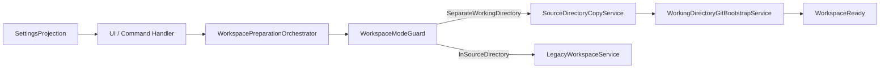
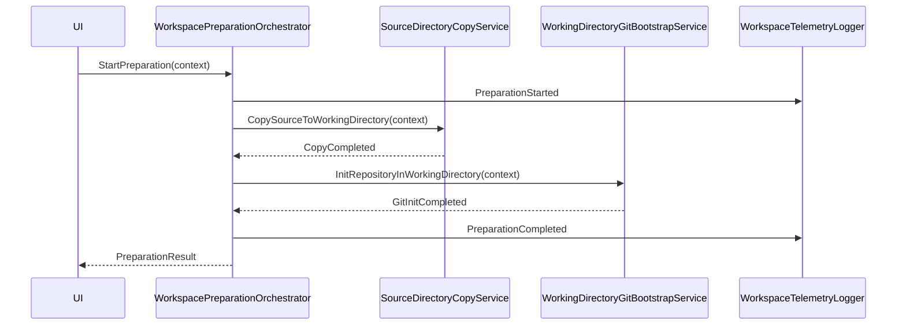

# Architektur-Blueprint – Separates Arbeitsverzeichnis mit Source-Copy und Git-Bootstrap im Working Directory

> **Dokument-Typ:** Architecture Blueprint
> **Status:** ✅ Implementiert
> **Version:** 3.0.0
> **Datum:** 2026-05-13

---

## 1. Zielbild

Im Modus `SeparateWorkingDirectory` gilt ein klarer Startablauf:

1. Das Quellverzeichnis wird nur gelesen.
2. Der Inhalt wird per Dateikopie in das Arbeitsverzeichnis übertragen.
3. Im Arbeitsverzeichnis wird `git init` ausgeführt.
4. Die Einstellungen bieten dafür keine frei wählbare Git-Init-Option.
5. Der Modus `InSourceDirectory` bleibt separat und unverändert behandelbar.

Damit ist das Quellverzeichnis vor Initialisierungs- und Metadatenänderungen geschützt.

## 2. Architekturentscheidungen

### ADR-01 – Source bleibt unverändert
- **Entscheidung:** Im separaten Modus werden keine Git-Operationen am Quellverzeichnis ausgeführt.
- **Begründung:** Die Anforderung verlangt eine reine Dateikopie als Ausgangspunkt.
- **Konsequenz:** Quellverzeichnis ist nur Lesequelle.

### ADR-02 – Kopie vor Git-Bootstrap
- **Entscheidung:** Das Arbeitsverzeichnis wird zuerst befüllt, danach wird dort `git init` ausgeführt.
- **Begründung:** So entsteht ein sauberer, eigener lokaler Git-Workspace.
- **Konsequenz:** Ein bestehender Source-Repository-Status ist für die Vorbereitung nicht erforderlich.

### ADR-03 – Keine konfigurierte Git-Init-Option im separaten Modus
- **Entscheidung:** Die Git-Init-Option ist in diesem Modus nicht editierbar.
- **Begründung:** Die fachliche Regel soll nicht von Benutzereingaben abhängen.
- **Konsequenz:** Einstellungen werden als abgeleitete Darstellung, nicht als freie Wahl, gerendert.

### ADR-04 – Copy-Scope ist begrenzt
- **Entscheidung:** Die Dateikopie übernimmt Arbeitsinhalte, nicht Repository-Metadaten.
- **Begründung:** `git init` soll im Arbeitsverzeichnis einen klaren Startpunkt schaffen.
- **Konsequenz:** `.git` und vergleichbare Metadaten werden nicht übernommen.

### ADR-05 – Bestehende Folgeflüsse bleiben erhalten
- **Entscheidung:** Pull, Push und Delete-Sync bleiben auf dem neuen Workspace aufsetzbar.
- **Begründung:** Der Bootstrap-Änderung folgt keine Neudefinition des gesamten Workflow-Modells.
- **Konsequenz:** Vorhandene Sync-Regeln können weiter verwendet werden.

## 3. Komponenten und Verantwortlichkeiten

| Komponente | Verantwortung |
|---|---|
| `WorkspacePreparationOrchestrator` | Koordiniert Copy, Bootstrap und Statusübergänge |
| `WorkspaceModeGuard` | Entscheidet zwischen separatem und direktem Modus |
| `SourceDirectoryCopyService` | Kopiert den Quellinhalt in das Arbeitsverzeichnis |
| `WorkingDirectoryGitBootstrapService` | Führt `git init` im Arbeitsverzeichnis aus |
| `SettingsProjection` | Rendert die nicht konfigurierbare Git-Init-Regel im UI |
| `WorkspaceValidationService` | Prüft Zielpfade, Leerstand und Schreibrechte |
| `WorkspaceTelemetryLogger` | Protokolliert Start, Copy und Bootstrap |

## 4. Verträge und Invarianten

### 4.1 Domänenverträge
- `WorkspaceContext { sourceDirectory, workingDirectory, workspaceMode, taskId }`
- `PreparationPolicy { allowGitInitInWorkingDirectory, hideGitInitSettingInSeparateMode, copyScope }`
- `PreparationResult { status, copiedFiles, bootstrapStatus, reasonCode }`

### 4.2 Invarianten
1. Im separaten Modus wird das Quellverzeichnis nicht geändert.
2. `git init` läuft nur im Arbeitsverzeichnis.
3. Die Git-Init-Option ist im separaten Modus nicht konfigurierbar.
4. Copy und Bootstrap müssen in dieser Reihenfolge erfolgen.
5. Das Arbeitsverzeichnis muss vor dem Start entweder neu sein oder kontrolliert validiert werden.

## 5. Sequenzfluss

## 6. Fehlerbehandlung

### Fehlerklassen
- `SourceCopy` – Kopieren des Quellinhalts fehlgeschlagen
- `WorkingDirectoryInit` – `git init` im Arbeitsverzeichnis fehlgeschlagen
- `SettingsProjection` – Git-Init-Regel konnte nicht konsistent dargestellt werden
- `Validation` – Pfad, Rechte oder Zielzustand ungültig

### Recovery-Regeln
1. Fail fast bei Copy-Fehlern.
2. Kein Bootstrap nach fehlgeschlagener Kopie.
3. Kein stilles Umschalten auf einen Source-Init-Fallback.
4. Teilzustände werden als fehlgeschlagen markiert und protokolliert.

## 7. UI-/Settings-Konzept

- In `SeparateWorkingDirectory` wird der Git-Init-Schritt als festes Systemverhalten angezeigt.
- Die UI zeigt keinen Schalter für `git init` in diesem Modus.
- Bestehende Einstellungen können weiterhin andere modusspezifische Werte steuern.
- Für `InSourceDirectory` bleibt die bisherige Darstellung separat behandelbar.

## 8. Teststrategie

- Copy-Scope: Quellverzeichnis bleibt unverändert.
- Bootstrap: `git init` wird im Arbeitsverzeichnis ausgeführt.
- Settings: Keine editierbare Git-Init-Option im separaten Modus.
- Regression: `InSourceDirectory` bleibt funktionsgleich.
- Fehlerpfade: nicht leeres Ziel, fehlende Rechte, Copy-Abbruch.

## 9. Qualitätsziele

| Ziel | Priorität |
|---|---|
| Source-Immutability | MUST |
| Git-Init nur im Working Directory | MUST |
| Nicht konfigurierbare Git-Init-Regel im separaten Modus | MUST |
| Regressionsfreiheit für den direkten Modus | HIGH |
| Nachvollziehbare Fehlerdiagnose | HIGH |

## 10. Verlinkung

- Anforderungen: [../requirements/separates-arbeitsverzeichnis-git-init-fallback-requirements-analysis.md](../requirements/separates-arbeitsverzeichnis-git-init-fallback-requirements-analysis.md)
- ERM: [separates-arbeitsverzeichnis-git-init-fallback-entity-relationship-model.md](separates-arbeitsverzeichnis-git-init-fallback-entity-relationship-model.md)
- Review: [../improvements/separates-arbeitsverzeichnis-git-init-fallback-architecture-review.md](../improvements/separates-arbeitsverzeichnis-git-init-fallback-architecture-review.md)

## 11. Versionierung

| Version | Datum | Autor | Änderung |
|---|---|---|---|
| 2.0.0 | 2026-05-13 | Architektur-Agent | Vorherige Fassung mit Git-Init-Fallback im separaten Modus |
| 3.0.0 | 2026-05-13 | Planning-Orchestrator | Source-Copy vor `git init` im Working Directory, keine Git-Init-Konfiguration im separaten Modus |
| 3.1.0 | 2026-05-13 | Implementation-Orchestrator | Initialer Snapshot-Commit nach Working-Directory-Bootstrap ergänzt |
