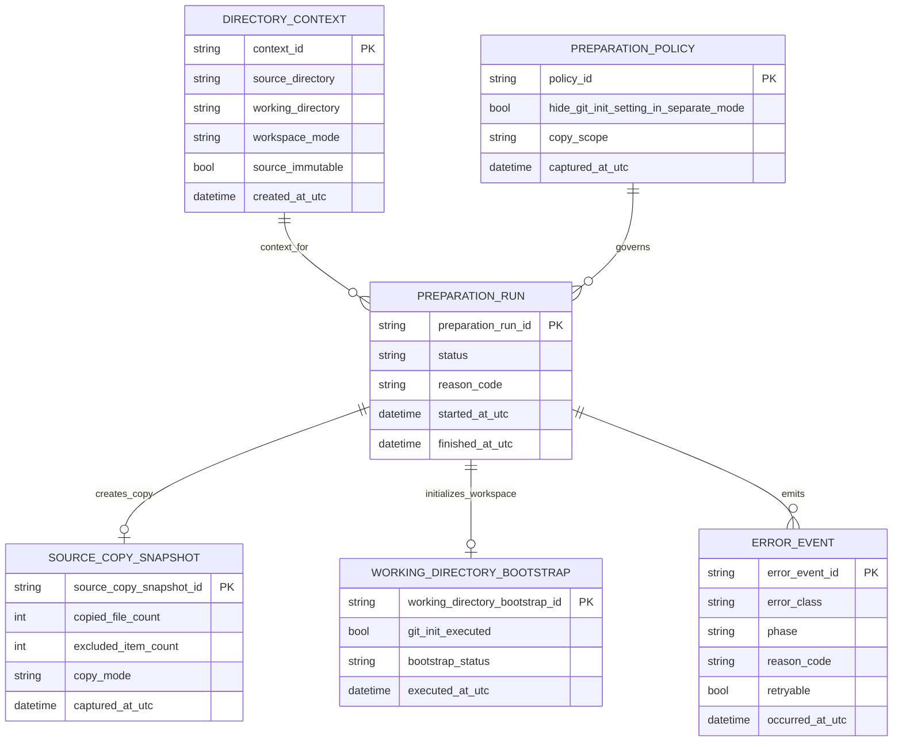
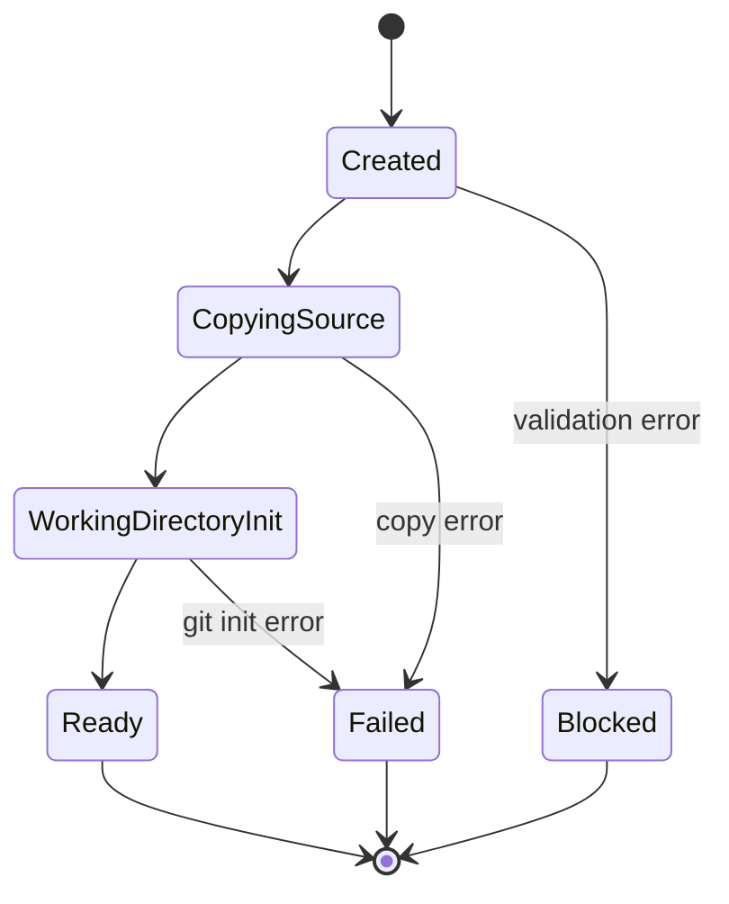

# Entity-Relationship-Modell – Separates Arbeitsverzeichnis mit Source-Copy und Git-Bootstrap

> **Dokument-Typ:** Entity Relationship Model
> **Status:** 📋 Geplant
> **Version:** 3.0.0
> **Datum:** 2026-05-13

---

## 1. Ziel und Scope

Dieses konzeptionelle Modell beschreibt die fachlich relevanten Zustände für den Start eines lokalen Repositories im Modus `SeparateWorkingDirectory`.

Kernregeln:

1. Das Quellverzeichnis bleibt unverändert.
2. Die Arbeitskopie wird per Dateikopie erstellt.
3. `git init` erfolgt nur im Arbeitsverzeichnis.
4. Im separaten Modus ist die Git-Init-Option nicht konfigurierbar.

## 2. ERM-Diagramm

## 3. Entitätenübersicht

| Entität | Schlüssel | Bedeutung |
|---|---|---|
| `DIRECTORY_CONTEXT` | `context_id` | Beschreibt Source- und Working-Directory samt Modus |
| `PREPARATION_POLICY` | `policy_id` | Legt fest, dass Git-Init im separaten Modus nicht konfigurierbar ist |
| `PREPARATION_RUN` | `preparation_run_id` | Ein einzelner Start-/Vorbereitungsdurchlauf |
| `SOURCE_COPY_SNAPSHOT` | `source_copy_snapshot_id` | Ergebnis der Kopierphase |
| `WORKING_DIRECTORY_BOOTSTRAP` | `working_directory_bootstrap_id` | Ergebnis von `git init` im Arbeitsverzeichnis |
| `ERROR_EVENT` | `error_event_id` | Fehlerdiagnose pro Phase |

## 4. Zustandsdiagramm

## 5. Invarianten

1. `source_immutable=true` im separaten Modus.
2. `git_init_executed=true` gilt nur für das Arbeitsverzeichnis.
3. `hide_git_init_setting_in_separate_mode=true` ist verbindlich.
4. Ein `PREPARATION_RUN` kann nur dann `Ready` werden, wenn Copy und Bootstrap erfolgreich waren.
5. Der Quellpfad ist nie Ziel einer Initialisierung.

## 6. Modellierungsentscheidungen

- Die Git-Init-Option wird als Policy abgebildet, nicht als frei editierbares Setting.
- Die Kopie und der Bootstrap werden getrennt modelliert, um Fehlerphasen sauber zu unterscheiden.
- Der Direct-Modus bleibt als eigener Pfad erhalten und wird nicht mit dem separaten Modus vermischt.

## 7. Abgleich mit Architektur

| Architekturregel | ERM-Abbildung |
|---|---|
| Source bleibt unverändert | `DIRECTORY_CONTEXT.source_immutable` |
| Kopie vor Git-Bootstrap | `SOURCE_COPY_SNAPSHOT` vor `WORKING_DIRECTORY_BOOTSTRAP` |
| Keine Git-Init-Konfiguration im separaten Modus | `PREPARATION_POLICY.hide_git_init_setting_in_separate_mode` |
| Fehlerkonsistenz | `ERROR_EVENT` pro Phase |

## 8. Verlinkung

- Anforderungen: [../requirements/separates-arbeitsverzeichnis-git-init-fallback-requirements-analysis.md](../requirements/separates-arbeitsverzeichnis-git-init-fallback-requirements-analysis.md)
- Architektur-Blueprint: [separates-arbeitsverzeichnis-git-init-fallback-architecture-blueprint.md](separates-arbeitsverzeichnis-git-init-fallback-architecture-blueprint.md)
- Architecture-Review: [../improvements/separates-arbeitsverzeichnis-git-init-fallback-architecture-review.md](../improvements/separates-arbeitsverzeichnis-git-init-fallback-architecture-review.md)

## 9. Versionierung

| Version | Datum | Autor | Änderung |
|---|---|---|---|
| 2.0.0 | 2026-05-13 | ERM-Agent | Vorherige Fassung mit optionalem Source-Init-Fallback |
| 3.0.0 | 2026-05-13 | Planning-Orchestrator | Source-Copy und Git-Bootstrap im Working Directory, Policy für nicht konfigurierbares Git-Init |
