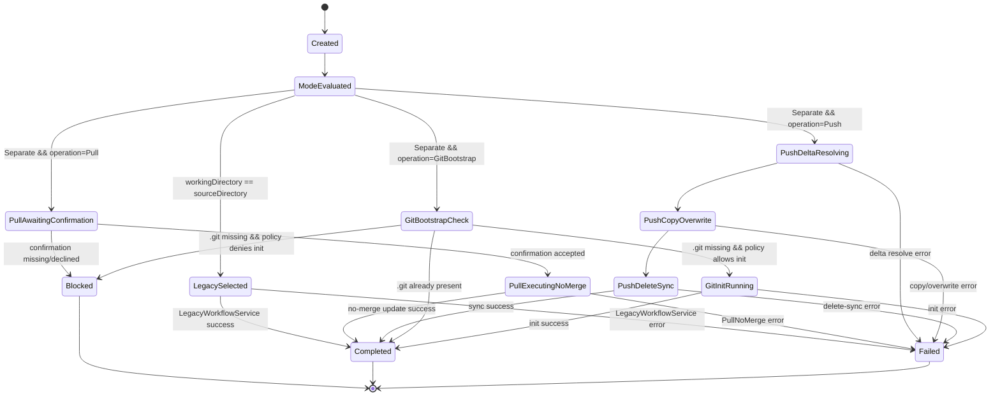

# Entity-Relationship-Modell – Separates Arbeitsverzeichnis mit Pull-ohne-Merge und Push-Sync

> **Dokument-Typ:** Entity Relationship Model  
> **Status:** 📋 Geplant  
> **Version:** 2.0.0  
> **Datum:** 2026-05-13

---

## 1. Ziel und Scope

Dieses ERM beschreibt ein **konzeptionelles Daten- und Zustandsmodell** für den Modus `SeparateWorkingDirectory` mit folgenden Kernregeln:

1. Pull im separaten Arbeitsverzeichnis erfolgt **ohne Merge** und nur nach verpflichtender Nutzerbestätigung.
2. Push ist **Dateisynchronisation** `WorkingDirectory -> SourceDirectory` (Copy/Overwrite), **kein** `git push`.
3. Delete-Sync basiert auf Git-Änderungserkennung im WorkingDirectory und löscht korrespondierende Dateien im SourceDirectory.
4. Optionales `git init` im WorkingDirectory ermöglicht lokalen Commit-Flow.
5. Bei `WorkingDirectory == SourceDirectory` wird strikt der Legacy-Zweig verwendet (regressionsfrei).

## 2. ERM-Diagramm (Mermaid)

```mermaid
erDiagram
    DIRECTORY_CONTEXT {
        string context_id PK
        string source_directory
        string working_directory
        string workspace_mode
        bool is_same_directory
        datetime created_at_utc
    }

    OPERATION_POLICY {
        string policy_id PK
        bool allow_git_init_in_working_directory
        bool require_pull_warning_confirmation
        bool forbid_git_push_in_separate_mode
        bool enable_delete_sync
        datetime captured_at_utc
    }

    OPERATION_RUN {
        string operation_run_id PK
        string operation_type
        string selected_branch
        string strategy
        string status
        string reason_code
        datetime started_at_utc
        datetime finished_at_utc
    }

    USER_CONFIRMATION {
        string confirmation_id PK
        string confirmation_type
        string message_text
        bool is_mandatory
        string user_decision
        datetime decided_at_utc
    }

    GIT_STATUS_SNAPSHOT {
        string git_status_snapshot_id PK
        int modified_count
        int added_count
        int deleted_count
        int untracked_count
        datetime captured_at_utc
    }

    SYNC_DELTA {
        string sync_delta_id PK
        int copy_overwrite_count
        int deletion_candidate_count
        int ignored_count
        string checksum
        datetime computed_at_utc
    }

    DELETION_CANDIDATE {
        string deletion_candidate_id PK
        string relative_path
        bool tracked_in_git
        bool exists_in_source_before_delete
        string delete_status
        datetime processed_at_utc
    }

    ERROR_EVENT {
        string error_event_id PK
        string error_class
        string reason_code
        string phase
        string sanitized_message
        bool retryable
        datetime occurred_at_utc
    }

    DIRECTORY_CONTEXT ||--o{ OPERATION_RUN : context_for
    OPERATION_POLICY ||--o{ OPERATION_RUN : governs
    OPERATION_RUN ||--o| USER_CONFIRMATION : requires_for_pull
    OPERATION_RUN ||--o| GIT_STATUS_SNAPSHOT : reads_git_state
    OPERATION_RUN ||--o| SYNC_DELTA : computes_for_push
    SYNC_DELTA ||--o{ DELETION_CANDIDATE : contains
    OPERATION_RUN ||--o{ ERROR_EVENT : emits
```

## 3. Tabellarische Übersicht (Entitäten, Schlüssel, Beziehungen, Kardinalitäten)

| Entität | Schlüssel | Kernattribute | Beziehungen | Kardinalität |
|---|---|---|---|---|
| `DIRECTORY_CONTEXT` | `context_id` | `source_directory`, `working_directory`, `workspace_mode`, `is_same_directory` | Kontext für Operationen | 1 : n zu `OPERATION_RUN` |
| `OPERATION_POLICY` | `policy_id` | `allow_git_init_in_working_directory`, `require_pull_warning_confirmation`, `forbid_git_push_in_separate_mode`, `enable_delete_sync` | Regelwerk für Operationen | 1 : n zu `OPERATION_RUN` |
| `OPERATION_RUN` | `operation_run_id` | `operation_type(Pull/Push/GitBootstrap)`, `selected_branch(Separate/Legacy)`, `strategy`, `status`, `reason_code` | Zentrale Ablaufinstanz | n : 1 zu `DIRECTORY_CONTEXT`, n : 1 zu `OPERATION_POLICY` |
| `USER_CONFIRMATION` | `confirmation_id` | `confirmation_type(PullNoMergeNotice)`, `is_mandatory`, `user_decision`, `message_text` | Pflichtbestätigung für Pull | 0..1 : 1 zu `OPERATION_RUN` |
| `GIT_STATUS_SNAPSHOT` | `git_status_snapshot_id` | `modified_count`, `added_count`, `deleted_count`, `untracked_count` | Eingabe für Delta/Delete-Berechnung | 0..1 : 1 zu `OPERATION_RUN` |
| `SYNC_DELTA` | `sync_delta_id` | `copy_overwrite_count`, `deletion_candidate_count`, `ignored_count`, `checksum` | Änderungsmenge für Push-Sync | 0..1 : 1 zu `OPERATION_RUN` |
| `DELETION_CANDIDATE` | `deletion_candidate_id` | `relative_path`, `tracked_in_git`, `exists_in_source_before_delete`, `delete_status` | Löschliste aus Git-Erkennung | 1..n : 1 zu `SYNC_DELTA` |
| `ERROR_EVENT` | `error_event_id` | `error_class(Init/PullNoMerge/PushCopy/DeleteSync/CompatibilityGuard)`, `phase`, `reason_code`, `retryable` | Fehler-/Abbruchdiagnose | 0..n : 1 zu `OPERATION_RUN` |

## 4. Zustandsdiagramm (OperationRun)

## 5. Invarianten (test- und implementierbar)

1. **Kein Merge bei Pull im separaten Modus:**  
   `operation_type=Pull` und `selected_branch=Separate` impliziert `strategy=NoMergePull`.
2. **Pull nur mit Pflichtbestätigung:**  
   Bei separatem Pull muss `USER_CONFIRMATION.is_mandatory=true` und `user_decision=accepted` vor Start von `PullExecutingNoMerge` vorliegen.
3. **Kein git push im separaten Modus:**  
   `operation_type=Push` und `selected_branch=Separate` impliziert `strategy=CopyOverwriteSync`; ein Remote-Push ist invariant verletzt.
4. **Delete-Sync nur aus Git-Erkennung im WorkingDirectory:**  
   Jeder `DELETION_CANDIDATE` muss aus `GIT_STATUS_SNAPSHOT` abgeleitet sein (`tracked_in_git=true`).
5. **Legacy-Schutz:**  
   `is_same_directory=true` impliziert `selected_branch=Legacy`; Separate-Services dürfen nicht ausgeführt werden.
6. **Fehlerkonsistenz:**  
   `status=Failed` impliziert mindestens ein zugeordnetes `ERROR_EVENT`.
7. **Determinismus:**  
   Gleiches `(DIRECTORY_CONTEXT, OPERATION_POLICY, GIT_STATUS_SNAPSHOT, operation_type)` ergibt denselben `SYNC_DELTA.checksum`.

## 6. Begründungen und Änderungen von 1.0.0 auf 2.0.0

1. **Zentralisierung auf `OPERATION_RUN`** statt nur Strategievorbereitung, um Pull/Push/Init/Legacy konsistent testbar zu machen.  
2. **Neue Entität `USER_CONFIRMATION`**, weil der Pull-Hinweis verpflichtend und auditierbar ist (FR-2/NFR-2).  
3. **Neue Entitäten `SYNC_DELTA` und `DELETION_CANDIDATE`** zur expliziten Modellierung von Copy/Overwrite und Delete-Sync (FR-3/FR-3.1).  
4. **`GIT_STATUS_SNAPSHOT` ergänzt**, damit Löschentscheidungen fachlich nachvollziehbar und reproduzierbar sind.  
5. **`selected_branch` und `is_same_directory` als Guardrail**, um Legacy-Regressionsfreiheit explizit zu erzwingen (FR-4).  
6. **Fehlerklassen in `ERROR_EVENT` geschärft**, damit Recovery und Testorakel pro Phase stabil bleiben (NFR-3/NFR-5).

## 7. Abgleich mit Architektur-Blueprint (Konsistenzprüfung)

| Blueprint-Regel | ERM-Abbildung | Konsistenz |
|---|---|---|
| Pull ohne Merge + Pflicht-Hinweis | `OPERATION_RUN(strategy=NoMergePull)` + `USER_CONFIRMATION` | ✅ |
| Push als Dateisync, kein `git push` | `OPERATION_RUN(strategy=CopyOverwriteSync)` + Invariante 3 | ✅ |
| Delete-Sync über Git-Erkennung | `GIT_STATUS_SNAPSHOT` -> `SYNC_DELTA` -> `DELETION_CANDIDATE` | ✅ |
| Optionales `git init` im WorkingDirectory | `operation_type=GitBootstrap` + Zustände `GitBootstrapCheck/GitInitRunning` | ✅ |
| Legacy-Zweig regressionsfrei | `DIRECTORY_CONTEXT.is_same_directory` + `selected_branch=Legacy` | ✅ |
| Strukturierte Fehler-/Eventfähigkeit | `ERROR_EVENT` mit `error_class`, `phase`, `reason_code` | ✅ |

## 8. Verlinkung (gleicher Basisname)

- Anforderungen: [../requirements/separates-arbeitsverzeichnis-git-init-fallback-requirements-analysis.md](../requirements/separates-arbeitsverzeichnis-git-init-fallback-requirements-analysis.md)
- Architektur-Blueprint: [separates-arbeitsverzeichnis-git-init-fallback-architecture-blueprint.md](separates-arbeitsverzeichnis-git-init-fallback-architecture-blueprint.md)
- Architecture-Review: [../improvements/separates-arbeitsverzeichnis-git-init-fallback-architecture-review.md](../improvements/separates-arbeitsverzeichnis-git-init-fallback-architecture-review.md)

## 9. Versionierung

| Version | Datum | Autor | Änderung |
|---|---|---|---|
| 1.0.0 | 2026-05-13 | ERM-Agent | Erstfassung mit Fokus auf Init/Clone/Copy-Fallback |
| 2.0.0 | 2026-05-13 | ERM-Agent | Umstellung auf Pull-ohne-Merge, Push-Copy/Overwrite, Delete-Sync, Git-Bootstrap und Legacy-Guard |
