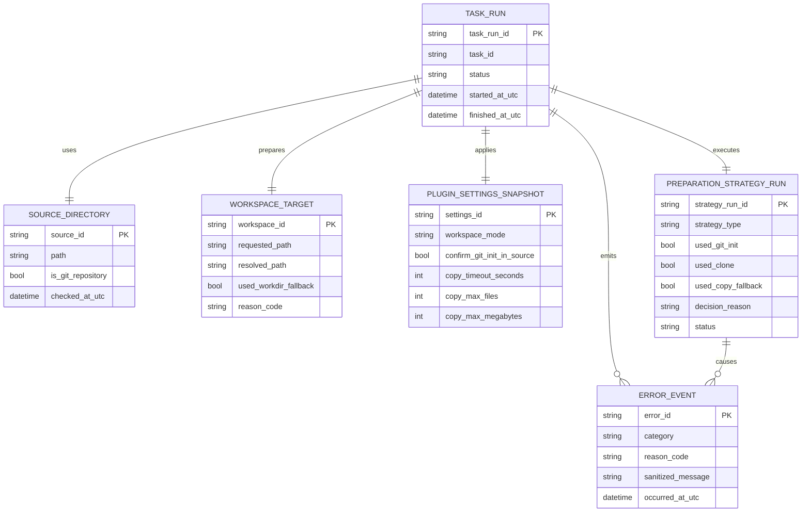
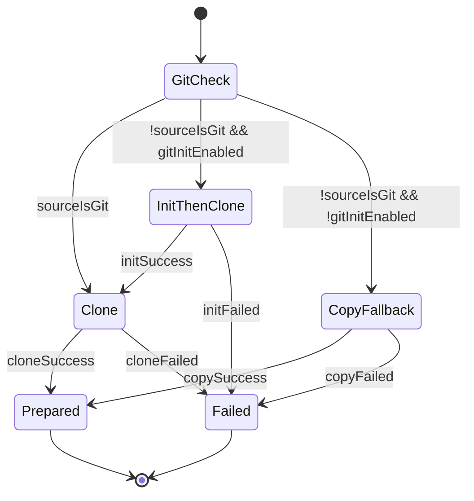

# Entity-Relationship-Modell – Separates Arbeitsverzeichnis mit git-init-/Copy-Fallback

> **Dokument-Typ:** Entity Relationship Model  
> **Status:** ✅ Umgesetzt  
> **Version:** 1.0.0  
> **Datum:** 2026-05-13

---

## 1. Ziel und Scope

Dieses ERM beschreibt die fachlichen Entitäten und Beziehungen für die Workspace-Vorbereitung bei lokalen Quellen mit Strategien `clone`, `init+clone` und `copy`.

## 2. Entitäten (konzeptionell)

## 3. Beziehungen und Kardinalitäten

- `TASK_RUN` zu `SOURCE_DIRECTORY`: 1:1 (pro Lauf genau eine Quelle)
- `TASK_RUN` zu `WORKSPACE_TARGET`: 1:1 (pro Lauf genau ein Ziel)
- `TASK_RUN` zu `PLUGIN_SETTINGS_SNAPSHOT`: 1:1 (Settings-Snapshot pro Lauf)
- `TASK_RUN` zu `PREPARATION_STRATEGY_RUN`: 1:1 (eine entschiedene Strategie)
- `TASK_RUN` zu `ERROR_EVENT`: 1:n (optional mehrere Fehlerereignisse)

## 4. Zustände / Transitionen der Strategie

## 5. Konsistenzregeln / Invarianten

1. Bei `workspace_mode != SeparateWorkingDirectory` ist dieses Modell nicht anwendbar.
2. Vor jeder Strategieentscheidung muss `is_git_repository` bestimmt sein.
3. `used_git_init = true` impliziert `confirm_git_init_in_source = true`.
4. `used_copy_fallback = true` impliziert `used_clone = false`.
5. Zielpfad darf nicht identisch mit Quellpfad sein.
6. Bei Fehlerstatus muss mindestens ein `ERROR_EVENT` vorhanden sein.

## 6. Mapping auf bestehende Komponenten

- `SOURCE_DIRECTORY` → LocalDirectoryPlugin (Input `SourceDirectory`)
- `WORKSPACE_TARGET` → ArbeitsverzeichnisResolver + LocalDirectoryPlugin
- `PLUGIN_SETTINGS_SNAPSHOT` → Plugin-/Arbeitsverzeichnis-Settings
- `PREPARATION_STRATEGY_RUN` → Entscheidungslogik in LocalDirectoryPlugin
- `TASK_RUN` → EntwicklungsprozessService
- `ERROR_EVENT` → Logging/Fehlerklassifikation

## 7. Verlinkung

- Anforderungen: [../requirements/separates-arbeitsverzeichnis-git-init-fallback-requirements-analysis.md](../requirements/separates-arbeitsverzeichnis-git-init-fallback-requirements-analysis.md)
- Architektur: [separates-arbeitsverzeichnis-git-init-fallback-architecture-blueprint.md](separates-arbeitsverzeichnis-git-init-fallback-architecture-blueprint.md)
- Review: [../improvements/separates-arbeitsverzeichnis-git-init-fallback-architecture-review.md](../improvements/separates-arbeitsverzeichnis-git-init-fallback-architecture-review.md)
