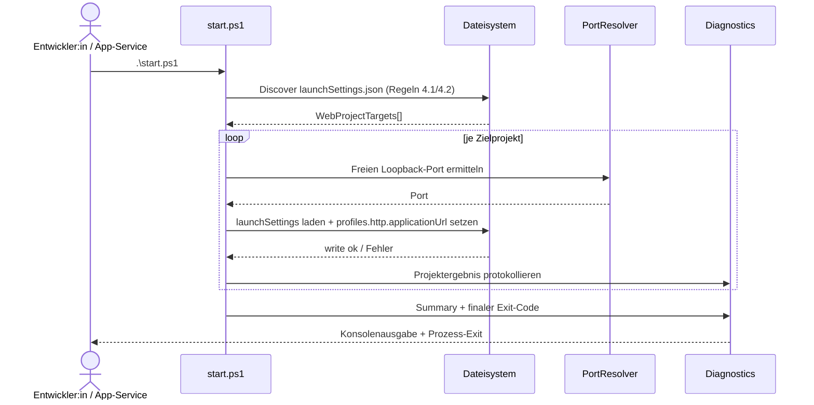

# Architektur-Blueprint – `start.ps1` für Visual-Studio-Debug mit freiem HTTP-Port

> **Dokument-Typ:** Architecture Blueprint  
> **Status:** Zur Umsetzung freigegeben  
> **Version:** 1.1.0  
> **Datum:** 2026-05-14

---

## 1. Referenzen

- Requirements: [../requirements/start-ps1-visual-studio-freier-http-port-requirements-analysis.md](../requirements/start-ps1-visual-studio-freier-http-port-requirements-analysis.md) (v1.1.0)
- ERM: [./start-ps1-visual-studio-freier-http-port-entity-relationship-model.md](./start-ps1-visual-studio-freier-http-port-entity-relationship-model.md)
- Review: [../improvements/start-ps1-visual-studio-freier-http-port-architecture-review.md](../improvements/start-ps1-visual-studio-freier-http-port-architecture-review.md)
- Ablaufdiagramm: [../flows/start-ps1-visual-studio-freier-http-port-flow.md](../flows/start-ps1-visual-studio-freier-http-port-flow.md)

---

## 2. Architekturentscheidung (Breaking Change)

Ab v1.1.0 gilt ein **neuer Skriptvertrag**:

1. `start.ps1` wird **parameterlos** gestartet (`.\start.ps1`).
2. Das Skript führt **autonome Projekterkennung** durch (keine feste App-Pfadkopplung).
3. Portauflösung liegt **vollständig im Skript**.
4. Die Anwendung (`RepositoryStartskriptService`) startet nur den Prozess und wertet Erfolg/Fehler aus, ohne Portlogik zu kennen.

Damit ist der bisherige Vertrag (`-Port`, `-RepositoryPath`, `SOFTWARESCHMIEDE_*` als Funktionsvoraussetzung) ersetzt.

---

## 3. Zielarchitektur: Komponenten und Verantwortlichkeiten

| Komponente | Verantwortung | Input | Output |
|---|---|---|---|
| `start.ps1` (Orchestrator) | Gesamtsteuerung Discovery → Port Resolution → Update → Abschluss | Repository-Root (aus Script-Location) | Exit-Code + strukturierte Logs |
| `ProjectDiscovery` | Relevante Web-Projekte finden | Dateisystem | Liste `WebProjectTarget` |
| `PortResolution` | Freien lokalen HTTP-Port je Zielprojekt bestimmen | Zielprojektkontext | `PortAssignment` |
| `LaunchSettingsUpdater` | `profiles.http.applicationUrl` atomar aktualisieren | LaunchSettings-Pfad + Port | Schreibresultat je Projekt |
| `Diagnostics & Exit Aggregator` | Einheitliche Logs und finalen Exit-Code bestimmen | Teilresultate | Konsolenprotokoll + finaler Exit-Code |
| `RepositoryStartskriptService` (C#) | Skript aufrufen, keine Fachsteuerung | RepositoryPfad + Konfiguration | Erfolg/Fehler an Aufrufer |

---

## 4. Erkennungslogik für relevante Web-Projekte (verbindliche Regeln)

### 4.1 Discovery-Regeln (MUST)

1. Scan rekursiv ab Repository-Root nach `**/Properties/launchSettings.json`.
2. Ignoriere Verzeichnisse: `.git`, `bin`, `obj`, `TestResults`, `node_modules`.
3. Ein Treffer ist **relevant**, wenn:
   - JSON parsebar ist,
   - `profiles` existiert,
   - `profiles.http` existiert und Objekt ist.
4. Reihenfolge der Verarbeitung ist deterministisch (alphabetisch nach absolutem Pfad).
5. Jeder Treffer wird isoliert verarbeitet (Fehler in A blockiert Update in B nicht).

### 4.2 Ausschlussregeln (MUST NOT)

- Keine harte Kopplung an `src/Softwareschmiede/...`.
- Keine Abhängigkeit von Skriptparametern oder App-übergebenen Portwerten.
- Keine Änderung anderer Profile/Felder außer `profiles.http.applicationUrl`.

---

## 5. Sequenz: Discovery → Port Resolution → launchSettings Update → Logging/Exit

---

## 6. Fehlerszenarien und Exit-Code-Kontrakt

### 6.1 Fehlerklassen

| Exit-Code | Bedeutung | Beispiel |
|---|---|---|
| 0 | Alle relevanten Zielprojekte erfolgreich aktualisiert | N Ziele, 0 Fehler |
| 10 | Discovery/Datei nicht nutzbar | Kein relevantes `launchSettings.json` gefunden |
| 11 | Ungültige Konfiguration | JSON defekt oder `profiles.http` fehlt |
| 12 | Port nicht ermittelbar/verfügbar | Kein freier Port für ein Zielprojekt |
| 13 | Schreibfehler | atomarer Write/Move fehlgeschlagen |
| 99 | Unerwarteter Fehler | Unbehandelte Ausnahme |

### 6.2 Aggregationsregel bei Mehrprojektlauf

- Alle Ziele werden bestmöglich verarbeitet.
- Finaler Exit-Code wird nach Priorität gebildet: `13 > 12 > 11 > 10 > 0`, sonst `99`.
- Bereits erfolgreich geschriebene Projekte bleiben gültig; keine globale Rollbackpflicht.

---

## 7. Qualitätsziele (Architekturebene)

| Qualitätsziel | Zielwert | Architekturmaßnahme |
|---|---|---|
| Robustheit | Keine JSON-Korruption bei Fehlern | atomarer Write (`.tmp` + Move), isolierte Projektverarbeitung |
| Performance | ≤ 3s für bis zu 5 Zielprojekte | schlanker Dateiscan + O(n)-Verarbeitung |
| Wartbarkeit | geringe Kopplung Skript↔App | Portlogik nur in `start.ps1`, Service nur Prozessstart |
| Sicherheit | keine Pfadtraversal/Secrets in Logs | Root-begrenzter Scan, strukturierte nicht-sensitive Logs |

---

## 8. Konkrete Auswirkungen auf bestehende Implementierung

### 8.1 `start.ps1`

- `param(...)` fachlich entfernen bzw. Alt-Parameter nur noch ohne Wirkung/deprecated behandeln.
- `Resolve-ConfiguredPort` ersetzen durch projektweise autonome Portauflösung.
- Neuer Discovery-Schritt für mehrere Projekte.
- Exit-Code-Aggregation für Mehrprojektverarbeitung ergänzen.
- Logging pro Projekt + Gesamtsummary standardisieren.

### 8.2 `RepositoryStartskriptService`

- Portreservierung als Skriptvoraussetzung entfernen (`PortReservationService` aus diesem Pfad entkoppeln).
- Keine Übergabe von `-Port`, `-RepositoryPath`.
- Keine Pflicht-Env für Portsteuerung (`SOFTWARESCHMIEDE_FREE_PORT`) setzen.
- Aufruf reduziert auf PowerShell-Standardargumente + Skriptpfad; Fehlerweitergabe bleibt.

### 8.3 Tests

- `StartPs1IntegrationTests`: parameterlosen Mehrprojekt-Discovery-Test ergänzen.
- `RepositoryStartskriptServiceTests`: Assertions auf `-Port`/Port-Env entfernen.
- Negativfälle für `10/11/12/13` mit Mehrprojektkontext absichern.

---

## 9. Teststrategie auf Architekturebene

1. **Skript-Unitnah:** Discovery-Regeln, Portfindung, Exit-Code-Aggregation.
2. **Skript-Integration:** temporäres Test-Repo mit mehreren `launchSettings.json`, Mischfälle (gültig/ungültig/gesperrt).
3. **App-Service-Unit:** Entkopplung verifizieren (keine Portargumente).
4. **End-to-End lokal:** `.\start.ps1` → Visual Studio F5.

---

## 10. Migrations- und Umsetzungsplan

1. `start.ps1` auf neuen parameterlosen Vertrag umbauen.
2. `RepositoryStartskriptService` entkoppeln (kein Port-Contract).
3. Test-Suiten gemäß Abschnitt 8.3 anpassen.
4. Dokumentation synchronisieren (Requirements/ERM/Review/Flow).
5. Teamkommunikation: neuer Standardaufruf `.\start.ps1`.

---

## 11. Versionierung

| Version | Datum | Autor | Änderung |
|---|---|---|---|
| 1.1.0 | 2026-05-14 | planning-architecture-blueprint | Breaking-Change-Update: parameterloser Vertrag, autonome Projekterkennung, Mehrprojekt-Flow, Exit-Code-Aggregation, Entkopplung zur Anwendung |
| 1.0.0 | 2026-05-14 | planning-orchestrator | Initialer Architektur-Blueprint |
