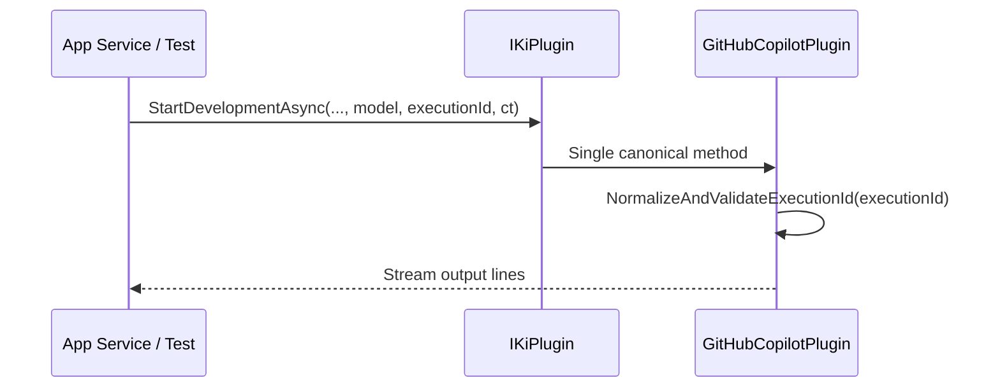

# Architektur-Blueprint: Entfernung des test-spezifischen `StartDevelopmentAsync`-Overloads

> **Dokument-Typ:** Architektur-Blueprint  
> **Status:** Entwurf  
> **Scope:** API-Vertrag `IKiPlugin` / Implementierung `GitHubCopilotPlugin` / Testmigration ohne Verhaltensänderung

## 1. Referenzen (Traceability)

- Requirements: [`../requirements/startdevelopmentasync-test-overload-removal-requirements-analysis.md`](../requirements/startdevelopmentasync-test-overload-removal-requirements-analysis.md)
- ERM-Zieldokument: [`./startdevelopmentasync-test-overload-removal-entity-relationship-model.md`](./startdevelopmentasync-test-overload-removal-entity-relationship-model.md)
- Architektur-Review-Zieldokument: [`../improvements/startdevelopmentasync-test-overload-removal-architecture-review.md`](../improvements/startdevelopmentasync-test-overload-removal-architecture-review.md)

## 2. Zielarchitektur und API-Vertragsentscheidung

### 2.1 Ist-Zustand

- `IKiPlugin` und `GitHubCopilotPlugin` besitzen zwei Overloads von `StartDevelopmentAsync(...)`.
- Der kürzere Overload (`ohne executionId`) delegiert intern an den längeren Overload.
- Tests (insb. `GitHubCopilotPluginTests`) verwenden teilweise den kürzeren Overload direkt.

### 2.2 Soll-Zustand (Vertragsentscheidung)

Es bleibt **genau ein** API-Vertrag für den Entwicklungsstart:

```csharp
IAsyncEnumerable<string> StartDevelopmentAsync(
    string prompt,
    AgentInfo agent,
    string localRepoPath,
    string? model,
    string? executionId,
    CancellationToken ct = default);
```

Architekturentscheidung:
- `executionId` bleibt optional auf Aufruferseite (Aufrufer übergeben bei Bedarf `null`).
- Keine zweite, test-spezifische Signatur mehr in Interface und Implementierung.
- Semantik bleibt unverändert: `executionId == null` erzeugt weiterhin automatisch eine gültige ID.

### 2.3 Zielbild (Ablauf)



## 3. Migrationsstrategie (ohne Verhaltensänderung)

1. **Testmigration zuerst**
   - Alle Tests auf den kanonischen 6-Parameter-Aufruf umstellen.
   - Bei bisherigen 4-/5-Parameter-Aufrufen explizit `executionId: null` ergänzen.
2. **Implementierung/Vertrag bereinigen**
   - Kürzeren Overload in `GitHubCopilotPlugin` entfernen.
   - Kürzeren Overload in `IKiPlugin` entfernen.
3. **Regression-Validierung**
   - Bestehende Testabdeckung muss identisches Laufzeitverhalten bestätigen (Dateiname, Cleanup, Fehlerpfade, Cancellation, CLI-Args).

Wichtig: Reihenfolge verhindert Breaking Changes in Tests während des Refactorings.

## 4. Betroffene Komponenten / Dateien

### 4.1 Vertrags- und Implementierungsebene

- `src/Softwareschmiede.Plugin.Contracts/Domain/Interfaces/IKiPlugin.cs`
- `plugins/Softwareschmiede.Plugin.GitHubCopilot/GitHubCopilotPlugin.cs`

### 4.2 Testebene (direkt betroffen)

- `src/Softwareschmiede.Tests/Infrastructure/Plugins/GitHubCopilotPluginTests.cs`

### 4.3 Aufrufer-/Integrationsebene (Verifikation)

- `src/Softwareschmiede/Application/Services/EntwicklungsprozessService.cs`
- `src/Softwareschmiede.Tests/Application/Services/EntwicklungsprozessServiceTests.cs`
- `src/Softwareschmiede.Tests/Application/Services/KiAusfuehrungsServiceTests.cs`

## 5. Qualitätsziele, Risiken, Trade-offs

| Bereich | Ziel / Risiko / Trade-off | Umgang |
|---|---|---|
| Wartbarkeit | **Ziel:** Eine eindeutige Signatur, weniger API-Duplizierung. | Overload-Entfernung und einheitliche Aufrufkonvention. |
| Testbarkeit | **Ziel:** Tests prüfen produktive Signatur statt Test-Shortcut. | Testmigration vor Interface-Änderung. |
| Kompatibilität | **Risiko:** Compile-Breaks bei verbliebenen Altaufrufen. | Gezielte Suche nach Alt-Signaturen + vollständiger Testlauf. |
| Verhaltenstreue | **Risiko:** ungewollte Semantikänderung bei `executionId == null`. | Regression-Tests für Dateinamen/Normalisierung/Cleanup/Cancellation. |
| API-Einfachheit | **Trade-off:** Aufrufer müssen `null` explizit übergeben. | Akzeptiert zugunsten klarer, einheitlicher API und geringerer Komplexität. |

## 6. Konkrete technische Maßnahmen + Teststrategie

### 6.1 Technische Maßnahmen

1. Tests in `GitHubCopilotPluginTests` umstellen:
   - Beispiel-Migration:  
     `StartDevelopmentAsync("Prompt", agent, repo, null)`  
     → `StartDevelopmentAsync("Prompt", agent, repo, null, null)`
   - Cancellation-Aufruf:  
     `StartDevelopmentAsync("Prompt", agent, repo, null, cts.Token)`  
     → `StartDevelopmentAsync("Prompt", agent, repo, null, null, cts.Token)`
2. Kürzeren Overload in `GitHubCopilotPlugin` entfernen.
3. Kürzeren Overload in `IKiPlugin` entfernen.
4. Optional: API-Dokumentation (`docs/api/plugin-interfaces.md`) auf Einzel-Signatur aktualisieren.

### 6.2 Teststrategie

- **Unit-Regression (Plugin):**
  - Prompt-Datei-Erzeugung, GUID-Normalisierung, Cleanup bei Fehlern, `.gitignore`-Synchronisierung, Cancellation.
- **Contract-/Caller-Regression:**
  - `EntwicklungsprozessServiceTests` und `KiAusfuehrungsServiceTests` müssen weiterhin `executionId` korrekt forwarden (`null`/gesetzt).
- **Build-/Test-Gate:**
  - Vollständiger `dotnet test`-Lauf ohne neue Warnungen/Fehlschläge.

## 7. Akzeptanzkriterien (architekturseitig)

- Es existiert nur noch eine `StartDevelopmentAsync`-Signatur im API-Vertrag.
- `GitHubCopilotPlugin` enthält keinen delegierenden Test-Overload mehr.
- Alle bestehenden Verhaltensweisen bleiben gemäß Tests unverändert.
- Traceability zu Requirements/ERM/Review ist im Blueprint vorhanden.
