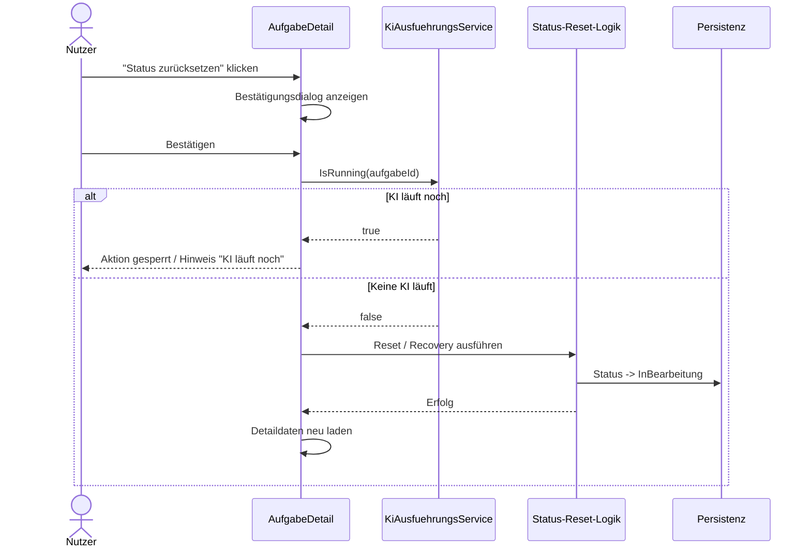

# Architektur-Blueprint – Status zurücksetzen bei `KI Aktiv` ohne Lauf

> **Dokument-Typ:** Architektur-Blueprint  
> **Status:** Entwurf  
> **Betroffene Komponente:** `AufgabeDetail`, `KiAusfuehrungsService`, `AufgabeService` / bestehende Reset-Logik

## 1. Referenzen

- Requirements: [../requirements/status-zuruecksetzen-ki-aktiv-ohne-lauf-requirements-analysis.md](../requirements/status-zuruecksetzen-ki-aktiv-ohne-lauf-requirements-analysis.md)
- Architecture Review: [../improvements/status-zuruecksetzen-ki-aktiv-ohne-lauf-architecture-review.md](../improvements/status-zuruecksetzen-ki-aktiv-ohne-lauf-architecture-review.md)
- Flow: [../flows/development-process-flow.md](../flows/development-process-flow.md)
- `src/Softwareschmiede/Components/Pages/Aufgaben/AufgabeDetail.razor`
- `src/Softwareschmiede/Components/Pages/Aufgaben/AufgabeDetail.razor.cs`
- `src/Softwareschmiede/Application/Services/KiAusfuehrungsService.cs`
- `src/Softwareschmiede/Application/Services/AufgabeRecoveryService.cs`
- `src/Softwareschmiede/Application/Services/AufgabeService.cs`

## 2. Problembild und Ziel

Die Detailansicht blockiert den Status-Reset bei `KI Aktiv` zu stark.  
Der Status allein darf nicht entscheiden; maßgeblich ist, ob eine KI-Ausführung wirklich läuft.

**Ziel:**
- Button bleibt bei `KI Aktiv` erreichbar
- vor Ausführung erscheint eine Bestätigung
- vor dem Reset wird der Laufstatus geprüft
- nach Erfolg ist der Status wieder so gesetzt, dass eine neue Anfrage möglich ist

## 3. Betroffene Schichten / Module

- **Presentation:** `AufgabeDetail.razor` / `.razor.cs`
  - Sichtbarkeit, Disable-Reason, Confirmation-Dialog
- **Application:**  
  - `KiAusfuehrungsService` als Laufzeit-Quelle
  - bestehende Status-Reset-/Recovery-Logik als Ausführungsweg
  - `AufgabeService` bleibt für reguläre Statusübergänge relevant
- **Domain / Persistenz:** keine neuen Entitäten, Felder oder Relationen
- **Infrastructure:** keine Migration erforderlich

## 4. Technologieentscheidungen

| Entscheidung | Begründung |
|---|---|
| Guard über `KiAusfuehrungsService.IsRunning(Id)` | Der Status allein reicht nicht; nur echte Laufaktivität blockiert den Reset |
| UI-Bestätigung vor der Mutation | Verhindert versehentliches Zurücksetzen |
| Wiederverwendung vorhandener Statuslogik | Keine Doppelimplementierung; Reset bleibt in bestehender Service-Schicht |
| Kein Schema-Change | Der Fix betrifft nur Verhalten, nicht das Datenmodell |
| Nach Erfolg Reload der Detailansicht | Statusbadge, Aktionen und Folgeaktionen bleiben konsistent |

## 5. Zielablauf

## 6. UI/UX-Auswirkungen

- Button bleibt bei `KI Aktiv` **sichtbar**
- bei laufender KI: **deaktiviert** mit klarer Begründung
- bei keiner laufenden KI: **aktiv**
- Bestätigungsdialog mit eindeutiger Warnung:
  - Status wird auf `InBearbeitung` gesetzt
  - neue KI-Anfrage ist danach möglich
- Nach Erfolg:
  - Statusbadge aktualisiert sich
  - Start-/Eingabefunktionen werden wieder nutzbar

## 7. Fehler- und Grenzfälle

| Fall | Verhalten |
|---|---|
| KI-Ausführung läuft noch | Reset blockieren, Hinweis anzeigen |
| Laufstatus nicht prüfbar | defensiv blockieren |
| Aufgabe inzwischen nicht mehr `KI Aktiv` | Aktion abbrechen / Seite neu laden |
| Paralleler Klick / konkurrierende Änderung | ein Reload korrigiert den Zustand |
| Nutzer bricht im Dialog ab | keine Änderung |
| Reset erfolgreich, Ansicht veraltet | nach Erfolg immer neu laden |

## 8. Teststrategie

- **Komponenten-/UI-Tests**
  - Button bei `KI Aktiv` sichtbar
  - bei `IsRunning == true` deaktiviert
  - Bestätigungsdialog öffnet sich
  - Confirm löst Reset-Flow aus
- **Service-Tests**
  - Reset setzt Status auf `InBearbeitung`
  - laufende KI blockiert den Reset
- **Regression**
  - bestehende KI-Start- und Abschlusspfade bleiben unverändert
- **Kein ERM-Test nötig**
  - weil kein Datenmodell geändert wird

## 9. Warum kein ERM erforderlich ist

Es gibt **keine** Änderungen an Entitäten, Tabellen, Fremdschlüsseln oder Persistenzfeldern.  
Der Fix ist rein:
- UI-seitig
- im Laufzeit-Guard
- in der Nutzung vorhandener Status-Transitionslogik

