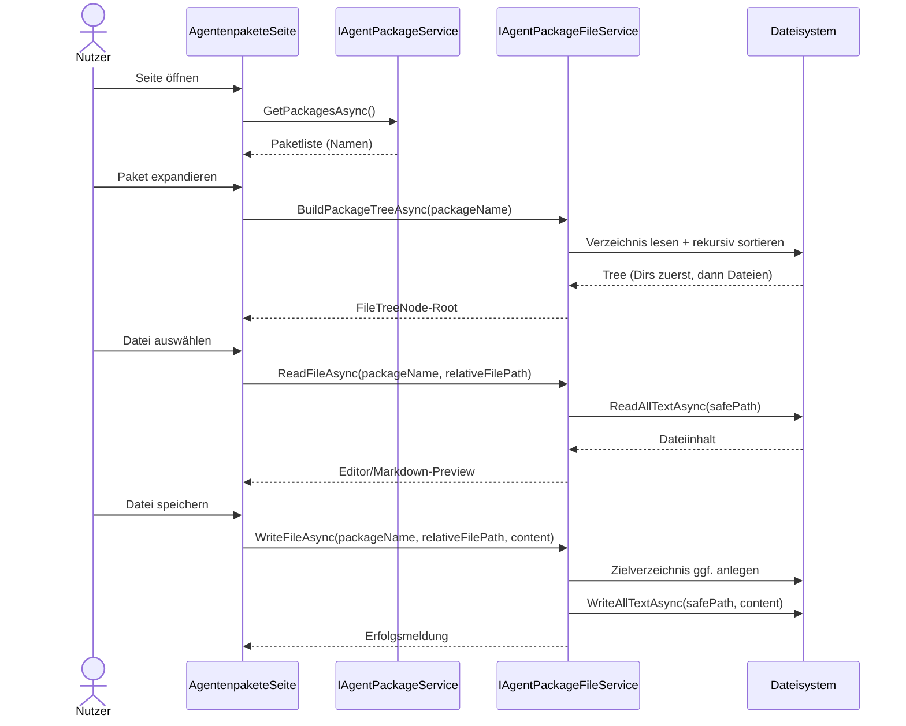

# Ablauf – AgentPackageFileService (Dateisystem, Sicherheit, Dateibaum)

## Titel & Kontext

Dieser Ablauf dokumentiert die Dateisystem-Orchestrierung für Agentenpakete.
`AgentPackageFileService` verwaltet Paketordner, Unterverzeichnisse und Dateien unter
`<ContentRoot>/agent-packages` und erzwingt dabei sichere Pfadauflösung gegen Path-Traversal.

Die UI (`AgentenpaketeSeite`) nutzt den Service für Erstellen/Umbenennen/Löschen, Datei-Upload,
Dateiinhalt lesen/schreiben und den rekursiven Dateibaum.

---

## Diagramm A – Sequenz: Paketbaum laden und Datei speichern



---

## Diagramm B – Sicherheits- und Validierungslogik

```mermaid
flowchart TD
    A([Datei/Verzeichnis-Aktion]) --> B[CancellationToken prüfen]
    B --> C[Null-Argumente prüfen]
    C --> D{Name-/Pfad-Validierung nötig?}
    D -- Ja --> E[ValidateName: keine leeren Werte,<br/>keine invalid chars,<br/>kein Slash/Backslash/..]
    D -- Nein --> F[Weiter]
    E --> F
    F --> G[ResolveSafePath(package, relativePath)]
    G --> H{Pfad innerhalb Paketbasis?}
    H -- Nein --> I[InvalidOperationException:<br/>Sicherheitsverletzung]
    H -- Ja --> J{Ziel vorhanden / Konflikt?}
    J -- Konflikt --> K[InvalidOperationException oder FileNotFoundException]
    J -- OK --> L[Dateisystemoperation ausführen]
    L --> M([Erfolg])
```

---

## Schrittbeschreibung

1. **Service-Initialisierung und Basispfad**  
   - **Code:** `AgentPackageFileService`-Konstruktor  
   - **Verhalten:** Ermittelt `<ContentRoot>/agent-packages` und legt den Ordner bei Bedarf an.

2. **Paketoperationen (Create/Rename/Delete)**  
   - **Code:** `CreatePackageAsync`, `RenamePackageAsync`, `DeletePackageAsync`  
   - **Verhalten:** Name wird validiert; Duplikate und fehlende Pakete führen zu Exceptions.

3. **Dateibaum aufbauen**  
   - **Code:** `BuildPackageTreeAsync`, `BuildNode`  
   - **Verhalten:** Rekursive Erzeugung von `FileTreeNode`; Sortierung: Verzeichnisse vor Dateien, jeweils alphabetisch.

4. **Verzeichnis- und Dateioperationen**  
   - **Code:** `CreateDirectoryAsync`, `RenameDirectoryAsync`, `DeleteDirectoryAsync`, `ReadFileAsync`, `WriteFileAsync`, `CreateEmptyFileAsync`, `UploadFileAsync`, `RenameFileAsync`, `DeleteFileAsync`  
   - **Verhalten:** Jede Operation arbeitet ausschließlich auf `ResolveSafePath`-Ergebnissen.

5. **UI-Integration**  
   - **Code:** `AgentenpaketeSeite.razor.cs`  
   - **Verhalten:** Fängt Exceptions ab, zeigt Fehler-/Erfolgsmeldungen und aktualisiert den Baum nach Mutationen.

---

## Fehlerbehandlung

- **Path Traversal oder Ziel außerhalb Paketordner**  
  - Ergebnis: `InvalidOperationException` („Sicherheitsverletzung“), keine Dateioperation.

- **Ungültige Namen / reservierte Pfadteile**  
  - Ergebnis: `ArgumentException` aus `ValidateName`.

- **Nicht existierende Dateien/Verzeichnisse**  
  - Ergebnis: `FileNotFoundException` bzw. `InvalidOperationException`.

- **Dateisystemkonflikte (Name bereits vorhanden)**  
  - Ergebnis: `InvalidOperationException`; UI bleibt konsistent und zeigt Meldung.

---

## Abhängigkeiten

- `src/Softwareschmiede/Infrastructure/Services/AgentPackageFileService.cs`
- `src/Softwareschmiede/Domain/Interfaces/IAgentPackageFileService.cs`
- `src/Softwareschmiede/Components/Pages/AgentenpaketeSeite.razor.cs`
- `src/Softwareschmiede/Domain/Interfaces/IAgentPackageService.cs`

