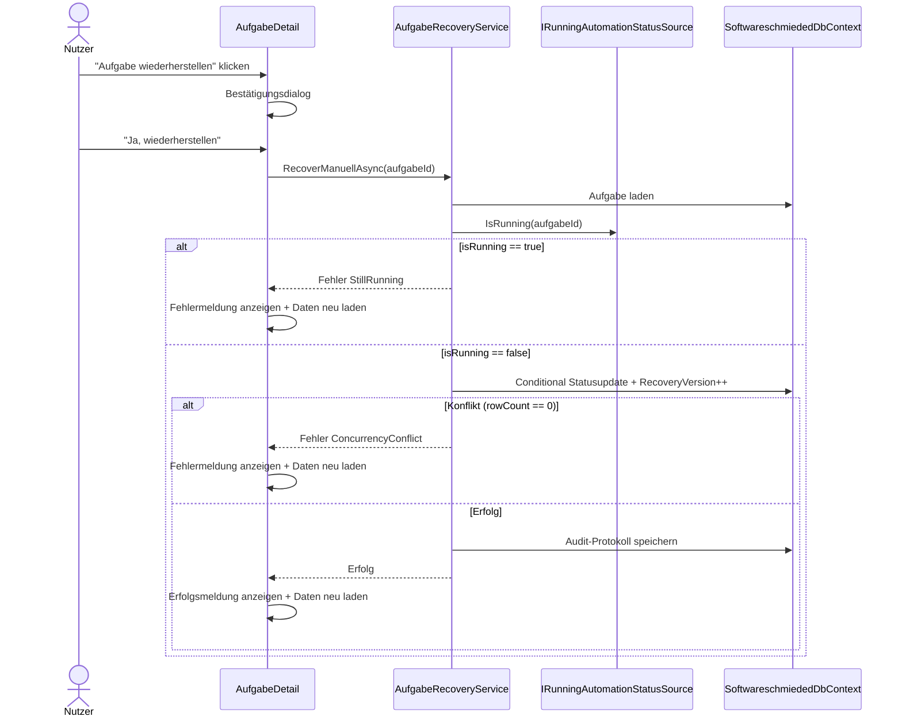
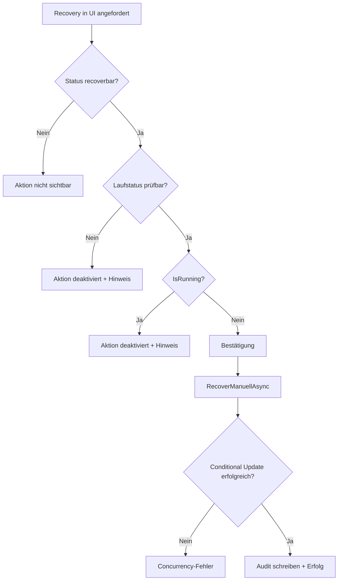

# Ablauf – Manuelle Aufgaben-Recovery

## Titel & Kontext

Dieser Ablauf beschreibt die manuelle Wiederherstellung einer festhängenden Aufgabe in `AufgabeDetail`.  
Die Recovery ist ausschließlich für `KiAktiv` und `TestsLaufen` vorgesehen und setzt die Aufgabe auf `InBearbeitung`, sofern keine Verarbeitung mehr läuft.

> Verwandte Artefakte:  
> [Requirements](../requirements/aufgabe-recovery-wiederherstellung-requirements-analysis.md) ·
> [Blueprint](../architecture/aufgabe-recovery-wiederherstellung-architecture-blueprint.md) ·
> [Technischer Contract](../api/aufgabe-recovery.md)

---

## Diagramm A – Sequenzablauf

---

## Diagramm B – Entscheidungslogik

---

## Schrittbeschreibung

1. **UI-Einblendung und Vorprüfung**
   - Nur bei `IstRecoveryStatus` (`KiAktiv`, `TestsLaufen`).
   - Disable-Reason bei laufender Verarbeitung oder nicht prüfbarem Laufstatus.

2. **Bestätigung durch Anwender**
   - Recovery startet erst nach expliziter Bestätigung.

3. **Service-Eligibility**
   - Aufgabe vorhanden?
   - Status recoverbar?
   - Laufstatus verfügbar und `!IsRunning`?

4. **Konsistenter Statuswechsel**
   - Conditionales Update mit Guard auf `Status` und `RecoveryVersion`.
   - Bei Erfolg: `Status = InBearbeitung`, `RecoveryVersion++`.

5. **Audit und Rückmeldung**
   - `Protokolleintrag` vom Typ `StatusUebergang`.
   - UI lädt Aufgabe neu und zeigt Erfolg/Fehler.

---

## Fehlerpfade

- Aufgabe nicht gefunden
- Nicht recoverbarer Status
- Verarbeitung läuft noch
- Laufstatusprüfung nicht möglich
- Concurrency-Konflikt

Alle Fehler werden als `InvalidOperationException` mit verständlichem Text an die UI propagiert.

