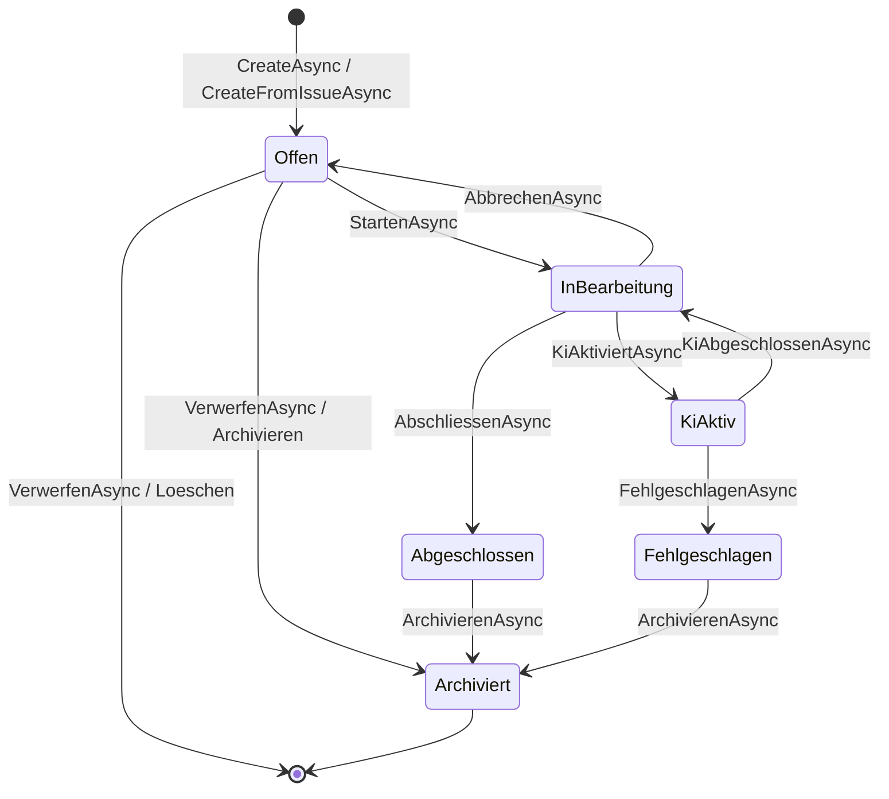

# Ablauf – AufgabeService Statusübergänge

## Titel & Kontext

Dieser Ablauf dokumentiert die Statusverwaltung im `AufgabeService` über den gesamten Aufgabenlebenszyklus.  
Der Service setzt fachliche Zustände (`Offen`, `InBearbeitung`, `KiAktiv`, `Fehlgeschlagen`, `Abgeschlossen`, `Archiviert`) und persistiert sie in der Datenbank.  
Er bildet die Grundlage für Orchestrierungsabläufe in `EntwicklungsprozessService` und UI-Aktionen in den Aufgaben-Views.

> Verwandte Artefakte:  
> [Requirements](../requirements/requirements-analysis.md) ·
> [Plugin-/Prozess-Requirements](../requirements/plugin-klassenbibliotheken-github-und-copilot.md) ·
> [Tests AufgabeService](../../src/Softwareschmiede.Tests/Application/Services/AufgabeServiceTests.cs)

---

## Diagramm A – Zustandsübergänge im Aufgabe-Lebenszyklus



---

## Diagramm B – Programmablauf mit Guard-Checks und Fehlerpfaden

```mermaid
flowchart TD
    A([Statusoperation auf AufgabeService]) --> B[Aufgabe per FindAsync laden]
    B --> C{Aufgabe gefunden?}
    C -- Nein -.-> C1[InvalidOperationException]
    C -- Ja --> D{Operation}
    D -- Archivieren --> F{Status = Abgeschlossen<br/>oder Fehlgeschlagen?}
    D -- Verwerfen --> V{Status = Offen?}
    F -- Nein -.-> F1[InvalidOperationException]
    F -- Ja --> E[Status = Archiviert]
    V -- Nein -.-> V1[InvalidOperationException]
    V -- Ja --> W{Aktion = Archivieren?}
    W -- Ja --> E
    W -- Nein --> R[Aufgabe entfernen]
    E --> G[SaveChangesAsync]
    R --> G
    G --> H([Status persistiert bzw. Aufgabe entfernt])
```

---

## Schrittbeschreibung

1. **Aufgabe erzeugen (Initialstatus `Offen`)**  
   - **Code:** `src/Softwareschmiede/Application/Services/AufgabeService.cs` (`CreateAsync`, `CreateFromIssueAsync`)  
   - **Eingaben:** `projektId`, Titel/Beschreibung oder `Issue`-Daten  
   - **Ausgabe/Seiteneffekt:** Neue `Aufgabe` mit `Status = AufgabeStatus.Offen`; Persistenz via `_db.SaveChangesAsync`.

2. **Aufgabe starten (`Offen` → `InBearbeitung`)**  
   - **Code:** `src/Softwareschmiede/Application/Services/AufgabeService.cs` (`StartenAsync`)  
   - **Eingaben:** `id`, `branchName`, `lokalerKlonPfad`  
   - **Ausgabe/Seiteneffekt:** Setzt `Status`, `BranchName`, `LokalerKlonPfad`; speichert Änderungen in DB.

3. **KI-Phase aktivieren/deaktivieren (`InBearbeitung` ↔ `KiAktiv`)**  
   - **Code:** `src/Softwareschmiede/Application/Services/AufgabeService.cs` (`KiAktiviertAsync`, `KiAbgeschlossenAsync`)  
   - **Eingaben:** `id`  
   - **Ausgabe/Seiteneffekt:** Wechsel in den KI-Laufstatus und Rückkehr in manuellen Bearbeitungsstatus.

4. **Fehlerzustand setzen (`*` → `Fehlgeschlagen`)**  
   - **Code:** `src/Softwareschmiede/Application/Services/AufgabeService.cs` (`FehlgeschlagenAsync`, `StatusSetzenAsync`)  
   - **Eingaben:** `id` bzw. generischer `AufgabeStatus`  
   - **Ausgabe/Seiteneffekt:** Fehlerstatus wird persistiert; nachgelagerte UI/Flows reagieren auf Endstatus.

5. **Abschluss mit Aufräumen (`InBearbeitung` → `Abgeschlossen`)**  
   - **Code:** `src/Softwareschmiede/Application/Services/AufgabeService.cs` (`AbschliessenAsync`)  
   - **Eingaben:** `id`  
   - **Ausgabe/Seiteneffekt:** Setzt `AbschlussDatum`, leert `BranchName`/`LokalerKlonPfad`, persistiert Abschluss.

6. **Abbruch und Rücksetzung (`InBearbeitung` → `Offen`)**  
   - **Code:** `src/Softwareschmiede/Application/Services/AufgabeService.cs` (`AbbrechenAsync`)  
   - **Eingaben:** `id`  
   - **Ausgabe/Seiteneffekt:** Setzt Status zurück, entfernt Branch-/Klonpfad-Bezug.

7. **Archivierung von Endzuständen**  
   - **Code:** `src/Softwareschmiede/Application/Services/AufgabeService.cs` (`ArchivierenAsync`)  
   - **Eingaben:** `id`  
   - **Ausgabe/Seiteneffekt:** Setzt `Status = Archiviert`, aber nur für `Abgeschlossen` oder `Fehlgeschlagen`.

8. **Verwerfen offener Aufgaben**
   - **Code:** `src/Softwareschmiede/Application/Services/AufgabeService.cs` (`VerwerfenAsync`)
   - **Eingaben:** `id`, `VerwerfenAktion`
   - **Ausgabe/Seiteneffekt:** Nur für `Offen`; entweder `Status = Archiviert` oder Aufgabe wird vollständig entfernt.

---

## Fehlerbehandlung

- **Aufgabe nicht gefunden**  
  - **Pfad:** Mehrere Methoden mit `_db.Aufgaben.FindAsync([id], ct)`  
  - **Behandlung:** `InvalidOperationException($"Aufgabe {id} nicht gefunden.")`.

- **Ungültige Archivierung aus Zwischenzuständen**  
  - **Pfad:** `ArchivierenAsync`  
  - **Behandlung:** `InvalidOperationException("Nur abgeschlossene oder fehlgeschlagene Aufgaben können archiviert werden.")`.

- **Ungültiges Verwerfen aus Nicht-Startzuständen**
  - **Pfad:** `VerwerfenAsync`
  - **Behandlung:** `InvalidOperationException("Nur offene Aufgaben können verworfen werden.")`.

- **Datenbankfehler bei Persistenz**  
  - **Pfad:** Alle Methoden mit `SaveChangesAsync`  
  - **Behandlung:** Keine lokale Abfanglogik im Service; Exception propagiert an aufrufende Orchestrierung/UI.

---

## Abhängigkeiten

- **Application Service**
  - `src/Softwareschmiede/Application/Services/AufgabeService.cs`

- **Persistenz**
  - `src/Softwareschmiede/Infrastructure/Data/SoftwareschmiededDbContext.cs`

- **Domäne**
  - `src/Softwareschmiede/Domain/Entities/Aufgabe.cs`
  - `src/Softwareschmiede/Domain/Enums/AufgabeStatus.cs`

- **Aufrufende Services/UI**
  - `src/Softwareschmiede/Application/Services/EntwicklungsprozessService.cs`
  - `src/Softwareschmiede/Components/Pages/Aufgaben/AufgabeDetail.razor.cs`
