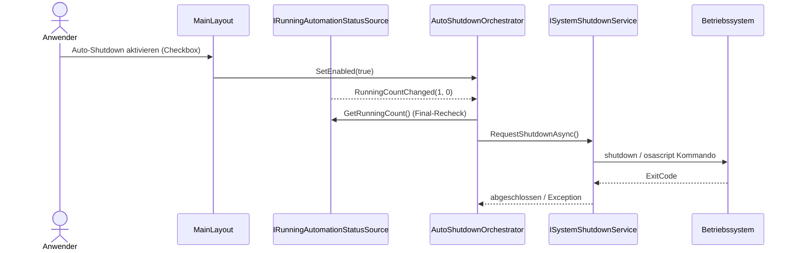
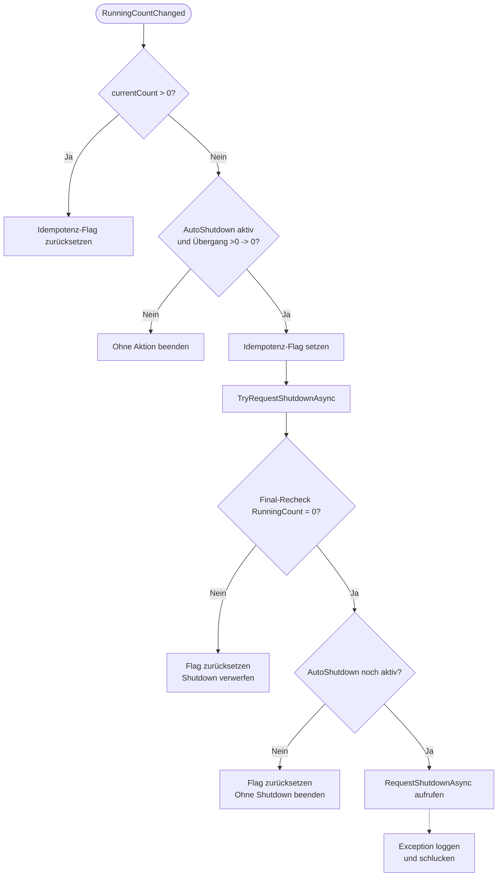

# Ablauf – AutoShutdownOrchestrator

## Titel & Kontext

Dieser Ablauf beschreibt den automatischen System-Shutdown nach Abschluss aller laufenden KI-Automatisierungen.  
Die Aktivierung erfolgt über den Toggle im `MainLayout`; ausgelöst wird der Shutdown erst beim Übergang der Running-Count-Metrik von `>0` auf `0`.  
Der `AutoShutdownOrchestrator` erzwingt dabei Idempotenz pro Zero-Transition und führt vor dem Shutdown einen Final-Recheck aus.

> Verwandte Artefakte:  
> [Architektur Blueprint](../architecture/architecture-blueprint.md) ·
> [Tests Orchestrator](../../src/Softwareschmiede.Tests/Application/Services/AutoShutdownOrchestratorTests.cs) ·
> [Tests Layout](../../src/Softwareschmiede.Tests/Components/Layout/MainLayoutTests.cs)

---

## Diagramm A – Sequenz: Toggle bis OS-Shutdown

---

## Diagramm B – Programmablauf: Transition-Logik und Fehlerpfade

---

## Schrittbeschreibung

1. **Initiales Wiring und Subscription**  
   - **Code:** `src/Softwareschmiede/Components/Layout/MainLayout.razor.cs` (`OnInitialized`), `src/Softwareschmiede/Application/Services/AutoShutdownOrchestrator.cs` (Konstruktor)  
   - **Eingaben:** Initialer Running-Count und UI-Default `_autoShutdownEnabled=false`  
   - **Ausgabe/Seiteneffekt:** UI subscribed auf `RunningCountChanged`; Orchestrator subscribed ebenfalls auf denselben Eventstream.

2. **Aktivierungszustand über UI setzen**  
   - **Code:** `src/Softwareschmiede/Components/Layout/MainLayout.razor` (Checkbox), `MainLayout.razor.cs` (`AutoShutdownChanged`)  
   - **Eingaben:** `ChangeEventArgs.Value` (bool/string)  
   - **Ausgabe/Seiteneffekt:** Normalisierung auf bool und Übergabe an `IAutoShutdownOrchestrator.SetEnabled`.

3. **Übergang auf 0 erkennen und entprellen**  
   - **Code:** `src/Softwareschmiede/Application/Services/AutoShutdownOrchestrator.cs` (`OnRunningCountChanged`)  
   - **Eingaben:** `previousCount`, `currentCount`, interne Flags  
   - **Ausgabe/Seiteneffekt:** Shutdown wird nur bei `previousCount > 0 && currentCount == 0` und ohne bereits gesetztes Transition-Flag gestartet.

4. **Final-Recheck vor Shutdown**  
   - **Code:** `src/Softwareschmiede/Application/Services/AutoShutdownOrchestrator.cs` (`TryRequestShutdownAsync`)  
   - **Eingaben:** Aktueller Wert aus `IRunningAutomationStatusSource.GetRunningCount()`  
   - **Ausgabe/Seiteneffekt:** Bei erneutem `>0` wird der Shutdown verworfen und der Guard zurückgesetzt.

5. **OS-Shutdown anfordern**  
   - **Code:** `src/Softwareschmiede/Infrastructure/Services/SystemShutdownService.cs` (`RequestShutdownAsync`, `ResolveShutdownCommand`)  
   - **Eingaben:** Plattform (`Windows/Linux/macOS`)  
   - **Ausgabe/Seiteneffekt:** Startet OS-Kommando (`shutdown`/`osascript`), wartet auf ExitCode, wirft bei Fehlercode.

6. **Lifecycle-Cleanup**  
   - **Code:** `src/Softwareschmiede/Application/Services/AutoShutdownOrchestrator.cs` (`Dispose`), `MainLayout.razor.cs` (`Dispose`)  
   - **Eingaben:** Komponenten-/Service-Dispose  
   - **Ausgabe/Seiteneffekt:** Eventhandler werden deregistriert, Leaks und Mehrfachaufrufe werden vermieden.

---

## Fehlerbehandlung

- **Shutdown wird trotz Zero-Event nicht ausgeführt (Race)**  
  - **Pfad:** `TryRequestShutdownAsync` mit Final-Recheck `GetRunningCount() > 0`  
  - **Behandlung:** Guard wird zurückgesetzt; nächster gültiger Übergang kann erneut auslösen.

- **Toggle vor Ausführung deaktiviert**  
  - **Pfad:** `TryRequestShutdownAsync` prüft `_autoShutdownEnabled` erneut  
  - **Behandlung:** Kein Shutdown; Guard-Flag wird zurückgesetzt.

- **Fehler beim OS-Kommando (ExitCode != 0 / Prozessstartfehler)**  
  - **Pfad:** `SystemShutdownService.RequestShutdownAsync` wirft Exception  
  - **Behandlung:** `AutoShutdownOrchestrator` fängt Exception in `TryRequestShutdownAsync`, loggt Fehler, Anwendung bleibt lauffähig.

- **Nicht unterstütztes Betriebssystem**  
  - **Pfad:** `ResolveShutdownCommand`  
  - **Behandlung:** `PlatformNotSupportedException`, wird im Orchestrator-`catch` protokolliert.

---

## Abhängigkeiten

- **UI**
  - `src/Softwareschmiede/Components/Layout/MainLayout.razor`
  - `src/Softwareschmiede/Components/Layout/MainLayout.razor.cs`

- **Application Services**
  - `src/Softwareschmiede/Application/Services/AutoShutdownOrchestrator.cs`
  - `src/Softwareschmiede/Application/Services/KiAusfuehrungsService.cs` (liefert Running-Count/Eventquelle)

- **Interfaces**
  - `src/Softwareschmiede/Application/Services/IAutoShutdownOrchestrator.cs`
  - `src/Softwareschmiede/Domain/Interfaces/IRunningAutomationStatusSource.cs`
  - `src/Softwareschmiede/Domain/Interfaces/ISystemShutdownService.cs`

- **Infrastruktur**
  - `src/Softwareschmiede/Infrastructure/Services/SystemShutdownService.cs`
