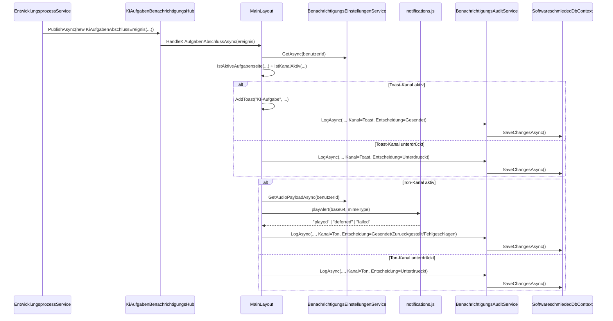
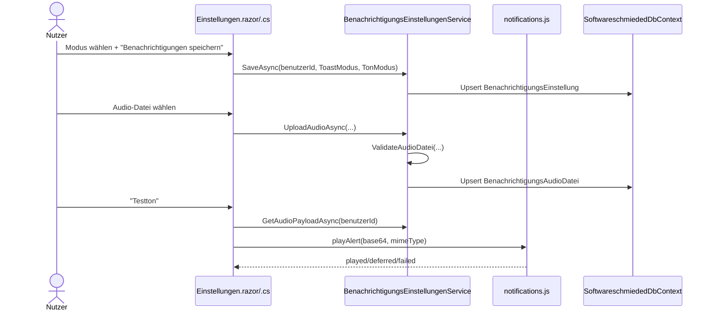

# Ablauf – Benachrichtigungssystem für abgeschlossene KI-Aufgaben

## Titel & Kontext

Dieser Ablauf dokumentiert den End-to-End-Pfad für Benachrichtigungen bei Abschluss eines KI-Laufs: vom Event-Publish in `EntwicklungsprozessService` über die Verteilung im `KiAufgabenBenachrichtigungsHub` bis zur kanalabhängigen Verarbeitung in `MainLayout` (Toast/Ton inkl. Audit).  
Zusätzlich beschreibt er die Einstellungsstrecke in `Einstellungen` für Modus-Persistenz, Audio-Upload und Testton. Die Dokumentation basiert auf dem implementierten Code in `src/Softwareschmiede/`.

> Verwandte Flows: [Entwicklungsprozess-Abläufe](./development-process-flow.md) · [KiAusfuehrungsService: Hintergrundläufe](./ki-ausfuehrungs-service-flow.md)

---

## Diagramm A – End-to-End-Interaktion (sequenceDiagram)



---

## Diagramm B – Modusmatrix & Dispatch-Entscheidung (flowchart TD)

```mermaid
flowchart TD
    A[Abschlussereignis empfangen] --> B{Bereits dedupliziert?}
    B -- Ja --> Z[Kein weiterer Dispatch]
    B -- Nein --> C{Modus Deaktiviert?}
    C -- Ja --> D[Audit: Unterdrueckt\nGrund KanalDeaktiviert]
    C -- Nein --> E{Modus NurAufgabenseite?}
    E -- Nein --> H[Dispatch erlaubt]
    E -- Ja --> F{Aktive Aufgabenseite?}
    F -- Ja --> H
    F -- Nein --> G[Audit: Unterdrueckt\nGrund NichtAufAufgabenseite]
    H --> I{Kanal Toast?}
    I -- Ja --> J[Toast anzeigen + Audit Gesendet]
    I -- Nein --> K[JS playAlert aufrufen]
    K --> L{Ergebnis deferred?}
    L -- Ja --> M[Warn-Toast + Audit Zurueckgestellt]
    L -- Nein --> N{Ergebnis failed?}
    N -- Ja -.-> O[Fehler-Toast + Audit Fehlgeschlagen]
    N -- Nein --> P[Audit Gesendet]
    K -.-> Q[JS-Exception] -.-> O
```

---

## Diagramm C – Einstellungen (Modus speichern, Audio, Testton)



---

## Schrittbeschreibung

1. **Abschlussereignis publizieren**
   - **Code:** `src/Softwareschmiede/Application/Services/EntwicklungsprozessService.cs` (`KiStartenAsync`, `PublishAsync`-Aufruf)
   - **Eingabe:** `aufgabeId`, `aufgabe.Titel`, berechneter `abschlusstatus` (`InBearbeitung` oder `Fehlgeschlagen`)
   - **Ausgabe:** `KiAufgabenAbschlussEreignis`
   - **Seiteneffekt:** In-Memory-Dispatch an den Hub

2. **Hub verteilt an Subscriber**
   - **Code:** `src/Softwareschmiede/Application/Services/KiAufgabenBenachrichtigungsHub.cs` (`PublishAsync`)
   - **Eingabe:** `KiAufgabenAbschlussEreignis`
   - **Ausgabe:** Callback-Aufrufe auf alle aktuellen Subscriber
   - **Seiteneffekt:** Fehler eines Subscribers stoppen andere Subscriber nicht

3. **MainLayout lädt Benutzerkontext und Einstellungen**
   - **Code:** `src/Softwareschmiede/Components/Layout/MainLayout.razor.cs` (`HandleKiAufgabenAbschlussAsync`)
   - **Eingabe:** Event + `BenutzerkontextService.GetBenutzerId()`
   - **Ausgabe:** `BenachrichtigungsEinstellungenDto` (`ToastModus`, `TonModus`)
   - **Seiteneffekt:** UI-Update über `InvokeAsync`/`StateHasChanged`

4. **Modusmatrix prüfen (pro Kanal)**
   - **Code:** `src/Softwareschmiede/Components/Layout/MainLayout.razor.cs` (`IstAktiveAufgabenseite`, `IstKanalAktiv`, `BestimmeUnterdrueckungsgrund`)
   - **Eingabe:** Kanalmodus + aktuelle Route + `AufgabeId`
   - **Ausgabe:** Dispatch-Entscheidung
   - **Seiteneffekt:** Unterdrückte Kanäle werden auditiert

5. **Toast dispatchen**
   - **Code:** `src/Softwareschmiede/Components/Layout/MainLayout.razor.cs` (`VerarbeiteToastAsync`, `AddToast`)
   - **Eingabe:** Event + `ToastModus`
   - **Ausgabe:** UI-Toast im `MainLayout` (`MainLayout.razor`)
   - **Seiteneffekt:** Audit-Eintrag (`Gesendet` oder `Unterdrueckt`)

6. **Ton dispatchen**
   - **Code:** `src/Softwareschmiede/Components/Layout/MainLayout.razor.cs` (`VerarbeiteTonAsync`) + `src/Softwareschmiede/wwwroot/js/notifications.js` (`playAlert`)
   - **Eingabe:** Event + `TonModus` + optionaler Audio-Payload
   - **Ausgabe:** JS-Ergebnis `played|deferred|failed`
   - **Seiteneffekt:** Warn-/Fehler-Toast bei `deferred`/`failed`, Audit-Eintrag mit Grund (`AutoplayBlockiert`, `AudioPlaybackFehler`, `JsInteropFehler`, `StandardtonFallback`, `BenutzerdefinierterTon`)

7. **Audit persistieren**
   - **Code:** `src/Softwareschmiede/Application/Services/BenachrichtigungsAuditService.cs` (`LogAsync`) + `src/Softwareschmiede/Infrastructure/Data/SoftwareschmiededDbContext.cs` (Index auf `{EreignisId,BenutzerId,Kanal}`)
   - **Eingabe:** Ereignis-/Aufgabe-/Benutzerdaten, Kanal, Modus, Entscheidung, Grund
   - **Ausgabe:** `BenachrichtigungsDispatchLog`
   - **Seiteneffekt:** Persistentes Dispatch-Audit in SQLite

8. **Einstellungen speichern**
   - **Code:** `src/Softwareschmiede/Components/Pages/Einstellungen.razor.cs` (`BenachrichtigungsEinstellungenSpeichernAsync`) + `src/Softwareschmiede/Application/Services/BenachrichtigungsEinstellungenService.cs` (`SaveAsync`)
   - **Eingabe:** `_toastModus`, `_tonModus`
   - **Ausgabe:** Erfolgs-/Fehlerstatus in UI
   - **Seiteneffekt:** Upsert von `BenachrichtigungsEinstellung` pro Benutzer

9. **Audio-Upload/Entfernen**
   - **Code:** `src/Softwareschmiede/Components/Pages/Einstellungen.razor.cs` (`BenachrichtigungsAudioDateiAusgewaehltAsync`, `BenachrichtigungsAudioEntfernenAsync`) + `BenachrichtigungsEinstellungenService.UploadAudioAsync/RemoveAudioAsync`
   - **Eingabe:** Datei aus `InputFile` bzw. Benutzeraktion „Entfernen“
   - **Ausgabe:** Statusmeldung + aktualisierte Dateiinformation
   - **Seiteneffekt:** Persistenz in `BenachrichtigungsAudioDatei` oder Löschung

10. **Testton auslösen**
    - **Code:** `src/Softwareschmiede/Components/Pages/Einstellungen.razor.cs` (`TesttonAbspielenAsync`)
    - **Eingabe:** Optionales gespeichertes Audio
    - **Ausgabe:** UI-Status „abgespielt“ / „deferred“ / Fehler
    - **Seiteneffekt:** Direkter JS-Aufruf ohne Hub-Event

---

## Fehlerbehandlung

- **Subscriber-Fehler im Hub:** `KiAufgabenBenachrichtigungsHub.PublishAsync` fängt Exceptions pro Callback ab und loggt Warning; andere Subscriber laufen weiter.
- **Doppelte Dispatches:** `MainLayout` nutzt `_dispatchDedupe` (`{EreignisId}:toast|ton`) und bricht bei Duplikaten ab.
- **Unterdrückte Kanäle durch Modusmatrix:** Kein UI-Dispatch, aber Audit mit `Unterdrueckt` und Grund.
- **Autoplay-Blocker im Browser:** `playAlert` liefert `deferred`; `MainLayout` zeigt Warn-Toast und auditiert `Zurueckgestellt`.
- **Audio-Playback-Fehler:** `playAlert` liefert `failed` oder JS-Interop wirft Exception; Fehler-Toast + Audit `Fehlgeschlagen`.
- **Audit-Persistenzkonflikt:** `BenachrichtigungsAuditService.LogAsync` fängt `DbUpdateException` (z. B. Unique-Index) und loggt Debug.
- **Ungültige Audio-Datei beim Upload:** `BenachrichtigungsEinstellungenService.ValidateAudioDatei` wirft bei leerer/zu großer Datei, ungültiger Extension/MIME oder Signatur-Mismatch; UI zeigt Fehlermeldung.

---

## Abhängigkeiten

- `EntwicklungsprozessService`
- `KiAufgabenBenachrichtigungsHub`
- `MainLayout` (`MainLayout.razor` / `MainLayout.razor.cs`)
- `BenachrichtigungsEinstellungenService`
- `BenachrichtigungsAuditService`
- `IBenutzerkontextService` (`BenutzerkontextService`)
- `notifications.js` (`window.softwareschmiedeNotifications.playAlert`)
- `SoftwareschmiededDbContext` + Entitäten `BenachrichtigungsEinstellung`, `BenachrichtigungsAudioDatei`, `BenachrichtigungsDispatchLog`
