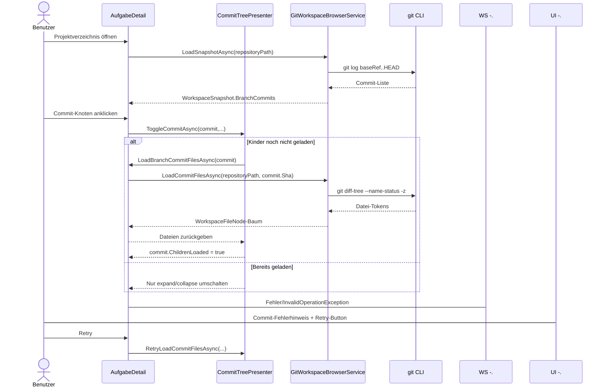
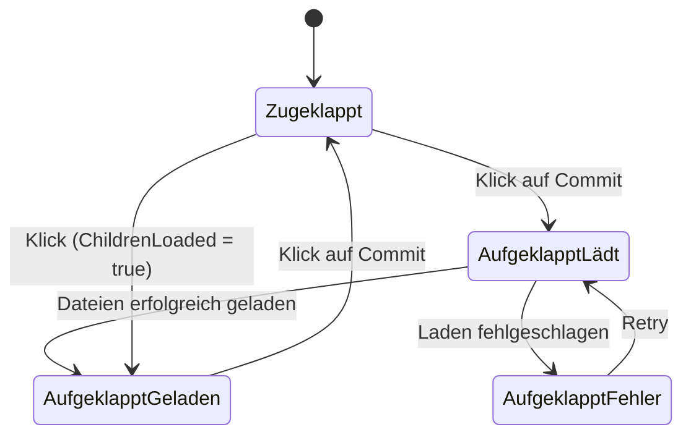

# Ablauf – Branch-Commit-Anzeige im Dateibaum (Lazy-Expansion & Retry)

## Titel & Kontext

Dieser Ablauf dokumentiert die Anzeige und Interaktion der Branch-Commits im Repository-Explorer von `AufgabeDetail`.
Im Fokus stehen die Ermittlung von `BranchCommits` im Snapshot, das Lazy-Laden der Commit-Dateien beim Aufklappen und das explizite Retry-Verhalten bei Ladefehlern.
Der Flow beschreibt ausschließlich den real implementierten Codepfad in UI-Presenter-Service-Kette.

---

## Diagramm – Sequenz für Commit-Knoten-Laden und Retry

---

## Diagramm – Zustandsübergänge eines Commit-Knotens

---

## Schrittbeschreibung

1. **Snapshot liefert Branch-Commits**
   - **Code:** `src/Softwareschmiede/Application/Services/GitWorkspaceBrowserService.cs` (`LoadSnapshotAsync`, `ReadBranchCommitsAsync`, `ResolveBaseReferenceAsync`)
   - **Eingaben:** `repositoryPath`, ermittelte Basisreferenz (`origin/main`, `origin/master`, `main`, `master`).
   - **Ausgaben/Seiteneffekte:** `WorkspaceSnapshot.BranchCommits` wird aus `git log --format=%H%x00%h%x00%s <baseRef>..HEAD` aufgebaut.

2. **Commit-Knoten werden im Explorer gerendert**
   - **Code:** `src/Softwareschmiede/Components/Pages/Aufgaben/AufgabeDetail.razor` (`foreach (var commit in VisibleBranchCommits)`)
   - **Eingaben:** `VisibleBranchCommits` aus `_workspaceSnapshot.BranchCommits`.
   - **Ausgaben/Seiteneffekte:** UI zeigt `[ShortSha] Subject`, Ladebadge und Fehlerbadge pro Commit.

3. **Klick auf Commit toggelt Expand/Collapse**
   - **Code:** `src/Softwareschmiede/Components/Pages/Aufgaben/AufgabeDetail.razor.cs` (`CommitNodeClickedAsync`)
   - **Eingaben:** `BranchCommit commit`.
   - **Ausgaben/Seiteneffekte:** Delegiert an `CommitTreePresenter.ToggleCommitAsync`.

4. **Presenter erzwingt Lazy-Loading nur beim ersten Expand**
   - **Code:** `src/Softwareschmiede/Components/Pages/Aufgaben/CommitTreePresenter.cs` (`ToggleCommitAsync`, `LoadCommitFilesAsync`)
   - **Eingaben:** `commit.IsExpanded`, `commit.ChildrenLoaded`, Loader-Delegate.
   - **Ausgaben/Seiteneffekte:** Bei erstem Expand startet Dateiladen; bei späteren Expands wird nur Zustand umgeschaltet.

5. **Dateien für Commit werden service-seitig geladen**
   - **Code:** `src/Softwareschmiede/Components/Pages/Aufgaben/AufgabeDetail.razor.cs` (`LoadBranchCommitFilesAsync`) + `src/Softwareschmiede/Application/Services/GitWorkspaceBrowserService.cs` (`LoadCommitFilesAsync`)
   - **Eingaben:** `commit.Sha`, `LokalerKlonPfad`.
   - **Ausgaben/Seiteneffekte:** `git diff-tree`-Output wird in einen Baum aus `WorkspaceFileNode` überführt; jeder Dateiknoten erhält `CommitSha`.

6. **Presenter setzt Erfolgszustand**
   - **Code:** `CommitTreePresenter.LoadCommitFilesAsync`
   - **Eingaben:** Geladene Dateiknoten.
   - **Ausgaben/Seiteneffekte:** `commit.Files`, `commit.ChildrenLoaded = true`, `commit.IsLoadingFiles = false`.

7. **Fehlerzustand mit Retry wird aufgebaut**
   - **Code:** `CommitTreePresenter.LoadCommitFilesAsync` (catch) + `AufgabeDetail.razor` (Retry-Button)
   - **Eingaben:** Exception beim Laden.
   - **Ausgaben/Seiteneffekte:** `commit.ErrorMessage` wird gesetzt; UI zeigt Warnung und `Retry`.

8. **Retry lädt denselben Commit erneut**
   - **Code:** `src/Softwareschmiede/Components/Pages/Aufgaben/AufgabeDetail.razor.cs` (`RetryCommitNodeLoadAsync`) + `CommitTreePresenter.RetryLoadCommitFilesAsync`
   - **Eingaben:** `BranchCommit commit`.
   - **Ausgaben/Seiteneffekte:** Fehlertext wird zurückgesetzt, Load erneut ausgeführt, Erfolg/Fehler neu bewertet.

---

## Fehlerbehandlung

- **Kein lokaler Klonpfad**
  - Pfad: `AufgabeDetail.LoadBranchCommitFilesAsync`
  - Behandlung: `InvalidOperationException("Kein lokaler Klonpfad vorhanden.")`, Commit-Knoten bleibt im Fehlerzustand.

- **`git diff-tree` schlägt fehl**
  - Pfad: `GitWorkspaceBrowserService.LoadCommitFilesAsync`
  - Behandlung: Exception mit `StdErr`; Presenter mappt Fehler auf `commit.ErrorMessage`.

- **Paralleles Mehrfachladen desselben Commit-Knotens**
  - Pfad: `CommitTreePresenter.LoadCommitFilesAsync`
  - Behandlung: Guard `if (commit.IsLoadingFiles) return;` verhindert konkurrierende Requests.

- **Ungültige Tokens aus `git diff-tree`**
  - Pfad: `GitWorkspaceBrowserService.BuildCommitFileTree`
  - Behandlung: Unvollständige Tokens werden übersprungen; valide Einträge bleiben erhalten.

---

## Bekannte Grenzen

- Commit-Dateien werden nach erstem erfolgreichen Laden gecacht (`ChildrenLoaded = true`); automatische Neuladung erfolgt erst nach Explorer-Refresh.
- Ohne ermittelbare Basisreferenz bleibt `BranchCommits` leer, obwohl `ChangedFileCount` > 0 sein kann.
- Retry ist manuell; es gibt keinen automatischen Backoff oder Hintergrund-Retry.

---

## Abhängigkeiten

- `src/Softwareschmiede/Components/Pages/Aufgaben/AufgabeDetail.razor`
- `src/Softwareschmiede/Components/Pages/Aufgaben/AufgabeDetail.razor.cs`
- `src/Softwareschmiede/Components/Pages/Aufgaben/CommitTreePresenter.cs`
- `src/Softwareschmiede/Application/Services/GitWorkspaceBrowserService.cs`
- `src/Softwareschmiede/Application/Services/IGitWorkspaceBrowserService.cs`
- `src/Softwareschmiede/Domain/ValueObjects/WorkspaceSnapshot.cs`
- `src/Softwareschmiede/Domain/ValueObjects/BranchCommit.cs`
- `src/Softwareschmiede/Domain/ValueObjects/WorkspaceFileNode.cs`
- Externes System: `git` CLI

> Verwandte Flows: [Live Project Browser mit Git-Status](./live-project-browser-git-status-flow.md) · [Commit-Diff-Preview im Dateibaum](./commit-diff-preview-flow.md)  
> API/Business/Requirements/Architecture: [live-project-browser-git-status.md](../api/live-project-browser-git-status.md) · [F021 – Live Project Browser mit Git-Status](../business/features/F021-live-project-browser-git-status.md) · [live-project-browser-git-status-requirements-analysis.md](../requirements/live-project-browser-git-status-requirements-analysis.md) · [live-project-browser-git-status-architecture-blueprint.md](../architecture/live-project-browser-git-status-architecture-blueprint.md)
