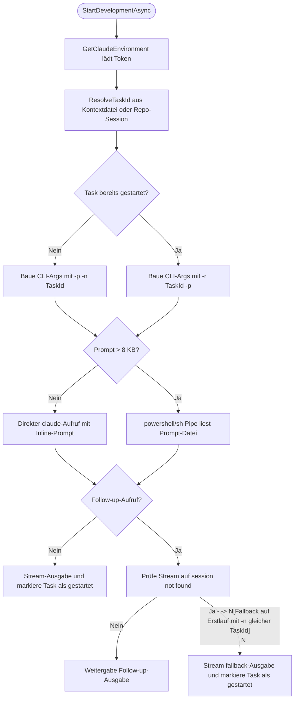
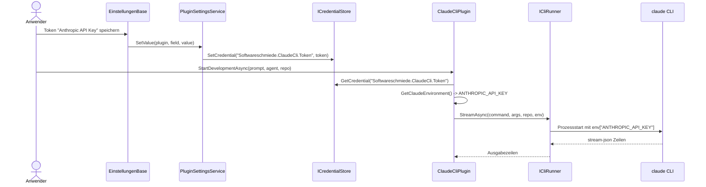

# Ablauf – Claude-CLI Aufruf-Fix & Session-Wiederverwendung

## Titel & Kontext

Dieser Ablauf beschreibt die Laufzeitlogik des `ClaudeCliPlugin` für die Task-ID-Auflösung, Erstlauf/Folgeaufruf, Session-Fallback und Large-Prompt-Verarbeitung.  
Im Fokus stehen die konkreten Entscheidungspfade in `StartDevelopmentAsync`, `ResolveTaskId` und `CreateExecutionRequest` für stabile Claude-CLI-Aufrufe pro Repository-Session.  
Zusätzlich wird die Token-Übergabe vom Settings-/Credential-Pfad bis zur Umgebungsvariable `ANTHROPIC_API_KEY` dokumentiert.

> Verwandte Artefakte:  
> [Requirements](../requirements/claude-cli-integration-requirements-analysis.md) ·
> [Architektur-Blueprint](../architecture/claude-cli-integration-architecture-blueprint.md) ·
> [Entity-Relationship-Model](../architecture/claude-cli-integration-entity-relationship-model.md) ·
> [Architecture-Review](../improvements/claude-cli-integration-architecture-review.md) ·
> [Testplan Claude-CLI](../tests/testplan-claude-cli-integration.md) ·
> [Testlücken Claude-CLI](../tests/testluecken-claude-cli-integration.md) ·
> [Lifecycle Report Claude-CLI](../lifecycle-report-claude-cli-integration.md)
>
> Dokumentations-Fallback (transparent):  
> `~/.copilot/agents/documentation-orchestrator.agent.md` war in der Laufzeitumgebung nicht verfügbar; verwendet wurde `.github/agents/documentation-orchestrator.agent.md` gemäß [Dokumentationsplan 2026-05-28](../documentation-plan.md).

---

## Diagramm A – Programmablauf: Task-ID, Erstlauf/Follow-up, Fallback und Large-Prompt-Pfad

---

## Diagramm B – Sequenz: Token-Übergabe bis ANTHROPIC_API_KEY

---

## Schrittbeschreibung

1. **Task-ID auflösen (Kontextdatei oder Repo-Session)**  
   - **Code:** `plugins/Softwareschmiede.Plugin.ClaudeCli/ClaudeCliPlugin.cs` (`ResolveTaskId`)  
   - **Eingaben:** `localRepoPath`, Dateien `*.claude.context.md`, internes `_repoTaskIds`  
   - **Ausgabe/Seiteneffekt:** Bei vorhandener Kontextdatei wird deren GUID verwendet, sonst wird je Repository eine persistierte Session-GUID erzeugt/weiterverwendet.

2. **Promptdatei und Laufmodus vorbereiten**  
   - **Code:** `ClaudeCliPlugin.cs` (`StartDevelopmentAsync`)  
   - **Eingaben:** `prompt`, `agent`, `model`  
   - **Ausgabe/Seiteneffekt:** `{guid}.claude-task.md` wird geschrieben, `isFollowUp` via `_startedTaskIds` bestimmt, `useStdIn` bei > 8 KB aktiviert.

3. **Erstlauf vs. Follow-up Argumente bilden**  
   - **Code:** `ClaudeCliPlugin.cs` (`BuildClaudeArgs`)  
   - **Eingaben:** `taskId`, `isFollowUp`, `includePromptArgument`  
   - **Ausgabe/Seiteneffekt:**  
     - Erstlauf: `-p -n <taskId>`  
     - Follow-up: `-r <taskId> -p`  
     - Gemeinsame Flags: `--dangerously-skip-permissions --output-format stream-json --model ...`.

4. **Large-Prompt-Pfad über Pipe statt Inline**  
   - **Code:** `ClaudeCliPlugin.cs` (`CreateExecutionRequest`)  
   - **Eingaben:** `promptFilePath`, Basis-Args, OS-Erkennung  
   - **Ausgabe/Seiteneffekt:**  
     - Windows: `powershell -Command "Get-Content -Raw -LiteralPath ... | claude ..."`  
     - Unix: `sh -c "cat '...' | claude ..."`  
     - Prompt bleibt aus CLI-Argumentliste entfernt.

5. **Follow-up-Fallback bei „session not found“**  
   - **Code:** `ClaudeCliPlugin.cs` (`StartDevelopmentAsync`, `MarkTaskAsNotStarted`, `CreateExecutionRequest`)  
   - **Eingaben:** Follow-up-Streamzeilen, Marker `session not found`  
   - **Ausgabe/Seiteneffekt:** Follow-up wird verworfen, Task als „nicht gestartet“ markiert und unmittelbar ein Erstlauf mit derselben `taskId` ausgelöst.

6. **Token-Übergabe CredentialStore → ANTHROPIC_API_KEY**  
   - **Code:** `ClaudeCliPlugin.cs` (`GetSettingGroups`, `GetClaudeEnvironment`)  
   - **Eingaben:** `Softwareschmiede.ClaudeCli.Token`  
   - **Ausgabe/Seiteneffekt:** Wenn Token gesetzt ist, wird `env["ANTHROPIC_API_KEY"]` für `ICliRunner` befüllt.

7. **Ist-Stand durch Tests abgesichert**  
   - **Code:** `src/Softwareschmiede.Tests/Infrastructure/Plugins/ClaudeCliPluginTests.cs`  
   - **Eingaben:** Testfälle  
     - `StartDevelopmentAsync_ShouldUseResumeArguments_OnFollowUpRun`  
     - `StartDevelopmentAsync_ShouldReuseGeneratedSessionId_WhenNoContextFileExists`  
     - `StartDevelopmentAsync_ShouldFallbackToFirstRun_WhenSessionIsMissing`  
     - `StartDevelopmentAsync_ShouldUseResumeArgs_WithCommandWrapper_WhenLargePromptOnFollowUp`  
     - `StartDevelopmentAsync_ShouldUsePowerShellPipe_WhenPromptIsLarge`  
   - **Ausgabe/Seiteneffekt:** Verifiziert Task-ID-Auflösung, `-n`/`-r`, Fallbackpfad und Pipe-basierte Ausführung.

---

## Fehlerbehandlung

- **Claude-Session nicht mehr vorhanden**  
  - **Pfad:** `StartDevelopmentAsync` Follow-up-Zweig  
  - **Behandlung:** Erkennung über `session not found`, Fallback auf Erstlauf mit gleicher Task-ID.

- **CLI-Streamingfehler außerhalb des Session-Markers**  
  - **Pfad:** `ICliRunner.StreamAsync` in `StartDevelopmentAsync`  
  - **Behandlung:** Exception propagiert an Aufrufer; Status-/Fehlerhandling erfolgt im orchestrierenden Service (`EntwicklungsprozessService`).

- **Fehlender Token**  
  - **Pfad:** `GetClaudeEnvironment`  
  - **Behandlung:** `ANTHROPIC_API_KEY` wird nicht gesetzt; Lauf nutzt leere/ohne Token-Umgebung.

- **Fehler in Pipe-/Shell-Ausführung**  
  - **Pfad:** `CreateExecutionRequest` + nachgelagerter CLI-Start  
  - **Behandlung:** Fehler wird nicht lokal geschluckt, sondern als Laufzeitfehler nach oben gegeben.

---

## Abhängigkeiten

- **Plugin-Implementierung**
  - `plugins/Softwareschmiede.Plugin.ClaudeCli/ClaudeCliPlugin.cs`

- **Plugin-Verträge / Infrastruktur**
  - `src/Softwareschmiede.Plugin.Contracts/Domain/Abstractions/CliKiPluginBase.cs`
  - `src/Softwareschmiede.Plugin.Contracts/Domain/Interfaces/ICliRunner.cs`
  - `src/Softwareschmiede.Plugin.Contracts/Domain/Interfaces/ICredentialStore.cs`

- **Einstellungen / Credential-Persistenz**
  - `src/Softwareschmiede/Application/Services/PluginSettingsService.cs`
  - `src/Softwareschmiede/Components/Pages/Einstellungen.razor.cs`
  - `src/Softwareschmiede/Infrastructure/Services/WindowsCredentialStore.cs`

- **Tests**
  - `src/Softwareschmiede.Tests/Infrastructure/Plugins/ClaudeCliPluginTests.cs`

---

## Verwandte Flows

- [PluginSettingsService](./plugin-settings-service-flow.md)
- [Kontextsteuerung bei Folgeanweisungen](./follow-up-context-steering-flow.md)
