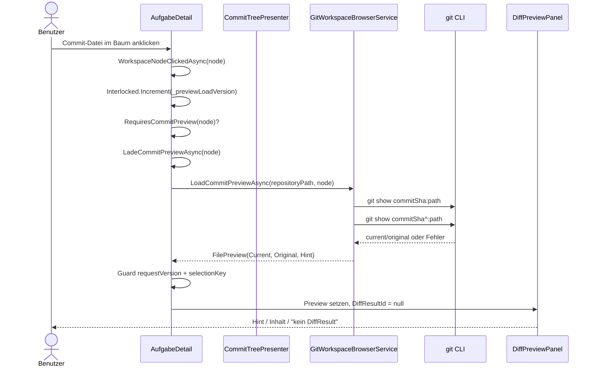
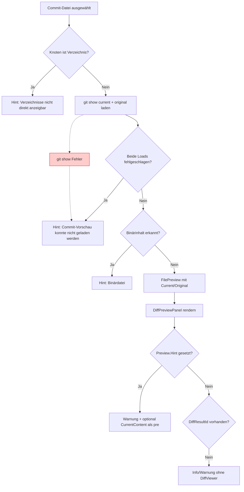

# Ablauf – Commit-Diff-Preview im Dateibaum

## Titel & Kontext

Dieser Ablauf dokumentiert die Vorschau für Dateien, die aus einem Branch-Commit-Knoten ausgewählt werden.
Er beschreibt den realen Pfad von `WorkspaceNodeClickedAsync` über `LoadCommitPreviewAsync` bis zur Darstellung im `DiffPreviewPanel`.
Im Fokus stehen Version-Guards, Fehlerpfade und die bewusst abweichende Darstellung ohne `DiffResultId`-basierten `DiffViewer`.

---

## Diagramm – Sequenz für Commit-Dateiauswahl und Preview

---

## Diagramm – Entscheidungslogik für Commit-Preview

---

## Schrittbeschreibung

1. **Commit-Dateiknoten wird eindeutig selektiert**
   - **Code:** `src/Softwareschmiede/Components/Pages/Aufgaben/AufgabeDetail.razor.cs` (`BuildSelectionKey`)
   - **Eingaben:** `WorkspaceFileNode` mit `CommitSha` und `RelativePath`.
   - **Ausgaben/Seiteneffekte:** Selektion wird als `commitSha:relativePath` gespeichert, damit Commit- und Workspace-Dateien kollisionsfrei bleiben.

2. **Klickpfad entscheidet Commit-Preview statt Workspace-Preview**
   - **Code:** `AufgabeDetail.razor.cs` (`WorkspaceNodeClickedAsync`, `CommitTreePresenter.RequiresCommitPreview`)
   - **Eingaben:** Ausgewählter Knoten.
   - **Ausgaben/Seiteneffekte:** Bei gesetztem `CommitSha` wird `LadeCommitPreviewAsync` aufgerufen.

3. **Versionierter Preview-Load startet**
   - **Code:** `AufgabeDetail.razor.cs` (`LadeCommitPreviewAsync`)
   - **Eingaben:** `WorkspaceFileNode node`.
   - **Ausgaben/Seiteneffekte:** `_previewLoadVersion` wird erhöht; `_selectedWorkspacePreview = null` signalisiert Ladezustand.

4. **Commit-Inhalte aus Git werden geladen**
   - **Code:** `src/Softwareschmiede/Application/Services/GitWorkspaceBrowserService.cs` (`LoadCommitPreviewAsync`)
   - **Eingaben:** `repositoryPath`, `node.CommitSha`, `node.RelativePath`, optional `node.SourceRelativePath`.
   - **Ausgaben/Seiteneffekte:** `git show <sha>:<path>` (aktuell) und `git show <sha>^:<path>` (original) werden gelesen.

5. **Service mappt Ergebnis auf `FilePreview`**
   - **Code:** `GitWorkspaceBrowserService.LoadCommitPreviewAsync`
   - **Eingaben:** CLI-Erfolg/-Fehler, Binärprüfung über Null-Byte.
   - **Ausgaben/Seiteneffekte:** Liefert `FilePreview` mit `CurrentContent`, `OriginalContent` oder `Hint` (z. B. Binärdatei/Fehler).

6. **Stale-Responses werden verworfen**
   - **Code:** `AufgabeDetail.razor.cs` (`LadeCommitPreviewAsync`)
   - **Eingaben:** `requestVersion`, `_previewLoadVersion`, `_selectedWorkspaceSelectionKey`.
   - **Ausgaben/Seiteneffekte:** Bei Parameterwechseln werden verspätete Ergebnisse ignoriert.

7. **Commit-Preview setzt bewusst keine Diff-ID**
   - **Code:** `AufgabeDetail.razor.cs` (`LadeCommitPreviewAsync`)
   - **Eingaben:** Erfolgreich geladene Commit-Preview.
   - **Ausgaben/Seiteneffekte:** `_selectedWorkspaceDiffResultId = null`; dadurch erfolgt keine `DiffViewer`-Einbettung.

8. **Panel rendert Commit-Preview über bestehende FR-4-Logik**
   - **Code:** `src/Softwareschmiede/Components/Diff/DiffPreviewPanel.razor`
   - **Eingaben:** `HasSelectedFile`, `Preview`, `DiffResultId`.
   - **Ausgaben/Seiteneffekte:** Bei Hint Warnung + optional `<pre>`, sonst Fallback „kein DiffResult vorhanden“ bzw. „Datei gelöscht …“.

---

## Fehlerbehandlung

- **Commit-Datei ohne `CommitSha`**
  - Pfad: `GitWorkspaceBrowserService.LoadCommitPreviewAsync`
  - Behandlung: `ArgumentException.ThrowIfNullOrWhiteSpace(node.CommitSha)`.

- **Knoten ist Verzeichnis**
  - Pfad: `LoadCommitPreviewAsync`
  - Behandlung: Rückgabe eines `FilePreview` mit Hinweis statt Exception.

- **Beide `git show`-Aufrufe schlagen fehl**
  - Pfad: `LoadCommitPreviewAsync`
  - Behandlung: `FilePreview.Hint = "Commit-Vorschau konnte nicht geladen werden: ..."`.

- **Binärinhalt im Commit**
  - Pfad: `LoadCommitPreviewAsync` (`IsBinaryText`)
  - Behandlung: `IsBinary = true`, `Hint = "Binärdatei – Vorschau nicht verfügbar."`.

- **UI-Fehler beim Laden**
  - Pfad: `AufgabeDetail.LadeCommitPreviewAsync` (catch)
  - Behandlung: Fehler wird geloggt; `FilePreview` mit `Hint = ex.Message` gesetzt.

- **Veraltete Antworten bei schnellem Wechsel**
  - Pfad: `AufgabeDetail.LadeCommitPreviewAsync`
  - Behandlung: Version-/Selection-Guard verwirft stale Responses ohne UI-Bruch.

---

## Bekannte Grenzen

- Commit-Preview nutzt aktuell keinen `DiffResultId`-Pfad; `DiffPreviewPanel` rendert daher keinen `DiffViewer` für Commit-Dateien.
- Für Root-Commits kann `commitSha^` fehlen; dadurch ist `OriginalContent` ggf. leer.
- Es gibt keinen dedizierten Deep-Link für Commit-Preview; `/diff/{DiffResultId}` bleibt auf Aufgaben-Diff-Ergebnisse beschränkt.
- Kein eigener Retry-Button für Commit-Preview-Load; erneuter Klick/Refresh startet einen neuen Request.

---

## Abhängigkeiten

- `src/Softwareschmiede/Components/Pages/Aufgaben/AufgabeDetail.razor`
- `src/Softwareschmiede/Components/Pages/Aufgaben/AufgabeDetail.razor.cs`
- `src/Softwareschmiede/Components/Pages/Aufgaben/CommitTreePresenter.cs`
- `src/Softwareschmiede/Components/Diff/DiffPreviewPanel.razor`
- `src/Softwareschmiede/Application/Services/GitWorkspaceBrowserService.cs`
- `src/Softwareschmiede/Application/Services/IGitWorkspaceBrowserService.cs`
- `src/Softwareschmiede/Domain/ValueObjects/FilePreview.cs`
- `src/Softwareschmiede/Domain/ValueObjects/WorkspaceFileNode.cs`
- Externes System: `git` CLI

> Verwandte Flows: [Branch-Commit-Anzeige im Dateibaum](./branch-commit-tree-expansion-flow.md) · [DiffViewer-Integration](./diffviewer-integration-flow.md)  
> API/Business/Requirements/Architecture: [diff-viewer.md](../api/diff-viewer.md) · [live-project-browser-git-status.md](../api/live-project-browser-git-status.md) · [F022 – Diff-Vergleichskomponente](../business/features/F022-diff-vergleichskomponente.md) · [diffviewer-correct-diff-display-requirements-analysis.md](../requirements/diffviewer-correct-diff-display-requirements-analysis.md) · [diffviewer-correct-diff-display-architecture-blueprint.md](../architecture/diffviewer-correct-diff-display-architecture-blueprint.md)
