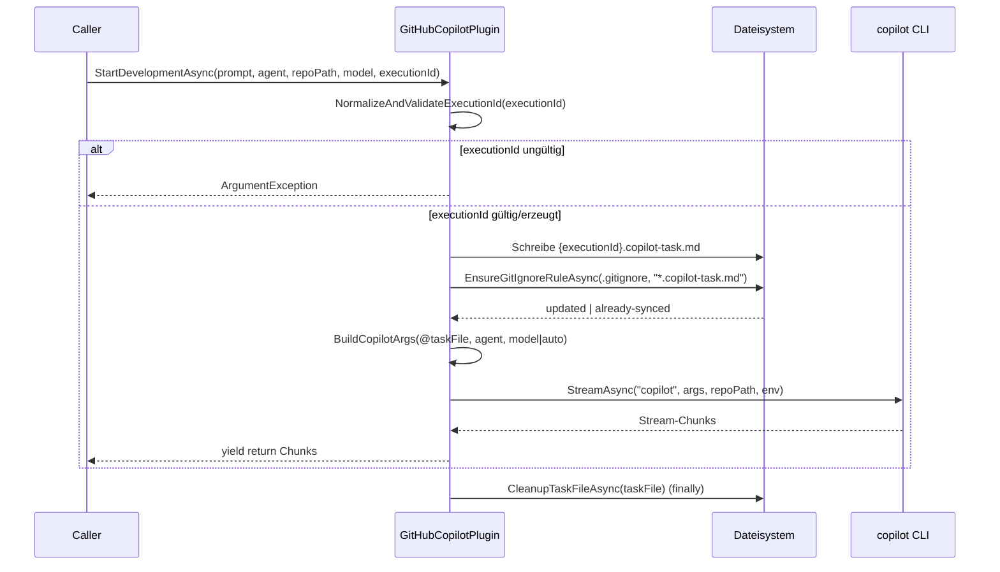
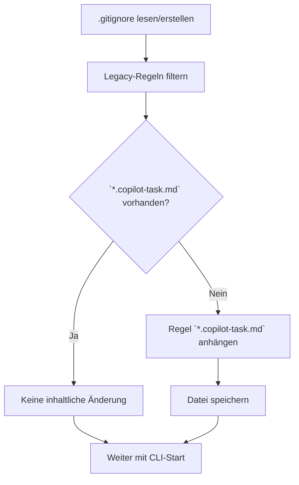

# Ablauf: GUID-präfixierte `.copilot-task`-Datei und `.gitignore`-Konsolidierung

**Modul:** `GitHubCopilotPlugin`  
**Methode:** `StartDevelopmentAsync`  
**Letzte Aktualisierung:** 2026-05-10

## Sequenzdiagramm

## Entscheidungslogik `.gitignore`

## Wichtige Punkte
- Prompt-Dateiname ist je Lauf eindeutig: `{executionId}.copilot-task.md`.
- Bei fehlender `executionId` wird eine GUID erzeugt.
- `.gitignore` wird robust und idempotent konsolidiert.
- Es gibt keinen test-spezifischen Kurz-Overload mehr; alle Caller nutzen die kanonische Signatur mit `executionId`-Parameter.
- Cleanup der Task-Datei wird immer ausgeführt; Fehler sind non-blocking.
