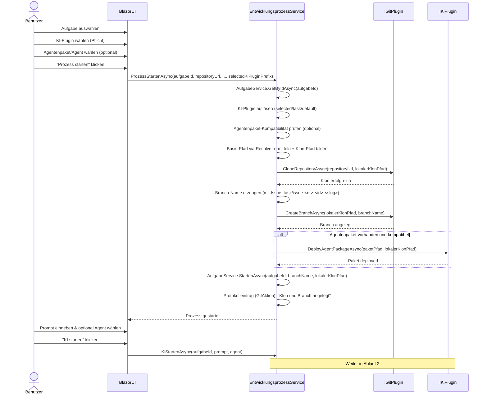
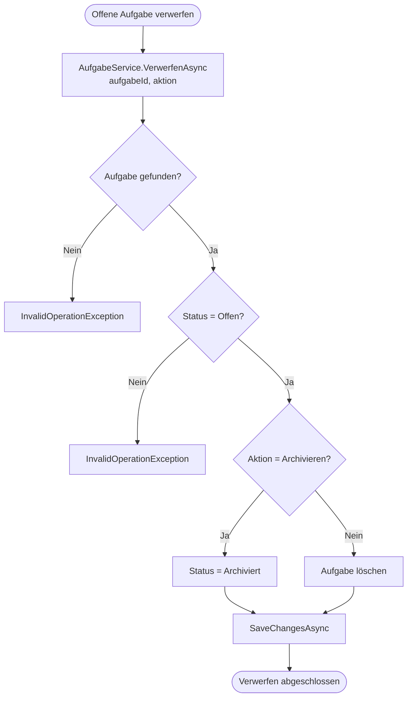
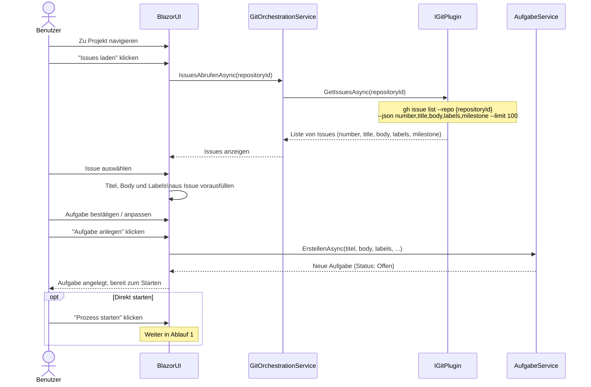
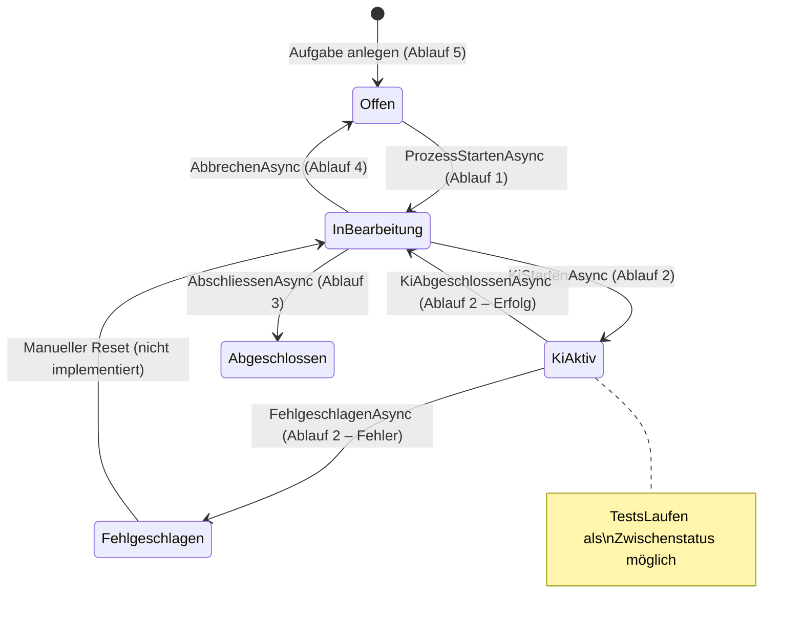

# Entwicklungsprozess-Ablauf

**Modul:** `EntwicklungsprozessService`, `GitOrchestrationService`, `GitHubPlugin`, `GitHubCopilotPlugin`, `ClaudeCliPlugin`  
**Letzte Aktualisierung:** 2026-05-24

Dieses Dokument beschreibt die zentralen Programmabläufe der KI-gestützten Softwareentwicklung in **Softwareschmiede**. Die Abläufe umfassen den kompletten Lebenszyklus einer Aufgabe: vom Starten des Entwicklungsprozesses über das KI-Streaming bis zum Abschluss oder Abbruch. Querverweise auf verwandte Dokumentation sind am Ende jedes Abschnitts angegeben.

---

## Inhaltsverzeichnis

1. [Ablauf 1: Entwicklungsprozess starten](#ablauf-1-entwicklungsprozess-starten)
2. [Ablauf 2: KI-Streaming und Protokollierung](#ablauf-2-ki-streaming-und-protokollierung)
3. [Ablauf 2b: Agent-Auswahl bei Folgeanweisungen](#ablauf-2b-agent-auswahl-bei-folgeanweisungen)
4. [Ablauf 3: Aufgabe abschließen](#ablauf-3-aufgabe-abschlie%C3%9Fen)
5. [Ablauf 4: Aufgabe abbrechen](#ablauf-4-aufgabe-abbrechen)
6. [Ablauf 4b: Offene Aufgabe verwerfen](#ablauf-4b-offene-aufgabe-verwerfen)
7. [Ablauf 5: Issue aus GitHub importieren und als Aufgabe anlegen](#ablauf-5-issue-aus-github-importieren-und-als-aufgabe-anlegen)

---

## Ablauf 1: Entwicklungsprozess starten

### Kontext

Dieser Ablauf beschreibt den Einstieg in einen KI-gestützten Entwicklungszyklus. Der Benutzer wählt eine Aufgabe aus, wählt ein **KI-Plugin (Pflicht)** und optional ein Agentenpaket/Agent, woraufhin `EntwicklungsprozessService` den Workspace vorbereitet (Git-Clone oder Fallback-Strategie), einen Feature-Branch anlegt und die KI aktiviert. Der Ablauf umfasst zwei Phasen: die Repository-Vorbereitung (`ProzessStartenAsync`) und den KI-Start (`KiStartenAsync`).

### Diagramm



### Schrittbeschreibung

| # | Schritt | Quellcode-Referenz | Eingabe / Ausgabe |
|---|---------|-------------------|-------------------|
| 1 | Aufgabe aus Datenbank laden | `EntwicklungsprozessService.ProzessStartenAsync` → `AufgabeService.GetByIdAsync(aufgabeId)` | Eingabe: `aufgabeId` (Guid); Ausgabe: `Aufgabe`-Objekt |
| 2 | KI-Plugin auflösen (Pflicht) | `EntwicklungsprozessService.ProzessStartenAsync` → `PluginSelectionService.ResolveDevelopmentAutomationPluginAsync(selected/task/default)` | Eingabe: `selectedKiPluginPrefix` bzw. `Aufgabe.KiPluginPrefix`; Ausgabe: effektives `IKiPlugin` |
| 3 | Agentenpaket-Kompatibilität vorab prüfen (optional) | `EntwicklungsprozessService.ProzessStartenAsync` → `IKiPlugin.IsAgentPackageCompatibleAsync(paketPfad)` | Nur wenn `Aufgabe.AgentenpaketName` gesetzt; bei Inkompatibilität Abbruch |
| 4 | Basis-Pfad auflösen und Klon-Pfad bestimmen | `EntwicklungsprozessService.ProzessStartenAsync` + `IArbeitsverzeichnisResolver.ResolveAsync` | Pfad: `<resolvedBase>/softwareschmiede/<aufgabeId>`; bei Fallback: `Path.GetTempPath()/softwareschmiede/<aufgabeId>` |
| 5 | Repository/Workspace vorbereiten | `IGitPlugin.CloneRepositoryAsync(repositoryUrl, lokalerKlonPfad)` → je Plugin `git clone` **oder** `git init`-Fallback + Dateikopie | Eingabe: URL/Pfad + Zielpfad; Seiteneffekt: lokales Arbeitsverzeichnis wird erstellt |
| 6 | Branch-Namen erzeugen | `EntwicklungsprozessService.ProzessStartenAsync` | Ohne Issue: `task/<aufgabeIdN>-<titel-slug>`; mit Issue: `task/issue-<issueNummer>-<aufgabeIdN>-<titel-slug>` (Slug max. 30 Zeichen) |
| 7 | Branch anlegen | `IGitPlugin.CreateBranchAsync(lokalerKlonPfad, branchName)` → `GitHubPlugin`: `git checkout -b {branchName}` | Seiteneffekt: neuer Branch im lokalen Klon |
| 8 | Agentenpaket deployen (optional) | `IKiPlugin.DeployAgentPackageAsync(paketPfad, lokalerKlonPfad)` → `GitHubCopilotPlugin`/`ClaudeCliPlugin`: Dateien rekursiv nach `.github/` kopieren | Nur wenn Paket konfiguriert und kompatibel |
| 9 | Aufgabe als gestartet markieren | `AufgabeService.StartenAsync(aufgabeId, branchName, lokalerKlonPfad)` | Statusübergang: `Offen → InBearbeitung`; BranchName + Pfad werden persistiert |
| 10 | Protokolleintrag schreiben | `EntwicklungsprozessService.ProzessStartenAsync` | GitAktion-Eintrag: "Klon und Branch angelegt: {branchName} in {pfad}" |

### Fehlerbehandlung

| Fehlerfall | Verhalten |
|-----------|-----------|
| Aufgabe nicht gefunden (`GetByIdAsync` wirft Exception) | Abbruch; Exception propagiert an BlazorUI |
| Workspace-Vorbereitung schlägt fehl (`git init` oder Copy/Bootstrap) | `IGitPlugin` wirft Exception; Zielverzeichnis verbleibt ggf. teilweise; Statuswechsel findet **nicht** statt |
| Konfigurierter Workdir-Pfad nicht nutzbar | Resolver nutzt Fallback (`Path.GetTempPath()`), schreibt ReasonCode in Logs; Prozess läuft mit Fallback weiter |
| Kein KI-Plugin verfügbar | Plugin-Auflösung wirft `InvalidOperationException`; UI verhindert den Start bereits vorab |
| `git checkout -b` schlägt fehl (Branch existiert bereits) | `IGitPlugin` wirft Exception; Prozess wird nicht als gestartet markiert |
| Agentenpaket inkompatibel (kein `.github`) | Früher Abbruch vor Clone via `InvalidOperationException`; verhindert fehlerhaftes Deployment |
| `DeployAgentPackageAsync` schlägt fehl | Exception propagiert; Aufgabe bleibt im Status `Offen` |

### Abhängigkeiten

- `EntwicklungsprozessService` (Orchestrator)
- `AufgabeService` (Datenbankzugriff, Statusverwaltung)
- `IGitPlugin` / `GitHubPlugin` (Git-Operationen via CLI)
- `PluginSelectionService` (Auflösung des effektiven KI-Plugins)
- `IKiPlugin` / `GitHubCopilotPlugin` / `ClaudeCliPlugin` (Kompatibilitätscheck + Agentenpaket-Deployment)

> **Verwandte Abläufe:** [Ablauf 2: KI-Streaming und Protokollierung](#ablauf-2-ki-streaming-und-protokollierung) · [Ablauf 3: Aufgabe abschließen](#ablauf-3-aufgabe-abschlie%C3%9Fen) · [KiAusfuehrungsService – Hintergrundläufe](./ki-ausfuehrungs-service-flow.md)

---

## Ablauf 2: KI-Streaming und Protokollierung

### Kontext

Dieser Ablauf beschreibt, wie `EntwicklungsprozessService.KiStartenAsync` die KI aktiviert, den Streaming-Output Chunk für Chunk protokolliert und an die Blazor-UI weiterleitet. Der Ablauf behandelt sowohl den Erfolgsfall (Status zurück auf `InBearbeitung`) als auch den Fehlerfall (Status `Fehlgeschlagen`). Er wird nach Abschluss von [Ablauf 1](#ablauf-1-entwicklungsprozess-starten) ausgeführt.

### Diagramm

```mermaid
flowchart TD
    A([KiStartenAsync aufgerufen]) --> B[Aufgabe laden]
    B --> C{Status == KiAktiv?}
    C -- Ja --> D[Exception: KI bereits aktiv]:::error
    C -- Nein --> E{LokalerKlonPfad gesetzt?}
    E -- Nein --> F[Exception: Kein Klon-Pfad]:::error
    E -- Ja --> G[KI-Plugin auflösen (selected/task/default)]
    G --> H{Plugin auflösbar?}
    H -- Nein -.-> H1[Exception: Kein KI-Plugin]:::error
    H -- Ja --> I[Protokolleintrag: Prompt + Agent-Name]
    I --> J[AufgabeService.KiAktiviertAsync\nStatus → KiAktiv]
    J --> K[IKiPlugin.StartDevelopmentAsync\nStreaming starten]
    K --> L{Nächster Stream-Chunk?}
    L -- Chunk vorhanden --> M[Chunk protokollieren]
    M --> N[yield return Chunk an Caller]
    N --> L
    L -- Stream beendet --> O[Gesamte Antwort als\nKiAntwort-Protokolleintrag speichern]
    O --> P[AufgabeService.KiAbgeschlossenAsync\nStatus → InBearbeitung]
    P --> Q([Erfolgreich abgeschlossen])

    K -.-> R[Exception beim Streaming]:::error
    R -.-> S[AufgabeService.FehlgeschlagenAsync\nStatus → Fehlgeschlagen]
    S -.-> T([Fehler protokollieren und beenden]):::error

    classDef error fill:#ffcccc,stroke:#cc0000,color:#333
```

### Schrittbeschreibung

| # | Schritt | Quellcode-Referenz | Eingabe / Ausgabe |
|---|---------|-------------------|-------------------|
| 1 | Aufgabe laden und Status prüfen | `EntwicklungsprozessService.KiStartenAsync` → `AufgabeService.GetByIdAsync` | Wirft Exception wenn `Status == KiAktiv` |
| 2 | Klon-Pfad validieren | `EntwicklungsprozessService.KiStartenAsync` | Wirft Exception wenn `LokalerKlonPfad` null oder leer |
| 3 | KI-Plugin auflösen (Pflicht) | `EntwicklungsprozessService.KiStartenAsync` → `PluginSelectionService.ResolveDevelopmentAutomationPluginAsync(selected/task/default)` | Eingabe: `selectedKiPluginPrefix` oder gespeicherter `KiPluginPrefix` |
| 4 | Prompt protokollieren | `EntwicklungsprozessService.KiStartenAsync` | Protokolleintrag (Typ: Prompt): Prompt-Text + Agent-Name |
| 5 | Status auf KiAktiv setzen | `AufgabeService.KiAktiviertAsync(aufgabeId)` | Statusübergang: `InBearbeitung → KiAktiv` |
| 6 | KI starten und Stream öffnen | `IKiPlugin.StartDevelopmentAsync(prompt, agent, lokalerKlonPfad)` → `GitHubCopilotPlugin`: `copilot suggest --type shell {prompt}` | Rückgabe: `IAsyncEnumerable<string>`; leerer `agent.Name` führt zu pluginseitigem Default-Agent |
| 7 | Chunks protokollieren und weiterleiten | `EntwicklungsprozessService.KiStartenAsync` (Schleife) | Jeder Chunk wird protokolliert + per `yield return` an BlazorUI übergeben |
| 8 | Abschluss-Protokolleintrag | `EntwicklungsprozessService.KiStartenAsync` | Gesamte Antwort als KiAntwort-Protokolleintrag (Typ: KiAntwort) |
| 9 | Status zurücksetzen | `AufgabeService.KiAbgeschlossenAsync(aufgabeId)` | Statusübergang: `KiAktiv → InBearbeitung` |

### Fehlerbehandlung

| Fehlerfall | Verhalten |
|-----------|-----------|
| `Status == KiAktiv` beim Aufruf | Sofortige Exception: "KI ist bereits aktiv für diese Aufgabe" |
| `LokalerKlonPfad` nicht gesetzt | Sofortige Exception: Prozess wurde nicht gestartet |
| Kein KI-Plugin verfügbar / Prefix nicht auflösbar | Plugin-Auflösung wirft Exception vor Streamingstart |
| Exception während des Streamings | `AufgabeService.FehlgeschlagenAsync` → Status `Fehlgeschlagen`; Fehlerdetails als Protokolleintrag |

### Abhängigkeiten

- `EntwicklungsprozessService.KiStartenAsync`
- `AufgabeService` (Status: `KiAktiviertAsync`, `KiAbgeschlossenAsync`, `FehlgeschlagenAsync`)
- `PluginSelectionService` (Pflichtauflösung des KI-Plugins)
- `IKiPlugin` / `GitHubCopilotPlugin` (`StartDevelopmentAsync` via `copilot suggest`)

> **Verwandte Abläufe:** [Ablauf 1: Entwicklungsprozess starten](#ablauf-1-entwicklungsprozess-starten) · [Ablauf 3: Aufgabe abschließen](#ablauf-3-aufgabe-abschlie%C3%9Fen) · [KiAusfuehrungsService – Hintergrundläufe](./ki-ausfuehrungs-service-flow.md)

---

## Ablauf 2b: Agent-Auswahl bei Folgeanweisungen

### Kontext

Dieser Ablauf beschreibt das Verhalten der Folgeanweisungen in `AufgabeDetail`. Nach mindestens einer KI-Antwort kann ein weiterer Prompt mit optionaler Agenten-Auswahl gesendet werden. Ist kein Agent gewählt, wird das KI-Plugin ohne `--agent` gestartet und nutzt den pluginseitigen Default.

### Diagramm

```mermaid
flowchart TD
    A([Aufgabe in Bearbeitung]) --> B{KiAntwort vorhanden?}
    B -- Nein --> C[Kein Folge-Prompt-Bereich]
    B -- Ja --> D[Folge-Prompt + Agent-Auswahl anzeigen]
    D --> E[Anwender wählt optional Agent]
    E --> F{Agent gewählt?}
    F -- Nein --> G[AgentInfo.Name = leer]
    F -- Ja --> H[Gewählten Agent übernehmen]
    G --> I[Prompt senden]
    H --> I
    I --> J[KiMitPromptStartenAsync(_prompt, _kiAgentName)]
    J --> K[StartKiLauf -> EntwicklungsprozessService.KiStartenAsync]
    K --> L[IKiPlugin.StartDevelopmentAsync]
    L --> M[_prompt leeren]
```

### Akzeptanzkriterien und Nachweise

| Kriterium | Umsetzung | Test-Nachweis |
|---|---|---|
| Agent-Auswahl bei Folgeanweisungen sichtbar/verfügbar | `AufgabeDetail.razor` (`@bind="_kiAgentName"` im KI-Anfrage-Block) | `FolgePromptMarkup_ShouldContainAgentSelectionBinding` |
| Standardwert = in Aufgabe gespeicherter Agent oder leer | `AufgabeDetail.razor.cs` (`LadeAsync*`: `_kiAgentName = _aufgabe.AgentenName`) | `OnInitializedAsync_ShouldDefaultFolgeAgentToInitialAgent` |
| Auswahl vor Absenden änderbar | Select-Element im Folge-Prompt-Bereich (`_kiAgentName`) | `FolgePromptAsync_ShouldUseSelectedFollowAgent_AndResetToInitialAgent` |
| Folgeanweisung ohne Agent möglich | `KiMitPromptStartenAsync`: Fallback auf `new AgentInfo(string.Empty, null, string.Empty)` | `KiStartenAsync_ShouldForwardSelectedAgentToPlugin` |
| Initialprompt unverändert | Initialer KI-Start läuft weiterhin über `_kiAgentName` und optional `selectedKiPluginPrefix` | `KiStartenAsync_ShouldKeepInitialPromptBehavior` |

### Abhängigkeiten

- `src/Softwareschmiede/Components/Pages/Aufgaben/AufgabeDetail.razor`
- `src/Softwareschmiede/Components/Pages/Aufgaben/AufgabeDetail.razor.cs`
- `src/Softwareschmiede.Tests/Components/Pages/Aufgaben/AufgabeDetailFolgePromptTests.cs`
- `src/Softwareschmiede.Tests/Application/Services/EntwicklungsprozessServiceTests.cs`

---

## Ablauf 3: Aufgabe abschließen

### Kontext

Nachdem die KI ihre Arbeit erledigt hat, schließt der Benutzer die Aufgabe ab. Dazu committet er die Änderungen, führt einen Push aus (Remote-Git oder Datei-Sync im separaten Arbeitsverzeichnis), erstellt einen Pull Request und löst anschließend den Abschluss-Vorgang aus, der den lokalen Klon bereinigt. Der Ablauf involviert `GitOrchestrationService` für Git-Operationen und `EntwicklungsprozessService.AbschliessenAsync` für den finalen Statusübergang.

### Diagramm

```mermaid
flowchart TD
    A([Aufgabe bereit zum Abschließen]) --> B[GitOrchestrationService.CommitAsync\ngit add . + git commit -m]
    B --> C{Commit erfolgreich?}
    C -- Nein -.-> CE[Exception protokollieren]:::error
    C -- Ja --> D[GitOrchestrationService.PushAsync\ngit push ODER Datei-Sync Working -> Source\ninkl. Delete-Sync via git status]
    D --> E{Push erfolgreich?}
    E -- Nein -.-> PE[Exception protokollieren]:::error
    E -- Ja --> F[EntwicklungsprozessService\n.PullRequestErstellenAsync\nBranchName prüfen]
    F --> G[IGitPlugin.CreatePullRequestAsync\ngh pr create ...]
    G --> H{PR erstellt?}
    H -- Nein -.-> PRE[Exception protokollieren]:::error
    H -- Ja --> I[Protokolleintrag:\nPull Request erstellt Nr. Titel URL]
    I --> J[EntwicklungsprozessService.AbschliessenAsync]
    J --> K[Klon-Verzeichnis löschen\nDirectory.Delete recursive]
    K --> L[AufgabeService.AbschliessenAsync\nStatus → Abgeschlossen]
    L --> M[Statusübergang protokollieren]
    M --> N([Aufgabe abgeschlossen])

    classDef error fill:#ffcccc,stroke:#cc0000,color:#333
```

### Schrittbeschreibung

| # | Schritt | Quellcode-Referenz | Eingabe / Ausgabe |
|---|---------|-------------------|-------------------|
| 1 | Änderungen committen | `GitOrchestrationService.CommitAsync(aufgabeId, message)` → `IGitPlugin.CommitAsync`: `git add .` + `git commit -m {message}` | Eingabe: Commit-Nachricht; Seiteneffekt: lokaler Commit im Feature-Branch |
| 2 | Branch pushen/synchronisieren | `GitOrchestrationService.PushAsync(aufgabeId)` → `IGitPlugin.PushBranchAsync`: `git push --set-upstream origin {branchName}` **oder** Datei-Sync `WorkingDirectory -> SourceDirectory` | Seiteneffekt: Branch auf Remote oder lokales Quellverzeichnis wird synchronisiert (inkl. Delete-Sync über `git status --porcelain`) |
| 3 | Pull Request erstellen | `EntwicklungsprozessService.PullRequestErstellenAsync(aufgabeId, repositoryId, title, body)` | BranchName wird aus Aufgabe geladen und geprüft |
| 4 | gh pr create ausführen | `IGitPlugin.CreatePullRequestAsync(repositoryId, branchName, title, body)` → `GitHubPlugin`: `gh pr create --repo {repositoryId} --head {branchName} --title {title} --body {body} --json number,title,url` | Ausgabe: PR-Nummer, Titel, URL |
| 5 | PR protokollieren | `EntwicklungsprozessService.PullRequestErstellenAsync` | Protokolleintrag: "Pull Request erstellt: #{nummer} – {titel} ({url})" |
| 6 | Klon-Verzeichnis löschen | `EntwicklungsprozessService.AbschliessenAsync` → `Directory.Delete(lokalerKlonPfad, recursive: true)` | Seiteneffekt: lokales Klon-Verzeichnis wird entfernt |
| 7 | Status setzen | `AufgabeService.AbschliessenAsync(aufgabeId)` | Statusübergang: `InBearbeitung → Abgeschlossen` |
| 8 | Abschluss protokollieren | `EntwicklungsprozessService.AbschliessenAsync` | Protokolleintrag: Statusübergang |

### Fehlerbehandlung

| Fehlerfall | Verhalten |
|-----------|-----------|
| Commit schlägt fehl (nichts zu committen, Merge-Konflikt) | Exception propagiert; kein Push, kein PR, Status bleibt `InBearbeitung` |
| Push/Sync schlägt fehl (Authentifizierung, Konflikte, Dateisync-Fehler) | Exception propagiert; kein PR; Status bleibt `InBearbeitung` |
| `BranchName` nicht gesetzt | `PullRequestErstellenAsync` wirft Exception vor dem `gh pr create`-Aufruf |
| `gh pr create` schlägt fehl | Exception propagiert; Klon bleibt vorhanden; Status bleibt `InBearbeitung` |
| `Directory.Delete` schlägt fehl (gesperrte Dateien) | Exception propagiert; Status wird **nicht** auf `Abgeschlossen` gesetzt |

### Abhängigkeiten

- `GitOrchestrationService` (`CommitAsync`, `PushAsync`)
- `EntwicklungsprozessService` (`PullRequestErstellenAsync`, `AbschliessenAsync`)
- `AufgabeService` (`AbschliessenAsync`)
- `IGitPlugin` / `GitHubPlugin` / `LocalDirectoryPlugin` (`CommitAsync`, `PushBranchAsync`, `CreatePullRequestAsync`)
- GitHub CLI (`gh pr create`) mit `GH_TOKEN`-Umgebungsvariable

> **Verwandte Abläufe:** [Ablauf 4: Aufgabe abbrechen](#ablauf-4-aufgabe-abbrechen) · [Ablauf 1: Entwicklungsprozess starten](#ablauf-1-entwicklungsprozess-starten) · [GitOrchestrationService – Git-Aktionen & PR-Auflösung](./git-orchestration-service-flow.md)

---

## Ablauf 4: Aufgabe abbrechen

### Kontext

Dieser Ablauf beschreibt das geordnete Abbrechen einer laufenden Aufgabe. Im Gegensatz zum Abschluss-Ablauf wird der lokale Klon gelöscht, **ohne** die Änderungen zu pushen oder einen Pull Request zu erstellen. Die Aufgabe kehrt in den Status `Offen` zurück und kann erneut gestartet werden.

### Diagramm


### Schrittbeschreibung

| # | Schritt | Quellcode-Referenz | Eingabe / Ausgabe |
|---|---------|-------------------|-------------------|
| 1 | Aufgabe laden | `EntwicklungsprozessService.AbbrechenAsync(aufgabeId)` → `AufgabeService.GetByIdAsync` | Eingabe: `aufgabeId`; Ausgabe: `Aufgabe`-Objekt inkl. `LokalerKlonPfad` |
| 2 | Klon-Verzeichnis löschen | `Directory.Delete(lokalerKlonPfad, recursive: true)` | Seiteneffekt: lokales Klon-Verzeichnis und alle Änderungen werden **unwiderruflich** entfernt; kein `git push` |
| 3 | Status zurücksetzen | `AufgabeService.AbbrechenAsync(aufgabeId)` | Statusübergang: `InBearbeitung → Offen`; `LokalerKlonPfad` und `BranchName` werden geleert |
| 4 | Abbruch protokollieren | `EntwicklungsprozessService.AbbrechenAsync` | Protokolleintrag: Statusübergang mit Zeitstempel |

### Fehlerbehandlung

| Fehlerfall | Verhalten |
|-----------|-----------|
| Aufgabe nicht gefunden | Exception propagiert; kein Statuswechsel |
| `Directory.Delete` schlägt fehl (gesperrte Dateien, fehlende Rechte) | Exception propagiert; ggf. Klon-Verzeichnis verbleibt auf Disk; Status-Reset erfolgt ggf. nicht |
| `AufgabeService.AbbrechenAsync` schlägt fehl | Klon wurde bereits gelöscht, Status konnte nicht zurückgesetzt werden → inkonsistenter Zustand möglich |

### Abhängigkeiten

- `EntwicklungsprozessService.AbbrechenAsync`
- `AufgabeService` (`AbbrechenAsync`)
- .NET `System.IO.Directory` (Verzeichnis-Bereinigung)

> **Verwandte Abläufe:** [Ablauf 3: Aufgabe abschließen](#ablauf-3-aufgabe-abschlie%C3%9Fen) · [Ablauf 1: Entwicklungsprozess starten](#ablauf-1-entwicklungsprozess-starten) · [GitOrchestrationService – Git-Aktionen & PR-Auflösung](./git-orchestration-service-flow.md)

---

## Ablauf 4b: Offene Aufgabe verwerfen

### Kontext

Offene Aufgaben können auf der Detailseite direkt verworfen werden, ohne sie vorher zu starten. Je nach Auswahl wird die Aufgabe archiviert oder dauerhaft gelöscht. Da noch kein lokaler Klon existiert, entfällt jede Klon-Bereinigung.

### Diagramm



### Schrittbeschreibung

| # | Schritt | Quellcode-Referenz | Eingabe / Ausgabe |
|---|---------|-------------------|-------------------|
| 1 | Aufgabe verwerfen | `AufgabeService.VerwerfenAsync(aufgabeId, aktion)` | Eingabe: `aufgabeId`, `VerwerfenAktion` |
| 2 | Status prüfen | `AufgabeService.VerwerfenAsync` | Nur `Offen` ist zulässig; andere Status führen zu `InvalidOperationException` |
| 3 | Auswahl ausführen | `VerwerfenAktion.Archivieren` / `VerwerfenAktion.Loeschen` | Ausgabe: Status `Archiviert` oder vollständige Entfernung der Aufgabe |
| 4 | Verwerfen speichern | `SaveChangesAsync` bzw. `DeleteAsync` | Persistenz der gewählten Verwerfungsaktion |

### Fehlerbehandlung

| Fehlerfall | Verhalten |
|-----------|-----------|
| Aufgabe nicht gefunden | Exception propagiert; keine Änderung |
| Aufgabe ist nicht `Offen` | Exception propagiert; Verwerfen wird abgebrochen |

### Abhängigkeiten

- `AufgabeService.VerwerfenAsync`
- `VerwerfenAktion`
- Blazor-Detailseite `AufgabeDetail`

> **Verwandte Abläufe:** [Ablauf 4: Aufgabe abbrechen](#ablauf-4-aufgabe-abbrechen) · [Ablauf 3: Aufgabe abschließen](#ablauf-3-aufgabe-abschlie%C3%9Fen)

---

## Ablauf 5: Issue aus GitHub importieren und als Aufgabe anlegen

### Kontext

Dieser Ablauf beschreibt, wie ein Benutzer GitHub-Issues eines Projekts abruft und ein Issue direkt als neue Aufgabe in Softwareschmiede importiert. Die Issues werden über die GitHub CLI geladen (`gh issue list`). Titel, Body und Labels des Issues werden in die neue Aufgabe übernommen. Der Ablauf involviert `GitOrchestrationService.IssuesAbrufenAsync` sowie die `AufgabeService.ErstellenAsync`-Methode.

### Diagramm



### Schrittbeschreibung

| # | Schritt | Quellcode-Referenz | Eingabe / Ausgabe |
|---|---------|-------------------|-------------------|
| 1 | Issues laden | `GitOrchestrationService.IssuesAbrufenAsync(repositoryId)` → `IGitPlugin.GetIssuesAsync(repositoryId)` | Eingabe: `repositoryId` (z.B. `owner/repo`); GitHub CLI: `gh issue list --repo {repositoryId} --json number,title,body,labels,milestone --limit 100` |
| 2 | Issues anzeigen | BlazorUI | Ausgabe: Liste von Issues mit Nummer, Titel, Labels, Milestone |
| 3 | Issue auswählen | Benutzerinteraktion in BlazorUI | Ausgabe: ausgewähltes Issue-Objekt |
| 4 | Formular vorausfüllen | BlazorUI | Titel ← `issue.title`; Beschreibung ← `issue.body`; Labels ← `issue.labels` |
| 5 | Aufgabe anlegen | `AufgabeService.ErstellenAsync(titel, body, labels, ...)` | Persistierung der neuen Aufgabe; initialer Status: `Offen` |
| 6 | Aufgabe bereitstellen | BlazorUI | Neue Aufgabe erscheint in der Aufgabenliste, bereit für [Ablauf 1](#ablauf-1-entwicklungsprozess-starten) |

### Fehlerbehandlung

| Fehlerfall | Verhalten |
|-----------|-----------|
| `gh issue list` schlägt fehl (ungültige `repositoryId`, fehlende Rechte, kein `GH_TOKEN`) | `IGitPlugin` wirft Exception; BlazorUI zeigt Fehlermeldung; keine Aufgabe wird angelegt |
| GitHub-Rate-Limit überschritten | `gh issue list` gibt Fehler zurück; Benutzer erhält Hinweis |
| Issue-Body ist `null` oder leer | Aufgabe wird mit leerem Body angelegt (kein Fehler) |
| `AufgabeService.ErstellenAsync` schlägt fehl | Exception propagiert; keine Aufgabe persistiert; BlazorUI zeigt Fehlermeldung |

### Abhängigkeiten

- `GitOrchestrationService.IssuesAbrufenAsync`
- `IGitPlugin` / `GitHubPlugin` (`GetIssuesAsync` via `gh issue list`)
- `AufgabeService` (`ErstellenAsync`)
- GitHub CLI mit `GH_TOKEN`-Umgebungsvariable

> **Verwandte Abläufe:** [Ablauf 1: Entwicklungsprozess starten](#ablauf-1-entwicklungsprozess-starten)

---

## Zustandsdiagramm: AufgabeStatus

Zur Übersicht der Statusübergänge, die in allen Abläufen referenziert werden:


