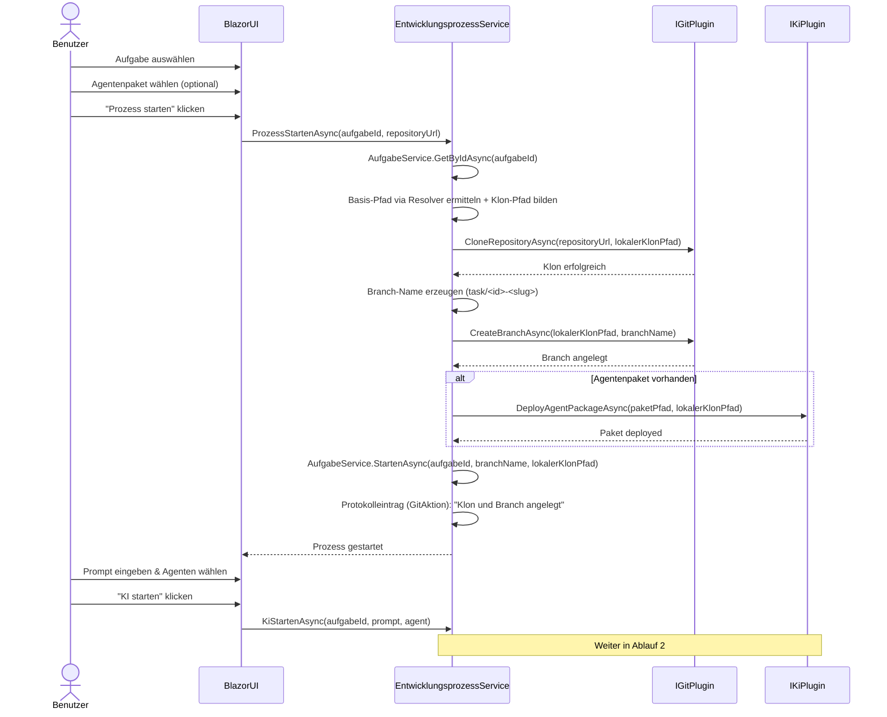
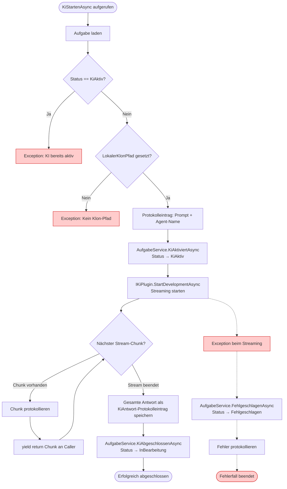
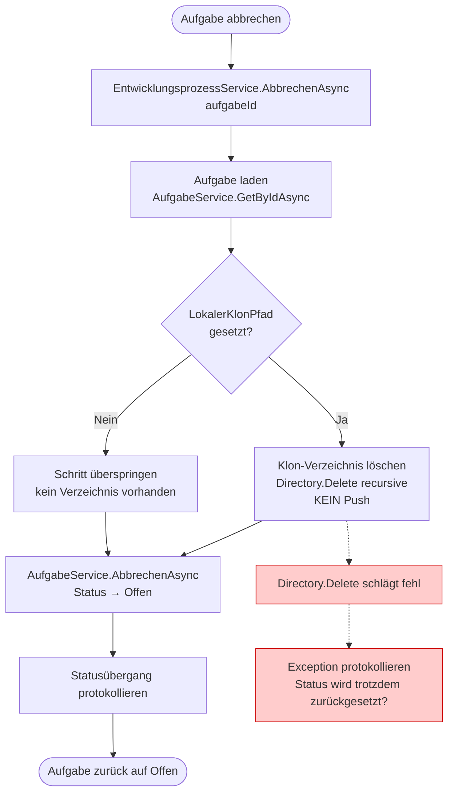
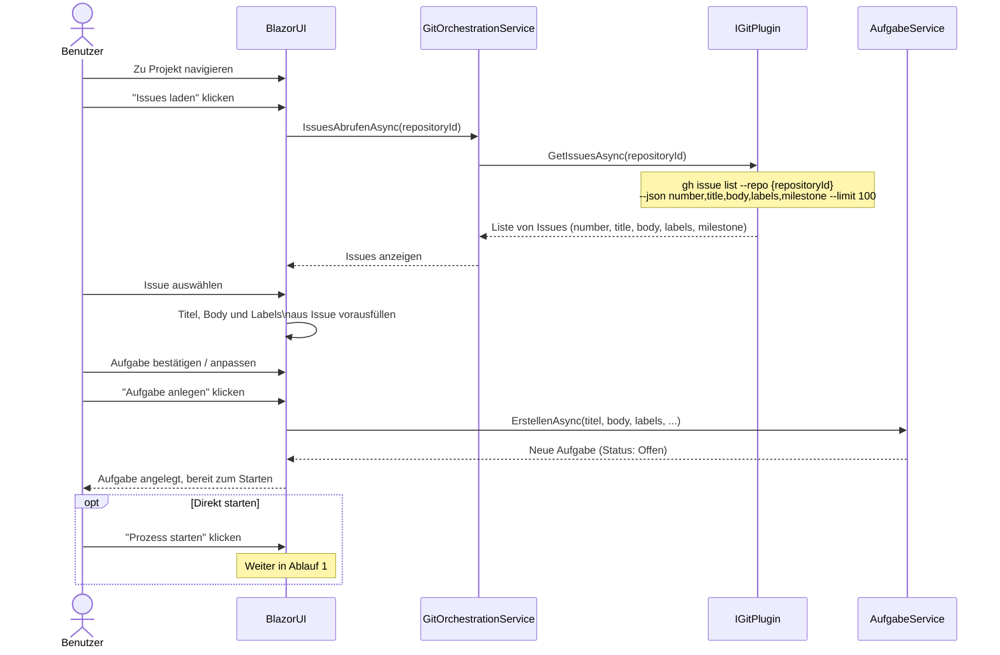
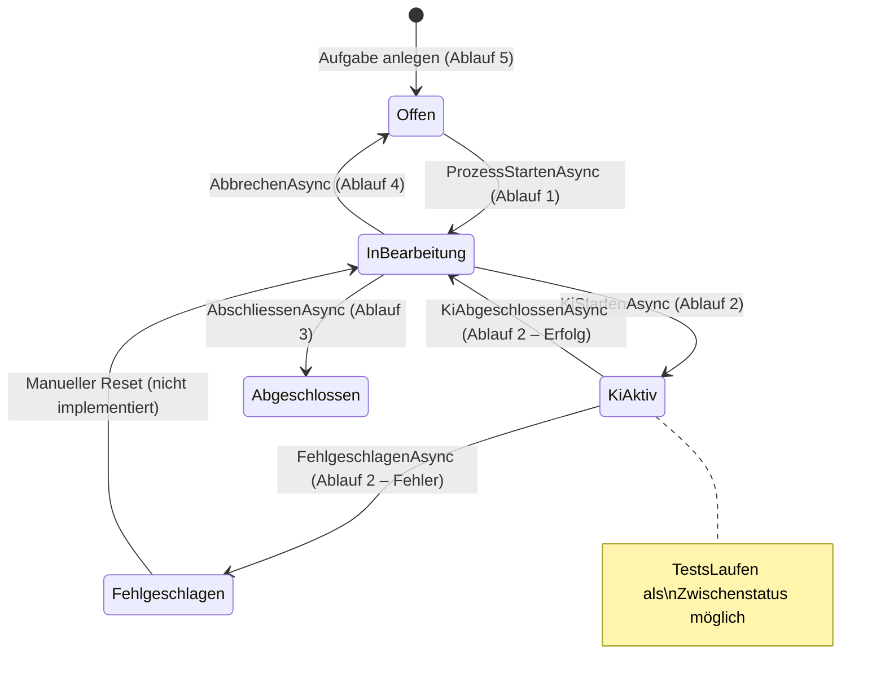

# Entwicklungsprozess-Ablauf

**Modul:** `EntwicklungsprozessService`, `GitOrchestrationService`, `GitHubPlugin`, `GitHubCopilotPlugin`  
**Letzte Aktualisierung:** 2026-05-10

Dieses Dokument beschreibt die zentralen Programmabläufe der KI-gestützten Softwareentwicklung in **Softwareschmiede**. Die Abläufe umfassen den kompletten Lebenszyklus einer Aufgabe: vom Starten des Entwicklungsprozesses über das KI-Streaming bis zum Abschluss oder Abbruch. Querverweise auf verwandte Dokumentation sind am Ende jedes Abschnitts angegeben.

---

## Inhaltsverzeichnis

1. [Ablauf 1: Entwicklungsprozess starten](#ablauf-1-entwicklungsprozess-starten)
2. [Ablauf 2: KI-Streaming und Protokollierung](#ablauf-2-ki-streaming-und-protokollierung)
3. [Ablauf 3: Aufgabe abschließen](#ablauf-3-aufgabe-abschlie%C3%9Fen)
4. [Ablauf 4: Aufgabe abbrechen](#ablauf-4-aufgabe-abbrechen)
5. [Ablauf 5: Issue aus GitHub importieren und als Aufgabe anlegen](#ablauf-5-issue-aus-github-importieren-und-als-aufgabe-anlegen)

---

## Ablauf 1: Entwicklungsprozess starten

### Kontext

Dieser Ablauf beschreibt den Einstieg in einen KI-gestützten Entwicklungszyklus. Der Benutzer wählt eine Aufgabe aus, konfiguriert das Agentenpaket und den Prompt, woraufhin `EntwicklungsprozessService` das Repository klont, einen Feature-Branch anlegt und die KI aktiviert. Der Ablauf umfasst zwei Phasen: die Repository-Vorbereitung (`ProzessStartenAsync`) und den KI-Start (`KiStartenAsync`).

### Diagramm



### Schrittbeschreibung

| # | Schritt | Quellcode-Referenz | Eingabe / Ausgabe |
|---|---------|-------------------|-------------------|
| 1 | Aufgabe aus Datenbank laden | `EntwicklungsprozessService.ProzessStartenAsync` → `AufgabeService.GetByIdAsync(aufgabeId)` | Eingabe: `aufgabeId` (Guid); Ausgabe: `Aufgabe`-Objekt |
| 2 | Basis-Pfad auflösen und Klon-Pfad bestimmen | `EntwicklungsprozessService.ProzessStartenAsync` + `IArbeitsverzeichnisResolver.ResolveAsync` | Pfad: `<resolvedBase>/softwareschmiede/<aufgabeId>`; bei Fallback: `Path.GetTempPath()/softwareschmiede/<aufgabeId>` |
| 3 | Repository klonen | `IGitPlugin.CloneRepositoryAsync(repositoryUrl, lokalerKlonPfad)` → `GitHubPlugin`: `git clone {url} {targetPath}` | Eingabe: URL + Zielpfad; Seiteneffekt: lokales Verzeichnis wird erstellt |
| 4 | Branch-Namen erzeugen | `EntwicklungsprozessService.ProzessStartenAsync` | Format: `task/<aufgabeId-ohne-Bindestriche>-<titel-slug>`, max. 30 Zeichen |
| 5 | Branch anlegen | `IGitPlugin.CreateBranchAsync(lokalerKlonPfad, branchName)` → `GitHubPlugin`: `git checkout -b {branchName}` | Seiteneffekt: neuer Branch im lokalen Klon |
| 6 | Agentenpaket deployen (optional) | `IKiPlugin.DeployAgentPackageAsync(paketPfad, lokalerKlonPfad)` → `GitHubCopilotPlugin`: Dateien nach `.github/agents/` kopieren | Nur wenn Paket konfiguriert |
| 7 | Aufgabe als gestartet markieren | `AufgabeService.StartenAsync(aufgabeId, branchName, lokalerKlonPfad)` | Statusübergang: `Offen → InBearbeitung`; BranchName + Pfad werden persistiert |
| 8 | Protokolleintrag schreiben | `EntwicklungsprozessService.ProzessStartenAsync` | GitAktion-Eintrag: "Klon und Branch angelegt: {branchName} in {pfad}" |

### Fehlerbehandlung

| Fehlerfall | Verhalten |
|-----------|-----------|
| Aufgabe nicht gefunden (`GetByIdAsync` wirft Exception) | Abbruch; Exception propagiert an BlazorUI |
| `git clone` schlägt fehl (ungültige URL, fehlende Berechtigungen) | `IGitPlugin` wirft Exception; Klon-Verzeichnis verbleibt ggf. teilweise; Statuswechsel findet **nicht** statt |
| Konfigurierter Workdir-Pfad nicht nutzbar | Resolver nutzt Fallback (`Path.GetTempPath()`), schreibt ReasonCode in Logs; Prozess läuft mit Fallback weiter |
| `git checkout -b` schlägt fehl (Branch existiert bereits) | `IGitPlugin` wirft Exception; Prozess wird nicht als gestartet markiert |
| `DeployAgentPackageAsync` schlägt fehl | Exception propagiert; Aufgabe bleibt im Status `Offen` |

### Abhängigkeiten

- `EntwicklungsprozessService` (Orchestrator)
- `AufgabeService` (Datenbankzugriff, Statusverwaltung)
- `IGitPlugin` / `GitHubPlugin` (Git-Operationen via CLI)
- `IKiPlugin` / `GitHubCopilotPlugin` (Agentenpaket-Deployment)

> **Verwandte Abläufe:** [Ablauf 2: KI-Streaming und Protokollierung](#ablauf-2-ki-streaming-und-protokollierung) · [Ablauf 3: Aufgabe abschließen](#ablauf-3-aufgabe-abschlie%C3%9Fen)

---

## Ablauf 2: KI-Streaming und Protokollierung

### Kontext

Dieser Ablauf beschreibt, wie `EntwicklungsprozessService.KiStartenAsync` die KI aktiviert, den Streaming-Output Chunk für Chunk protokolliert und an die Blazor-UI weiterleitet. Der Ablauf behandelt sowohl den Erfolgsfall (Status zurück auf `InBearbeitung`) als auch den Fehlerfall (Status `Fehlgeschlagen`). Er wird nach Abschluss von [Ablauf 1](#ablauf-1-entwicklungsprozess-starten) ausgeführt.

### Diagramm



### Schrittbeschreibung

| # | Schritt | Quellcode-Referenz | Eingabe / Ausgabe |
|---|---------|-------------------|-------------------|
| 1 | Aufgabe laden und Status prüfen | `EntwicklungsprozessService.KiStartenAsync` → `AufgabeService.GetByIdAsync` | Wirft Exception wenn `Status == KiAktiv` |
| 2 | Klon-Pfad validieren | `EntwicklungsprozessService.KiStartenAsync` | Wirft Exception wenn `LokalerKlonPfad` null oder leer |
| 3 | Prompt protokollieren | `EntwicklungsprozessService.KiStartenAsync` | Protokolleintrag (Typ: Prompt): Prompt-Text + Agent-Name |
| 4 | Status auf KiAktiv setzen | `AufgabeService.KiAktiviertAsync(aufgabeId)` | Statusübergang: `InBearbeitung → KiAktiv` |
| 5 | KI starten und Stream öffnen | `IKiPlugin.StartDevelopmentAsync(prompt, agent, lokalerKlonPfad)` → `GitHubCopilotPlugin`: `copilot suggest --type shell {prompt}` | Rückgabe: `IAsyncEnumerable<string>` |
| 6 | Chunks protokollieren und weiterleiten | `EntwicklungsprozessService.KiStartenAsync` (Schleife) | Jeder Chunk wird protokolliert + per `yield return` an BlazorUI übergeben |
| 7 | Abschluss-Protokolleintrag | `EntwicklungsprozessService.KiStartenAsync` | Gesamte Antwort als KiAntwort-Protokolleintrag (Typ: KiAntwort) |
| 8 | Status zurücksetzen | `AufgabeService.KiAbgeschlossenAsync(aufgabeId)` | Statusübergang: `KiAktiv → InBearbeitung` |

### Fehlerbehandlung

| Fehlerfall | Verhalten |
|-----------|-----------|
| `Status == KiAktiv` beim Aufruf | Sofortige Exception: "KI ist bereits aktiv für diese Aufgabe" |
| `LokalerKlonPfad` nicht gesetzt | Sofortige Exception: Prozess wurde nicht gestartet |
| Exception während des Streamings | `AufgabeService.FehlgeschlagenAsync` → Status `Fehlgeschlagen`; Fehlerdetails als Protokolleintrag |

### Abhängigkeiten

- `EntwicklungsprozessService.KiStartenAsync`
- `AufgabeService` (Status: `KiAktiviertAsync`, `KiAbgeschlossenAsync`, `FehlgeschlagenAsync`)
- `IKiPlugin` / `GitHubCopilotPlugin` (`StartDevelopmentAsync` via `copilot suggest`)

> **Verwandte Abläufe:** [Ablauf 1: Entwicklungsprozess starten](#ablauf-1-entwicklungsprozess-starten) · [Ablauf 3: Aufgabe abschließen](#ablauf-3-aufgabe-abschlie%C3%9Fen)

---

## Ablauf 3: Aufgabe abschließen

### Kontext

Nachdem die KI ihre Arbeit erledigt hat, schließt der Benutzer die Aufgabe ab. Dazu committet er die Änderungen, pusht den Branch, erstellt einen Pull Request und löst anschließend den Abschluss-Vorgang aus, der den lokalen Klon bereinigt. Der Ablauf involviert `GitOrchestrationService` für Git-Operationen und `EntwicklungsprozessService.AbschliessenAsync` für den finalen Statusübergang.

### Diagramm

```mermaid
flowchart TD
    A([Aufgabe bereit zum Abschließen]) --> B[GitOrchestrationService.CommitAsync\ngit add . + git commit -m]
    B --> C{Commit erfolgreich?}
    C -- Nein -.-> CE[Exception protokollieren]:::error
    C -- Ja --> D[GitOrchestrationService.PushAsync\ngit push --set-upstream origin branchName]
    D --> E{Push erfolgreich?}
    E -- Nein -.-> PE[Exception protokollieren]:::error
    E -- Ja --> F[EntwicklungsprozessService\n.PullRequestErstellenAsync\nBranchName prüfen]
    F --> G[IGitPlugin.CreatePullRequestAsync\ngh pr create ...]
    G --> H{PR erstellt?}
    H -- Nein -.-> PRE[Exception protokollieren]:::error
    H -- Ja --> I[Protokolleintrag:\nPull Request erstellt Nr. Titel URL]
    I --> J[EntwicklungsprozessService.AbschliessenAsync]
    J --> K[Klon-Verzeichnis löschen\nDirectory.Delete recursive]
    K --> L[AufgabeService.AbschliessenAsync\nStatus → Abgeschlossen]
    L --> M[Statusübergang protokollieren]
    M --> N([Aufgabe abgeschlossen])

    classDef error fill:#ffcccc,stroke:#cc0000,color:#333
```

### Schrittbeschreibung

| # | Schritt | Quellcode-Referenz | Eingabe / Ausgabe |
|---|---------|-------------------|-------------------|
| 1 | Änderungen committen | `GitOrchestrationService.CommitAsync(aufgabeId, message)` → `IGitPlugin.CommitAsync`: `git add .` + `git commit -m {message}` | Eingabe: Commit-Nachricht; Seiteneffekt: lokaler Commit im Feature-Branch |
| 2 | Branch pushen | `GitOrchestrationService.PushAsync(aufgabeId)` → `IGitPlugin.PushBranchAsync`: `git push --set-upstream origin {branchName}` | Seiteneffekt: Branch auf Remote-Repository verfügbar |
| 3 | Pull Request erstellen | `EntwicklungsprozessService.PullRequestErstellenAsync(aufgabeId, repositoryId, title, body)` | BranchName wird aus Aufgabe geladen und geprüft |
| 4 | gh pr create ausführen | `IGitPlugin.CreatePullRequestAsync(repositoryId, branchName, title, body)` → `GitHubPlugin`: `gh pr create --repo {repositoryId} --head {branchName} --title {title} --body {body} --json number,title,url` | Ausgabe: PR-Nummer, Titel, URL |
| 5 | PR protokollieren | `EntwicklungsprozessService.PullRequestErstellenAsync` | Protokolleintrag: "Pull Request erstellt: #{nummer} – {titel} ({url})" |
| 6 | Klon-Verzeichnis löschen | `EntwicklungsprozessService.AbschliessenAsync` → `Directory.Delete(lokalerKlonPfad, recursive: true)` | Seiteneffekt: lokales Klon-Verzeichnis wird entfernt |
| 7 | Status setzen | `AufgabeService.AbschliessenAsync(aufgabeId)` | Statusübergang: `InBearbeitung → Abgeschlossen` |
| 8 | Abschluss protokollieren | `EntwicklungsprozessService.AbschliessenAsync` | Protokolleintrag: Statusübergang |

### Fehlerbehandlung

| Fehlerfall | Verhalten |
|-----------|-----------|
| Commit schlägt fehl (nichts zu committen, Merge-Konflikt) | Exception propagiert; kein Push, kein PR, Status bleibt `InBearbeitung` |
| Push schlägt fehl (Authentifizierung, Konflikte) | Exception propagiert; kein PR; Status bleibt `InBearbeitung` |
| `BranchName` nicht gesetzt | `PullRequestErstellenAsync` wirft Exception vor dem `gh pr create`-Aufruf |
| `gh pr create` schlägt fehl | Exception propagiert; Klon bleibt vorhanden; Status bleibt `InBearbeitung` |
| `Directory.Delete` schlägt fehl (gesperrte Dateien) | Exception propagiert; Status wird **nicht** auf `Abgeschlossen` gesetzt |

### Abhängigkeiten

- `GitOrchestrationService` (`CommitAsync`, `PushAsync`)
- `EntwicklungsprozessService` (`PullRequestErstellenAsync`, `AbschliessenAsync`)
- `AufgabeService` (`AbschliessenAsync`)
- `IGitPlugin` / `GitHubPlugin` (`CommitAsync`, `PushBranchAsync`, `CreatePullRequestAsync`)
- GitHub CLI (`gh pr create`) mit `GH_TOKEN`-Umgebungsvariable

> **Verwandte Abläufe:** [Ablauf 4: Aufgabe abbrechen](#ablauf-4-aufgabe-abbrechen) · [Ablauf 1: Entwicklungsprozess starten](#ablauf-1-entwicklungsprozess-starten)

---

## Ablauf 4: Aufgabe abbrechen

### Kontext

Dieser Ablauf beschreibt das geordnete Abbrechen einer laufenden Aufgabe. Im Gegensatz zum Abschluss-Ablauf wird der lokale Klon gelöscht, **ohne** die Änderungen zu pushen oder einen Pull Request zu erstellen. Die Aufgabe kehrt in den Status `Offen` zurück und kann erneut gestartet werden.

### Diagramm



### Schrittbeschreibung

| # | Schritt | Quellcode-Referenz | Eingabe / Ausgabe |
|---|---------|-------------------|-------------------|
| 1 | Aufgabe laden | `EntwicklungsprozessService.AbbrechenAsync(aufgabeId)` → `AufgabeService.GetByIdAsync` | Eingabe: `aufgabeId`; Ausgabe: `Aufgabe`-Objekt inkl. `LokalerKlonPfad` |
| 2 | Klon-Verzeichnis löschen | `Directory.Delete(lokalerKlonPfad, recursive: true)` | Seiteneffekt: lokales Klon-Verzeichnis und alle Änderungen werden **unwiderruflich** entfernt; kein `git push` |
| 3 | Status zurücksetzen | `AufgabeService.AbbrechenAsync(aufgabeId)` | Statusübergang: `InBearbeitung → Offen`; `LokalerKlonPfad` und `BranchName` werden geleert |
| 4 | Abbruch protokollieren | `EntwicklungsprozessService.AbbrechenAsync` | Protokolleintrag: Statusübergang mit Zeitstempel |

### Fehlerbehandlung

| Fehlerfall | Verhalten |
|-----------|-----------|
| Aufgabe nicht gefunden | Exception propagiert; kein Statuswechsel |
| `Directory.Delete` schlägt fehl (gesperrte Dateien, fehlende Rechte) | Exception propagiert; ggf. Klon-Verzeichnis verbleibt auf Disk; Status-Reset erfolgt ggf. nicht |
| `AufgabeService.AbbrechenAsync` schlägt fehl | Klon wurde bereits gelöscht, Status konnte nicht zurückgesetzt werden → inkonsistenter Zustand möglich |

### Abhängigkeiten

- `EntwicklungsprozessService.AbbrechenAsync`
- `AufgabeService` (`AbbrechenAsync`)
- .NET `System.IO.Directory` (Verzeichnis-Bereinigung)

> **Verwandte Abläufe:** [Ablauf 3: Aufgabe abschließen](#ablauf-3-aufgabe-abschlie%C3%9Fen) · [Ablauf 1: Entwicklungsprozess starten](#ablauf-1-entwicklungsprozess-starten)

---

## Ablauf 5: Issue aus GitHub importieren und als Aufgabe anlegen

### Kontext

Dieser Ablauf beschreibt, wie ein Benutzer GitHub-Issues eines Projekts abruft und ein Issue direkt als neue Aufgabe in Softwareschmiede importiert. Die Issues werden über die GitHub CLI geladen (`gh issue list`). Titel, Body und Labels des Issues werden in die neue Aufgabe übernommen. Der Ablauf involviert `GitOrchestrationService.IssuesAbrufenAsync` sowie die `AufgabeService.ErstellenAsync`-Methode.

### Diagramm



### Schrittbeschreibung

| # | Schritt | Quellcode-Referenz | Eingabe / Ausgabe |
|---|---------|-------------------|-------------------|
| 1 | Issues laden | `GitOrchestrationService.IssuesAbrufenAsync(repositoryId)` → `IGitPlugin.GetIssuesAsync(repositoryId)` | Eingabe: `repositoryId` (z.B. `owner/repo`); GitHub CLI: `gh issue list --repo {repositoryId} --json number,title,body,labels,milestone --limit 100` |
| 2 | Issues anzeigen | BlazorUI | Ausgabe: Liste von Issues mit Nummer, Titel, Labels, Milestone |
| 3 | Issue auswählen | Benutzerinteraktion in BlazorUI | Ausgabe: ausgewähltes Issue-Objekt |
| 4 | Formular vorausfüllen | BlazorUI | Titel ← `issue.title`; Beschreibung ← `issue.body`; Labels ← `issue.labels` |
| 5 | Aufgabe anlegen | `AufgabeService.ErstellenAsync(titel, body, labels, ...)` | Persistierung der neuen Aufgabe; initialer Status: `Offen` |
| 6 | Aufgabe bereitstellen | BlazorUI | Neue Aufgabe erscheint in der Aufgabenliste, bereit für [Ablauf 1](#ablauf-1-entwicklungsprozess-starten) |

### Fehlerbehandlung

| Fehlerfall | Verhalten |
|-----------|-----------|
| `gh issue list` schlägt fehl (ungültige `repositoryId`, fehlende Rechte, kein `GH_TOKEN`) | `IGitPlugin` wirft Exception; BlazorUI zeigt Fehlermeldung; keine Aufgabe wird angelegt |
| GitHub-Rate-Limit überschritten | `gh issue list` gibt Fehler zurück; Benutzer erhält Hinweis |
| Issue-Body ist `null` oder leer | Aufgabe wird mit leerem Body angelegt (kein Fehler) |
| `AufgabeService.ErstellenAsync` schlägt fehl | Exception propagiert; keine Aufgabe persistiert; BlazorUI zeigt Fehlermeldung |

### Abhängigkeiten

- `GitOrchestrationService.IssuesAbrufenAsync`
- `IGitPlugin` / `GitHubPlugin` (`GetIssuesAsync` via `gh issue list`)
- `AufgabeService` (`ErstellenAsync`)
- GitHub CLI mit `GH_TOKEN`-Umgebungsvariable

> **Verwandte Abläufe:** [Ablauf 1: Entwicklungsprozess starten](#ablauf-1-entwicklungsprozess-starten)

---

## Zustandsdiagramm: AufgabeStatus

Zur Übersicht der Statusübergänge, die in allen Abläufen referenziert werden:



