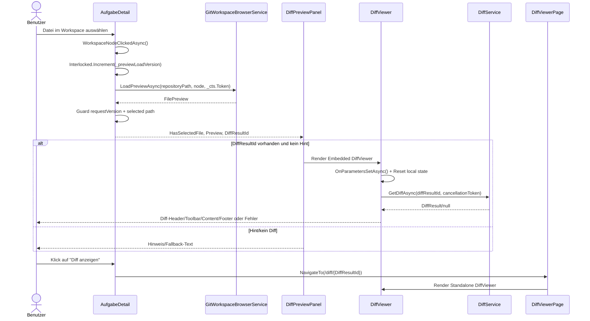
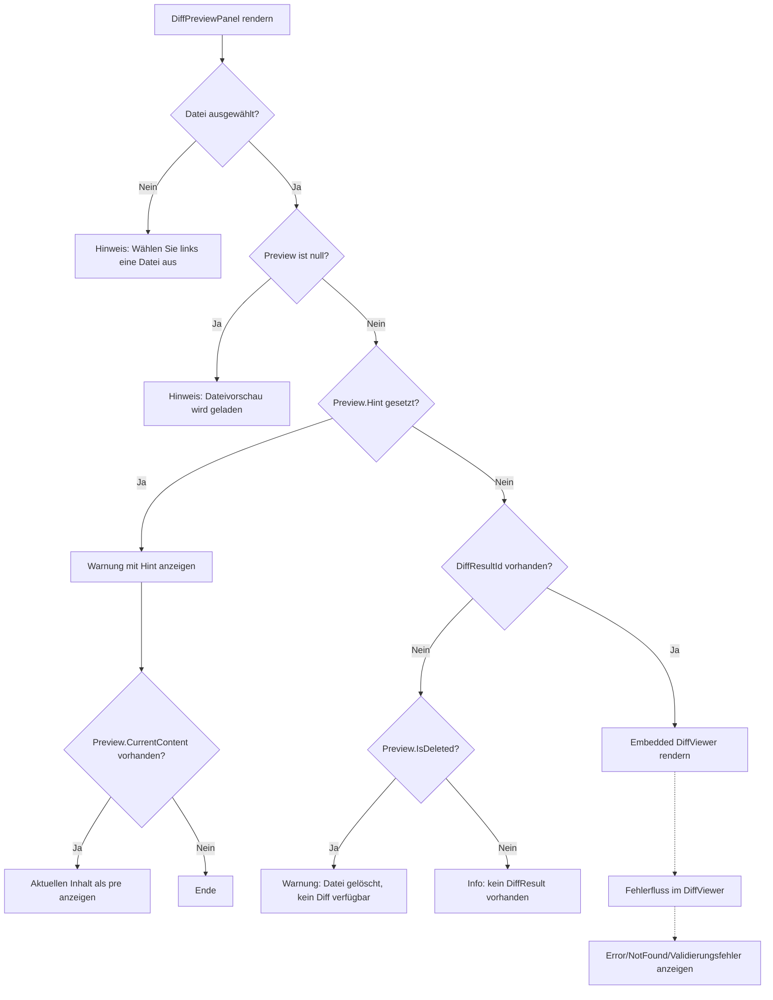

# Ablauf – DiffViewer-Integration (AufgabeDetail, Preview-Panel, Viewer, Route)

## Titel & Kontext

Dieser Ablauf dokumentiert die UI-Integration des Diff-Viewers vom Aufgabenkontext bis zur standalone Route.  
Im Fokus stehen die Zustandsgrenzen zwischen `AufgabeDetail`, `DiffPreviewPanel` und `DiffViewer`, die FR-4-Fallbacklogik in der Vorschau sowie die stabile Verarbeitung bei Parameterwechseln.  
Zusätzlich wird der Kompatibilitätspfad über `/diff/{DiffResultId:guid}` mit `DiffViewerPage` als Wrapper beschrieben.

---

## Diagramm – Zustandsverantwortung und Datenfluss

---

## Diagramm – FR-4-Fallback-Entscheidungslogik im Preview-Panel

---

## Schrittbeschreibung

1. **Aufgabenansicht lädt Integrationszustand**
   - **Code:** `src/Softwareschmiede/Components/Pages/Aufgaben/AufgabeDetail.razor.cs` (`LadeAsync`)
   - **Eingaben:** `Id` der Aufgabe.
   - **Ausgaben/Seiteneffekte:** Lädt `_aufgabe`, `_latestDiffResultId` und Workspace-Daten; initialisiert damit den Datenkontext für Vorschau und Diff-Button.

2. **State Ownership im Parent `AufgabeDetail`**
   - **Code:** `src/Softwareschmiede/Components/Pages/Aufgaben/AufgabeDetail.razor` (`DiffPreviewPanel`-Einbindung) und `AufgabeDetail.razor.cs` (Felder `_selectedWorkspaceNode`, `_selectedWorkspacePreview`, `_latestDiffResultId`)
   - **Eingaben:** Dateiauswahl und zuletzt bekannte Diff-ID.
   - **Ausgaben/Seiteneffekte:** Parent hält ausschließlich Selektions-/Preview-/Diff-ID-Zustand und reicht ihn als Parameter an das Panel weiter.

3. **Dateiauswahl startet versionierten Preview-Ladevorgang**
   - **Code:** `src/Softwareschmiede/Components/Pages/Aufgaben/AufgabeDetail.razor.cs` (`WorkspaceNodeClickedAsync`, `LadeWorkspacePreviewAsync`)
   - **Eingaben:** `WorkspaceFileNode node`.
   - **Ausgaben/Seiteneffekte:** Erhöht `_previewLoadVersion`, setzt `_selectedWorkspacePreview = null` (Loading-Signal) und lädt Vorschau via `GitWorkspaceBrowserService.LoadPreviewAsync`.

4. **Parameterwechsel-Stabilität im Parent (Version Guard)**
   - **Code:** `src/Softwareschmiede/Components/Pages/Aufgaben/AufgabeDetail.razor.cs` (`LadeWorkspacePreviewAsync`)
   - **Eingaben:** `requestVersion`, `_selectedWorkspacePath`.
   - **Ausgaben/Seiteneffekte:** Verwirft veraltete Antworten bei `requestVersion != _previewLoadVersion` oder Pfadwechsel, damit keine stale Preview im UI landet.

5. **FR-4 Entscheidung 1: Keine Datei gewählt**
   - **Code:** `src/Softwareschmiede/Components/Diff/DiffPreviewPanel.razor` (`if (!HasSelectedFile)`)
   - **Eingaben:** `HasSelectedFile = false`.
   - **Ausgaben/Seiteneffekte:** Zeigt den Hinweis *„Wählen Sie links eine Datei aus.“*.

6. **FR-4 Entscheidung 2: Preview lädt**
   - **Code:** `src/Softwareschmiede/Components/Diff/DiffPreviewPanel.razor` (`else if (Preview is null)`)
   - **Eingaben:** `Preview = null` bei laufender Ladeoperation.
   - **Ausgaben/Seiteneffekte:** Zeigt den Loading-Hinweis *„Dateivorschau wird geladen…“*.

7. **FR-4 Entscheidung 3: Fachlicher Hinweis (`Hint`)**
   - **Code:** `src/Softwareschmiede/Components/Diff/DiffPreviewPanel.razor` (`else if (!string.IsNullOrWhiteSpace(Preview.Hint))`)
   - **Eingaben:** `Preview.Hint`, optional `Preview.CurrentContent`.
   - **Ausgaben/Seiteneffekte:** Rendert Warnung und optional Rohinhalt als `<pre>` statt DiffViewer.

8. **FR-4 Entscheidung 4/5: Diff vorhanden vs. Deleted/kein Diff**
   - **Code:** `src/Softwareschmiede/Components/Diff/DiffPreviewPanel.razor` (`else if (DiffResultId.HasValue)`, `else if (Preview.IsDeleted)`, `else`)
   - **Eingaben:** `DiffResultId`, `Preview.IsDeleted`.
   - **Ausgaben/Seiteneffekte:** Rendert Embedded-`DiffViewer` oder fallbackt auf Warnung „Datei gelöscht …“ bzw. Info „kein DiffResult vorhanden“.

9. **Lokale Zustandsführung im `DiffViewer`**
   - **Code:** `src/Softwareschmiede/Components/Diff/DiffViewer.razor` (`OnParametersSetAsync`, `LoadDiffAsync`)
   - **Eingaben:** `DiffResultId`, `PresentationMode`.
   - **Ausgaben/Seiteneffekte:** Reset von `selectedLines`, `currentViewMode`, `currentSearchTerm`; Laden des Diffs über `DiffService.GetDiffAsync`.

10. **Parameterwechsel-Stabilität im `DiffViewer` (Cancellation + Version Guard)**
    - **Code:** `src/Softwareschmiede/Components/Diff/DiffViewer.razor` (`loadingCancellationTokenSource`, `loadingVersion`, `LoadDiffAsync`)
    - **Eingaben:** Neues `DiffResultId`-Parameterupdate.
    - **Ausgaben/Seiteneffekte:** Bricht vorherigen Request ab (`Cancel`/`Dispose`), erhöht `loadingVersion`, ignoriert verspätete Antworten bei Version-Mismatch und setzt `isLoading` nur für die aktuelle Version.

11. **Route-Kompatibilität für direkten Deep-Link**
    - **Code:** `src/Softwareschmiede/Components/Pages/Aufgaben/AufgabeDetail.razor.cs` (`DiffAnzeigen`) und `src/Softwareschmiede/Components/Pages/Diff/DiffViewerPage.razor`
    - **Eingaben:** `_latestDiffResultId`, Routeparameter `DiffResultId`.
    - **Ausgaben/Seiteneffekte:** Navigation nach `/diff/{DiffResultId}`; `DiffViewerPage` reicht die ID als Wrapper an `DiffViewer` im `Standalone`-Modus weiter.

12. **Lifecycle-Cleanup für laufende UI-Operationen**
    - **Code:** `src/Softwareschmiede/Components/Pages/Aufgaben/AufgabeDetail.razor.cs` (`Dispose`) und `src/Softwareschmiede/Components/Diff/DiffViewer.razor` (`IAsyncDisposable.DisposeAsync`)
    - **Eingaben:** Komponenten-Dispose.
    - **Ausgaben/Seiteneffekte:** `CancellationTokenSource` wird in beiden Komponenten gecancelt und freigegeben, um hängende Requests zu vermeiden.

---

## Fehlerbehandlung

- **Preview-Laden schlägt fehl (Workspace)**
  - Pfad: `AufgabeDetail.LadeWorkspacePreviewAsync`
  - Behandlung: Fehler wird geloggt; `FilePreview` mit `Hint = ex.Message` gesetzt, wodurch FR-4-Hinweiszweig aktiv wird.

- **Diff-ID ungültig (`Guid.Empty`)**
  - Pfad: `DiffViewer.OnParametersSetAsync`
  - Behandlung: Laufende Loads werden abgebrochen; `errorMessage = "A valid diff id is required."`; kein Service-Aufruf.

- **Diff nicht gefunden**
  - Pfad: `DiffViewer.LoadDiffAsync` (`DiffService.GetDiffAsync` liefert `null`)
  - Behandlung: Benutzer sieht „Diff not found.“ bzw. not-found Fehlertext im Viewer.

- **Service-/Laufzeitfehler beim Diff-Laden**
  - Pfad: `DiffViewer.LoadDiffAsync` (`catch (Exception ex)`)
  - Behandlung: Nutzerfreundliche Fehlermeldung; technischer Fehler via Logger.

- **Abgebrochene oder veraltete Requests**
  - Pfad: `AufgabeDetail.LadeWorkspacePreviewAsync`, `DiffViewer.LoadDiffAsync`
  - Behandlung: Responses werden still verworfen (Version/Cancellation Guards), UI bleibt konsistent beim schnellen Parameterwechsel.

---

## Abhängigkeiten

- `src/Softwareschmiede/Components/Pages/Aufgaben/AufgabeDetail.razor`
- `src/Softwareschmiede/Components/Pages/Aufgaben/AufgabeDetail.razor.cs`
- `src/Softwareschmiede/Components/Diff/DiffPreviewPanel.razor`
- `src/Softwareschmiede/Components/Diff/DiffViewer.razor`
- `src/Softwareschmiede/Components/Pages/Diff/DiffViewerPage.razor`
- `src/Softwareschmiede/Application/Services/DiffService.cs`
- `src/Softwareschmiede/Application/Services/GitWorkspaceBrowserService.cs`

> Verwandte Dokumentation: [Diff-Pipeline (Backend)](./diff-service-flow.md) · [API-Dokumentation Diff Viewer](../api/diff-viewer.md)
