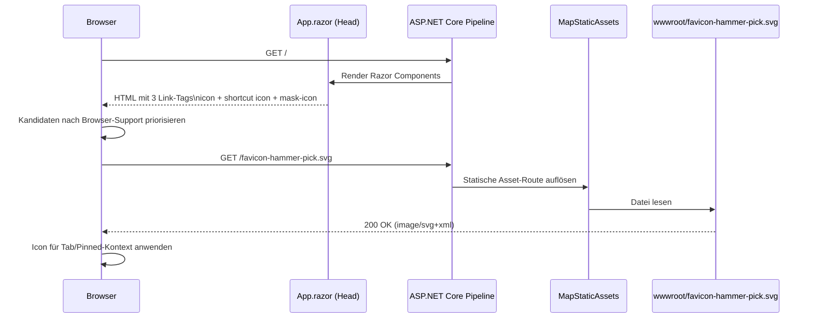

# Ablauf – Favicon-Auslieferung (`favicon-hammer-pick.svg`)

## Titel & Kontext

Dieser Ablauf dokumentiert den Lebenszyklus der Favicon-Auslieferung in der Blazor-Server-Anwendung:  
von den `<link>`-Einträgen in `App.razor` über `MapStaticAssets()` bis zur browserseitigen Icon-Auswahl mit Fallback-Verhalten.

> Relevanter Feature-Kontext: `favicon-hammer-pick-svg`

---

## Diagramm A – End-to-End-Interaktion (sequenceDiagram)



---

## Diagramm B – Browser-Auswahl & Fallback (flowchart TD)

```mermaid
flowchart TD
    A[HTML Head geparst] --> B{SVG rel=icon unterstützt?}
    B -- Ja --> C[GET /favicon-hammer-pick.svg]
    B -- Nein --> D{SVG rel=shortcut icon unterstützt?}
    D -- Ja --> C
    D -- Nein --> E{mask-icon Kontext aktiv?\n(z. B. Safari pinned tab)}
    E -- Ja --> C
    E -- Nein --> F[Browserinterner Fallback]

    C --> G{Antwort 200 + gültiges SVG?}
    G -- Ja --> H[Favicon aktiv]
    G -- Nein --> I[Asset unbrauchbar]

    I --> F
    F --> J{Automatischer Request /favicon.ico?}
    J -- Ja --> K[/favicon.ico nicht vorhanden -> 404]
    J -- Nein --> L[Standard-Browser-Icon]
    K --> L
```

---

## Schrittbeschreibung

1. **Head-Linkdefinition in `App.razor`**
   - **Code:** `src/Softwareschmiede/Components/App.razor`
   - **Details:** Drei Verweise auf dieselbe SVG-Ressource:
     - `rel="icon" type="image/svg+xml" sizes="any"`
     - `rel="shortcut icon" type="image/svg+xml"`
     - `rel="mask-icon" color="#f59e0b"`

2. **Statische Auslieferung über ASP.NET Core**
   - **Code:** `src/Softwareschmiede/Program.cs`
   - **Details:** `app.MapStaticAssets()` stellt Assets aus `wwwroot/` bereit, inkl. `favicon-hammer-pick.svg`.

3. **Dateiquelle**
   - **Code:** `src/Softwareschmiede/wwwroot/favicon-hammer-pick.svg`
   - **Details:** SVG enthält Branding-Marker (`<title>Softwareschmiede Favicon</title>`, Akzentfarbe `#f59e0b`).

4. **Browserauswahl & Fallback**
   - Browser wählen den ersten kompatiblen Linkkandidaten.
   - Bei fehlender Unterstützung oder fehlerhafter Auslieferung greift browserabhängiger Fallback (häufig `/favicon.ico`).
   - Da kein `favicon.ico` im Projekt liegt und keine Legacy-Links gesetzt sind, bleibt dann ein Browser-Standardicon.

---

## Verifikation (Tests)

- `src/Softwareschmiede.Tests/Components/AppTests.cs`
  - prüft SVG-Link-Tags
  - verifiziert, dass keine `favicon.ico`/`favicon.png`-Referenzen mehr existieren
- `src/Softwareschmiede.Tests/Infrastructure/StaticAssets/FaviconHammerPickSvgTests.cs`
  - prüft Existenz und inhaltliche Marker der SVG-Datei
