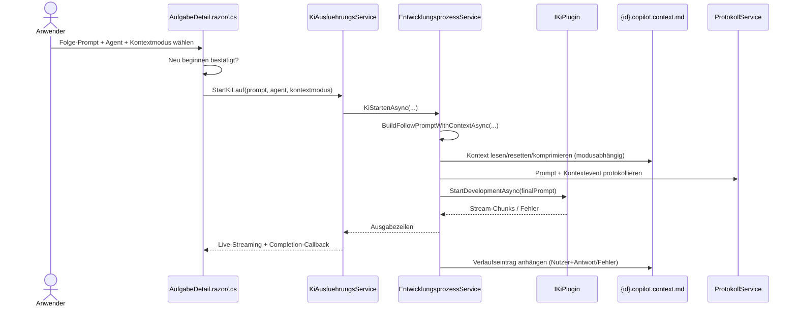

# Ablauf – Kontextsteuerung bei Folgeanweisungen

## Titel & Kontext

Dieser Ablauf dokumentiert die Kontextsteuerung für Folgeanweisungen in der Aufgaben-Detailansicht.  
Der Nutzer kann pro Folgeanweisung zwischen **Kontext mitgeben**, **Kontext ignorieren** und **Kontext neu beginnen** wählen.  
Die Umsetzung erfolgt über UI-Guardrails in `AufgabeDetail`, Kontextorchestrierung in `EntwicklungsprozessService` und persistente Dateiablage in `{aufgabeId}.copilot.context.md`.

> Verwandte Artefakte:  
> [Requirements](../requirements/kontextsteuerung-folgeanweisungen-requirements-analysis.md) ·
> [Architektur](../architecture/kontextsteuerung-folgeanweisungen-architecture-blueprint.md) ·
> [Review](../improvements/kontextsteuerung-folgeanweisungen-architecture-review.md) ·
> [Tests](../tests/testplan-kontextsteuerung-folgeanweisungen.md)

---

## Diagramm A – Sequenz: Folgeanweisung mit Kontextsteuerung



---

## Diagramm B – Programmablauf: Modus- und Fehlerpfade

```mermaid
flowchart TD
    A([FolgePromptAsync]) --> B{Modus = NeuBeginnen<br/>und unbestätigt?}
    B -- Ja -.-> B1[Abbruch mit UI-Fehlerhinweis]
    B -- Nein --> C[KiStartenAsync mit kontextmodus]
    C --> D{Kontextmodus = KontextNeuBeginnen?}
    D -- Ja --> E[Kontextdatei atomisch resetten]
    D -- Nein --> D2{Kontextmodus = KontextIgnorieren?}
    D2 -- Ja --> F[Nur Nutzerprompt verwenden]
    D2 -- Nein --> G[Kontextdatei sicher lesen]
    G --> H{Soft-Limit überschritten?}
    H -- Ja --> I[KI-Komprimierung ausführen + speichern]
    H -- Nein --> J[Kontext unverändert verwenden]
    I --> K{Hard-Limit überschritten?}
    J --> K
    K -- Ja -.-> K1[Preflight-Fehler protokollieren<br/>und Lauf abbrechen]
    K -- Nein --> L[Finalen Prompt senden]
    E --> L
    F --> L
    L --> M[Streaming verarbeiten]
    M --> N[Kontexteintrag mit Status anhängen]
    M -.-> O[Fehlerstatus setzen + Fehlereintrag anhängen]
```

---

## Schrittbeschreibung

1. **Folge-Prompt freischalten und Eingaben erfassen**  
   - **Code:** `src/Softwareschmiede/Components/Pages/Aufgaben/AufgabeDetail.razor` (`Folge-Prompt`-Block)  
   - **Eingaben:** `_folgePrompt`, `_folgeAgentName`, `_folgeKontextmodus`  
   - **Ausgabe/Seiteneffekt:** UI zeigt exakt drei Modi; Senden wird bei unbestätigtem „Kontext neu beginnen“ deaktiviert.

2. **UI-Validierung vor Start**  
   - **Code:** `src/Softwareschmiede/Components/Pages/Aufgaben/AufgabeDetail.razor.cs` (`FolgePromptAsync`)  
   - **Eingaben:** gewählter Kontextmodus + Checkbox `_folgeKontextNeuBeginnenBestaetigt`  
   - **Ausgabe/Seiteneffekt:** Bei fehlender Bestätigung wird kein Lauf gestartet; `_fehler` wird gesetzt.

3. **Hintergrundlauf starten**  
   - **Code:** `src/Softwareschmiede/Components/Pages/Aufgaben/AufgabeDetail.razor.cs` (`KiMitPromptStartenAsync`, `StartKiLauf`) und `src/Softwareschmiede/Application/Services/KiAusfuehrungsService.cs` (`StartKiLauf`)  
   - **Eingaben:** Prompt, Agent, optionales Model, `FolgeanweisungsKontextmodus`  
   - **Ausgabe/Seiteneffekt:** Start über `KiAusfuehrungsService`; Live-Streaming-Subscription wird aufgebaut.

4. **Finalen Prompt kontextabhängig aufbauen**  
   - **Code:** `src/Softwareschmiede/Application/Services/EntwicklungsprozessService.cs` (`KiStartenAsync`, `BuildFollowPromptWithContextAsync`)  
   - **Eingaben:** Nutzerprompt, `runId`, `kontextmodus`, Kontextdateipfad  
   - **Ausgabe/Seiteneffekt:**  
     - `KontextNeuBeginnen`: Kontextdatei wird atomisch zurückgesetzt; finaler Prompt = Nutzerprompt.  
     - `KontextIgnorieren`: finaler Prompt = Nutzerprompt.  
     - `KontextMitgeben`: Kontext wird gelesen und als Präfix (`context + --- + prompt`) kombiniert.

5. **Kontextgröße prüfen und ggf. komprimieren**  
   - **Code:** `src/Softwareschmiede/Application/Services/EntwicklungsprozessService.cs` (`EnsureContextWithinLimitsAsync`, `CompressContextAsync`)  
   - **Eingaben:** Kontextinhalt, `KiKontext:SoftLimitChars`, `KiKontext:HardLimitChars`  
   - **Ausgabe/Seiteneffekt:** Bei Soft-Limit-Überschreitung KI-Komprimierung; Ergebnis wird atomisch gespeichert; bei Hard-Limit-Überschreitung wird vor KI-Start abgebrochen.

6. **KI-Lauf streamen und Aufgabenstatus führen**  
   - **Code:** `src/Softwareschmiede/Application/Services/EntwicklungsprozessService.cs` (`KiStartenAsync`)  
   - **Eingaben:** finaler Prompt + Agent + Klonpfad  
   - **Ausgabe/Seiteneffekt:** Prompt/Antwort-Protokoll, Statuswechsel (`KiAktiv` → `InBearbeitung` bzw. `Fehlgeschlagen`), Stream-Weitergabe an UI.

7. **Kontextverlauf persistieren**  
   - **Code:** `src/Softwareschmiede/Application/Services/EntwicklungsprozessService.cs` (`BuildContextEntry`, `AppendContextEntryAsync`, `WriteTextAtomicallyWithBackupAsync`)  
   - **Eingaben:** `runId`, `contextEventId`, Modus, Nutzerprompt, Antwort/Fehlertext  
   - **Ausgabe/Seiteneffekt:** `{id}.copilot.context.md` erhält strukturierten Verlaufseintrag inkl. Status (`Erfolgreich`/`Fehler`) und Korrelation.

8. **UI-Zustand nach Abschluss zurücksetzen**  
   - **Code:** `src/Softwareschmiede/Components/Pages/Aufgaben/AufgabeDetail.razor.cs` (`FolgePromptAsync`, Completion-Callback in `StartKiLauf`)  
   - **Eingaben:** Laufende Session/Completion-Status  
   - **Ausgabe/Seiteneffekt:** `_folgePrompt` leer, `_folgeAgentName` zurück auf Start-Agent, `_folgeKontextmodus` zurück auf `KontextMitgeben`, Protokoll neu geladen.

---

## Fehlerbehandlung

- **Neu-beginnen ohne Bestätigung**  
  - **Pfad:** `AufgabeDetail.FolgePromptAsync`  
  - **Behandlung:** Sofortiger Abbruch im UI; kein Start des Hintergrundlaufs.

- **Fehler beim Prompt-Preflight (z. B. Hard-Limit / fehlerhafte Komprimierung)**  
  - **Pfad:** `EntwicklungsprozessService.KiStartenAsync` (`catch` um `BuildFollowPromptWithContextAsync`)  
  - **Behandlung:** Fehler wird als Kontexteintrag (`Status: Fehler`) und Protokolleintrag mit `RunId`/`ContextEventId` persistiert; Exception wird weitergeworfen.

- **Fehler im KI-Streaming**  
  - **Pfad:** `EntwicklungsprozessService.KiStartenAsync` (Enumerator-Fehlerpfad)  
  - **Behandlung:** Aufgabe auf `Fehlgeschlagen`, Protokolleintrag mit Fehlertext, Kontexteintrag mit Fehlerstatus.

- **Dateilesefehler der Kontextdatei**  
  - **Pfad:** `ReadFileTextSafeAsync`  
  - **Behandlung:** Fallback auf `{path}.bak`; nur ohne Backup wird der Fehler propagiert.

- **Risiko inkonsistenter Dateischreibvorgänge**  
  - **Pfad:** `WriteTextAtomicallyWithBackupAsync`  
  - **Behandlung:** Atomisches Schreiben via `.tmp` + `File.Replace`/`File.Move` und Backup-Datei `.bak`.

---

## Abhängigkeiten

- **UI / Component**
  - `src/Softwareschmiede/Components/Pages/Aufgaben/AufgabeDetail.razor`
  - `src/Softwareschmiede/Components/Pages/Aufgaben/AufgabeDetail.razor.cs`

- **Application Services**
  - `src/Softwareschmiede/Application/Services/KiAusfuehrungsService.cs`
  - `src/Softwareschmiede/Application/Services/EntwicklungsprozessService.cs`
  - `src/Softwareschmiede/Application/Services/ProtokollService.cs`
  - `src/Softwareschmiede/Application/Services/AufgabeService.cs`

- **Domain / Konfiguration**
  - `src/Softwareschmiede/Domain/Enums/FolgeanweisungsKontextmodus.cs`
  - Konfigurationsschlüssel: `KiKontext:SoftLimitChars`, `KiKontext:HardLimitChars`

- **Plugin / Externe Ausführung**
  - `src/Softwareschmiede.Plugin.Contracts/Domain/Interfaces/IKiPlugin.cs`
  - Implementierungspfad über `plugins/Softwareschmiede.Plugin.GitHubCopilot/` (KI-Ausführung und Komprimierung)

---

## Verwandte Flows

- [Entwicklungsprozess-Abläufe](./development-process-flow.md#ablauf-2b-agent-auswahl-bei-folgeanweisungen)
- [Arbeitsverzeichnis-Auflösung](./workdir-resolution-flow.md)
