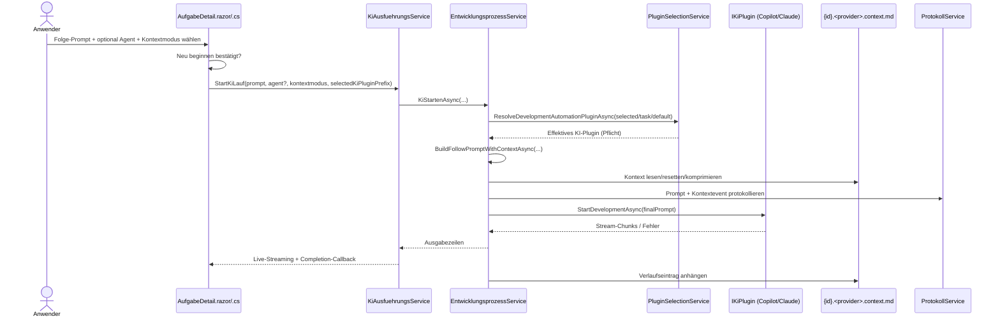

# Ablauf – Kontextsteuerung bei Folgeanweisungen

## Titel & Kontext

Dieser Ablauf dokumentiert die Kontextsteuerung für Folgeanweisungen in der Aufgaben-Detailansicht.  
Der Nutzer kann pro Folgeanweisung zwischen **Kontext mitgeben**, **Kontext ignorieren** und **Kontext neu beginnen** wählen.  
Die Verarbeitung kombiniert UI-Guardrails (`AufgabeDetail`), Hintergrundlauf (`KiAusfuehrungsService`) und Prompt-/Kontextlogik in `EntwicklungsprozessService` – inklusive provider-spezifischer Dateinamen für GitHub Copilot (`*.copilot.*`) und Claude CLI (`*.claude.*`).

> Verwandte Artefakte:  
> [Requirements Kontextsteuerung](../requirements/kontextsteuerung-folgeanweisungen-requirements-analysis.md) ·
> [Architektur Kontextsteuerung](../architecture/kontextsteuerung-folgeanweisungen-architecture-blueprint.md) ·
> [Review Kontextsteuerung](../improvements/kontextsteuerung-folgeanweisungen-architecture-review.md) ·
> [Claude-CLI Testplan](../tests/testplan-claude-cli-integration.md)

---

## Diagramm A – Sequenz: Folgeanweisung mit Plugin-Auswahl und Kontextsteuerung



---

## Diagramm B – Programmablauf: Moduslogik inkl. Claude-/Copilot-Sichtbarkeit

```mermaid
flowchart TD
    A([KiStartenAsync in AufgabeDetail]) --> B{Modus = NeuBeginnen<br/>und unbestätigt?}
    B -- Ja -.-> B1[Abbruch mit UI-Fehlerhinweis]
    B -- Nein --> C[KiStartenAsync mit kontextmodus]
    C --> C0{KI-Plugin auflösbar?}
    C0 -- Nein -.-> C9[Abbruch: Kein KI-Plugin verfügbar]
    C0 -- Ja --> D[Kontextdatei mit Provider-Präfix auflösen]
    D --> D1{Kontextmodus = KontextNeuBeginnen?}
    D1 -- Ja --> E[Kontextdatei atomisch resetten]
    D1 -- Nein --> D2{Kontextmodus = KontextIgnorieren?}
    D2 -- Ja --> F[Nur Nutzerprompt verwenden]
    D2 -- Nein --> G[Kontextdatei sicher lesen]
    G --> H{Soft-Limit überschritten?}
    H -- Ja --> I[KI-Komprimierung + speichern]
    H -- Nein --> J[Kontext unverändert verwenden]
    I --> K{Hard-Limit überschritten?}
    J --> K
    K -- Ja -.-> K1[Preflight-Fehler protokollieren<br/>und Lauf abbrechen]
    K -- Nein --> L[Finalen Prompt senden]
    E --> L
    F --> L
    L --> M[Streaming verarbeiten + Kontexteintrag]
    M -.-> O[Fehlerstatus setzen + Fehlereintrag]
```

---

## Schrittbeschreibung

1. **Prompt-Eingabe mit Modus-Guardrails**  
   - **Code:** `src/Softwareschmiede/Components/Pages/Aufgaben/AufgabeDetail.razor`, `AufgabeDetail.razor.cs` (`KiStartenAsync`, `KiMitPromptStartenAsync`)  
   - **Eingaben:** `_prompt`, `_kiAgentName`, `_folgeKontextmodus`, `_folgeKontextNeuBeginnenBestaetigt`  
   - **Ausgabe/Seiteneffekt:** Bei unbestätigtem „Kontext neu beginnen“ wird der Lauf blockiert und `_fehler` gesetzt.

2. **Hintergrundlauf starten und Session verwalten**  
   - **Code:** `src/Softwareschmiede/Application/Services/KiAusfuehrungsService.cs` (`StartKiLauf`, `Subscribe`)  
   - **Eingaben:** Prompt, optionaler Agent, optionales Model, `selectedKiPluginPrefix`, `FolgeanweisungsKontextmodus`  
   - **Ausgabe/Seiteneffekt:** Session wird im Singleton gehalten, Running-Count-Event ausgelöst, UI erhält Live-Stream.

3. **Effektives KI-Plugin auflösen (Pflichtfeld)**  
   - **Code:** `src/Softwareschmiede/Application/Services/EntwicklungsprozessService.cs` (`KiStartenAsync`), `src/Softwareschmiede/Application/Services/PluginSelectionService.cs` (`ResolveDevelopmentAutomationPluginAsync`)  
   - **Eingaben:** `selectedKiPluginPrefix` (UI), `Aufgabe.KiPluginPrefix`, konfigurierte Defaults/Fallbacks  
   - **Ausgabe/Seiteneffekt:** Konsistente Auflösung `explizit → aufgabe → default/fallback`; bei nicht auflösbarem Plugin Abbruch vor Streaming.

4. **Kontextdateipfad provider-spezifisch bestimmen**  
   - **Code:** `src/Softwareschmiede/Application/Services/EntwicklungsprozessService.cs` (`ResolveContextFilePath`), `src/Softwareschmiede.Plugin.Contracts/Domain/Abstractions/CliKiPluginBase.cs`  
   - **Eingaben:** `localRepoPath`, `aufgabeId`, `ProviderDateiPraefix`  
   - **Ausgabe/Seiteneffekt:** Dateinamen wie `{id}.copilot.context.md` oder `{id}.claude.context.md`.

5. **Finalen Prompt je Kontextmodus aufbauen**  
   - **Code:** `src/Softwareschmiede/Application/Services/EntwicklungsprozessService.cs` (`BuildFollowPromptWithContextAsync`)  
   - **Eingaben:** Nutzerprompt, Modus, Kontextdateiinhalt  
   - **Ausgabe/Seiteneffekt:**  
     - `KontextNeuBeginnen`: Kontextdatei resetten, nur Nutzerprompt senden.  
     - `KontextIgnorieren`: Kontextdatei ignorieren, nur Nutzerprompt senden.  
     - `KontextMitgeben`: Kontext als Präfix voranstellen.

6. **Kontextlimits prüfen und ggf. KI-Komprimierung ausführen**  
   - **Code:** `EntwicklungsprozessService.cs` (`EnsureContextWithinLimitsAsync`, `CompressContextAsync`)  
   - **Eingaben:** Kontextinhalt, `KiKontext:SoftLimitChars`, `KiKontext:HardLimitChars`  
   - **Ausgabe/Seiteneffekt:** Bei Soft-Limit KI-Komprimierung und atomisches Speichern; bei Hard-Limit Abbruch vor KI-Start.

7. **KI-Ausführung streamen (Copilot/Claude CLI)**  
   - **Code:** `EntwicklungsprozessService.cs` (`KiStartenAsync`),  
     `plugins/Softwareschmiede.Plugin.GitHubCopilot/GitHubCopilotPlugin.cs` (`StartDevelopmentAsync`),  
     `plugins/Softwareschmiede.Plugin.ClaudeCli/ClaudeCliPlugin.cs` (`StartDevelopmentAsync`)  
   - **Eingaben:** Finaler Prompt, optionaler Agent, Modell  
   - **Ausgabe/Seiteneffekt:** CLI-Streaming (`copilot` oder `claude`), Statuswechsel `KiAktiv` → `InBearbeitung` oder `Fehlgeschlagen`, Protokolleinträge.

8. **Kontextverlauf persistieren und UI zurücksetzen**  
   - **Code:** `EntwicklungsprozessService.cs` (`BuildContextEntry`, `AppendContextEntryAsync`), `AufgabeDetail.razor.cs` (Completion-Callback)  
   - **Eingaben:** `runId`, `contextEventId`, Modus, Antwort/Fehler  
   - **Ausgabe/Seiteneffekt:** Verlaufseintrag mit Status (`Erfolgreich`/`Fehler`) in Kontextdatei; UI setzt Folgeformular auf Standardwerte zurück.

---

## Fehlerbehandlung

- **Neu-beginnen ohne Bestätigung**  
  - **Pfad:** `AufgabeDetail.KiStartenAsync`  
  - **Behandlung:** Sofortiger UI-Abbruch; kein Hintergrundlauf.

- **Preflight-Fehler vor KI-Start (z. B. Hard-Limit, ungültige Komprimierung)**  
  - **Pfad:** `EntwicklungsprozessService.KiStartenAsync` (`catch` um `BuildFollowPromptWithContextAsync`)  
  - **Behandlung:** Fehler als Kontexteintrag + Protokolleintrag mit `RunId`/`ContextEventId`; Exception wird propagiert.

- **Kein KI-Plugin verfügbar / Prefix nicht auflösbar**  
  - **Pfad:** `EntwicklungsprozessService.KiStartenAsync` → `PluginSelectionService.ResolveDevelopmentAutomationPluginAsync`  
  - **Behandlung:** Exception vor Streaming; UI zeigt Fehler und hält Senden deaktiviert, wenn keine Plugins geladen sind.

- **Streamingfehler im KI-Plugin**  
  - **Pfad:** `KiStartenAsync` (Enumerator-Fehlerpfad)  
  - **Behandlung:** Aufgabe auf `Fehlgeschlagen`, Fehler-Markdown im Protokoll, Kontext-Fehlereintrag.

- **Dateilesefehler Kontextdatei**  
  - **Pfad:** `ReadFileTextSafeAsync`  
  - **Behandlung:** Fallback auf `.bak`; nur ohne Backup wird der Fehler weitergeworfen.

- **Dateischreibfehler bei Kontextpersistenz**  
  - **Pfad:** `WriteTextAtomicallyWithBackupAsync`  
  - **Behandlung:** Atomisches Schreiben via `.tmp` + `File.Replace`/`File.Move`; bei Fehler Exception an Aufrufer.

---

## Abhängigkeiten

- **UI / Komponenten**
  - `src/Softwareschmiede/Components/Pages/Aufgaben/AufgabeDetail.razor`
  - `src/Softwareschmiede/Components/Pages/Aufgaben/AufgabeDetail.razor.cs`

- **Application Services**
  - `src/Softwareschmiede/Application/Services/KiAusfuehrungsService.cs`
  - `src/Softwareschmiede/Application/Services/EntwicklungsprozessService.cs`
  - `src/Softwareschmiede/Application/Services/ProtokollService.cs`
  - `src/Softwareschmiede/Application/Services/AufgabeService.cs`

- **Plugin-Management / Verträge**
  - `src/Softwareschmiede/Application/Services/PluginSelectionService.cs`
  - `src/Softwareschmiede/Infrastructure/Plugins/PluginManager.cs`
  - `src/Softwareschmiede.Plugin.Contracts/Domain/Interfaces/IKiPlugin.cs`
  - `src/Softwareschmiede.Plugin.Contracts/Domain/Abstractions/CliKiPluginBase.cs`

- **Plugin-Implementierungen**
  - `plugins/Softwareschmiede.Plugin.GitHubCopilot/GitHubCopilotPlugin.cs`
  - `plugins/Softwareschmiede.Plugin.ClaudeCli/ClaudeCliPlugin.cs`

---

## Verwandte Flows

- [Entwicklungsprozess-Abläufe](./development-process-flow.md#ablauf-2b-agent-auswahl-bei-folgeanweisungen)
- [Plugin-Settings-Service](./plugin-settings-service-flow.md)
- [AufgabeService Statusübergänge](./aufgabe-service-status-flow.md)
