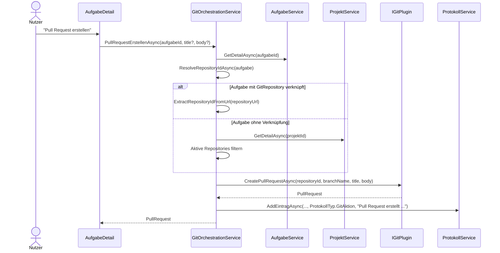

# Ablauf – GitOrchestrationService (Git-Aktionen, Issue-Import, PR-Auflösung)

## Titel & Kontext

Dieser Ablauf dokumentiert die zentrale Git-Orchestrierung in `GitOrchestrationService`.
Der Service kapselt die UI-nahen Git-Aktionen (Issues laden, Commit/Reset/Push/Pull, Pull Request erstellen) und ergänzt sie um fachliche Guards sowie Protokolleinträge.
Ein besonderer Fokus liegt auf der Repository-Auflösung für Pull Requests (Aufgaben-Repository vs. Projekt-Repository).

---

## Diagramm A – Sequenz: Pull Request aus der Aufgabenansicht



---

## Diagramm B – Programmablauf: Guards und Repository-Auflösung

```mermaid
flowchart TD
    A([Git-Orchestrierung aufgerufen]) --> B{Aktion = PullRequestErstellenAsync?}
    B -- Nein --> C[Aufgabe laden und Pflichtfelder prüfen]
    C --> D[IGitPlugin Aktion ausführen]
    D --> E[ProtokollService AddEintragAsync]
    E --> Z([Erfolg zurückgeben])

    B -- Ja --> F[Aufgabe-Detail laden]
    F --> G{BranchName gesetzt?}
    G -- Nein -.-> G1[InvalidOperationException]:::error
    G -- Ja --> H{GitRepository an Aufgabe?}
    H -- Ja --> I[RepositoryId aus RepositoryUrl extrahieren]
    H -- Nein --> J[Projekt laden und aktive Repositories ermitteln]
    J --> K{Genau 1 aktives Repository?}
    K -- Ja --> L[RepositoryId aus Projekt-Repository extrahieren]
    K -- Nein -.-> K1[InvalidOperationException]:::error
    I --> M[IGitPlugin CreatePullRequestAsync]
    L --> M
    M --> N[GitAktion protokollieren]
    N --> Z

    classDef error fill:#ffcccc,stroke:#cc0000,color:#333;
```

---

## Schrittbeschreibung

1. **Issue-Import für neue Aufgaben**
   - **Code:** `src/Softwareschmiede/Application/Services/GitOrchestrationService.cs` (`IssuesAbrufenAsync`), `src/Softwareschmiede/Components/Pages/Aufgaben/NeueAufgabe.razor.cs` (`LadeIssuesAsync`)
   - **Eingaben:** `repositoryId` (`owner/repo`)
   - **Ausgaben/Seiteneffekte:** Rückgabe einer `Issue`-Liste; UI füllt Auswahlliste für `CreateFromIssueAsync`.

2. **Gemeinsamer Guard für Git-Aktionen auf Aufgaben**
   - **Code:** `GitOrchestrationService.CommitAsync`, `ResetAsync`, `PushAsync`, `PullAsync`
   - **Eingaben:** `aufgabeId`, aktionsspezifische Parameter (`message`, `resetType`, `targetRef`)
   - **Ausgaben/Seiteneffekte:** Aufgabe wird geladen; fehlender `LokalerKlonPfad` oder fehlender `BranchName` (bei Push) führt zum Abbruch per Exception.

3. **Ausführung der Plugin-Operation**
   - **Code:** `GitOrchestrationService.*` → `IGitPlugin` (`CommitAsync`, `ResetAsync`, `PushBranchAsync`, `PullAsync`, `CreatePullRequestAsync`)
   - **Eingaben:** Lokaler Repository-Pfad, Branch, PR-Metadaten
   - **Ausgaben/Seiteneffekte:** Git-Kommando läuft im Ziel-Repository; Plugin-Ergebnis wird an den Service zurückgegeben.

4. **Protokollierung jeder Git-Aktion**
   - **Code:** `GitOrchestrationService.*` → `ProtokollService.AddEintragAsync`
   - **Eingaben:** `aufgabeId`, `ProtokollTyp.GitAktion`, formatierter Text
   - **Ausgaben/Seiteneffekte:** Persistenter Audit-Log in der Aufgabenhistorie.

5. **Repository-Auflösung für Pull Requests**
   - **Code:** `GitOrchestrationService.PullRequestErstellenAsync`, `ResolveRepositoryIdAsync`, `ExtractRepositoryIdFromUrl`
   - **Eingaben:** Aufgabe inkl. optionaler `GitRepository`-Verknüpfung
   - **Ausgaben/Seiteneffekte:** Eindeutige `repositoryId`; bei fehlender oder mehrdeutiger Projektzuordnung wird kontrolliert abgebrochen.

6. **UI-Integration für Commit/Push/Pull/Reset/PR**
   - **Code:** `src/Softwareschmiede/Components/Pages/Aufgaben/AufgabeDetail.razor.cs` (`CommitAsync`, `PushAsync`, `PullAsync`, `ResetAsync`, `PullRequestErstellenAsync`)
   - **Eingaben:** Formulardaten in der Aufgabenansicht
   - **Ausgaben/Seiteneffekte:** Erfolg-/Fehlermeldungen in der UI, anschließendes Reload via `LadeAsync`.

---

## Fehlerbehandlung

- **Aufgabe nicht gefunden**
  - Pfad: alle Methoden mit `GetByIdAsync`/`GetDetailAsync`
  - Behandlung: `InvalidOperationException`, UI zeigt Fehlermeldung.

- **Fehlender Klonpfad oder Branch**
  - Pfad: `CommitAsync`/`ResetAsync`/`PullAsync`/`PushAsync`/`PullRequestErstellenAsync`
  - Behandlung: `InvalidOperationException`; keine Plugin-Aktion wird gestartet.

- **Mehrdeutige oder fehlende Projekt-Repositories bei PR**
  - Pfad: `ResolveRepositoryIdAsync`
  - Behandlung: `InvalidOperationException` mit konkretem Hinweis auf notwendige Repository-Verknüpfung.

- **Ungültige Repository-URL**
  - Pfad: `ExtractRepositoryIdFromUrl`
  - Behandlung: `InvalidOperationException`; PR-Erstellung wird abgebrochen.

- **Plugin-/Netzwerk-/CLI-Fehler**
  - Pfad: `IGitPlugin`-Aufrufe
  - Behandlung: Exception propagiert; Aufrufseite (`AufgabeDetail`/`NeueAufgabe`) setzt UI-Fehlermeldung.

---

## Abhängigkeiten

- `src/Softwareschmiede/Application/Services/GitOrchestrationService.cs`
- `src/Softwareschmiede/Application/Services/AufgabeService.cs`
- `src/Softwareschmiede/Application/Services/ProjektService.cs`
- `src/Softwareschmiede/Application/Services/ProtokollService.cs`
- `src/Softwareschmiede/Components/Pages/Aufgaben/AufgabeDetail.razor.cs`
- `src/Softwareschmiede/Components/Pages/Aufgaben/NeueAufgabe.razor.cs`
- `src/Softwareschmiede/Domain/Interfaces/IGitPlugin.cs`

> Verwandte Flows: [Entwicklungsprozess-Abläufe](./development-process-flow.md) · [ProjektService](./projekt-service-flow.md) · [KI-Ausführung im Hintergrund](./ki-ausfuehrungs-service-flow.md)
