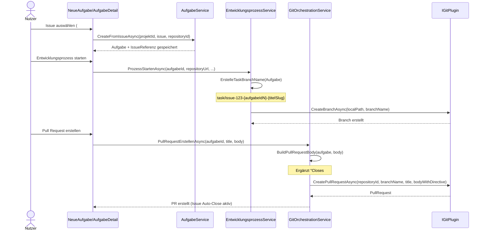
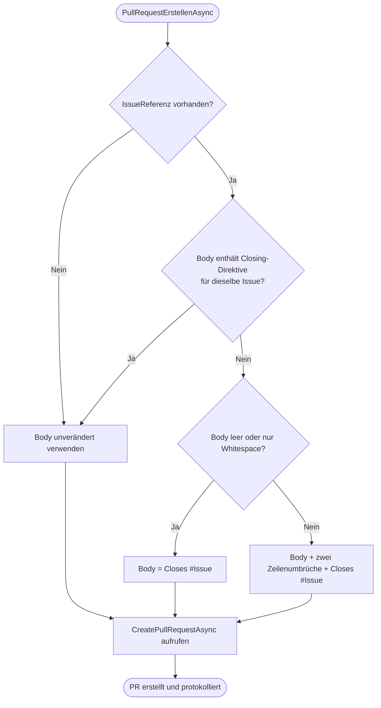

# Ablauf – Issue-Auswahl, Branch-Verknüpfung und PR Auto-Close

## Kontext

Dieser Ablauf dokumentiert den End-to-End-Pfad des Features:

1. Issue in **Neue Aufgabe** auswählen
2. Aufgabe mit `IssueReferenz` persistieren
3. beim Prozessstart issuebezogenen Task-Branch erzeugen
4. bei PR-Erstellung die passende Closing-Direktive ergänzen

## Diagramm A – Sequenz: Von der Issue bis zum PR

## Diagramm B – Entscheidungslogik: PR-Body

## Schrittübersicht

1. **Issue-Auswahl in der UI**
   - `NeueAufgabe.razor.cs` lädt Issues (`LadeIssuesAsync`) und übernimmt bei Auswahl Titel/Body.
2. **Persistenz der Issue-Verknüpfung**
   - `AufgabeService.CreateFromIssueAsync` speichert `IssueReferenz`.
3. **Issuebezogener Branchname**
   - `EntwicklungsprozessService.ErstelleTaskBranchName` nutzt `IssueNummer`, falls vorhanden.
4. **PR-Body mit Auto-Close**
   - `GitOrchestrationService.BuildPullRequestBody` ergänzt `Closes #<IssueNummer>` nur bei Bedarf.
5. **Nachvollziehbarkeit im Protokoll**
   - PR-Protokolleintrag enthält den Hinweis auf Issue und Auto-Close.

## Verknüpfte Dokumentation

- API-Contract: [issue-branch-pr-linking.md](../api/issue-branch-pr-linking.md)
- Business: [F019 – Issue-, Branch- und PR-Verknüpfung](../business/features/F019-issue-branch-pr-verknuepfung.md)
- Testplan: [testplan-issue-branch-pr-linking.md](../tests/testplan-issue-branch-pr-linking.md)
