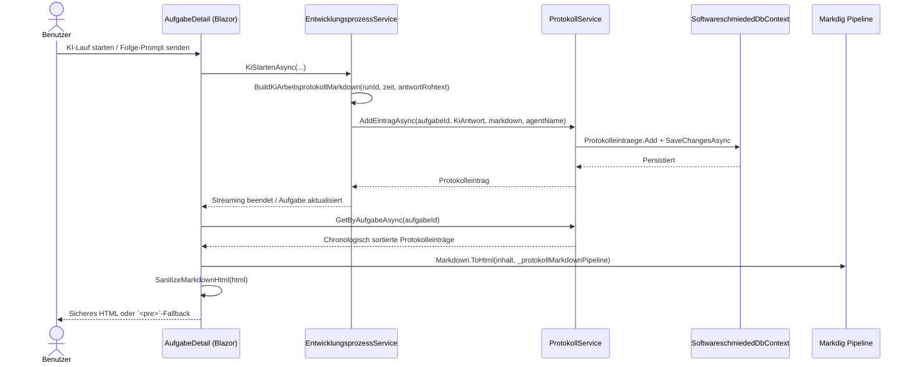
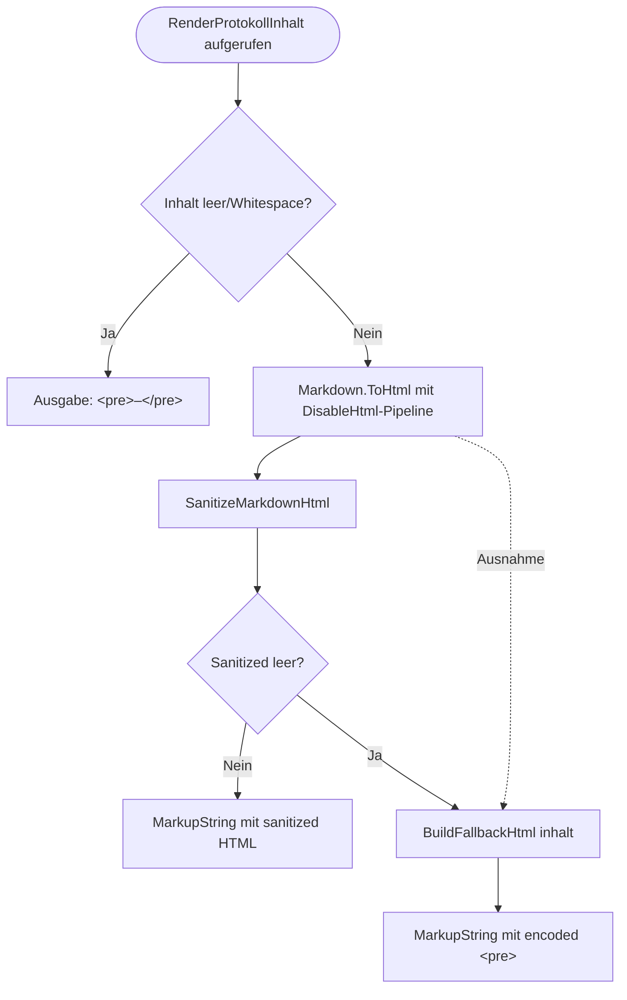

# KI-Arbeitsprotokoll – Persistierung, Rendering und Fallback

**Modul/Feature:** `EntwicklungsprozessService`, `ProtokollService`, `AufgabeDetail`  
**Letzte Aktualisierung:** 2026-05-24

Dieser Ablauf dokumentiert, wie KI-Ausgaben als strukturiertes Markdown-Arbeitsprotokoll erzeugt, in der Datenbank persistiert und in der Aufgaben-Detailansicht sicher gerendert werden. Der Fokus liegt auf dem Format `# {Datum}` plus Schritttrennung `## Schritt n`, der Sanitizing-Stufe für HTML-Ausgabe und dem robusten Fallback-Pfad bei Render-/Sanitizing-Problemen.

## Formatvertrag (verbindlich)

1. Jeder persistierte KI-Protokolleintrag beginnt mit `# yyyy-MM-dd`.
2. Nach der Datumszeile folgt die Metadatenzeile `- RunId: \`{runId}\``.
3. Antwortblöcke werden als `## Schritt n` mit mindestens einer Leerzeile zwischen den Schritten ausgegeben.
4. Bei leerer KI-Antwort wird ein Fallback-Schritt `## Schritt 1` mit „Keine Ausgabe vorhanden.“ erzeugt.
5. In der laufenden Streaming-Ansicht gilt derselbe Aufbau; dort lautet der Fallbacktext „Warte auf Ausgabe...“.

---

## 1) Sequenzablauf: Persistierung bis Webdarstellung

## 2) Flowchart: Rendering, Sanitizing und Fehlerpfad

---

## Schrittbeschreibung

1. **KI-Streaming wird abgeschlossen und Rohantwort gesammelt**  
   **Code:** `src/Softwareschmiede/Application/Services/EntwicklungsprozessService.cs` (`KiStartenAsync`)  
   **Eingaben:** `aufgabeId`, `prompt`, `agentName`, Stream-Chunks aus `IKiPlugin.StartDevelopmentAsync`  
   **Ausgaben/Seiteneffekte:** `vollstaendigeAntwort` wird aus allen Chunks aufgebaut; bei Fehler wird `fehler` gesetzt.

2. **Markdown-Arbeitsprotokoll wird normiert aufgebaut**  
   **Code:** `src/Softwareschmiede/Application/Services/EntwicklungsprozessService.cs` (`BuildKiArbeitsprotokollMarkdown`)  
   **Eingaben:** `runId`, `zeitpunktUtc`, `antwortRohtext`  
   **Ausgaben:** Markdown mit:
   - Datumszeile `# yyyy-MM-dd`
   - Metadatenzeile `- RunId: \`{runId}\``
   - Schrittblöcke `## Schritt 1..n` pro nicht-leerer Antwortzeile (inkl. Leerzeilentrennung zwischen Schritten)  
   - Fallback `## Schritt 1` + „Keine Ausgabe vorhanden.“ bei leerer Antwort  
   **Seiteneffekte:** keine (pure String-Erzeugung).

3. **Protokolleintrag wird persistiert**  
   **Code:**  
   - `src/Softwareschmiede/Application/Services/EntwicklungsprozessService.cs` (`KiStartenAsync` ruft `AddEintragAsync`)  
   - `src/Softwareschmiede/Application/Services/ProtokollService.cs` (`AddEintragAsync`)  
   **Eingaben:** `aufgabeId`, `ProtokollTyp.KiAntwort`, Markdown-Inhalt, optional `agentName`  
   **Ausgaben/Seiteneffekte:** Neuer Datensatz in `Protokolleintraege` (`SoftwareschmiededDbContext`), `Zeitstempel = DateTimeOffset.UtcNow`, Commit via `SaveChangesAsync`.

4. **Protokoll wird für die Detailseite geladen**  
   **Code:** `src/Softwareschmiede/Components/Pages/Aufgaben/AufgabeDetail.razor.cs` (`LadeAsync`), `src/Softwareschmiede/Application/Services/ProtokollService.cs` (`GetByAufgabeAsync`)  
   **Eingaben:** `Id` der Aufgabe  
   **Ausgaben/Seiteneffekte:** `_protokoll` wird chronologisch (`OrderBy(Zeitstempel)`) befüllt; DB-Lesezugriff ohne Tracking.

5. **Markdown wird in der UI gerendert**  
   **Code:**  
   - `src/Softwareschmiede/Components/Pages/Aufgaben/AufgabeDetail.razor` (`@RenderProtokollInhalt(eintrag.Inhalt)`)  
   - `src/Softwareschmiede/Components/Pages/Aufgaben/AufgabeDetail.razor.cs` (`RenderProtokollInhalt`)  
   **Eingaben:** `eintrag.Inhalt` (Markdown) sowie laufender Streaming-Output über `BuildStreamingArbeitsprotokollMarkdown`  
   **Ausgaben:** `MarkupString` für die Anzeige im DOM.

6. **HTML wird sanitiziert und unsichere URIs werden neutralisiert**  
   **Code:** `src/Softwareschmiede/Components/Pages/Aufgaben/AufgabeDetail.razor.cs` (`SanitizeMarkdownHtml`)  
   **Eingaben:** Von Markdig erzeugtes HTML  
   **Ausgaben/Seiteneffekte:**  
   - Entfernt Event-Handler-Attribute (`on...`) via `_unsafeHtmlEventAttributeRegex`  
   - Ersetzt unsichere Schemes in `href`/`src` (`javascript:`, `data:`, `vbscript:`) auf `"#"` via `_unsafeHtmlUriRegex`  
   - Keine Persistierung; nur Laufzeit-Transformation.

7. **Fallback sichert Darstellung bei Problemen**  
   **Code:** `src/Softwareschmiede/Components/Pages/Aufgaben/AufgabeDetail.razor.cs` (`RenderProtokollInhalt`, `BuildFallbackHtml`)  
   **Eingaben:** Ursprünglicher `inhalt`  
   **Ausgaben/Seiteneffekte:** Bei Exception oder leerem Sanitizing-Ergebnis wird HTML-encoded `<pre>` ausgegeben; XSS wird durch `HtmlEncoder.Default.Encode(...)` verhindert.

---

## Fehlerbehandlung

- **Fehler beim KI-Streaming (`MoveNextAsync`)**  
  `KiStartenAsync` erzeugt trotzdem ein Markdown-Protokoll mit Präfix `Fehler: ...`, persistiert es als `KiAntwort` und setzt den Aufgabenstatus auf `Fehlgeschlagen`.  
  **Code:** `src/Softwareschmiede/Application/Services/EntwicklungsprozessService.cs`

- **Leere oder nur Whitespace-Antwort**  
  `BuildKiArbeitsprotokollMarkdown` erzeugt einen gültigen Fallback-Abschnitt (`## Schritt 1` + „Keine Ausgabe vorhanden.“), sodass Persistierung und Rendering stabil bleiben.  
  **Code:** `src/Softwareschmiede/Application/Services/EntwicklungsprozessService.cs`

- **Ausnahme im Markdown-Rendering**  
  `RenderProtokollInhalt` fängt Exceptions ab und nutzt `BuildFallbackHtml(inhalt)`.  
  **Code:** `src/Softwareschmiede/Components/Pages/Aufgaben/AufgabeDetail.razor.cs`

- **Sanitized HTML leer**  
  Wenn nach Sanitizing kein verwertbares HTML übrig bleibt, wird ebenfalls `BuildFallbackHtml` verwendet.  
  **Code:** `src/Softwareschmiede/Components/Pages/Aufgaben/AufgabeDetail.razor.cs`

- **Unsichere Link-/Src-Schemes und Event-Handler im HTML**  
  Werden aktiv entfernt/neutralisiert; abgesichert durch Tests (`RenderProtokollInhalt_ShouldSanitize...`, `SanitizeMarkdownHtml_ShouldRemoveHtmlEventHandlerAttributes`).  
  **Code:** `src/Softwareschmiede.Tests/Components/Pages/Aufgaben/AufgabeDetailFolgePromptTests.cs`

---

## Abhängigkeiten

- **Application Services:** `EntwicklungsprozessService`, `ProtokollService`, `AufgabeService`
- **UI/Rendering:** `AufgabeDetail` (Blazor), `Markdig` (`Markdown.ToHtml`)
- **Sicherheitsbausteine:** `HtmlEncoder`, Regex-basierte Sanitizing-Regeln
- **Persistenz:** `SoftwareschmiededDbContext` (`DbSet<Protokolleintrag> Protokolleintraege`)
- **Externe Interaktion:** `IKiPlugin` (liefert Stream-Chunks für Protokollinhalt)

---

**Verwandte Flows:**  
- [Entwicklungsprozess-Abläufe](./development-process-flow.md) (insb. KI-Streaming)  
- [Kontextsteuerung bei Folgeanweisungen](./follow-up-context-steering-flow.md)

---

## Testabdeckung (Stand 2026-05-24)

- `src/Softwareschmiede.Tests/Application/Services/EntwicklungsprozessServiceTests.cs`
  - `KiStartenAsync_ShouldPersistMarkdownArbeitsprotokoll_WithDateHeadingAndSeparatedSteps`
  - `KiStartenAsync_ShouldPersistFallbackStep_WhenKiOutputIsWhitespaceOnly`
  - `KiStartenAsync_ShouldNormalizeLineBreaks_AndKeepStepOrder`
- `src/Softwareschmiede.Tests/Components/Pages/Aufgaben/AufgabeDetailFolgePromptTests.cs`
  - `RenderProtokollInhalt_ShouldRenderMarkdownHeadings`
  - `RenderProtokollInhalt_ShouldSanitizeUnsafe*`
  - `SanitizeMarkdownHtml_ShouldRemoveHtmlEventHandlerAttributes`
  - `BuildStreamingArbeitsprotokollMarkdown_ShouldCreateDateHeadingAndStepSections`
