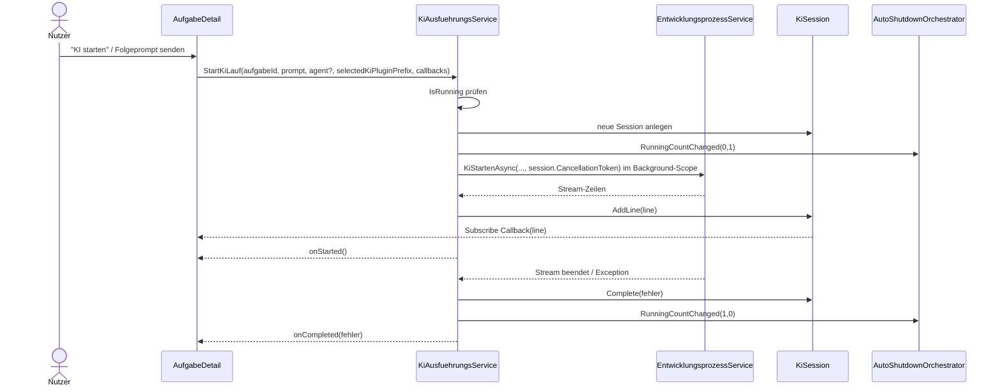

# Ablauf – KiAusfuehrungsService (Hintergrundläufe, Streaming-Puffer, RunningCount)

## Titel & Kontext

Dieser Ablauf beschreibt die Hintergrundausführung von KI-Läufen über `KiAusfuehrungsService`.
Der Service entkoppelt die Laufzeit von der Blazor-Komponente: Ein KI-Lauf läuft weiter, auch wenn Nutzer:innen navigieren, und die Ausgabe bleibt in einer Session gepuffert.
Zusätzlich publiziert der Service Running-Count-Übergänge für Orchestrierungen wie `AutoShutdownOrchestrator`.  
Im Sollzustand 2026-05-25 gilt: KI-Plugin ist Pflicht, Agentenpaket/Agent sind optionale Eingaben aus der UI.

---

## Diagramm A – Sequenz: Start, Streaming, Abschluss



---

## Diagramm B – Programmablauf: Session-Lifecycle und Fehlerpfade

```mermaid
flowchart TD
    A([StartKiLauf aufgerufen]) --> B{Session bereits laufend?}
    B -- Ja --> C[Start ablehnen und Warning loggen]
    C --> Z([Ohne neue Session beenden])
    B -- Nein --> D[KiSession erzeugen und speichern]
    D --> E[RunningCountChanged auslösen]
    E --> F[Background-Task mit AsyncScope starten]
    F --> G{Stream-Zeile empfangen?}
    G -- Ja --> H[Session AddLine + Subscriber benachrichtigen]
    H --> I{Erste Zeile?}
    I -- Ja --> J[onStarted Callback]
    I -- Nein --> G
    J --> G
    G -- Nein --> K[Session Complete(false)]
    K --> L[RunningCountChanged auslösen]
    L --> M[onCompleted(false)]
    M --> N([Lauf erfolgreich beendet])

    F -.-> O[Exception, Cancel oder Plugin-Auflösung fehlgeschlagen]:::error
    O -.-> P[Fehlerzeile hinzufügen und Complete(true)]:::error
    P -.-> Q[RunningCountChanged + onCompleted(true)]:::error
    Q -.-> R([Fehlerpfad beendet]):::error

    classDef error fill:#ffcccc,stroke:#cc0000,color:#333;
```

---

## Schrittbeschreibung

1. **Session-Wiederaufnahme beim Seitenaufruf**
   - **Code:** `src/Softwareschmiede/Components/Pages/Aufgaben/AufgabeDetail.razor.cs` (`OnInitializedAsync`)
   - **Eingaben:** `Id` der Aufgabe
   - **Ausgaben/Seiteneffekte:** Bei laufender Session lädt die UI `GetBufferedLines(Id)` und re-subscribed via `KiLiveSubscribieren`.

2. **Neustart vorbereiten und alte Session bereinigen**
   - **Code:** `AufgabeDetail.KiMitPromptStartenAsync` + `KiAusfuehrungsService.SessionBereinigen`
   - **Eingaben:** Prompt, optionaler Agent, optional `model`, `selectedKiPluginPrefix`, `FolgeanweisungsKontextmodus`
   - **Ausgaben/Seiteneffekte:** Abgeschlossene Session wird entfernt; neue Live-Subscription wird vorbereitet.

3. **Singleton-Session erzeugen und Running-Count aktualisieren**
   - **Code:** `src/Softwareschmiede/Application/Services/KiAusfuehrungsService.cs` (`StartKiLauf`, `RaiseRunningCountChanged`)
   - **Eingaben:** `aufgabeId`, Laufparameter, Callbacks
   - **Ausgaben/Seiteneffekte:** `ConcurrentDictionary<Guid, KiSession>` erhält neuen Eintrag; Event `RunningCountChanged` wird bei echter Änderung publiziert.

4. **Ausführung in separatem DI-Scope**
   - **Code:** `KiAusfuehrungsService.StartKiLauf` (`CreateAsyncScope`, `GetRequiredService<EntwicklungsprozessService>`)
   - **Eingaben:** Session-`CancellationToken`
   - **Ausgaben/Seiteneffekte:** `EntwicklungsprozessService.KiStartenAsync` läuft im Hintergrund und streamt Zeilen in die Session.

5. **Streaming-Pufferung mit Block-Headern**
   - **Code:** `KiSession.AddLine`
   - **Eingaben:** Einzelne Stream-Zeile
   - **Ausgaben/Seiteneffekte:** Zeilen werden thread-sicher gepuffert; bei Pausen ≥2 Sekunden wird ein neuer Block mit Leerzeile + Zeitstempel eingefügt; Subscriber erhalten Live-Updates.

6. **Abschluss, Abbruch und Cleanup**
   - **Code:** `KiAusfuehrungsService.AbortKiLauf`, `KiSession.Cancel`, `KiSession.Complete`, `AufgabeDetail` (`onCompleted`-Callback)
   - **Eingaben:** Nutzerabbruch oder Laufende
   - **Ausgaben/Seiteneffekte:** Session markiert Fehler/Erfolg, Running-Count sinkt, UI lädt Daten via `LadeAsyncWithScope`, Subscription wird disposed.

---

## Fehlerbehandlung

- **Doppeltstart derselben Aufgabe**
  - Pfad: `StartKiLauf` bei `IsRunning(aufgabeId)==true`
  - Behandlung: Lauf wird nicht erneut gestartet; Warning-Log; keine zusätzlichen Running-Count-Events.

- **Fehler in `EntwicklungsprozessService.KiStartenAsync`**
  - Pfad: Background-Task `catch (Exception ex)`
  - Behandlung: Fehler wird geloggt, Session erhält `[Fehler] ...`, `onCompleted(true)` wird ausgelöst.

- **Kein KI-Plugin verfügbar / Prefix nicht auflösbar**
  - Pfad: `EntwicklungsprozessService.KiStartenAsync` → `PluginSelectionService.ResolveDevelopmentAutomationPluginAsync`
  - Behandlung: Exception wird im Background-Task gefangen, als Fehlerzeile gepuffert und via `onCompleted(true)` an die UI signalisiert.

- **Abbruch durch Cancellation**
  - Pfad: `AbortKiLauf` → `OperationCanceledException`
  - Behandlung: Lauf endet kontrolliert als Fehlerpfad (`onCompleted(true)`), Session bleibt auslesbar bis `SessionBereinigen`.

- **Subscriber-Fehler**
  - Pfad: `KiSession.AddLine` beim Callback-Aufruf
  - Behandlung: Exceptions werden geschluckt, um den Hintergrundlauf nicht zu unterbrechen.

---

## Abhängigkeiten

- `src/Softwareschmiede/Application/Services/KiAusfuehrungsService.cs`
- `src/Softwareschmiede/Application/Services/EntwicklungsprozessService.cs`
- `src/Softwareschmiede/Application/Services/PluginSelectionService.cs`
- `src/Softwareschmiede/Components/Pages/Aufgaben/AufgabeDetail.razor.cs`
- `src/Softwareschmiede/Application/Services/AutoShutdownOrchestrator.cs`
- `src/Softwareschmiede/Domain/Interfaces/IRunningAutomationStatusSource.cs`

> Verwandte Flows: [Entwicklungsprozess-Abläufe](./development-process-flow.md) · [Kontextsteuerung bei Folgeanweisungen](./follow-up-context-steering-flow.md) · [AutoShutdownOrchestrator](./auto-shutdown-orchestrator-flow.md)
