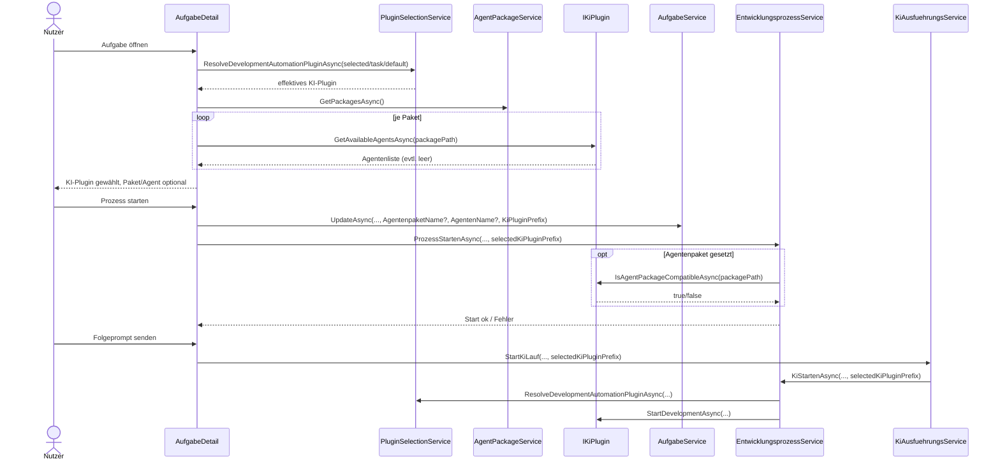
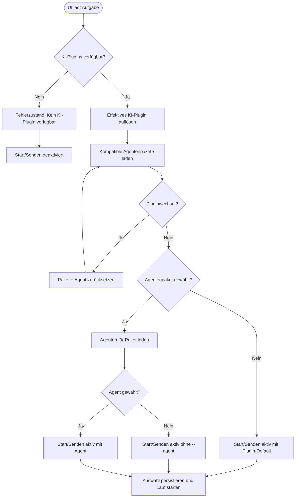

# Ablauf – KI-Plugin-spezifische Agenten-Discovery/Auswahl (Issue 58)

## Titel & Kontext

Dieser Ablauf beschreibt die plugin-spezifische Agenten-Discovery in `AufgabeDetail` beim Aufgabenstart und bei Folgeprompts.  
Sollzustand: **KI-Plugin ist Pflicht**, **Agentenpaket und Agent sind optional**. Die effektive KI-Plugin-Auswahl wird als `KiPluginPrefix` pro Aufgabe gespeichert und in Start-/Folgepfaden konsistent genutzt.

## Diagramm A – Sequenz: Auswahl, Persistenz und Start/Folgeprompt

## Diagramm B – Programmablauf: Pflicht-/Optional-Logik und Resets

## Schrittbeschreibung

1. **Pflichtfeld KI-Plugin auflösen**  
   - **Code:** `src/Softwareschmiede/Components/Pages/Aufgaben/AufgabeDetail.razor.cs` (`LadeKiPluginsAsync`), `src/Softwareschmiede/Application/Services/PluginSelectionService.cs` (`ResolveDevelopmentAutomationPluginAsync`)  
   - **Eingaben:** `_selectedKiPluginPrefix`, gespeicherter `Aufgabe.KiPluginPrefix`, verfügbare Plugins  
   - **Ausgaben/Seiteneffekte:** Effektiver `PluginPrefix` wird gesetzt; bei fehlenden KI-Plugins bleiben Start/Senden deaktiviert.

2. **Plugin-spezifische Paket-/Agenten-Discovery laden**  
   - **Code:** `AufgabeDetail.razor.cs` (`LadeAgentenpaketeAsync`)  
   - **Eingaben:** Effektives `IKiPlugin`, `AgentPackageService.GetPackagesAsync()`  
   - **Ausgaben/Seiteneffekte:** Es werden nur Pakete mit mindestens einem kompatiblen Agenten angeboten; leere Auswahl ist zulässig.

3. **Reset-Regeln bei Auswahländerungen anwenden**  
   - **Code:** `AufgabeDetail.razor.cs` (`KiPluginGeaendertAsync`, `PaketGeaendertAsync`)  
   - **Eingaben:** UI-Änderung von Plugin oder Paket  
   - **Ausgaben/Seiteneffekte:** Pluginwechsel setzt Paket+Agent zurück; Paketwechsel setzt Agent zurück.

4. **Auswahl vor Prozessstart persistieren (optional für Paket/Agent)**  
   - **Code:** `AufgabeDetail.razor.cs` (`ProzessStartenAsync`), `src/Softwareschmiede/Application/Services/AufgabeService.cs` (`UpdateAsync`)  
   - **Eingaben:** `AgentenpaketName?`, `AgentenName?`, `KiPluginPrefix`  
   - **Ausgaben/Seiteneffekte:** `KiPluginPrefix` wird immer gespeichert; Paket/Agent werden bei leerer UI-Auswahl als `null` persistiert.

5. **Startlauf mit optionalem Agentenpaket ausführen**  
   - **Code:** `src/Softwareschmiede/Application/Services/EntwicklungsprozessService.cs` (`ProzessStartenAsync`)  
   - **Eingaben:** `selectedKiPluginPrefix`, optionales `Aufgabe.AgentenpaketName`  
   - **Ausgaben/Seiteneffekte:** Kompatibilitätscheck/Deploy nur bei gesetztem Paket; ansonsten Start ohne Paketdeployment.

6. **Folgeprompt mit derselben Plugin-Auflösung starten**  
   - **Code:** `AufgabeDetail.razor.cs` (`KiMitPromptStartenAsync`), `src/Softwareschmiede/Application/Services/KiAusfuehrungsService.cs` (`StartKiLauf`), `EntwicklungsprozessService.cs` (`KiStartenAsync`)  
   - **Eingaben:** Prompt, optionaler Agent, `selectedKiPluginPrefix`  
   - **Ausgaben/Seiteneffekte:** Bei leerem Agentnamen wird `AgentInfo(string.Empty, ...)` verwendet; Plugin startet ohne `--agent`.

## Fehlerbehandlung

- **Kein KI-Plugin verfügbar**  
  - **Pfad:** `AufgabeDetail.IsAgentenauswahlGueltig`, `ProzessStartenAsync`, `KiStartenAsync`  
  - **Behandlung:** UI blockiert Start/Senden; Fehlerhinweis „Kein KI-Plugin verfügbar“.

- **Ungültiger/fehlender gespeicherter PluginPrefix**  
  - **Pfad:** `PluginSelectionService.ResolveDevelopmentAutomationPluginAsync`  
  - **Behandlung:** Fallback-Kette `explizit → gespeichertes Default → priorisierter Fallback`; Warn-Log bei ungültigem gespeichertem Prefix.

- **Inkompatibles Agentenpaket**  
  - **Pfad:** `EntwicklungsprozessService.ProzessStartenAsync` (`IsAgentPackageCompatibleAsync`)  
  - **Behandlung:** `InvalidOperationException`; Start wird vor Deployment abgebrochen.

- **Leere Agentenliste für Paket**  
  - **Pfad:** `AufgabeDetail.LadeAgentenpaketeAsync`  
  - **Behandlung:** Paket wird nicht in `_agentenpakete` übernommen; Lauf bleibt ohne Paket/Agent möglich.

## Abhängigkeiten

- `src/Softwareschmiede/Components/Pages/Aufgaben/AufgabeDetail.razor`
- `src/Softwareschmiede/Components/Pages/Aufgaben/AufgabeDetail.razor.cs`
- `src/Softwareschmiede/Application/Services/PluginSelectionService.cs`
- `src/Softwareschmiede/Application/Services/EntwicklungsprozessService.cs`
- `src/Softwareschmiede/Application/Services/KiAusfuehrungsService.cs`
- `src/Softwareschmiede/Application/Services/AufgabeService.cs`
- `src/Softwareschmiede/Infrastructure/Plugins/PluginManager.cs`

## Verwandte Dokumentation

- [Entwicklungsprozess-Abläufe](./development-process-flow.md)
- [Kontextsteuerung bei Folgeanweisungen](./follow-up-context-steering-flow.md)
- [API-Contract](../api/ki-plugin-spezifische-agenten-discovery-auswahl.md)
