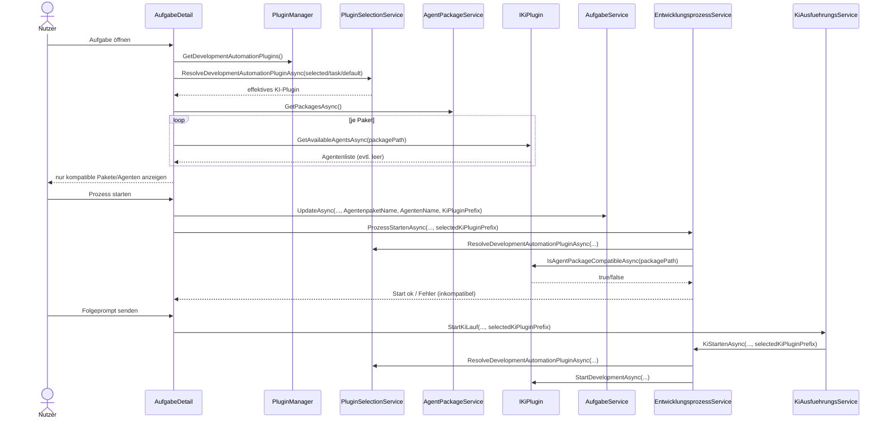
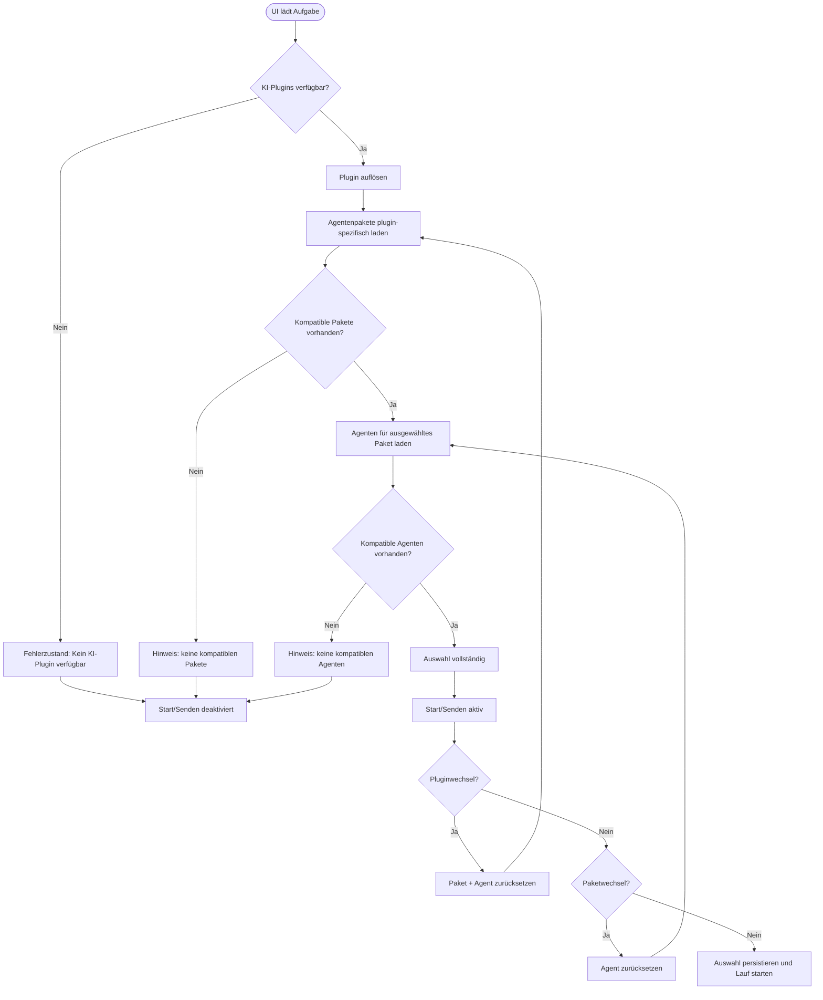

# Ablauf – KI-Plugin-spezifische Agenten-Discovery/Auswahl (Issue 58)

## Kontext

Dieser Ablauf dokumentiert die Umsetzung von **Issue 58**:

- Discovery ist plugin-spezifisch.
- UI-Reihenfolge ist verbindlich: **KI-Plugin → Agentenpaket → Agent**.
- Start- und Folgeprompt verwenden dieselbe Plugin-Auflösung.
- `KiPluginPrefix` wird pro Aufgabe persistiert.

## Sequenzdiagramm – Auswahl, Persistenz und Start

## Entscheidungslogik – Zustände und Reset-Regeln

## Technische Referenzen

- `src/Softwareschmiede/Components/Pages/Aufgaben/AufgabeDetail.razor.cs`
- `src/Softwareschmiede/Application/Services/PluginSelectionService.cs`
- `src/Softwareschmiede/Application/Services/EntwicklungsprozessService.cs`
- `src/Softwareschmiede/Application/Services/KiAusfuehrungsService.cs`
- `src/Softwareschmiede/Application/Services/AufgabeService.cs`
- `src/Softwareschmiede/Domain/Entities/Aufgabe.cs`
- `src/Softwareschmiede/Migrations/20260524151645_202605241703_AddKiPluginPrefix.cs`

## Testbezug

- `PluginSelectionServiceTests`
- `EntwicklungsprozessServiceTests`
- `AufgabeDetailFolgePromptTests`
- `AufgabeServiceTests`

## Verwandte Dokumentation

- [API-Contract](../api/ki-plugin-spezifische-agenten-discovery-auswahl.md)
- [F026 – Business-Sicht](../business/features/F026-ki-plugin-spezifische-agenten-discovery-auswahl.md)
