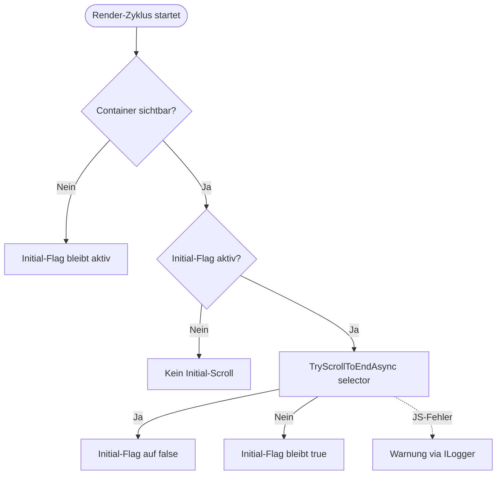
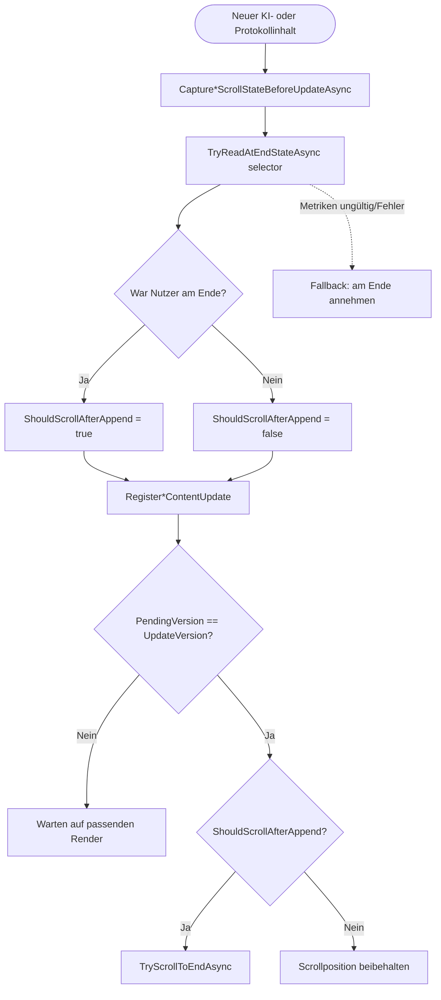
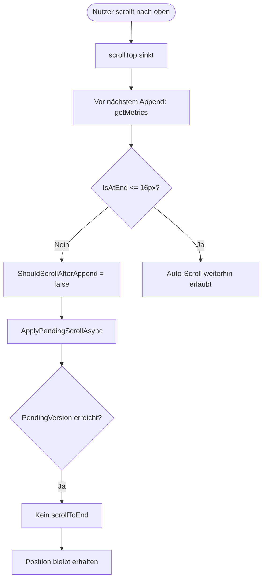

# KI-Protokoll Auto-Scroll – Initial-Scroll, Follow-Scroll und Scroll-Lock

**Modul/Feature:** `AufgabeDetail` (Blazor), `log-scroll.js`  
**Letzte Aktualisierung:** 2026-05-25

Dieser Ablauf dokumentiert die Scroll-Logik für die KI-Protokollausgabe in der Aufgaben-Detailseite. Der Fokus liegt auf drei Kernfällen: initiales Scrollen beim Einblenden, konditionales Follow-Scroll bei neuem Inhalt und Positionsbeibehaltung bei manuellem Hochscrollen. Die Logik gilt für den Streaming-Bereich (`#streamingOutput`) und den Protokoll-Verlauf (`#historyProtokoll`) mit derselben Guard-Strategie.

---

## 1) Flowchart: Einblenden des Protokolls → initiales Scrollen ans Ende

## 2) Flowchart: Neuer Inhalt → Follow-Scroll nur bei vorherigem Endzustand

## 3) Flowchart: Manuelles Hochscrollen → Scroll-Lock/Positionsbeibehaltung

---

## Schrittbeschreibung

1. **Render-Hook triggert Scroll-Entscheidung**  
   **Code:** `src/Softwareschmiede/Components/Pages/Aufgaben/AufgabeDetail.razor.cs` (`OnAfterRenderAsync`, `ApplyPendingScrollAsync`)  
   **Eingaben:** aktueller Renderzustand, Sichtbarkeit von `#streamingOutput` und `#historyProtokoll`  
   **Ausgaben/Seiteneffekte:** Initial-Scroll oder Follow-Scroll wird angestoßen; interne Pending-Flags werden fortgeschrieben.

2. **Container-Sichtbarkeit wird je Bereich ermittelt**  
   **Code:** `src/Softwareschmiede/Components/Pages/Aufgaben/AufgabeDetail.razor.cs` (`IsStreamingContainerVisible`, `IsHistoryContainerVisible`)  
   **Eingaben:** `_aufgabe.Status`, `_streamingLines.Count`, `_protokoll.Count`  
   **Ausgaben/Seiteneffekte:** steuert, ob Scroll-Logik aktiv ist; bei unsichtbaren Bereichen werden Initial/Pending-Flags zurückgesetzt.

3. **Vor Update wird der Endzustand gelesen (Follow-Scroll-Guard)**  
   **Code:** `src/Softwareschmiede/Components/Pages/Aufgaben/AufgabeDetail.razor.cs` (`CaptureStreamingScrollStateBeforeUpdateAsync`, `CaptureHistoryScrollStateBeforeUpdateAsync`, `TryReadAtEndStateAsync`)  
   **Eingaben:** CSS-Selector (`#streamingOutput` / `#historyProtokoll`), DOM-Metriken aus JS  
   **Ausgaben/Seiteneffekte:** setzt `*_ShouldScrollAfterAppend` und `*_PendingScrollVersion` für den nächsten Render.

4. **JS-Interop liefert Scroll-Metriken aus dem DOM**  
   **Code:** `src/Softwareschmiede/wwwroot/js/log-scroll.js` (`getMetrics`)  
   **Eingaben:** `selector`  
   **Ausgaben/Seiteneffekte:** `[scrollTop, scrollHeight, clientHeight, existsFlag]`; bei fehlendem Element `[0,0,0,0]`.

5. **Endzustand wird mit Schwellwert bewertet**  
   **Code:** `src/Softwareschmiede/Components/Pages/Aufgaben/AufgabeDetail.razor.cs` (`IsAtEnd`, `ScrollEndThresholdPx = 16`)  
   **Eingaben:** `scrollTop`, `scrollHeight`, `clientHeight`, `thresholdPx`  
   **Ausgaben/Seiteneffekte:** boolescher Entscheid „am Ende“; entscheidet über Auto-Scroll vs. Scroll-Lock.

6. **Inhaltsupdates registrieren Versionsstände für konsistentes Follow-Scroll**  
   **Code:** `src/Softwareschmiede/Components/Pages/Aufgaben/AufgabeDetail.razor.cs` (`RegisterStreamingContentUpdate`, `RegisterHistoryContentUpdate`)  
   **Eingaben:** neue Streaming-Zeilen oder neu geladene Protokolleinträge  
   **Ausgaben/Seiteneffekte:** `*_UpdateVersion` erhöht; Initial-Scroll wird bei erstmaliger Sichtbarkeit wieder aktiviert.

7. **Scroll-Operation wird nur bei erfüllten Guards ausgeführt**  
   **Code:** `src/Softwareschmiede/Components/Pages/Aufgaben/AufgabeDetail.razor.cs` (`ApplyPendingScrollAsync`, `TryScrollToEndAsync`)  
   **Eingaben:** Pending-/Update-Versionen, `*_ShouldScrollAfterAppend`  
   **Ausgaben/Seiteneffekte:** ruft `softwareschmiedeLogScroll.scrollToEnd` auf oder lässt Position unverändert.

8. **Manuelles Hochscrollen erzeugt Scroll-Lock-Effekt**  
   **Code:** `src/Softwareschmiede/Components/Pages/Aufgaben/AufgabeDetail.razor.cs` (`TryReadAtEndStateAsync`, `ApplyPendingScrollAsync`)  
   **Eingaben:** vom Nutzer veränderter `scrollTop` vor neuem Append  
   **Ausgaben/Seiteneffekte:** `*_ShouldScrollAfterAppend = false`; neue Inhalte werden angehängt, ohne die aktuelle Leserposition zu überschreiben.

---

## Fehlerbehandlung

- **`IJSRuntime` nicht verfügbar**  
  `TryReadAtEndStateAsync` liefert defensiv `true`, `TryScrollToEndAsync` liefert `false`; die UI bleibt funktionsfähig ohne Hard-Fail.  
  **Code:** `src/Softwareschmiede/Components/Pages/Aufgaben/AufgabeDetail.razor.cs`

- **DOM-Element nicht gefunden / Metriken unvollständig**  
  `getMetrics` signalisiert `existsFlag = 0`; C#-Seite behandelt das als toleranten Fallback („am Ende“), damit kein Blockieren der Scroll-Logik entsteht.  
  **Code:** `src/Softwareschmiede/wwwroot/js/log-scroll.js`, `src/Softwareschmiede/Components/Pages/Aufgaben/AufgabeDetail.razor.cs`

- **Exception im JS-Interop-Aufruf**  
  Beide Interop-Pfade loggen Warnungen und setzen auf degradierendes Verhalten statt Exception-Propagation in die UI.  
  **Code:** `src/Softwareschmiede/Components/Pages/Aufgaben/AufgabeDetail.razor.cs`

---

## Abhängigkeiten

- **UI-Komponente:** `AufgabeDetail.razor`, `AufgabeDetail.razor.cs`
- **JavaScript-Interop:** `src/Softwareschmiede/wwwroot/js/log-scroll.js`
- **Script-Einbindung:** `src/Softwareschmiede/Components/App.razor`
- **Services (Datenquelle für neue Inhalte):** `ProtokollService`, `KiAusfuehrungsService`
- **Testabdeckung:** `src/Softwareschmiede.Tests/Components/Pages/Aufgaben/AufgabeDetailFolgePromptTests.cs`

---

**Verwandte Flows:**  
- [KI-Arbeitsprotokoll: Persistierung und Rendering](./ki-arbeitsprotokoll-rendering-flow.md)  
- [Entwicklungsprozess-Abläufe](./development-process-flow.md)
