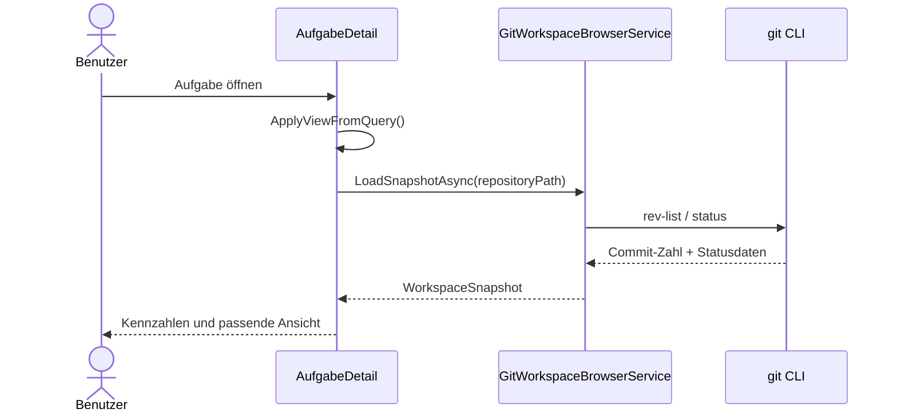
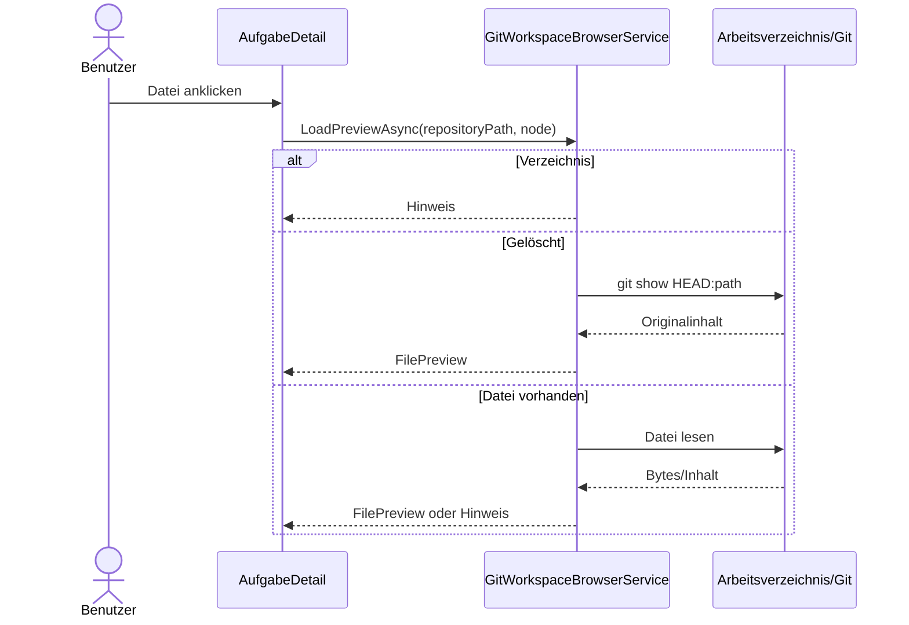

# Ablauf – Live Project Browser mit Git-Status

**Modul:** `AufgabeDetail`, `GitWorkspaceBrowserService`, `WorkspaceSnapshot`, `WorkspaceFileNode`, `FilePreview`  
**Letzte Aktualisierung:** 2026-05-18

---

## Kontext

Die Aufgabenseite lädt den Repository-Zustand direkt aus dem lokalen Klon.
Die Ansicht wird über den Query-Parameter `view` gesteuert:

- `?view=task` → Aufgabenansicht
- `?view=tree` → Projektverzeichnis

---

## Ablauf 1: Aufgabenseite öffnen



---

## Ablauf 2: Projektverzeichnis öffnen

```mermaid
flowchart TD
    A[Klick auf Projektverzeichnis] --> B[NavigateTo(?view=tree)]
    B --> C[OnParametersSetAsync()]
    C --> D[LoadSnapshotAsync()]
    D --> E[Tree-/Listenansicht rendern]
```

---

## Ablauf 3: Datei auswählen



---

## Ablauf 4: Refresh und Rückkehr

1. Benutzer klickt **↻ Aktualisieren**.
2. Die Seite lädt den Snapshot erneut.
3. Der zuletzt gewählte Pfad bleibt erhalten.
4. Mit **← Zur Aufgabe** wird die Aufgabenansicht wieder aktiv.

---

## Verwandte Dokumentation

- [F021 – Live Project Browser mit Git-Status](../business/features/F021-live-project-browser-git-status.md)
- [Requirements Analysis](../requirements/live-project-browser-git-status-requirements-analysis.md)
- [Architecture Blueprint](../architecture/live-project-browser-git-status-architecture-blueprint.md)
