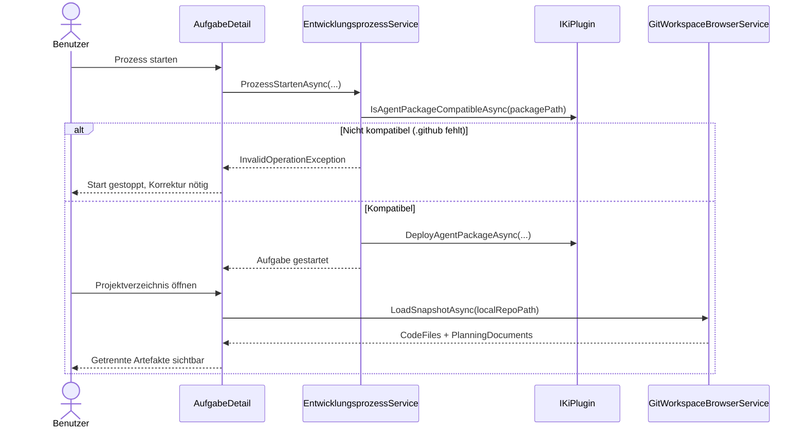

# Ablauf – Live Project Browser mit Planungsdokument-Erkennung & Compliance-Bezug

## Titel & Kontext

Dieser Ablauf beschreibt den End-to-End-Pfad vom Laden geänderter Workspace-Artefakte bis zur UI-Auswirkung in `AufgabeDetail`.
Im Fokus stehen die getrennte Erkennung von `CodeFiles` und `PlanningDocuments`, die Fallback-Erkennung bei Pfadvarianten (`/`, `./`) sowie der Workflow-Bezug zur Agentendefinitions-Compliance vor dem Prozessstart.
Damit bleibt der Explorer aussagekräftig, auch wenn ausschließlich Planungsdokumente geändert wurden.

## Diagramm A – Ablauf der Snapshot- und Fallback-Erkennung

```mermaid
flowchart TD
    A([Explorer laden]) --> B[GitWorkspaceBrowserService.LoadSnapshotAsync]
    B --> C{Repositorypfad gültig?}
    C -- Nein --> D[Error-Snapshot zurückgeben]
    C -- Ja --> E[git rev-parse und git status lesen]
    E --> F[FlatFiles und Tree aufbauen]
    F --> G{PlanningDocuments direkt erkannt?}
    G -- Ja --> H[PlanningDocuments setzen]
    G -- Nein --> I[Fallback mit Slash/Dot-Normalisierung]
    I --> J{Pfad unter docs/requirements|architecture|improvements?}
    J -- Ja --> K[PlanningDocuments über Fallback setzen]
    J -- Nein --> L[Nicht als Planung klassifizieren]
    H --> M[CodeFiles separat klassifizieren]
    K --> M
    L --> M
    M --> N[WorkspaceSnapshot an AufgabeDetail]
    N --> O([UI zeigt Änderungen in Baum/Liste + Vorschau])

    E -.-> P[git status Fehler]:::error
    P -.-> D

    classDef error fill:#ffcccc,stroke:#cc0000,color:#333;
```

## Diagramm B – Sequenz: Compliance-Bezug und Workflow-Auswirkung



## Schrittbeschreibung

1. **Explorer-Modus aktivieren und Snapshot laden**  
   - **Code:** `src/Softwareschmiede/Components/Pages/Aufgaben/AufgabeDetail.razor.cs` (`ApplyViewFromQuery`, `LadeWorkspaceAsync`)  
   - **Eingaben:** Query-Parameter `view`, `LokalerKlonPfad` der Aufgabe  
   - **Ausgaben/Seiteneffekte:** UI wechselt nach `tree`; bei gültigem Pfad wird `LoadSnapshotAsync` aufgerufen.

2. **Git-Status und Branch-Commit-Liste einlesen und in Domänenmodell überführen**  
   - **Code:** `src/Softwareschmiede/Application/Services/GitWorkspaceBrowserService.cs` (`LoadSnapshotAsync`, `ReadStatusEntriesAsync`, `BuildSnapshot`)  
   - **Eingaben:** `repositoryPath`, `git status --porcelain`  
   - **Ausgaben/Seiteneffekte:** `WorkspaceSnapshot` mit `RootNodes`, `FlatFiles`, `ChangedFileCount`, `CommitCount`, `BranchCommits`.

3. **Primäre Planungsdokument-Erkennung ausführen**  
   - **Code:** `GitWorkspaceBrowserService.IsPlanningDocumentPath`, `IsPlanningDocumentNode`  
   - **Eingaben:** `RelativePath` und optional `SourceRelativePath` je Status-Eintrag  
   - **Ausgaben/Seiteneffekte:** `.md`-Dateien unter `docs/requirements`, `docs/architecture`, `docs/improvements` werden als `PlanningDocuments` klassifiziert.

4. **Fallback-Erkennung anwenden, wenn primär keine Treffer vorliegen**  
   - **Code:** `GitWorkspaceBrowserService.IsPlanningDocumentPathFallback`  
   - **Eingaben:** Nicht-normalisierte Pfade mit führenden `./` oder `/`  
   - **Ausgaben/Seiteneffekte:** Robustere Erkennung von Planungsdokumenten; verhindert, dass relevante Änderungen aus dem Explorer-Kontext fallen.

5. **Code-Artefakte getrennt ermitteln und UI rendern**  
   - **Code:** `GitWorkspaceBrowserService.IsCodeFileNode`; `AufgabeDetail.razor` (Explorer-Rendering, Baum/Liste, `DiffPreviewPanel`)  
   - **Eingaben:** `FlatFiles` aus dem Snapshot  
   - **Ausgaben/Seiteneffekte:** `CodeFiles` und `PlanningDocuments` bleiben logisch getrennt; Nutzer sieht konsistenten Änderungsumfang inkl. Planungsartefakten.

6. **Compliance vor Prozessstart erzwingen (Workflow-Bezug)**  
   - **Code:** `src/Softwareschmiede/Application/Services/EntwicklungsprozessService.cs` (`ProzessStartenAsync`),  
     `plugins/Softwareschmiede.Plugin.GitHubCopilot/GitHubCopilotPlugin.cs` (`IsAgentPackageCompatibleAsync`, `DeployAgentPackageAsync`),  
     `plugins/Softwareschmiede.Plugin.ClaudeCli/ClaudeCliPlugin.cs` (`IsAgentPackageCompatibleAsync`, `DeployAgentPackageAsync`)  
   - **Eingaben:** `AgentenpaketName`/Paketpfad, aktives KI-Plugin  
   - **Ausgaben/Seiteneffekte:** Bei fehlendem `.github` wird der Start mit `InvalidOperationException` gestoppt; bei Erfolg erfolgt Deployment und der Explorer zeigt danach den resultierenden Änderungsstand.

## Fehlerbehandlung

- **Kein lokaler Klonpfad vorhanden**  
  - Pfad: `AufgabeDetail.LadeWorkspaceAsync`  
  - Behandlung: `WorkspaceSnapshot.FromError("Kein lokaler Klonpfad vorhanden.")`; UI zeigt Warnung.

- **Repositorypfad existiert nicht oder ist kein Git-Repository**  
  - Pfad: `GitWorkspaceBrowserService.LoadSnapshotAsync`  
  - Behandlung: Error-Snapshot mit sprechender Meldung statt ungefangener Ausnahme.

- **`git status` schlägt fehl**  
  - Pfad: `ReadStatusEntriesAsync`  
  - Behandlung: `InvalidOperationException`; in `AufgabeDetail` gefangen und als Error-Snapshot angezeigt.

- **Pfad außerhalb Repository-Root bei Vorschau**  
  - Pfad: `GitWorkspaceBrowserService.CombinePath`  
  - Behandlung: `InvalidOperationException` (Traversal-Schutz), UI zeigt Fehlerhinweis in der Dateivorschau.

- **Agentenpaket nicht kompatibel (`.github` fehlt)**  
  - Pfad: `EntwicklungsprozessService.ProzessStartenAsync` + `IKiPlugin.IsAgentPackageCompatibleAsync`  
  - Behandlung: Prozessstart wird vor Klonen abgebrochen; verhindert inkonsistente Agent-Deployments.

## Abhängigkeiten

- `src/Softwareschmiede/Components/Pages/Aufgaben/AufgabeDetail.razor`
- `src/Softwareschmiede/Components/Pages/Aufgaben/AufgabeDetail.razor.cs`
- `src/Softwareschmiede/Application/Services/GitWorkspaceBrowserService.cs`
- `src/Softwareschmiede/Domain/ValueObjects/WorkspaceSnapshot.cs`
- `src/Softwareschmiede/Application/Services/EntwicklungsprozessService.cs`
- `plugins/Softwareschmiede.Plugin.GitHubCopilot/GitHubCopilotPlugin.cs`
- `plugins/Softwareschmiede.Plugin.ClaudeCli/ClaudeCliPlugin.cs`
- Externes System: `git` CLI

> Verwandte Flows: [Entwicklungsprozess-Abläufe](./development-process-flow.md) · [Standardplugin-Auflösung & KI-Dispatch](./plugin-default-selection-flow.md) · [Branch-Commit-Anzeige im Dateibaum](./branch-commit-tree-expansion-flow.md) · [Commit-Diff-Preview im Dateibaum](./commit-diff-preview-flow.md)  
> Verwandte Fachdoku: [F021 – Live Project Browser mit Git-Status](../business/features/F021-live-project-browser-git-status.md)
