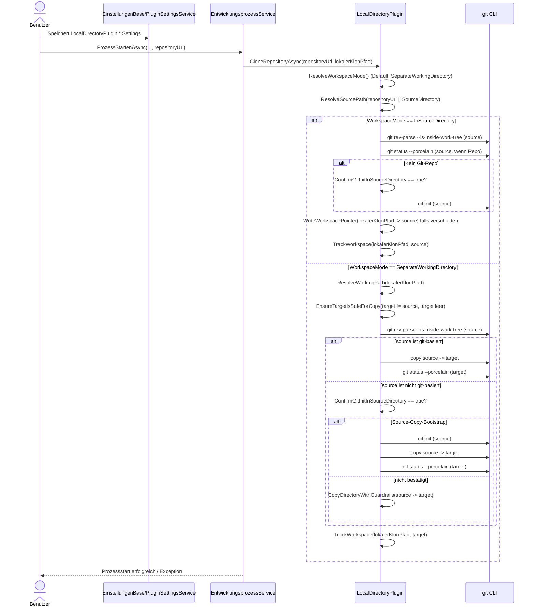
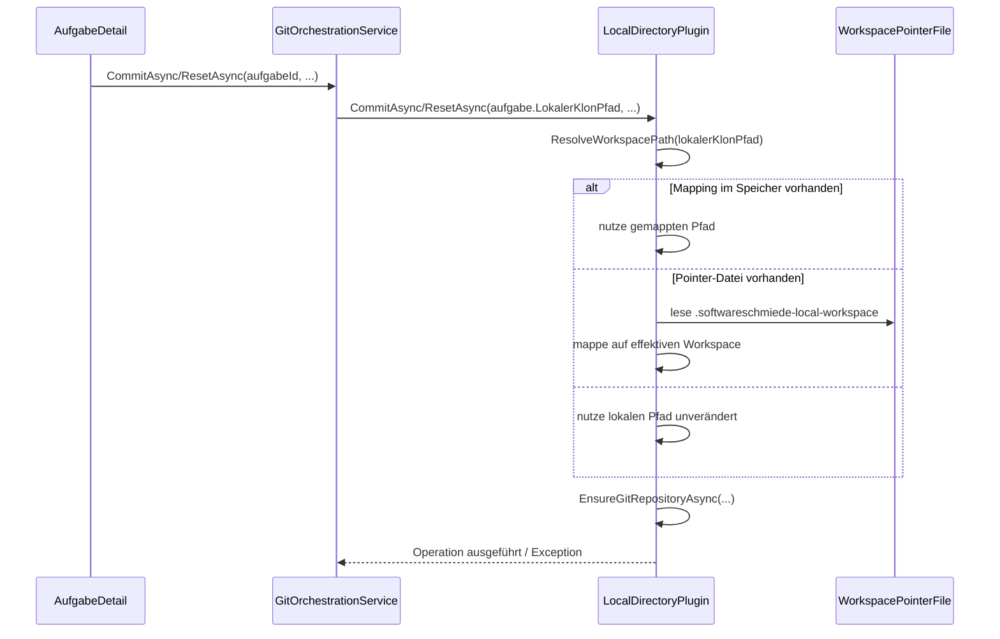
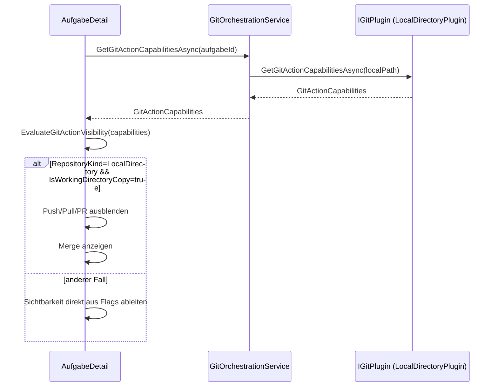

# Ablauf – LocalDirectoryPlugin (WorkspaceMode, Kopierpfad, Guardrails)

**Modul:** `LocalDirectoryPlugin`, `ArbeitsverzeichnisResolver`, `ArbeitsverzeichnisSettingsService`, `EntwicklungsprozessService`, `GitOrchestrationService`  
**Letzte Aktualisierung:** 2026-05-13

---

## Kontext

`LocalDirectoryPlugin` implementiert `IGitPlugin` für lokale Verzeichnisse ohne Remote-Provider.

- `WorkspaceMode.InSourceDirectory`: arbeitet direkt im Quellverzeichnis.
- `WorkspaceMode.SeparateWorkingDirectory`: erstellt eine separate Arbeitskopie.

Der Integrationspfad ist:
1. `EntwicklungsprozessService` erzeugt den angefragten `lokalerKlonPfad` aus Resolver-Ergebnis.
2. `IGitPlugin.CloneRepositoryAsync(...)` wird aufgerufen.
3. `LocalDirectoryPlugin` löst intern den effektiven Workspace auf.
4. Folgeaktionen (`CreateBranch`, `Commit`, `Reset`) nutzen Mapping/Pointer-Datei auf den effektiven Workspace.

---

## Ablauf 1: WorkspaceMode-Verhalten (InSourceDirectory vs SeparateWorkingDirectory)



---

## Ablauf 2: Kopierpfad in SeparateWorkingDirectory inkl. Guardrails

```mermaid
flowchart TD
    A([CloneRepositoryAsync im SeparateWorkingDirectory]) --> B[Resolve source + destination]
    B --> C{destination == source?}
    C -- Ja --> C1[InvalidOperationException\n"anderes Zielverzeichnis erforderlich"]:::error
    C -- Nein --> D{destination existiert und nicht leer?}
    D -- Ja --> D1[InvalidOperationException\n"Zielverzeichnis ist nicht leer"]:::error
    D -- Nein --> E[git rev-parse source]
    E --> F{source ist git?}
    F -- Ja --> G[git clone source destination]
    G --> H[git status --porcelain leer?]
    H -- Nein --> H1[InvalidOperationException\nuncommitted changes]:::error
    H -- Ja --> N([Workspace bereit])

    F -- Nein --> I{ConfirmGitInitInSourceDirectory == true?}
    I -- Ja --> J[Source-Copy-Bootstrap:\ngit init target]
    J --> K[git clone source destination]
    K --> L[git status --porcelain leer?]
    L -- Nein --> L1[InvalidOperationException\nuncommitted changes]:::error
    L -- Ja --> N
    I -- Nein --> M[Directory.CreateDirectory(destination)]
    M --> O[Traverse Verzeichnisbaum]
    O --> P{Reparse Point/Symlink?}
    P -- Ja --> P1[InvalidOperationException\n"Symlink/Reparse-Point ist nicht erlaubt"]:::error
    P -- Nein --> Q[Datei zählen + Bytes summieren]
    Q --> R{CopyMaxFiles überschritten?}
    R -- Ja --> R1[InvalidOperationException\nCopy-Guardrail Dateien]:::error
    R -- Nein --> S{CopyMaxMegabytes überschritten?}
    S -- Ja --> S1[InvalidOperationException\nCopy-Guardrail MB]:::error
    S -- Nein --> T[File copy (overwrite:false)]
    T --> O

    C1 --> X[Bei Fehler nach Zielerstellung:\nDirectory.Delete(destination, recursive:true)]
    D1 --> X
    H1 --> X
    L1 --> X
    P1 --> X
    R1 --> X
    S1 --> X

    classDef error fill:#ffcccc,stroke:#cc0000,color:#333
```

---

## Fehler- und Guardrail-Matrix

| Fall | Quelle | Verhalten |
|---|---|---|
| `WorkspaceMode` ungültig im Credential Store | `ResolveWorkspaceMode` | Warn-Log, Fallback auf `SeparateWorkingDirectory` |
| Kein Quellverzeichnis übergeben/konfiguriert | `ResolveSourcePath` | `InvalidOperationException` |
| Quellverzeichnis existiert nicht | `EnsureDirectoryExists` | `DirectoryNotFoundException` |
| `InSourceDirectory` ohne `ConfirmGitInitInSourceDirectory=true` und ohne `.git` | `EnsureInitializedInSourceDirectoryAsync` | `InvalidOperationException` |
| `SeparateWorkingDirectory`: Quelle ist Git-Repository | `CloneToWorkingDirectoryAsync` | `git clone` wird ausgeführt |
| `SeparateWorkingDirectory`: Source-Copy-Bootstrap | `CopyDirectoryWithGuardrailsAsync` + `EnsureInitializedInWorkingDirectoryAsync` + `CreateInitialWorkspaceCommitAsync` | Source bleibt unverändert, Working Directory erhält eigenes Git-Repository |
| Dirty Workspace (`git status --porcelain` nicht leer) | `ValidateWorkspaceIsCleanAsync` | `InvalidOperationException` |
| Copy-Guardrails verletzt (`CopyMaxFiles`, `CopyMaxMegabytes`, Timeout/Cancellation) | `CopyDirectoryWithGuardrailsAsync` | Abbruch + Aufräumen des Zielverzeichnisses |
| `Push` im `SeparateWorkingDirectory` | `PushBranchAsync` | Dateisynchronisation `WorkingDirectory -> SourceDirectory` (Copy/Overwrite + Delete-Sync via `git status --porcelain`), **kein `git push`** |
| `Pull` im `SeparateWorkingDirectory` | `PullAsync` | No-Merge-Sync `SourceDirectory -> WorkingDirectory` mit explizitem Hinweislog („kein Merge“) |
| Nicht unterstützte Remote-Provider-Operationen (`CreatePullRequest`, `GetIssues`, `GetRemoteBranches`, …) | `BuildNotSupported` | `NotSupportedException` |

---

## Integrationspfad nach Clone (Folgeoperationen)



---

## Ablauf 4: Capability-Flags und Aktionssichtbarkeit in `AufgabeDetail`



Für den Modus `SeparateWorkingDirectory` liefert `LocalDirectoryPlugin` die Kombination:

- `RepositoryKind = LocalDirectory`
- `IsWorkingDirectoryCopy = true`
- `CanPush = false`, `CanPull = false`, `CanCreatePullRequest = false`
- `CanMergeToSource = true`

Damit wird der gewünschte Workflow in der Aufgabenansicht erzwungen:
**Push/Pull/PR ausblenden, Merge einblenden**.

---

## Verwandte Dokumentation

- [workdir-resolution-flow.md](./workdir-resolution-flow.md)
- [development-process-flow.md](./development-process-flow.md)
- [plugin-settings-service-flow.md](./plugin-settings-service-flow.md)

---

## Bekannte Einschränkungen / nächste Schritte

- Kein Remote-`git push`/`git pull`: Im `SeparateWorkingDirectory` wird ausschließlich Datei-Sync verwendet.
- Pull führt keinen Merge aus; bei `uncommitted changes` wird vor dem Sync abgebrochen.
- Offener Restpunkt: UI-seitiger Pull-Bestätigungsdialog in `AufgabeDetail` ist noch nicht automatisiert getestet.
