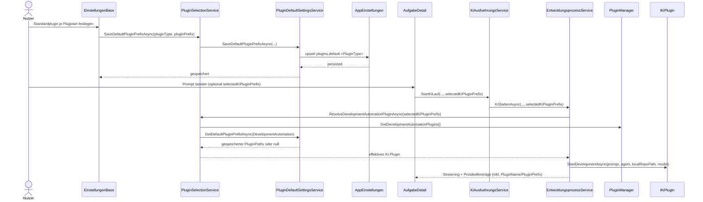
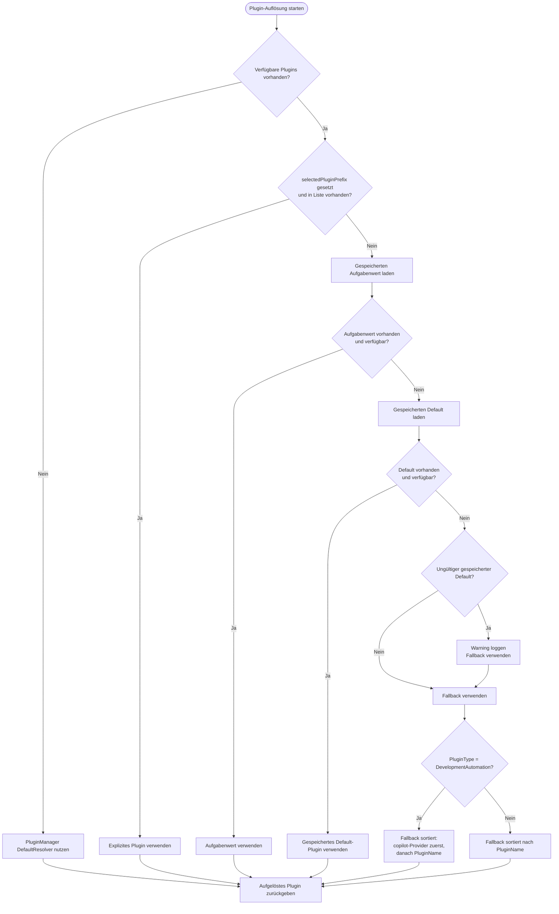

# Ablauf – Standardplugin-Auflösung und KI-Plugin-Dispatch

## Titel & Kontext

Dieser Ablauf beschreibt die konsistente Auflösung des effektiven Plugins beim Prompt-Dispatch in der Reihenfolge
**Explizite Auswahl → gespeicherter Aufgabenwert (`KiPluginPrefix`) → gespeicherter Default → Fallback**.
Damit ist die technische Umsetzung deckungsgleich zu den Fachregeln in **F014** und zur API-Dokumentation.

> Verwandte Artefakte:  
> [F014 – Standardplugin je Pluginart & KI-Plugin-Auswahl](../business/features/F014-standardplugin-ki-plugin-auswahl.md) ·
> [API: plugin-default-selection.md](../api/plugin-default-selection.md)

---

## Diagramm A – Sequenz: Einstellungen speichern und Prompt ausführen

---

## Diagramm B – Entscheidungslogik: explizit → Default → Fallback

---

## Schrittbeschreibung

1. **Default persistieren**  
   - **Code:** `Einstellungen.razor.cs`, `PluginSelectionService.SaveDefaultPluginPrefixAsync`, `PluginDefaultSettingsService.SaveDefaultPluginPrefixAsync`  
   - **Regel:** Speicherung per Schlüssel `plugins.default.<PluginType>` mit `PluginPrefix` (technische ID), nicht Anzeigename.

2. **Explizite Auswahl vom UI-Flow übernehmen**  
   - **Code:** `AufgabeDetail.razor.cs` → `KiAusfuehrungsService.StartKiLauf` → `EntwicklungsprozessService.KiStartenAsync`  
   - **Regel:** `selectedKiPluginPrefix` ist optional; bei leerem Wert startet die Kette direkt beim gespeicherten Default.

3. **Effektives Plugin auflösen**  
   - **Code:** `PluginSelectionService.ResolveDevelopmentAutomationPluginAsync` / `ResolveSourceCodeManagementPluginAsync`  
   - **Reihenfolge:** Explizit (wenn gültig) → gespeicherter Default (wenn gültig) → Fallback.

4. **Fallback robust anwenden**  
   - **KI-Plugins (`DevelopmentAutomation`):** Copilot-Provider wird im Fallback bevorzugt, anschließend alphabetisch nach Pluginname.  
   - **SCM-Plugins:** Alphabetischer Fallback nach Pluginname.  
   - **Edge Case:** Ist die verfügbare Liste leer, wird der Default-Resolver des `PluginManager` genutzt.

5. **Prompt mit aufgelöstem Plugin ausführen**  
   - **Code:** `EntwicklungsprozessService.KiStartenAsync`  
   - **Seiteneffekt:** Protokolleintrag enthält verwendetes Plugin (Name + Prefix) zur Nachvollziehbarkeit.

---

## Fehlerbehandlung

- **Gespeicherter Default nicht mehr verfügbar**  
  - **Behandlung:** Kein Abbruch; Warning-Log und sauberer Fallback.

- **Explizite Auswahl ungültig oder veraltet**  
  - **Behandlung:** Kein Abbruch; Auflösung setzt mit gespeichertem Default/Fallback fort.

- **Keine verfügbaren Plugins in der Liste**  
  - **Behandlung:** Rückgriff auf `PluginManager`-DefaultResolver.

---

## Abhängigkeiten

- `src/Softwareschmiede/Components/Pages/Einstellungen.razor.cs`
- `src/Softwareschmiede/Components/Pages/Aufgaben/AufgabeDetail.razor.cs`
- `src/Softwareschmiede/Application/Services/PluginSelectionService.cs`
- `src/Softwareschmiede/Application/Services/PluginDefaultSettingsService.cs`
- `src/Softwareschmiede/Application/Services/KiAusfuehrungsService.cs`
- `src/Softwareschmiede/Application/Services/EntwicklungsprozessService.cs`
