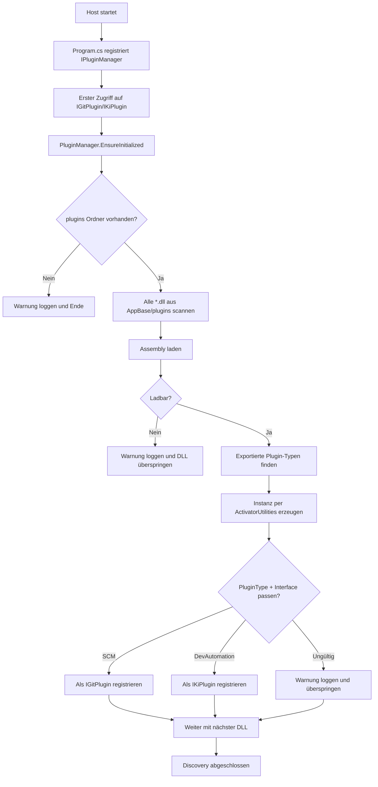

# Ablauf – Plugin-Discovery und Laden

## Kontext

Beim Start registriert der Host den `PluginManager`.  
Die eigentliche Discovery läuft lazy beim ersten Zugriff auf `IGitPlugin` oder `IKiPlugin`.

## Flow

## Fehlerverhalten

- Defekte oder nicht ladbare DLLs blockieren den Start nicht.
- Ungültige Plugin-Typ/Interface-Kombinationen werden übersprungen.
- Fehlt ein Default-Plugin, wirft `GetDefault...` eine `InvalidOperationException`.

## Relevante Dateien

- `src/Softwareschmiede/Program.cs`
- `src/Softwareschmiede/Infrastructure/Plugins/PluginManager.cs`
- `src/Softwareschmiede/Domain/Interfaces/IPluginManager.cs`
- `src/Softwareschmiede/Softwareschmiede.csproj`
