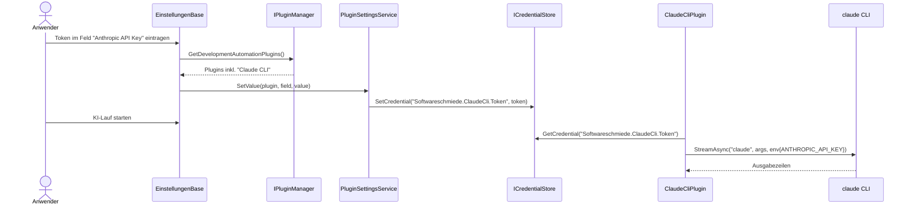
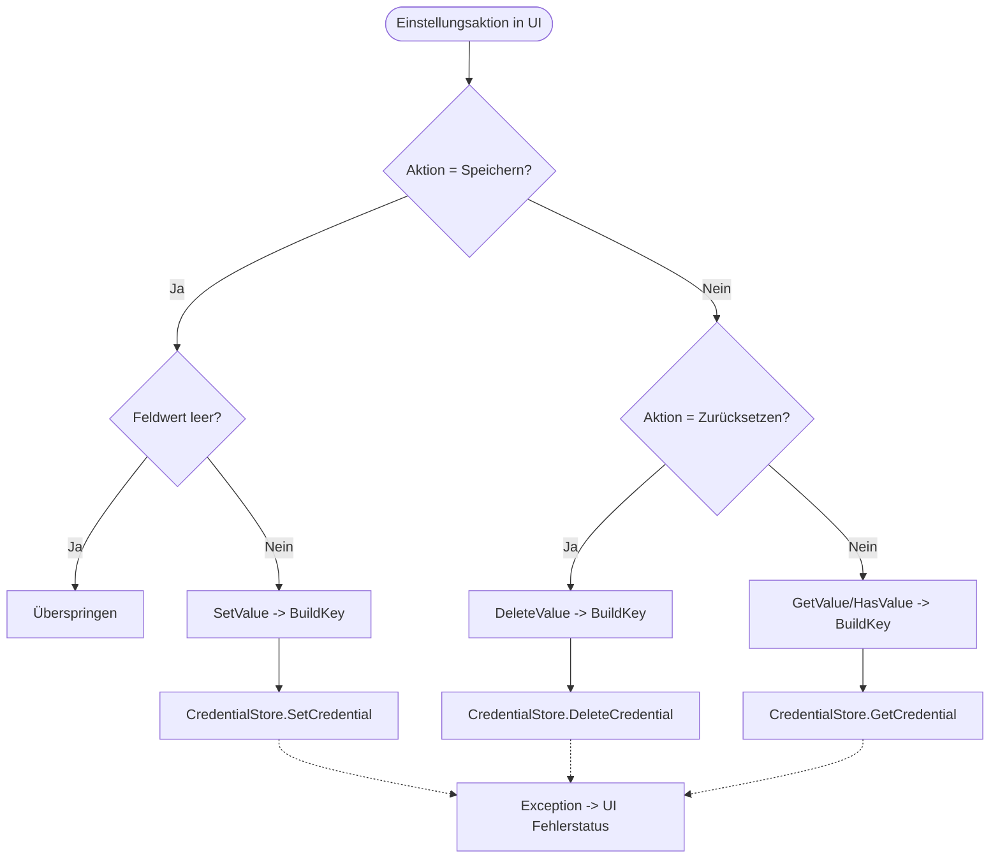

# Ablauf – PluginSettingsService

## Titel & Kontext

Dieser Ablauf beschreibt das Lesen, Speichern und Zurücksetzen von Plugin-Konfigurationen über den `PluginSettingsService`.  
Die Einstellungsseite aggregiert SCM- und KI-Plugins aus dem `PluginManager` und persistiert Werte im `ICredentialStore` unter `<PluginPrefix>.<FieldKey>`.  
Für die Claude-CLI-Integration ist insbesondere der Schlüssel `Softwareschmiede.ClaudeCli.Token` relevant, der im `ClaudeCliPlugin` als `ANTHROPIC_API_KEY` genutzt wird.

> Verwandte Artefakte:  
> [Requirements Plugin-Prinzip](../requirements/plugin-klassenbibliotheken-github-und-copilot.md) ·
> [Architektur Plugin-Blueprint](../architecture/plugin-klassenbibliotheken-github-und-copilot-architecture-blueprint.md) ·
> [Claude-CLI Testplan](../tests/testplan-claude-cli-integration.md)

---

## Diagramm A – Sequenz: Einstellungen speichern und Laufzeitnutzung in Claude CLI

---

## Diagramm B – Programmablauf: Read/Write/Delete mit Guard-Checks

---

## Schrittbeschreibung

1. **Pluginliste für Einstellungen zusammenstellen**  
   - **Code:** `src/Softwareschmiede/Components/Pages/Einstellungen.razor.cs` (`OnInitializedAsync`)  
   - **Eingaben:** `PluginManager.GetSourceCodeManagementPlugins()`, `PluginManager.GetDevelopmentAutomationPlugins()`  
   - **Ausgabe/Seiteneffekt:** `PluginSettings.GetAllPlugins(...)` erstellt eine gemeinsame Liste für die UI.

2. **Feldschlüssel deterministisch auflösen**  
   - **Code:** `src/Softwareschmiede/Application/Services/PluginSettingsService.cs` (`BuildKey`)  
   - **Eingaben:** `plugin.PluginPrefix`, `field.Key`  
   - **Ausgabe/Seiteneffekt:** Schlüssel im Format `<PluginPrefix>.<FieldKey>`, z. B. `Softwareschmiede.ClaudeCli.Token`.

3. **Werte lesen und Feldzustand initialisieren**  
   - **Code:** `Einstellungen.razor.cs` (`OnInitializedAsync`), `PluginSettingsService.GetValue`, `HasValue`  
   - **Eingaben:** Alle Felder aus `plugin.GetSettingGroups()`  
   - **Ausgabe/Seiteneffekt:** `_hasValues`, `_inputValues`, `_visibleSecrets` werden für Rendering gesetzt.

4. **Pluginwerte speichern**  
   - **Code:** `Einstellungen.razor.cs` (`SpeichernAsync`), `PluginSettingsService.SetValue`  
   - **Eingaben:** Nicht-leere UI-Eingaben pro Feld  
   - **Ausgabe/Seiteneffekt:** Persistenz in `ICredentialStore`; UI leert Eingaben, setzt Statusmeldung „Einstellungen gespeichert.“.

5. **Pluginwerte zurücksetzen**  
   - **Code:** `Einstellungen.razor.cs` (`ZuruecksetzenAsync`), `PluginSettingsService.DeleteValue`  
   - **Eingaben:** Plugin und alle Felder  
   - **Ausgabe/Seiteneffekt:** Credential-Einträge werden gelöscht; UI markiert Felder als „nicht gesetzt“.

6. **Laufzeitnutzung in Claude-CLI-Integration**  
   - **Code:** `plugins/Softwareschmiede.Plugin.ClaudeCli/ClaudeCliPlugin.cs` (`GetSettingGroups`, `GetClaudeEnvironment`, `StartDevelopmentAsync`)  
   - **Eingaben:** Gespeicherter Token aus `Softwareschmiede.ClaudeCli.Token`  
   - **Ausgabe/Seiteneffekt:** Übergabe als `ANTHROPIC_API_KEY` in die CLI-Umgebung beim `claude`-Aufruf.

---

## Fehlerbehandlung

- **Fehler beim Speichern/Löschen von Credentials**  
  - **Pfad:** `Einstellungen.razor.cs` (`SpeichernAsync`, `ZuruecksetzenAsync`)  
  - **Behandlung:** `catch (Exception)` setzt pluginbezogene Fehlermeldung (`_statusMessages`) und `_errorFlags`.

- **Leere Eingabewerte beim Speichern**  
  - **Pfad:** `SpeichernAsync` mit `string.IsNullOrWhiteSpace(value)`  
  - **Behandlung:** Feld wird übersprungen; vorhandener Credential-Wert bleibt unverändert.

- **Credential API Fehler in Windows-Store**  
  - **Pfad:** `WindowsCredentialStore.SetCredential` (`CredWrite` fehlgeschlagen)  
  - **Behandlung:** `InvalidOperationException` mit Win32-Fehlercode, in UI abgefangen und angezeigt.

- **Nicht vorhandene Credentials beim Lesen**  
  - **Pfad:** `WindowsCredentialStore.GetCredential` liefert `null`  
  - **Behandlung:** UI markiert Feld als „nicht gesetzt“ (`_hasValues[key] = false`).

---

## Abhängigkeiten

- **UI / Komponenten**
  - `src/Softwareschmiede/Components/Pages/Einstellungen.razor`
  - `src/Softwareschmiede/Components/Pages/Einstellungen.razor.cs`

- **Application Service**
  - `src/Softwareschmiede/Application/Services/PluginSettingsService.cs`

- **Plugin-/Contract-Schicht**
  - `src/Softwareschmiede/Domain/Interfaces/IPluginManager.cs`
  - `src/Softwareschmiede.Plugin.Contracts/Domain/Interfaces/IPlugin.cs`
  - `src/Softwareschmiede.Plugin.Contracts/Domain/Interfaces/ICredentialStore.cs`
  - `src/Softwareschmiede.Plugin.Contracts/Domain/ValueObjects/PluginSettingField.cs`

- **Infrastruktur / Plugins**
  - `src/Softwareschmiede/Infrastructure/Services/WindowsCredentialStore.cs`
  - `plugins/Softwareschmiede.Plugin.ClaudeCli/ClaudeCliPlugin.cs`
  - `plugins/Softwareschmiede.Plugin.GitHubCopilot/GitHubCopilotPlugin.cs`
