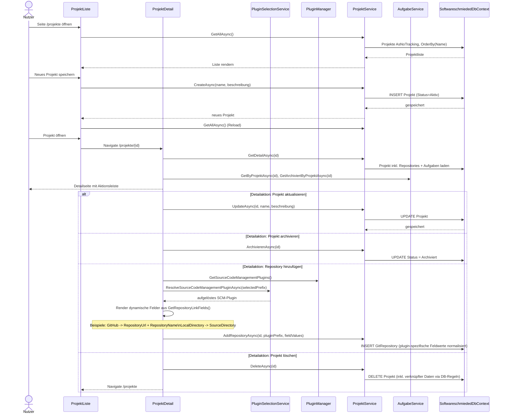
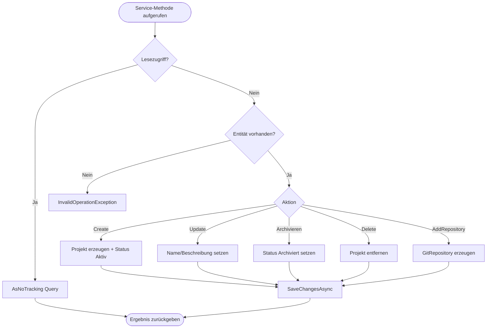

# Ablauf – ProjektService (Projektverwaltung & Repository-Zuordnung)

## Titel & Kontext

Dieser Ablauf beschreibt die Projektverwaltung über `ProjektService`:
Übersicht laden, Projekt anlegen, Detaildaten laden, sowie ein einzelnes Projekt auf der Detailseite bearbeiten, archivieren, löschen und mit Repositorys verknüpfen.

Die UI trennt dabei Übersichts- und Detailaktionen:  
- **Übersicht (`ProjektListe`)**: Neu anlegen  
- **Detail (`ProjektDetail`)**: Bearbeiten, Archivieren, Löschen, Repository hinzufügen

---

## Diagramm A – Sequenz: Übersicht und Detailaktionen

---

## Diagramm B – CRUD-/Guard-Logik im Service

---

## Schrittbeschreibung

1. **Projektübersicht laden**  
   - **Code:** `ProjektListe.razor.cs` (`OnInitializedAsync`) + `ProjektService.GetAllAsync`  
   - **Verhalten:** Sortierte Liste aktiver/archivierter Projekte via `AsNoTracking`.

2. **Projekt anlegen (Übersichtsseite)**  
   - **Code:** `ProjektListe.razor.cs` (`SpeichernAsync`) + `ProjektService.CreateAsync`  
   - **Verhalten:** Validierung auf UI-Seite (`Name` Pflicht), dann Persistierung mit `ProjektStatus.Aktiv`.

3. **Projektdetails laden**  
   - **Code:** `ProjektDetail.razor.cs` (`LadeAsync`) + `ProjektService.GetDetailAsync`  
   - **Verhalten:** Projekt inkl. `Repositories`/`Aufgaben`, plus aktive und archivierte Aufgabenlisten.

4. **Einzelaktionen auf Detailseite**  
   - **Code:** `ProjektDetail.razor.cs` (`UpdateAsync`, `ArchivierenAsync`, `DeleteAsync`, `AddRepositoryAsync`)  
   - **Verhalten:** Alle Einzelaktionen werden über `ProjektService` ausgeführt und danach neu geladen oder umgeleitet.

5. **Repository zuordnen (plugin-gesteuerte Felder)**  
   - **Code:** `ProjektDetail.razor(.cs)` + `PluginSelectionService.ResolveSourceCodeManagementPluginAsync` + `ProjektService.AddRepositoryAsync`  
   - **Verhalten:** Das Feldschema wird pro SCM-Plugin über `GetRepositoryLinkFields()` geladen.  
     Beim Öffnen der Maske wird das gespeicherte SCM-Standardplugin (falls gültig) automatisch vorausgewählt.  
     Für GitHub sind typischerweise `RepositoryUrl` und `RepositoryName` Pflichtfelder; für LocalDirectory `SourceDirectory`.

---

## Fehlerbehandlung

- **Projekt/Repository nicht gefunden**  
  - `UpdateAsync`, `ArchivierenAsync`, `DeleteAsync`, `RemoveRepositoryAsync`, `AddRepositoryAsync` werfen `InvalidOperationException`.

- **Ungültige Eingaben in UI**  
  - `ProjektListe` und `ProjektDetail` prüfen Pflichtfelder und setzen lokale Fehlermeldungen.

- **Persistenzfehler (DB/Constraints)**  
  - Exception propagiert zur UI; Seite zeigt Fehlermeldung.

---

## Abhängigkeiten

- `src/Softwareschmiede/Application/Services/ProjektService.cs`
- `src/Softwareschmiede/Components/Pages/Projekte/ProjektListe.razor.cs`
- `src/Softwareschmiede/Components/Pages/Projekte/ProjektDetail.razor.cs`
- `src/Softwareschmiede/Application/Services/AufgabeService.cs`
- `src/Softwareschmiede/Infrastructure/Data/SoftwareschmiededDbContext.cs`
