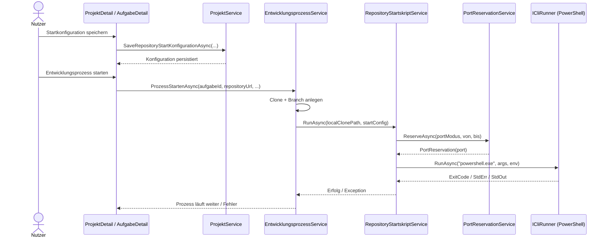
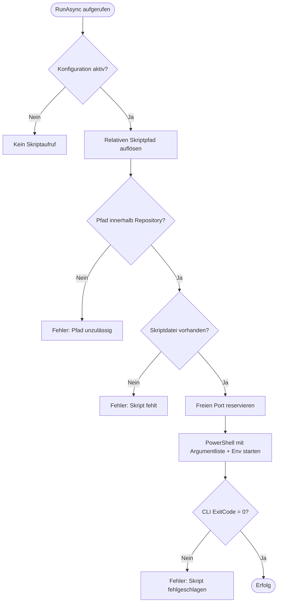

# Ablauf – Repository-Startskript mit freier Portzuweisung

## Kontext

Dieser Ablauf beschreibt den technischen Pfad des Features:

1. Startkonfiguration wird pro Repository gepflegt
2. Beim Prozessstart wird ein freier Port reserviert
3. Das Startskript wird im lokalen Aufgabenklon mit Portkontext ausgeführt

## Diagramm A – Sequenz: Prozessstart mit Startskript

## Diagramm B – Entscheidungslogik: Skriptausführung

## Schrittbeschreibung

1. **Startkonfiguration bearbeiten (Projektdetail)**
   - `ProjektDetail.razor` / `ProjektDetail.razor.cs`
   - Formularfelder: Skriptpfad, Argument-Template, Portmodus, Portbereich, Aktiv-Flag
   - Persistenz über `ProjektService.SaveRepositoryStartKonfigurationAsync`

2. **Validierung und Persistenz**
   - `ProjektService.ValidateStartConfiguration`
   - Regeln: relativer Pfad, Portmodus-/Bereichskonsistenz, Pflichtfelder
   - Speicherung in `RepositoryStartKonfigurationen` (EF Core, 1:1 zu `GitRepository`)

3. **Integration in Prozessstart**
   - `EntwicklungsprozessService.ProzessStartenAsync`
   - Reihenfolge: Clone -> Branch -> Startskript -> Agentenpaket-Deploy -> Aufgabe starten

4. **Portreservierung**
   - `PortReservationService.ReserveAsync`
   - Modi: `Auto`, `Fest`, Bereich
   - Hält Port über `PortReservation` (`TcpListener`) bis nach Skriptausführung

5. **Skriptausführung**
   - `RepositoryStartskriptService.RunAsync`
   - Sicherheitsgrenze: Skript muss im Repository liegen
   - Übergibt Port und Pfad via Argumente und Umgebungsvariablen

6. **Fehler- und Cleanup-Pfad**
   - Bei Skript-/CLI-Fehlern wird im Prozessstart der lokale Klon gelöscht
   - Exception wird propagiert, damit UI den Fehler klar anzeigen kann

## Verknüpfte Dokumentation

- API-Contract: [repository-startskript-freier-port.md](../api/repository-startskript-freier-port.md)
- Business: [F020 – Repository-Startskript mit freier Portzuweisung](../business/features/F020-repository-startskript-freier-port.md)
- Testplan: [testplan-repository-startskript-freier-port.md](../tests/testplan-repository-startskript-freier-port.md)
