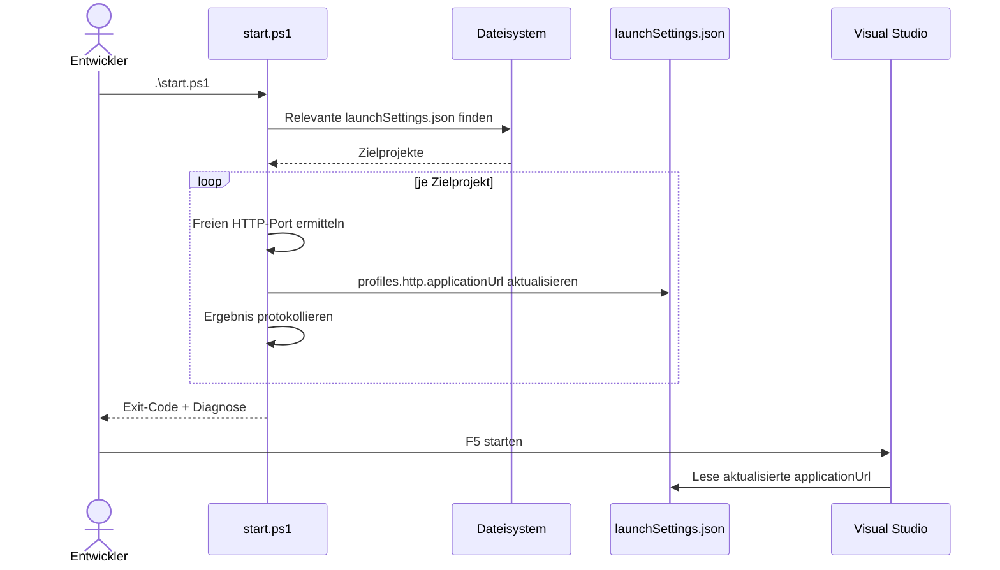
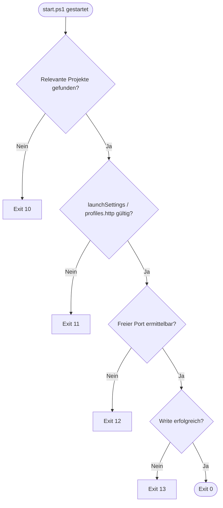

# Ablauf – `start.ps1` für Visual-Studio-Debug mit freiem HTTP-Port

## Kontext

Dieser Ablauf beschreibt den lokalen Skriptpfad, mit dem `start.ps1` Webprojekte autonom erkennt und deren `http`-Debugprofil für Visual Studio auf freie Ports setzt.

## Diagramm A – Sequenz: Aufruf bis Debug-Start

## Diagramm B – Entscheidungslogik inkl. Exit-Codes

## Schrittbeschreibung

1. **Eingang auswerten**
   - Keine fachlichen Parameter
   - Repository-Root aus Skriptpfad ableiten
2. **Portquelle festlegen**
   - Port wird je Zielprojekt intern ermittelt
3. **Port prüfen**
   - Bereich `1..65535`
   - Verfügbarkeit per Loopback-Listener
4. **Zieldatei aktualisieren**
   - alle relevanten `**/Properties/launchSettings.json`
   - Nur `profiles.http.applicationUrl` wird verändert
5. **Diagnose und Rückgabe**
   - Einheitliches Diagnoseformat mit Code
   - Exit-Code gemäß Fehlerklasse, aggregiert über mehrere Projekte

## Verknüpfte Dokumentation

- [API-Contract: start.ps1 für Visual-Studio-Debug](../api/start-ps1-visual-studio-freier-http-port.md)
- [API-Contract: Repository-Startskript mit freier Portzuweisung](../api/repository-startskript-freier-port.md)
- [Feature F020 – Repository-Startskript mit freier Portzuweisung](../business/features/F020-repository-startskript-freier-port.md)
