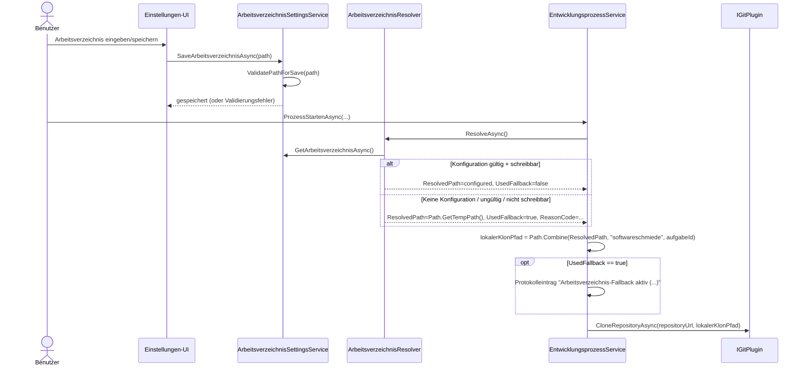

# Ablauf – Arbeitsverzeichnis-Auflösung für lokale Repository-Klone

**Modul:** `ArbeitsverzeichnisSettingsService`, `ArbeitsverzeichnisResolver`, `EntwicklungsprozessService`, `Einstellungen.razor`  
**Letzte Aktualisierung:** 2026-05-10

---

## Kontext

Der Benutzer kann in den Einstellungen ein Basis-Arbeitsverzeichnis für lokale Klone konfigurieren.  
Beim Start eines Entwicklungsprozesses wird dieses Basisverzeichnis zur Laufzeit validiert und aufgelöst. Ist der Wert ungültig oder nicht nutzbar, wird auf `Path.GetTempPath()` zurückgefallen.

Der finale Klonpfad wird immer unterhalb von:

`<basis>/softwareschmiede/<aufgabeId>`

gebildet.

---

## Sequenzdiagramm

---

## Schrittbeschreibung

| # | Schritt | Ergebnis |
|---|---|---|
| 1 | Benutzer pflegt Wert in Einstellungen | `repositories.workdir` wird in `AppEinstellungen` gespeichert oder auf `null` gesetzt |
| 2 | Service validiert Eingabe | Nur absolute, gültige und erzeugbare Pfade werden akzeptiert |
| 3 | Prozessstart ruft Resolver auf | Laufzeit-validierter Basispfad wird ermittelt |
| 4 | Fallback falls nötig | `Path.GetTempPath()` + ReasonCode |
| 5 | Finaler Klonpfad wird gebildet | `<ResolvedPath>/softwareschmiede/<aufgabeId>` |
| 6 | Repository wird geklont | `IGitPlugin.CloneRepositoryAsync(...)` |

---

## Fehlerbehandlung

| Fehlerfall | Verhalten |
|---|---|
| Ungültige Eingabe in Einstellungen | `ArgumentException`, Speichern wird verhindert, UI zeigt Validierungsfehler |
| Konfigurierter Pfad zur Laufzeit nicht nutzbar | Fallback auf Temp-Pfad, Warn-Logs + Protokolleintrag mit `ReasonCode` |
| `git clone` schlägt fehl | Exception wird propagiert, Aufgabe bleibt nicht gestartet |

---

## Verwandte Dokumentation

- [development-process-flow.md](./development-process-flow.md)
- [API: workdir-configuration.md](../api/workdir-configuration.md)
- [Business: F009 – Arbeitsverzeichnis konfigurieren](../business/features/F009-arbeitsverzeichnis-konfigurieren.md)
