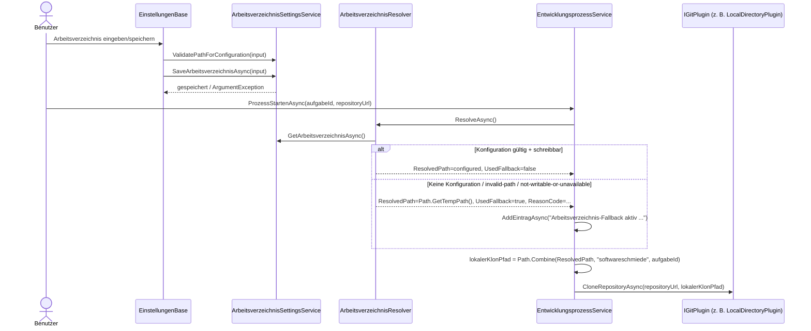

# Ablauf – Arbeitsverzeichnis-Auflösung und Integration mit LocalDirectoryPlugin

**Modul:** `ArbeitsverzeichnisSettingsService`, `ArbeitsverzeichnisResolver`, `EntwicklungsprozessService`, `Einstellungen.razor`  
**Letzte Aktualisierung:** 2026-05-12

---

## Kontext

Das globale Arbeitsverzeichnis (`repositories.workdir`) wird in den Einstellungen gespeichert und beim Prozessstart zur Laufzeit aufgelöst.  
Der Resolver liefert entweder den konfigurierten, schreibbaren Basis-Pfad oder einen Fallback auf `Path.GetTempPath()` mit `ReasonCode`.

Der Prozess bildet daraus immer den angefragten Klonpfad:

`<resolvedBase>/softwareschmiede/<aufgabeId>`

Dieser Pfad wird anschließend an das aktive `IGitPlugin` übergeben (u. a. `LocalDirectoryPlugin`).

---

## Sequenzdiagramm

---

## Schrittbeschreibung

| # | Schritt | Ergebnis |
|---|---|---|
| 1 | UI validiert Eingabe syntaktisch | `ValidatePathForConfiguration` prüft absoluten und gültigen Pfad (ohne Seiteneffekte) |
| 2 | Speichern der Einstellung | `SaveArbeitsverzeichnisAsync` normalisiert Pfad, erstellt Verzeichnis (wenn gesetzt) und persistiert `repositories.workdir` |
| 3 | Laufzeit-Auflösung beim Prozessstart | `ResolveAsync` prüft den gespeicherten Wert inkl. Schreibprobe |
| 4 | Fallback bei Laufzeitproblemen | `ResolvedPath = Path.GetTempPath()`, `UsedFallback = true`, `ReasonCode` gesetzt |
| 5 | Bildung des Klon-Zielpfads | `<ResolvedPath>/softwareschmiede/<aufgabeId>` |
| 6 | Übergabe an SCM-Plugin | `IGitPlugin.CloneRepositoryAsync(repositoryUrl, lokalerKlonPfad)` |

---

## Fehlerbehandlung

| Fehlerfall | Verhalten |
|---|---|
| Ungültige Eingabe beim Speichern | `ArgumentException`, UI zeigt Validierungsfehler, DB-Wert bleibt unverändert |
| Laufzeitwert nicht nutzbar (z. B. Datei statt Ordner, nicht schreibbar) | Resolver-Fallback auf Temp, Warn-Logs mit `ReasonCode`, Prozess läuft mit Fallback weiter |
| `IGitPlugin.CloneRepositoryAsync` schlägt fehl | Exception wird propagiert, Aufgabe bleibt nicht gestartet |

---

## Verwandte Dokumentation

- [local-directory-plugin-flow.md](./local-directory-plugin-flow.md)
- [development-process-flow.md](./development-process-flow.md)
- [API: workdir-configuration.md](../api/workdir-configuration.md)
- [Business: F009 – Arbeitsverzeichnis konfigurieren](../business/features/F009-arbeitsverzeichnis-konfigurieren.md)
