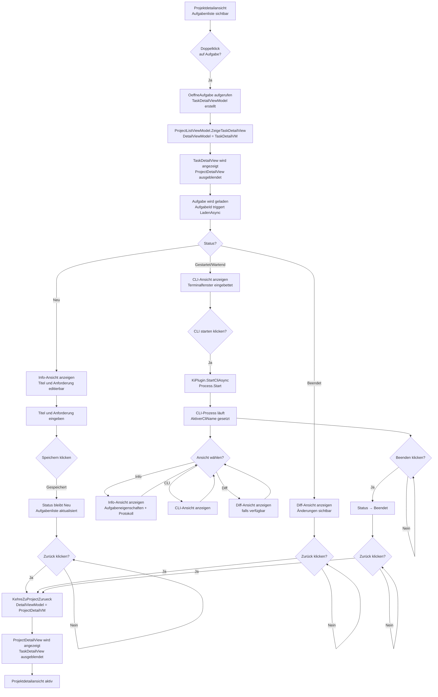

# Aufgaben & KI-Entwicklungsprozess — Technischer Ablauf

## Übersicht

Der Entwicklungsprozess wird durch `EntwicklungsprozessService.ProzessStartenAsync` eingeleitet. Das CLI des KI-Tools wird als nativer Prozess gestartet und via Win32 `SetParent` in die WPF-Aufgabendetailansicht eingebettet. `KiAusfuehrungsService` verwaltet den Prozess-Lifecycle als Singleton.

Die Seitenleisten-Anzeige aktiver Aufgaben wird durch `MainWindowViewModel.AktiveAufgabenAktualisierenAsync()` verwaltet, die `AufgabeService.GetAktiveAufgabenAsync()` aufruft und die `AktiveAufgabenListe` ObservableCollection befüllt. Das Dashboard zeigt dieselbe Liste über `DashboardViewModel.AktiveAufgabenListe` an.

## Ablauf

### Navigieren zu Aufgabendetail aus Projektdetail

Ausgelöst durch Doppelklick auf Aufgabe in der Aufgabenliste oder durch Klick auf „Neue Aufgabe".

Beteiligte Komponenten:
- `ProjectDetailView.xaml.cs` — Code-Behind mit `MouseDoubleClick` Event-Handler auf Aufgabenliste
- `ProjectDetailViewModel.AufgabeOeffnenCommand` — RelayCommand<Guid> mit `OeffneAufgabe(id)` Methode
- `ProjectDetailViewModel.NavigateToTaskViewCallback` — Action<TaskDetailViewModel>, gesetzt durch `ProjectListViewModel`
- `ProjectListViewModel.ZeigeTaskDetailView` — Private Methode, setzt `DetailViewModel = vm`
- `MainWindow.xaml` — DataTemplate für `TaskDetailViewModel` rendert `TaskDetailView`

Ablauf:
1. Nutzer doppelklickt auf Aufgabe in `ProjectDetailView.Aufgabenliste`
2. `AufgabeDoubleClick()` in Code-Behind wird ausgelöst
3. `ProjectDetailViewModel.AufgabeOeffnenCommand.Execute(aufgabeId)` wird aufgerufen
4. `OeffneAufgabe(id)` wird ausgeführt:
   - Neues `TaskDetailViewModel` wird aus DI-Container erstellt
   - `TaskDetailViewModel.ZurueckAction = () => NavigateBackToProjectCallback?.Invoke()` wird gesetzt
   - `TaskDetailViewModel.DetailTitelAenderungAction` wird gesetzt, damit der Fenstertitel nach dem Laden auf den Aufgabentitel wechseln kann
   - `TaskDetailViewModel.AufgabeListeAktualisierenCallback = ReloadAufgabenListAsync` wird gesetzt
   - `TaskDetailViewModel.AufgabeId = id` wird gesetzt (triggert Laden)
5. `NavigateToTaskViewCallback?.Invoke(vm)` wird aufgerufen → `ProjectListViewModel.ZeigeTaskDetailView(vm)`
6. `ProjectListViewModel.DetailViewModel = vm` wird gesetzt
7. MainWindow wechselt DataTemplate: `TaskDetailViewModel` → `TaskDetailView` wird gerendert
8. `TaskDetailViewModel` lädt die Aufgabe und meldet den Titel über `DetailTitelAenderungAction`
9. `MainWindowViewModel.Title` bzw. der von `ProjectListViewModel` gemeldete Detailtitel wird auf `Softwareschmiede – {Aufgabentitel}` gesetzt
10. `ProjectDetailView` wird nicht mehr angezeigt

### Navigieren zurück zur Projektdetailansicht

Ausgelöst durch Klick auf „Zurück"-Button im Ribbon der `TaskDetailView`.

Beteiligte Komponenten:
- `TaskDetailViewModel.ZurueckCommand` — RelayCommand mit `ZurueckAction?.Invoke()`
- `ProjectDetailViewModel.NavigateBackToProjectCallback` — Action, gesetzt durch `ProjectListViewModel`
- `ProjectListViewModel.KehreZuProjectZurueck` — Private Methode, setzt `DetailViewModel = _currentProjectDetailViewModel`

Ablauf:
1. Nutzer klickt „Zurück" Button im Ribbon von `TaskDetailView`
2. `TaskDetailViewModel.ZurueckCommand.Execute()` wird aufgerufen
3. `ZurueckAction?.Invoke()` wird aufgerufen → `NavigateBackToProjectCallback?.Invoke()`
4. `ProjectListViewModel.KehreZuProjectZurueck()` wird aufgerufen
5. `DetailViewModel = _currentProjectDetailViewModel` wird gesetzt
6. MainWindow wechselt DataTemplate: `ProjectDetailViewModel` → `ProjectDetailView` wird gerendert
7. `TaskDetailView` wird nicht mehr angezeigt

### 0. Kombinierter Start-Ablauf: Repository klonen + CLI starten (Status: Neu → Gestartet)

Ausgelöst durch den „Starten"-Button im Ribbon der `TaskDetailView` (nur aktiv wenn Status == `Neu`).

Beteiligte Komponenten:
- `TaskDetailViewModel.StartenCommand` — RelayCommand mit CanExecute-Bedingung: Status == `Neu` && !IsCliRunning
- `TaskDetailViewModel.StartenAsync` — Orchestriert Plugin-Dialog, Klonen und CLI-Start
- `PluginSelectionService.ResolveSourceCodeManagementPluginAsync` — Wählt das Git-Plugin
- `PluginSelectionDialogService.ShowPluginSelectionDialogAsync` — Zeigt KI-Plugin-Dialog (falls nicht als Projekt-Standard gespeichert)
- `PluginDefaultSettingsService.GetProjectDefaultPluginPrefixAsync` / `SaveProjectDefaultPluginPrefixAsync` — Projekt-Level Plugin-Speicherung
- `EntwicklungsprozessService.ProzessStartenAsync` — Klont Repository und legt Branch an
- `KiAusfuehrungsService.StartCliAsync` — Startet den KI-CLI-Prozess
- `PluginSelectionResult` — DTO mit ausgewähltem Plugin-Prefix und SaveAsProjectDefault-Flag

Ablauf:
1. Anwender klickt „Starten" Button im Ribbon
2. `TaskDetailViewModel.StartenAsync()` wird aufgerufen
3. Prüfung: `Aufgabe.Status == Neu`, sonst Fehler
4. `PluginSelectionService.ResolveSourceCodeManagementPluginAsync` ermittelt Git-Plugin
5. `PluginDefaultSettingsService.GetProjectDefaultPluginPrefixAsync(projektId, PluginType.KiAutomation)` prüft Projekt-Standard für KI-Plugin
6. Falls kein Projekt-Standard vorhanden:
   - `PluginSelectionDialogService.ShowPluginSelectionDialogAsync` zeigt Dialog mit verfügbaren KI-Plugins
   - Benutzer wählt Plugin und optional Checkbox „Für dieses Projekt verwenden"
   - Falls Checkbox aktiviert: `PluginDefaultSettingsService.SaveProjectDefaultPluginPrefixAsync` speichert als Projekt-Standard
7. `EntwicklungsprozessService.ProzessStartenAsync(aufgabeId, repositoryUrl, basisBranch, gitPlugin)` wird aufgerufen:
   - Arbeitsverzeichnis wird ermittelt
   - Repository wird geklont in `{workdir}/softwareschmiede/{aufgabeId}`
   - Branch wird erstellt oder checked out; ohne `IssueReferenz` wird ein Branch im Format `task/{aufgabe.Id:N}-{slug}` erzeugt, mit Issue-Nummer im Format `task/issue-{nummer}-{aufgabe.Id:N}-{slug}`
   - Status wird auf `Gestartet` gesetzt (nicht zwischendurch auf andere Status)
8. `KiAusfuehrungsService.StartCliAsync(aufgabeId, kiPluginPrefix)` wird aufgerufen:
   - KI-Plugin wird geladen
   - `IKiPlugin.StartCliAsync` liefert `ProcessStartInfo`
   - `Process.Start()` startet den nativen Prozess
   - Event `CliProcessStatusChanged` → `IsCliRunning = true`
   - `CliProcessManager.OnCliProcessStatusChanged` (ebenfalls auf das Event abonniert) startet den
     30s-Heartbeat-Timer **und** persistiert sofort `Aufgabe.AktiveRunId` (neue Lauf-ID) sowie
     `Aufgabe.LastHeartbeatUtc` über `AufgabeService.AktivenLaufSetzenAsync` — dadurch zeigt die
     Seitenleisten-Kachel (siehe „KI-Ausführungsstatus-Konvertierung") sofort `"▶ Läuft"`, ohne auf den
     ersten periodischen Heartbeat warten zu müssen
9. Fenster wird eingebettet (siehe Abschnitt „Fenster einbetten")
10. UI wählt die CLI-Ansicht mit laufendem Prozess; Anwender sieht die KI-Agenten-Ausgabe
11. Bei Fehler (Klone fehlgeschlagen, CLI-Start fehlgeschlagen): Fehler wird angezeigt, Status bleibt `Neu`, Rollback des Klonverzeichnisses falls nötig

### 0.3. Automatische issue.md-Erstellung und .gitignore-Aktualisierung

Nach dem erfolgreichen Repository-Klon werden automatisch die Aufgabendaten in lokalen Dateien gespeichert:

Beteiligte Komponenten:
- `EntwicklungsprozessService.CreateIssueFileAsync` — Erstellt die Datei `issue.md` mit Aufgabebeschreibung
- `EntwicklungsprozessService.UpdateGitignoreAsync` — Aktualisiert `.gitignore` mit Eintrag für `issue.md`
- `ILogger<EntwicklungsprozessService>` — Protokolliert erfolgreiche Operationen und Fehler

Ablauf:
1. Nach `gitPlugin.CloneRepositoryAsync()` wird `CreateIssueFileAsync(lokalerKlonPfad, aufgabe, branchName, ct)` aufgerufen
   - Markdown-Datei `{lokalerKlonPfad}/issue.md` wird erstellt
   - Inhalt: `# Aufgabe: [Titel]`; Metadaten (Aufgaben-ID, Branch-Name, Erstellungsdatum); `## Anforderung` mit Aufgabenbeschreibung
   - Falls `AnforderungsBeschreibung` null oder leer: Fallback-Text `[Keine Anforderungsbeschreibung verfügbar]` wird verwendet
   - Bei Exception (z. B. IOException): Warnung wird geloggt via `_logger.LogWarning`, Prozess wird nicht unterbrochen
2. Danach wird `UpdateGitignoreAsync(lokalerKlonPfad, ct)` aufgerufen
   - `.gitignore`-Datei wird gelesen (oder neue Datei erstellt falls nicht vorhanden)
   - Prüfung: Ist `issue.md` bereits als Eintrag vorhanden? (Case-insensitive)
   - Falls nicht vorhanden: Zeile `issue.md` am Ende der Datei hinzufügen (Newline-safe)
   - Geschrieben via `File.WriteAllTextAsync` mit UTF8-Encoding ohne BOM
   - Bei Exception: Warnung wird geloggt, Prozess wird nicht unterbrochen

Die Dateien `issue.md` und `.gitignore`-Eintrag sind lokale Dateien und gehören nicht zum VCS. Sie unterstützen den Entwickler, indem sie die Aufgabeninformationen verfügbar machen, ohne sie im Repository zu committen.

### 0.5. Aufgabe anlegen und bearbeiten (Status: Neu)

Ausgelöst durch den „Speichern"-Button in der Info-Ansicht.

Beteiligte Komponenten:
- `TaskDetailViewModel.SpeichernCommand` — Prüft, ob Titel nicht leer und Status ∈ {Neu, Gestartet}
- `AufgabeService.UpdateAsync` — Speichert `Titel` und `AnforderungsBeschreibung` in der Datenbank
- `IDialogService` — Zeigt Fehler-Toast bei Validierungsfehlern
- `TaskDetailView.xaml` — Info-Ansicht mit TextBox-Bindungen zu `EditTitel` und `EditAnforderungsBeschreibung`

Ablauf:
1. Anwender gibt Titel und optional Anforderungsbeschreibung ein
2. Two-Way-Binding aktualisiert `EditTitel` und `EditAnforderungsBeschreibung` in ViewModel
3. ViewModel berechnet `KannSpeichern` basierend auf nicht-leerem Titel
4. Anwender klickt „Speichern" → `SpeichernCommand.Execute()`
5. `AufgabeService.UpdateAsync()` wird aufgerufen
6. Bei Erfolg: `LadenAsync()` neu laden, Toast anzeigen; bei Fehler: `FehlerMeldung` anzeigen

### 1. Automatischer CLI-Neustart bei Ansicht-Laden (Status: Gestartet, kein Prozess läuft)

Falls die Aufgabendetailansicht für eine Aufgabe im Status `Gestartet` geöffnet wird und kein aktiver CLI-Prozess läuft (z.B. nach Neustart der Anwendung), wird die CLI automatisch neu gestartet.

Beteiligte Komponenten:
- `TaskDetailViewModel.LadenAsync` — Lädt Aufgabe, prüft Status und Prozess-Zustand
- `KiAusfuehrungsService.IsRunning(aufgabeId)` — Prüft, ob Prozess läuft
- `CliAutomatischNeustartenAsync` — Startet CLI neu mit gespeichertem Plugin

Ablauf:
1. Benutzer navigiert zu Aufgabendetailansicht
2. `LadenAsync` wird aufgerufen (registriert in AufgabeId-Property-Setter)
3. Aufgabe wird mit `AufgabeService.GetDetailAsync` geladen
4. Prüfung: `Aufgabe.Status == Gestartet && !KiAusfuehrungsService.IsRunning(aufgabeId)` ?
5. Falls wahr: `CliAutomatischNeustartenAsync` wird aufgerufen
6. Gespeichertes Plugin wird ermittelt (Aufgaben-Plugin oder Projekt-Standard oder Global-Default)
7. `KiAusfuehrungsService.StartCliAsync` wird aufgerufen
8. CLI-Fenster wird eingebettet; Benutzer sieht laufenden Prozess

### 2. Plugin-Wechsel bei laufender CLI (Status: Gestartet/Wartend mit aktiver CLI)

Ausgelöst durch den „Plugin ändern"-Button im Ribbon (nur aktiv wenn `IsCliRunning` && Status ∈ {Gestartet, Wartend}).

Beteiligte Komponenten:
- `TaskDetailViewModel.PluginAendernCommand` — RelayCommand mit CanExecute-Bedingung: IsCliRunning && Status ∈ {Gestartet, Wartend}
- `TaskDetailViewModel.PluginWechselAsync` — Orchestriert Dialog, Stop, Restart
- `PluginSelectionDialogService.ShowPluginSelectionDialogAsync` — Zeigt Dialog mit aktuellem Plugin vorselektiert
- `KiAusfuehrungsService.StopCliAsync` — Beendet aktuellen Prozess
- `KiAusfuehrungsService.StartCliAsync` — Startet neuen Prozess mit gewähltem Plugin
- `PluginDefaultSettingsService.SaveProjectDefaultPluginPrefixAsync` — Speichert neues Plugin als Projekt-Standard falls gewünscht

Ablauf:
1. Anwender klickt „Plugin ändern" Button im Ribbon
2. `PluginWechselAsync()` wird aufgerufen
3. `PluginSelectionDialogService.ShowPluginSelectionDialogAsync` zeigt Dialog mit verfügbaren Plugins
4. Benutzer wählt neues Plugin und optional Checkbox „Für dieses Projekt verwenden"
5. `KiAusfuehrungsService.StopCliAsync()` wird aufgerufen (mit Timeout ~5s)
6. Falls StopCliAsync fehlschlägt: Fehler wird angezeigt, Dialog bleibt offen, kein Neustart durchgeführt
7. Falls erfolgreich: `KiAusfuehrungsService.StartCliAsync` mit neuem Plugin-Prefix aufgerufen
8. Neuer Prozess wird eingebettet
9. Falls Checkbox aktiviert: `PluginDefaultSettingsService.SaveProjectDefaultPluginPrefixAsync` speichert neues Standard-Plugin

### 4. Fenster einbetten (`ProcessWindowHost`)

Beteiligte Komponenten:
- `TaskDetailView.xaml.cs` — abonniert `TaskDetailViewModel.CliProzessGestartet`
- `ProcessWindowEmbedder` (optional) — Hilfsdienst für Handle-Suche
- `ProcessWindowHost.EmbeddedHandle` — DependencyProperty; Setter ruft `EmbedWindow()` auf
- `NativeMethods.SetParent(handle, _hostHandle)` — bindet das CLI-Fenster an den WPF-Container
- `NativeMethods.SetWindowLong` — entfernt `WS_CAPTION` und `WS_THICKFRAME` aus dem eingebetteten Fenster

### 5. Info-, CLI- und Diff-Ansicht wechseln

Ausgelöst durch die Ansichtsleiste in der `TaskDetailView`.

Beteiligte Komponenten:
- `TaskDetailViewModel.InfoViewCommand` — Wechselt zur Stammdaten-/Info-Ansicht
- `TaskDetailViewModel.CliViewCommand` — Wechselt zur CLI-Ansicht, wenn `ShowCliPanel` gilt
- `TaskDetailViewModel.DiffViewCommand` — Wechselt zur Diff-Ansicht, wenn `ShowDiffPanel` gilt
- `TaskDetailViewModel.IsInfoViewSelected`, `IsCliViewSelected`, `IsDiffViewSelected` — abgeleitete Auswahl-Properties für das aktive Detailpanel
- `TaskDetailViewModel.IsInfoViewVisible` — Kompatibilitätsproperty, leitet auf die Info-Auswahl weiter
- `TaskDetailView.xaml` — Gemeinsame Ansichtsleiste und Panel-Sichtbarkeit über die Auswahl-Properties

Ablauf:
1. Beim Laden der Aufgabe wählt `TaskDetailViewModel` eine Standardansicht:
   - Status `Neu`: Info
   - Status `Gestartet` oder `Wartend`: CLI
   - Status `Beendet`: Diff, sofern verfügbar, sonst Info
2. Anwender klickt `Info`, `CLI` oder `Diff` in der Ansichtsleiste
3. Das jeweilige Command setzt die interne Detailansicht
4. `TaskDetailViewModel` benachrichtigt `IsInfoViewSelected`, `IsCliViewSelected`, `IsDiffViewSelected`, `ShowInfoPanel`, `ShowCliPanel` und `ShowDiffPanel`
5. Die XAML blendet das passende Panel ein; der Wechsel ist ein reiner UI-Zustand und startet oder stoppt keine CLI

Die Info-Ansicht ist nicht an den Aufgabenstatus gebunden. Sie bleibt auch bei gestarteten, wartenden und beendeten Aufgaben auswählbar.

### 5.1. Zeitgesteuerter Prompt-Versand planen

Ausgelöst durch Eingabe einer Zielzeit (Stunde und Minute) sowie Klick auf den Button „Zeitgesteuert senden" im Ribbon der `TaskDetailView`.

Beteiligte Komponenten:
- `TaskDetailViewModel.ScheduledPromptTargetHours`, `ScheduledPromptTargetMinutes` — bindbare int?-Properties für die Zeitfelder
- `TaskDetailViewModel.CanSchedulePrompt` — Bedingung: CLI läuft, Vorlage gewählt, gültige Zeit eingegeben
- `TaskDetailViewModel.SchedulePromptCommand` — AsyncRelayCommand zum Planen des Prompts
- `TaskDetailViewModel.SchedulePromptAsync` — Private Methode mit Validierung und Planungslogik
- `PromptZeitVersandService.SchedulePromptAsync` — Plant Prompt mit Timer oder sendet sofort
- `PromptVorlagenPlatzhalterService.Resolve` — Löst Platzhalter im Prompttext auf
- `PseudoConsoleSession.WritePromptAsync` — Schreibt Prompt auf InputStream

Ablauf:
1. Anwender trägt Stunde und/oder Minute in die Zeitfelder ein (z.B. 16 und 30)
2. Anwender wählt eine Promptvorlage aus der ComboBox (z.B. „Fehleranalyse")
3. Vorlage-ComboBox sendet **nicht** sofort, da Zeitfelder befüllt sind
4. Anwender klickt Button „Zeitgesteuert senden"
5. `SchedulePromptCommand.Execute()` wird aufgerufen → `SchedulePromptAsync()` wird ausgeführt
6. Validierung der Zeitfelder:
   - Stunde (wenn gesetzt): muss 0–23 sein
   - Minute (wenn gesetzt): muss 0–59 sein
   - Mindestens eines der Felder muss gesetzt sein
   - Falls ungültig: `FehlerMeldung` wird gesetzt, Abbruch
7. `TargetTime` wird berechnet: heutiges Datum + eingegebene Uhrzeit (lokal via `DateTime.Now`)
8. Prompt wird aufgelöst via `PromptVorlagenPlatzhalterService.Resolve(_aufgabe)` (benötigt die geladene Aufgabe)
9. `_promptZeitVersandService.SchedulePromptAsync(aufgabeId, promptText, targetTime)` wird aufgerufen:
   - Liegt `targetTime` in der Vergangenheit/Gegenwart: `SendPromptAsync()` wird sofort aufgerufen, Prompt versendet, keine Warteschlange
   - Sonst: `ScheduledPromptInfo` wird im internen Dictionary abgelegt (ersetzt evtl. vorhandenen Eintrag, dessen Timer wird abgebrochen), `ITimer` wird via `TimeProvider.CreateTimer` gestartet mit Restlaufzeit
10. ViewModel setzt `ScheduledPromptStatus = "Prompt in Wartestellung"` und `ScheduledPromptTimeDisplay = targetTime.ToString("HH:mm")`
11. Zeitfelder werden geleert (`null`), `SelectedPromptVorlage` wird zurückgesetzt
12. UI rendert Status-Anzeige mit „Prompt in Wartestellung" und Zielzeit

### 5.2. Automatischer Prompt-Versand bei Erreichen der Zielzeit

Ausgelöst durch Timer-Fälligkeit im `PromptZeitVersandService` für einen geplanten Prompt.

Beteiligte Komponenten:
- `PromptZeitVersandService._scheduledPrompts` — Dictionary<Guid, ScheduledPromptEntry> mit aktiven Prompts pro Aufgabe
- `ITimer` — Timer pro Eintrag, erstellt via `TimeProvider.CreateTimer`
- `PromptZeitVersandService.HandleTimerElapsedAsync` — Callback wird bei Fälligkeit aufgerufen (Thread-Pool-Thread)
- `PromptZeitVersandService.SendPromptAsync` — Schreibt Prompt an Session oder verwerfen
- `PromptZeitVersandService.PromptSent` — Event, ausgelöst nach erfolgreichem Versand
- `KiAusfuehrungsService.GetPseudoConsoleSession` — Holt aktive Session für die Aufgabe
- `PseudoConsoleSession.WritePromptAsync` — Schreibt Prompt mit Encoding und Flushing
- `TaskDetailViewModel` — abonniert `PromptSent` Event

Ablauf:
1. Timer des geplanten Prompts feuert (auf Thread-Pool-Thread)
2. `HandleTimerElapsedAsync(aufgabeId)` wird aufgerufen
3. Lock wird akquiriert; Eintrag wird aus Dictionary entfernt; Info gespeichert; Timer disposed
4. `SendPromptAsync(aufgabeId, promptText, CancellationToken.None)` wird aufgerufen (außerhalb des Locks)
5. `_kiService.GetPseudoConsoleSession(aufgabeId)` holt die aktive Session:
   - Session vorhanden: `PseudoConsoleSession.WritePromptAsync(promptText, ct)` wird aufgerufen
     - Prompt wird zu UTF-8-Bytes + Newline konvertiert
     - Bytes werden auf `InputStream` geschrieben, Stream wird geflusht
     - `MarkInputActivity()` wird aufgerufen (Status-Erkennung)
     - Nach erfolgreicher Schreiboperation: `PromptSent?.Invoke(aufgabeId)` Event wird ausgelöst
   - Session `null` (CLI zwischenzeitlich beendet oder gewechselt): Log-Warnung wird geschrieben, **kein** Event, **keine** Exception, **kein** `FehlerMeldung` — Prompt wird **still verworfen**
6. Exceptions (ObjectDisposedException, OperationCanceledException) werden gefangen und geloggt; kein unkontrolliertes Exception-Bubbling
7. `TaskDetailViewModel` (falls abonniert und aufgabeId trifft zu) empfängt `PromptSent`-Event über `_dispatcherInvoke`:
   - `ScheduledPromptStatus = null` wird gesetzt
   - `ScheduledPromptTimeDisplay = null` wird gesetzt
   - Ansicht wechselt zur CLI via `WaehleAnsicht(DetailAnsicht.Cli)`

### 5.3. Zeitgesteuerte Prompts stornieren

Ausgelöst durch mehrere Ereignisse: Wechsel der Aufgabendetailansicht, Dispose des ViewModels, Aufgabenabschluss, oder wenn Anwender einen neuen Prompt plant (ersetzt den vorhandenen).

Beteiligte Komponenten:
- `PromptZeitVersandService.CancelScheduledPrompt` — Storniert einen geplanten Prompt
- `TaskDetailViewModel.Dispose` — ruft `CancelScheduledPrompt` auf
- `TaskDetailViewModel.AufgabeAbschliessenAsync` — ruft `CancelScheduledPrompt` vor Abschluss auf
- `TaskDetailViewModel.LadenAsync` — ruft `CancelScheduledPrompt` beim Wechsel der AufgabeId auf

Ablauf beim Stornieren:
1. `_promptZeitVersandService.CancelScheduledPrompt(aufgabeId)` wird aufgerufen
2. Lock wird akquiriert; Eintrag wird aus Dictionary entfernt; Timer wird disposed
3. Bearbeitete Aufgabe: Geplanter Prompt ist damit aus der Warteschlange entfernt und der Timer ist abgebrochen
4. Falls ViewModel noch aktiv (nicht disposed): `TaskDetailViewModel.ScheduledPromptStatus` soll auf `null` gesetzt werden
   - **Wichtig:** Das ViewModel abonniert das `PromptSent`-Event; ein stilles Verwerfen macht `ScheduledPromptStatus` nicht automatisch `null`
   - Daher: Beim Wechsel der `AufgabeId` oder `Dispose` muss das ViewModel selbst die Status-Properties räumen

Zusätzlich:
- `TaskDetailViewModel.OnCliProcessStatusChanged` — Wenn die CLI stoppt (IsCliRunning → false), wird `ScheduledPromptStatus` und `ScheduledPromptTimeDisplay` auf `null` gesetzt. Dadurch wird eine „verwaiste" Wartestellung entfernt, die durch stilles Verwerfen entstanden wäre.

### 5.1. Aktiver CLI-Name in der Fußzeile

Beteiligte Komponenten:
- `TaskDetailViewModel.AktiverCliName` — Name des aktuell ausgeführten KI-Plugins für die Fußzeile
- `TaskDetailViewModel.SetAktiverCliName` und `ResolveKiPluginName` — lösen Pluginname aus Prefix und Pluginliste auf
- `TaskDetailView.xaml` — bindet die Fußzeile an `AktiverCliName` und zeigt sie nur bei vorhandenem Wert an

Ablauf:
1. Beim Starten, automatischen Neustarten oder Pluginwechsel wird das tatsächlich verwendete KI-Plugin aufgelöst
2. `AktiverCliName` wird auf den Pluginnamen gesetzt; wenn kein Name auflösbar ist, dient der Prefix als Fallback
3. Bei Stop, Fehler oder Prozessende setzt das ViewModel `AktiverCliName = null`
4. Die Fußzeile zeigt dadurch nur während einer aktiven CLI-Ausführung einen CLI-Namen und behält keine veralteten Werte

### 6. Prozess beendet sich

- `Process.Exited`-Event wird ausgelöst
- `KiAusfuehrungsService.CliProcessStatusChanged` → `CliProcessStatus.Gestoppt` (oder `Fehler`)
- `TaskDetailViewModel.OnCliProcessStatusChanged` → `IsCliRunning = false`
- `CliProcessManager.OnCliProcessStatusChanged` stoppt den Heartbeat-Timer **und** entfernt
  `Aufgabe.AktiveRunId` über `AufgabeService.AktivenLaufBeendenAsync` — die Seitenleisten-Kachel zeigt
  daraufhin wieder `"✓ Bereit"` (nicht mehr `"▶ Läuft"`), auch wenn `Aufgabe.Status` noch `Gestartet` bleibt
- Anwender kann Status manuell auf `Beendet` setzen oder via `AufgabeAbschliessenCommand`

### 7. Aufgabe abschließen (`AbschliessenAsync`)

- `EntwicklungsprozessService.AbschliessenAsync` — Setzt Status auf `Beendet`, löscht optional Klonverzeichnis

### 7.1. Issue anlegen und der Aufgabe zuordnen

Beteiligte Komponenten:
- `TaskDetailView` — Ribbon-Gruppe `Issue` mit `IssueAnlegen`-Button
- `TaskDetailViewModel.IssueAnlegenCommand` — Capability-/CanExecute-Prüfung und Ablaufsteuerung
- `IssueCreateDialogViewModel` / `IssueCreateDialog` — editierbare Issue-Daten, optionale Templates und KI-Ausfüllhilfe
- `IIssueCreateProvider` — providerunabhängige Anlage mit Titel und Beschreibung
- `IIssueTemplateProvider` — optionale Template-Fähigkeit
- `IIssueTemplateTextGenerator` — optionale einmalige KI-Textgenerierung
- `AufgabeService.TryAssignIssueReferenzIfNoneAsync` — konkurrenzsichere lokale Zuordnung

Ablauf:
1. Beim Laden der Aufgabe prüft `TaskDetailViewModel`, ob Repository, Provider und `IIssueCreateProvider` verfügbar sind, ob die Anlage für das Repository unterstützt wird und ob noch keine `IssueReferenz` existiert.
2. Der Anwender öffnet den Dialog. Titel und `AnforderungsBeschreibung` werden initialisiert; `null` oder Whitespace wird als leerer Beschreibungstext behandelt.
3. Ein Provider mit `IIssueTemplateProvider` lädt Templates. Nichtunterstützung oder eine leere Trefferliste blendet die Template-Auswahl aus; ein Ladefehler wird angezeigt, blockiert die Anlage ohne Template aber nicht.
4. Bei Template-Auswahl wird der Body als `Template-Inhalt`, `---`, `Originalanforderung:` und optional der ursprünglichen Beschreibung aufgebaut. Der Body bleibt über die TextBox editierbar.
5. Für die KI-Aktion wird der ausgewählte KI-Provider mit Template-Inhalt und Originalanforderung aufgerufen. Das Ergebnis ersetzt den editierbaren Body; Fehler ändern den bisherigen Body nicht.
6. Vor dem Erstellen wird die Zuordnung erneut live geprüft. Bei leerem Titel, laufender Operation oder bestehender Zuordnung bleibt „Anlegen" deaktiviert.
7. `IIssueCreateProvider.CreateIssueAsync` erstellt das externe Issue. Bei einem nicht erfolgreichen Ergebnis wird keine lokale Referenz gespeichert.
8. Nach erfolgreicher Provider-Antwort wird `TryAssignIssueReferenzIfNoneAsync` ausgeführt. Die Methode verhindert auch bei parallelen Aktionen eine zweite Zuordnung.
9. Bei erfolgreicher Speicherung ruft das ViewModel `LadenAsync` auf. Die neue Referenz wird angezeigt und die Anlageaktion wird ausgeblendet.
10. Schlägt die lokale Zuordnung nach externer Anlage fehl, werden URL oder Nummer des externen Issues in der Fehlermeldung genannt; ein automatischer erneuter Create-Versuch erfolgt nicht.

Providerumfang:
- GitHub unterstützt Issue-Anlage und das Laden von Repository-Templates über `gh`.
- Der Jira-Pfad im Bitbucket-Plugin unterstützt die Issue-Anlage mit konfiguriertem Jira-URL, Projekt-Key und Issue-Typ; die Beschreibung wird als Jira-ADF übertragen.
- Nicht unterstützte Template-Fähigkeiten bei Jira/Bitbucket verhindern den No-Template-Pfad nicht.
- Provider ohne `IIssueCreateProvider`, etwa LocalDirectory, bieten die Aktion nicht an.

### 7.2. Pull Request erstellen und Issue automatisch schliessen

Beteiligte Komponenten:
- `TaskDetailView` — Ribbon-Gruppe `Pull Request` mit Button `PullRequestErstellen`
- `TaskDetailViewModel.PullRequestErstellenCommand` — UI-Command fuer Aufgaben mit Branch, verknuepftem Repository und Pull-Request-Capability des Git-Plugins
- `GitOrchestrationService.PullRequestErstellenAsync` — Hauptpfad fuer Git-Aktionen aus der Aufgabe
- `EntwicklungsprozessService.PullRequestErstellenAsync` — aelterer PR-Pfad mit identischem Body-Aufbau
- `IGitWorkspaceBrowserService.LoadSnapshotAsync` — ermittelt die Branch-Commits relativ zur Basisreferenz
- `PullRequestBodyBuilder` — zentrale Normalisierung des Pull-Request-Bodys inklusive Commitliste und Closing-Direktive
- `IGitPlugin.CreatePullRequestAsync` — Provider-Aufruf mit normalisiertem Titel, Branch und Body

Ablauf:
1. Die UI zeigt den PR-Button fuer Aufgaben mit Branch, verknuepftem Repository und Pull-Request-Capability des SCM-/Git-Plugins an; der Aufgabenstatus ist keine Voraussetzung.
2. Der Anwender klickt `PR erstellen`; `TaskDetailViewModel.PullRequestErstellenAsync` ruft den PR-Servicepfad auf.
3. Der Service laedt die Aufgabe inklusive `IssueReferenz`.
4. Der Branch-Name der Aufgabe wird validiert; ohne Branch wird kein Pull Request erstellt.
5. Der Service laedt die Branch-Commits aus dem lokalen Arbeitsverzeichnis und baut daraus eine Markdown-Liste fuer den Pull-Request-Body.
6. Falls `IssueReferenz.IssueNummer > 0` gilt und der Body noch keine Closing-Direktive fuer dieselbe Issue enthaelt, wird `Closes #<IssueNummer>` ergaenzt.
7. Bestehende Closing-Direktiven fuer dieselbe Issue werden erkannt und nicht dupliziert; Direktiven fuer andere Issues bleiben erhalten.
8. Das aufgeloeste Git-Plugin pusht den Aufgabenbranch zum Remote, damit `gh pr create` eine Head-Revision findet.
9. Das aufgeloeste Git-Plugin erstellt den Pull Request mit dem normalisierten Body.
10. Bei gueltiger Issue-Nummer wird im Aufgabenprotokoll vermerkt, dass Auto-Close aktiv ist.

Bei GitHub schliesst die `Closes #<IssueNummer>`-Direktive das verknuepfte Issue automatisch, sobald der Pull Request gemergt wird. Andere SCM-Provider erhalten dieselbe Information als normalen Pull-Request-Text, falls sie keine GitHub-kompatible Schliesslogik auswerten.

### 8. Aufgabe löschen (`LoeschenAsync`)

Ausgelöst durch den „Löschen"-Button im Ribbon.

Beteiligte Komponenten:
- `TaskDetailViewModel.LoeschenCommand` — Prüft `KannLoeschen` (Status ∉ {Beendet, Archiviert} && !IsCliRunning)
- `IDialogService.BestaetigenDialog` — Zeigt Bestätigungsdialog
- `AufgabeService.DeleteAsync` — Löscht die Aufgabe aus der Datenbank
- `AufgabeListeAktualisierenCallback` — Optional: aktualisiert übergeordnete Listenansicht
- `ZurueckAction` — Navigationscallback zur Rückkehr zur Projektdetailansicht

Ablauf:
1. Anwender klickt „Löschen" im Ribbon
2. `LoeschenCommand.Execute()` wird aufgerufen
3. `IDialogService.BestaetigenDialog("Aufgabe '{Titel}' wirklich löschen?...")` wird angezeigt
4. Anwender wählt „Löschen" oder „Abbrechen"
5. Bei „Löschen": `AufgabeService.DeleteAsync()` wird aufgerufen
6. Bei Erfolg: Callback aufgerufen, `ZurueckAction` navigiert zur Projektansicht
7. Bei Fehler (z.B. Status=Beendet): `FehlerMeldung` zeigt Exception-Message

## Diagramm

## Seitenleisten-Anzeige aktiver Aufgaben

Dieser Ablauf zeigt, wie aktive Aufgaben in der Navigationsseitenleiste und im Dashboard angezeigt werden.

### Abruf aktiver Aufgaben

Beteiligte Komponenten:
- `AufgabeService.GetAktiveAufgabenAsync()` — Filtert und sortiert aktive Aufgaben
- `MainWindowViewModel.AktiveAufgabenAktualisierenAsync()` — Ruft Service auf und befüllt UI-Collection
- `DashboardViewModel.LadenAsync()` — Befüllt Dashboard-Liste
- `MainWindowViewModel.AktiveAufgabenListe` — ObservableCollection für Seitenleiste
- `DashboardViewModel.AktiveAufgabenListe` — ObservableCollection für Dashboard

Ablauf in `AufgabeService.GetAktiveAufgabenAsync()`:
1. Filtert Aufgaben mit `Status == AufgabeStatus.Gestartet || Status == AufgabeStatus.Wartend`
2. Sortiert absteigend nach `LastHeartbeatUtc ?? ErstellungsDatum` (neueste zuerst)
3. Begrenzt auf maximal 20 Ergebnisse
4. Verwendet `AsNoTracking()` für Performance
5. Gibt `List<Aufgabe>` zurück

### Seitenleisten-Rendering (MainWindow.xaml)

Beteiligte Komponenten:
- `MainWindow.xaml` — Seitenleiste mit `ItemsControl` für aktive Aufgaben
- `MainWindowViewModel.AktiveAufgabenListe` — Binding-Quelle
- `MainWindowViewModel.IsDashboardVisible` — computed Property, steuert Sichtbarkeit
- `KiAusfuehrungsStatusConverter` — Konvertiert `Aufgabe` zu Status-String
- `App.xaml` — DataTemplate `AktiveAufgabeCardTemplate` definiert Kachel-Layout

Ablauf:
1. `MainWindowViewModel` Constructor ruft `AktiveAufgabenAktualisierenAsync()` auf
2. Service wird aufgerufen, aktive Aufgaben werden abgerufen
3. `AktiveAufgabenListe.ReplaceAll(aufgaben)` füllt die Collection
4. Seitenleiste bindet auf `AktiveAufgabenListe` mit `ItemsControl`
5. Für jede Aufgabe wird `AktiveAufgabeCardTemplate` DataTemplate angewendet:
   - `TextBlock` zeigt `Titel` (mit Ellipsis bei Überlauf)
   - `TextBlock` zeigt Status via `KiAusfuehrungsStatusConverter`
   - `Button` führt `NavigateZuAufgabeCommand` aus mit `CommandParameter={Binding Id}`
6. Sichtbarkeit gesteuert durch `IsDashboardVisible`:
   - Wenn `CurrentView is DashboardViewModel`: `Visibility=Collapsed`
   - Sonst: `Visibility=Visible`

Trigger zur Aktualisierung:
- `MainWindowViewModel.NavigateToDashboard()` ruft `AktiveAufgabenAktualisierenAsync()` auf
- `MainWindowViewModel.NavigateToProjectList()` ruft `AktiveAufgabenAktualisierenAsync()` auf
- `MainWindowViewModel.NavigateToSettings()` ruft `AktiveAufgabenAktualisierenAsync()` auf
- Neu: `IRunningAutomationStatusSource.RunningCountChanged`-Event (bei Prozess-Start/-Stopp)
- Neu: `DispatcherTimer.Tick` (alle 5 Sekunden, Fallback für Heartbeat-Änderungen)

### Automatische Statusaktualisierung bei Prozess-Änderungen (Event-Pfad)

Ausgelöst durch `IRunningAutomationStatusSource.RunningCountChanged`, das von `KiAusfuehrungsService` auslöst wird, wenn ein CLI-Prozess startet oder stoppt.

Beteiligte Komponenten:
- `MainWindowViewModel` — Event-Handler `OnRunningCountChanged`, Dispatcher-Marshalling
- `IRunningAutomationStatusSource` — Interface für Prozess-Status-Events (bereits als Singleton in DI registriert)
- `KiAusfuehrungsService` — Startet/stoppt CLI-Prozesse und löst das Event aus
- `AufgabeService.GetAktiveAufgabenAsync()` — Ruft aktive Aufgaben ab
- `ObservableCollectionExtensions.ReplaceAll()` — Ersetzt die Collection mit neuen Aufgaben

Ablauf:
1. CLI-Prozess wird gestartet oder gestoppt
2. `KiAusfuehrungsService` ruft intern `RaiseRunningCountChanged()` auf (möglicherweise aus dem `Process.Exited`-Hintergrund-Thread)
3. Das registrierte Event `IRunningAutomationStatusSource.RunningCountChanged` wird ausgelöst mit vorherigem und aktuellem Prozess-Zähler
4. `MainWindowViewModel.OnRunningCountChanged(previousCount, currentCount)` wird aufgerufen
5. Der Handler marshallt über `_dispatcherInvoke` auf den UI-Thread (um Thread-Sicherheit zu gewährleisten)
6. `AktiveAufgabenImHintergrundAktualisieren()` wird per `SafeFireAndForget` aufgerufen
7. `AktiveAufgabenAktualisierenAsync()` betritt den `SemaphoreSlim`-Re-Entrancy-Schutz:
   - Falls bereits eine Aktualisierung läuft (WaitAsync mit Timeout=0 scheitert), wird die neue Anfrage übersprungen (Skip-if-busy)
   - Sonst: `AufgabeService.GetAktiveAufgabenAsync()` wird aufgerufen, aktive Aufgaben werden abgerufen
8. `AktiveAufgabenListe.ReplaceAll(aufgaben)` ersetzt die Collection vollständig
9. WPF bewertet die neuen `Aufgabe`-Instanzen neu:
   - `KiAusfuehrungsStatusConverter` wird erneut aufgerufen für jede Aufgabe
   - Status-String wird neu berechnet (▶ Läuft, ⏸ Wartet, oder ✓ Bereit)
   - Seitenleiste und Dashboard zeigen den aktualisierten Status an (gemeinsame Collection)

### Periodische Statusaktualisierung (Timer-Fallback, alle 5 Sekunden)

Ausgelöst durch `DispatcherTimer.Tick` im `MainWindowViewModel`, die unabhängig vom `RunningCountChanged`-Event läuft.

Beteiligte Komponenten:
- `MainWindowViewModel._aktualisierungsTimer` — `DispatcherTimer` mit Intervall = 5 Sekunden
- `MainWindowViewModel.OnAktualisierungsTimerTick` — Timer-Tick-Handler
- Gleiche Service-Kette wie oben (Event-Pfad ab Schritt 6)

Ablauf:
1. Timer löst zyklisch `Tick` auf dem UI-Thread aus (alle 5 Sekunden)
2. `MainWindowViewModel.OnAktualisierungsTimerTick(object? sender, EventArgs e)` wird aufgerufen
3. `AktiveAufgabenImHintergrundAktualisieren()` wird per `SafeFireAndForget` aufgerufen
4. Weitere Schritte wie oben (ab Schritt 7 im Event-Pfad)

**Zweck des Fallback-Timers:** Der Event-Pfad erkennt nur Start/Stopp von Prozessen. Diese Timer-basierte Aktualisierung fängt Statusänderungen ohne Event ab:
- **Rate-Limit-Übergang:** Status wechselt von `Gestartet` zu `Wartend`, wenn die KI ein Rate-Limit erkennt (kein Event hierfür)
- **Heartbeat-Ablauf:** Status wechselt von `Läuft` zu `Bereit`, wenn `LastHeartbeatUtc` älter als 5 Minuten wird (passiert automatisch, kein Event)
- **Routinerefresh:** Kontinuierliches Vorrücken von `LastHeartbeatUtc` wird erfasst

### Übergangsanimation bei Statuswechsel

Ausgelöst, wenn `AktiveAufgabenListe.ReplaceAll()` neue `Aufgabe`-Instanzen in die Collection einfügt und WPF die UI-Elemente neu rendert.

Beteiligte Komponenten:
- `ActiveTasksListControl.xaml` — `ItemsControl` mit Status-`TextBlock`, Attached Behavior `StatusUebergangsAnimation.Status`
- `StatusUebergangsAnimation` — Static class mit Attached Property und `PropertyChangedCallback`
- `StatusAenderungsErkennung` — Merkt je `Aufgabe.Id` den zuletzt beobachteten Status
- `KiAusfuehrungsStatusConverter` — Bindet an das Attached Property
- `DoubleAnimation` — Opacity-Fade-Animation auf `UIElement.OpacityProperty`

Ablauf:
1. Nach einem Refresh (Event-Pfad oder Timer-Pfad) wird `AktiveAufgabenListe.ReplaceAll(aufgaben)` aufgerufen
2. WPF ItemsControl regeneriert die Item-Container; für jede `Aufgabe` wird ein neuer Status-`TextBlock` erzeugt
3. Binding `{Binding ., Converter={StaticResource KiAusfuehrungsStatusConverter}}` wird ausgewertet
4. Der neue Wert wird in das Attached Property `StatusUebergangsAnimation.Status` geschrieben
5. `StatusUebergangsAnimation.OnStatusChanged()` Callback wird aufgerufen mit:
   - `d`: Ziel-Element (`TextBlock`)
   - `e.NewValue`: Neuer Status-String (z. B. `"▶ Läuft"`)
6. Callback prüft: Ist `d` ein `FrameworkElement` und ist `DataContext` eine `Aufgabe`? Sonst abbrechen.
7. Callback registriert eine Unloaded-Bereinigung (nur beim ersten Mal), um die Erkennung aus dem Speicher zu entfernen, wenn das Element entladen wird
8. Callback fragt `StatusAenderungsErkennung.HatSichGeaendert(aufgabe.Id, neuerStatus)` ab:
   - **Erste Beobachtung** (Status noch nicht für diese `Id` gemerkt): `false` → keine Animation
   - **Gleicher Status wie zuletzt** (Routine-Refresh alle 5 s ohne echten Wechsel): `false` → keine Animation
   - **Neuer Status** (echter Wechsel, z. B. von `"✓ Bereit"` zu `"▶ Läuft"`): `true` → Animation wird ausgelöst
9. Bei `true` wird eine neue `DoubleAnimation` konstruiert:
   - `From = 0.3`, `To = 1.0` (Opacity-Fade)
   - `Duration = 250 ms` (kurz und unauffällig)
   - `EasingFunction = QuadraticEase` mit `EasingMode = EaseOut` (sanfte Beschleunigung)
10. Animation wird auf dem `TextBlock` mit `BeginAnimation(UIElement.OpacityProperty, animation)` gestartet
11. Visuelles Ergebnis: Status-Text fades von gedimmt (0.3) auf vollständige Opazität (1.0) — hebt den Wechsel dezent hervor
12. `AutomationProperties.Name` und `AutomationProperties.HelpText` bleiben während der Animation auslesbar und beeinflussen sie nicht

**Wichtig:** Die Erkennung ist `aufgabe.Id`-gekeyted, nicht element-gekeyted. Dadurch wird sichergestellt, dass:
- Animation feuert nur bei echtem Statuswechsel der Aufgabe
- Routine-Refreshs alle 5 Sekunden (ohne Wechsel) triggern keine Animation
- Eine Aufgabe, die von der Liste entfernt und später wieder hinzugefügt wird, als neuer Eintrag erkannt wird (neue Baseline)

### Dashboard-Rendering (DashboardView.xaml)

Ablauf:
1. `DashboardViewModel.LadenAsync()` wird ausgelöst (z.B. via `LadenCommand`)
2. Bestehende Logik für Projekte, Recovery, Statistik-Zähler bleibt unverändert
3. Neue Zeile: `AufgabeService.GetAktiveAufgabenAsync()` wird aufgerufen
4. `AktiveAufgabenListe.ReplaceAll(aufgaben)` füllt die Collection
5. Dashboard bindet auf `AktiveAufgabenListe` mit `ItemsControl`
6. Gleiches `AktiveAufgabeCardTemplate` wird verwendet wie in Seitenleiste
7. Abschnitt ist immer sichtbar wenn auf Dashboard

### KI-Ausführungsstatus-Konvertierung

Beteiligte Komponenten:
- `KiAusfuehrungsStatusConverter : IValueConverter` — Konvertiert `Aufgabe` zu Status-String
- Referenz: `AufgabeRecoveryService.HeartbeatTimeoutMinutes` (standardmäßig 5 Minuten)

Konvertierungs-Logik in `Convert()`:
1. Input-Check: Ist Wert vom Typ `Aufgabe`? Sonst `string.Empty` zurückgeben
2. Wenn `AktiveRunId != null` UND `LastHeartbeatUtc != null` UND `(Jetzt - LastHeartbeatUtc) < 5 Minuten`:
   - Output: `"▶ Läuft"`
3. Wenn `Status == AufgabeStatus.Wartend`:
   - Output: `"⏸ Wartet"`
4. Sonst (Default):
   - Output: `"✓ Bereit"`
5. `ConvertBack()` ist nicht implementiert (Converter ist One-Way)

### Navigation zu Aufgabendetail aus aktiver Aufgabe

Ausgelöst durch Klick auf den Navigation-Button (→) einer aktiven Aufgabenkachel.

Beteiligte Komponenten:
- Aufgabenkachel-Template mit Button: `Command="{Binding DataContext.NavigateZuAufgabeCommand, RelativeSource={RelativeSource AncestorType=Window}}"`
- `MainWindowViewModel.NavigateZuAufgabeCommand` — `RelayCommand<Guid>`
- `MainWindowViewModel.NavigateZuAufgabe(Guid aufgabeId)` — Erstellt `TaskDetailViewModel`

Ablauf:
1. Benutzer klickt Navigation-Button auf Aufgabenkachel
2. `NavigateZuAufgabeCommand.Execute(aufgabeId)` wird aufgerufen
3. `NavigateZuAufgabe(aufgabeId)` wird ausgeführt:
   - Neue `TaskDetailViewModel`-Instanz wird aus DI-Container erstellt: `_serviceProvider.GetRequiredService<TaskDetailViewModel>()`
   - `TaskDetailViewModel.ZurueckAction = NavigateToDashboard` wird gesetzt
   - `TaskDetailViewModel.DetailTitelAenderungAction` wird gesetzt und aktualisiert den Fenstertitel nur, solange diese Detailansicht noch aktiv ist
   - `MainWindowViewModel.Title` wird zunächst auf `Softwareschmiede – Aufgabe` gesetzt
   - `MainWindowViewModel.CurrentView = viewModel` wird gesetzt → navigiert zu `TaskDetailView`
   - `TaskDetailViewModel.AufgabeId = aufgabeId` wird gesetzt (triggert `LadenAsync()`)
4. Nach dem Laden meldet `TaskDetailViewModel` den Aufgabentitel; `MainWindowViewModel.Title` wird auf `Softwareschmiede – {Aufgabentitel}` gesetzt
5. `IsDashboardVisible` wird neu berechnet (Wert ändert sich zu `false`)
6. Seitenleisten-Sektion wird ausgeblendet durch Visibility-Binding

## Fehlerbehandlung

| Situation | Verhalten |
|-----------|-----------|
| Speichern mit leerem Titel | „Speichern"-Button ist disabled; kein Service-Aufruf |
| Speichern während CLI läuft | „Speichern"-Button ist disabled (`KannSpeichern` prüft `!IsCliRunning`) |
| Löschen im Status Beendet/Archiviert | „Löschen"-Button ist disabled (`KannLoeschen` prüft Status) |
| Löschen während CLI läuft | „Löschen"-Button ist disabled (`KannLoeschen` prüft `!IsCliRunning`) |
| Dialog-Bestätigung abgebrochen | Aufgabe bleibt unverändert; Dialog wird geschlossen |
| Delete-Service wirft Exception | `FehlerMeldung` zeigt Exception-Message; Aufgabe bleibt erhalten |
| CLI-Prozess startet nicht | Exception in `CliStartenAsync`; `FehlerMeldung` in ViewModel gesetzt |
| `SetParent` schlägt fehl | CLI-Fenster bleibt eigenständig; kein Absturz der Anwendung |
| Prozess beendet sich unerwartet | `Process.Exited`-Event; `IsCliRunning = false`; Heartbeat bleibt als letzter Wert |
| Heartbeat > 5 Min, kein Prozess | Recovery-Kandidat; Banner auf Dashboard |
| Zweiter CLI-Start für gleiche Aufgabe | `KiAusfuehrungsService` gibt vorhandenes Handle zurück (kein doppelter Start) |
| Fehler innerhalb des `Process.Exited`-Handlers (z. B. Dispose-Fehler) | `KiAusfuehrungsService.HandleProcessExited` fängt den gesamten Handler-Body ab und loggt; Anwendung stürzt nicht ab (Details: [Stabilität & Fehlerbehandlung](../stabilitaet/index.md)) |
| Überlappende Heartbeat-Ticks derselben Aufgabe | `CliProcessManager` serialisiert pro Aufgabe über ein eigenes `SemaphoreSlim`; Heartbeats anderer Aufgaben bleiben unbeeinflusst |
| Event-Handler wird aus dem `Process.Exited`-Hintergrund-Thread ausgelöst | `MainWindowViewModel.OnRunningCountChanged` marshallt via `_dispatcherInvoke` auf den UI-Thread; kein Zugriff auf UI-Elements ohne Marshalling |
| Überlappende Event- und Timer-Aktualisierungen | `SemaphoreSlim(1,1)` in `AktiveAufgabenAktualisierenAsync()` mit `WaitAsync(0)` (non-blocking) überspringt neue Anfragen während eine Aktualisierung läuft — keine DbContext-Konflikte, aber auch keine "schwebenden" Anfragen-Queue |
| DispatcherTimer läuft weiter, obwohl Fenster geschlossen | `MainWindowViewModel.Dispose()` wird in `MainWindow.OnClosed` aufgerufen; Timer wird gestoppt und Event-Handler abgemeldet — wichtig für App-Lifecycle |
| Statuserkennung speichert Einträge ohne Limit | Pro aktiver Aufgabe wird ein Eintrag in `StatusAenderungsErkennung._letzterStatus` erstellt; maximal ~20 gleichzeitig aktive Aufgaben; Speicher-Overhead ist vernachlässigbar; Einträge werden nicht bereinigt, aber Speicher wird bei App-Shutdown freigegeben |
