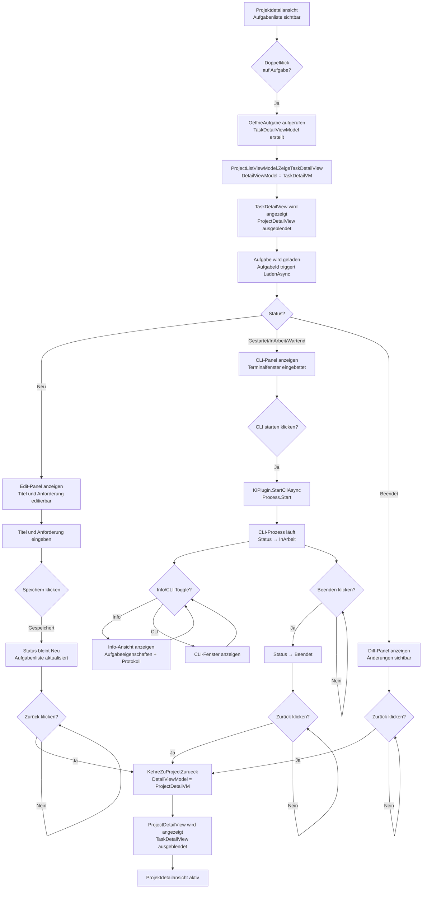

# Aufgaben & KI-Entwicklungsprozess — Technischer Ablauf

## Übersicht

Der Entwicklungsprozess wird durch `EntwicklungsprozessService.ProzessStartenAsync` eingeleitet. Das CLI des KI-Tools wird als nativer Prozess gestartet und via Win32 `SetParent` in die WPF-Aufgabendetailansicht eingebettet. `KiAusfuehrungsService` verwaltet den Prozess-Lifecycle als Singleton.

Die Seitenleisten-Anzeige aktiver Aufgaben wird durch `MainWindowViewModel.AktiveAufgabenAktualisierenAsync()` verwaltet, die `AufgabeService.GetAktiveAufgabenAsync()` aufruft und die `AktiveAufgabenListe` ObservableCollection befüllt. Das Dashboard zeigt dieselbe Liste über `DashboardViewModel.AktiveAufgabenListe` an.

## Ablauf

### Navigieren zu Aufgabendetail aus Projektdetail

Ausgelöst durch Doppelklick auf Aufgabe in der Aufgabenliste oder durch Klick auf „Neue Aufgabe".

Beteiligte Komponenten:
- `ProjectDetailView.xaml.cs` — Code-Behind mit `MouseDoubleClick` Event-Handler auf Aufgabenliste
- `ProjectDetailViewModel.AufgabeOeffnenCommand` — RelayCommand<Guid> mit `OeffneAufgabe(id)` Methode
- `ProjectDetailViewModel.NavigateToTaskViewCallback` — Action<TaskDetailViewModel>, gesetzt durch `ProjectListViewModel`
- `ProjectListViewModel.ZeigeTaskDetailView` — Private Methode, setzt `DetailViewModel = vm`
- `MainWindow.xaml` — DataTemplate für `TaskDetailViewModel` rendert `TaskDetailView`

Ablauf:
1. Nutzer doppelklickt auf Aufgabe in `ProjectDetailView.Aufgabenliste`
2. `AufgabeDoubleClick()` in Code-Behind wird ausgelöst
3. `ProjectDetailViewModel.AufgabeOeffnenCommand.Execute(aufgabeId)` wird aufgerufen
4. `OeffneAufgabe(id)` wird ausgeführt:
   - Neues `TaskDetailViewModel` wird aus DI-Container erstellt
   - `TaskDetailViewModel.ZurueckAction = () => NavigateBackToProjectCallback?.Invoke()` wird gesetzt
   - `TaskDetailViewModel.AufgabeListeAktualisierenCallback = ReloadAufgabenListAsync` wird gesetzt
   - `TaskDetailViewModel.AufgabeId = id` wird gesetzt (triggert Laden)
5. `NavigateToTaskViewCallback?.Invoke(vm)` wird aufgerufen → `ProjectListViewModel.ZeigeTaskDetailView(vm)`
6. `ProjectListViewModel.DetailViewModel = vm` wird gesetzt
7. MainWindow wechselt DataTemplate: `TaskDetailViewModel` → `TaskDetailView` wird gerendert
8. `ProjectDetailView` wird nicht mehr angezeigt

### Navigieren zurück zur Projektdetailansicht

Ausgelöst durch Klick auf „Zurück"-Button im Ribbon der `TaskDetailView`.

Beteiligte Komponenten:
- `TaskDetailViewModel.ZurueckCommand` — RelayCommand mit `ZurueckAction?.Invoke()`
- `ProjectDetailViewModel.NavigateBackToProjectCallback` — Action, gesetzt durch `ProjectListViewModel`
- `ProjectListViewModel.KehreZuProjectZurueck` — Private Methode, setzt `DetailViewModel = _currentProjectDetailViewModel`

Ablauf:
1. Nutzer klickt „Zurück" Button im Ribbon von `TaskDetailView`
2. `TaskDetailViewModel.ZurueckCommand.Execute()` wird aufgerufen
3. `ZurueckAction?.Invoke()` wird aufgerufen → `NavigateBackToProjectCallback?.Invoke()`
4. `ProjectListViewModel.KehreZuProjectZurueck()` wird aufgerufen
5. `DetailViewModel = _currentProjectDetailViewModel` wird gesetzt
6. MainWindow wechselt DataTemplate: `ProjectDetailViewModel` → `ProjectDetailView` wird gerendert
7. `TaskDetailView` wird nicht mehr angezeigt

### 0. Kombinierter Start-Ablauf: Repository klonen + CLI starten (Status: Neu → Gestartet)

Ausgelöst durch den „Starten"-Button im Ribbon der `TaskDetailView` (nur aktiv wenn Status == `Neu`).

Beteiligte Komponenten:
- `TaskDetailViewModel.StartenCommand` — RelayCommand mit CanExecute-Bedingung: Status == `Neu` && !IsCliRunning
- `TaskDetailViewModel.StartenAsync` — Orchestriert Plugin-Dialog, Klonen und CLI-Start
- `PluginSelectionService.ResolveSourceCodeManagementPluginAsync` — Wählt das Git-Plugin
- `PluginSelectionDialogService.ShowPluginSelectionDialogAsync` — Zeigt KI-Plugin-Dialog (falls nicht als Projekt-Standard gespeichert)
- `PluginDefaultSettingsService.GetProjectDefaultPluginPrefixAsync` / `SaveProjectDefaultPluginPrefixAsync` — Projekt-Level Plugin-Speicherung
- `EntwicklungsprozessService.ProzessStartenAsync` — Klont Repository und legt Branch an
- `KiAusfuehrungsService.StartCliAsync` — Startet den KI-CLI-Prozess
- `PluginSelectionResult` — DTO mit ausgewähltem Plugin-Prefix und SaveAsProjectDefault-Flag

Ablauf:
1. Anwender klickt „Starten" Button im Ribbon
2. `TaskDetailViewModel.StartenAsync()` wird aufgerufen
3. Prüfung: `Aufgabe.Status == Neu`, sonst Fehler
4. `PluginSelectionService.ResolveSourceCodeManagementPluginAsync` ermittelt Git-Plugin
5. `PluginDefaultSettingsService.GetProjectDefaultPluginPrefixAsync(projektId, PluginType.KiAutomation)` prüft Projekt-Standard für KI-Plugin
6. Falls kein Projekt-Standard vorhanden:
   - `PluginSelectionDialogService.ShowPluginSelectionDialogAsync` zeigt Dialog mit verfügbaren KI-Plugins
   - Benutzer wählt Plugin und optional Checkbox „Für dieses Projekt verwenden"
   - Falls Checkbox aktiviert: `PluginDefaultSettingsService.SaveProjectDefaultPluginPrefixAsync` speichert als Projekt-Standard
7. `EntwicklungsprozessService.ProzessStartenAsync(aufgabeId, repositoryUrl, basisBranch, gitPlugin)` wird aufgerufen:
   - Arbeitsverzeichnis wird ermittelt
   - Repository wird geklont in `{workdir}/softwareschmiede/{aufgabeId}`
   - Branch wird erstellt oder checked out
   - Status wird auf `Gestartet` gesetzt (nicht zwischendurch auf andere Status)
8. `KiAusfuehrungsService.StartCliAsync(aufgabeId, kiPluginPrefix)` wird aufgerufen:
   - KI-Plugin wird geladen
   - `IKiPlugin.StartCliAsync` liefert `ProcessStartInfo`
   - `Process.Start()` startet den nativen Prozess
   - Event `CliProcessStatusChanged` → `IsCliRunning = true`
9. Fenster wird eingebettet (siehe Abschnitt „Fenster einbetten")
10. UI zeigt CLI-Panel mit laufendem Prozess; Anwender sieht die KI-Agenten-Ausgabe
11. Bei Fehler (Klone fehlgeschlagen, CLI-Start fehlgeschlagen): Fehler wird angezeigt, Status bleibt `Neu`, Rollback des Klonverzeichnisses falls nötig

### 0.3. Automatische issue.md-Erstellung und .gitignore-Aktualisierung

Nach dem erfolgreichen Repository-Klon werden automatisch die Aufgabendaten in lokalen Dateien gespeichert:

Beteiligte Komponenten:
- `EntwicklungsprozessService.CreateIssueFileAsync` — Erstellt die Datei `issue.md` mit Aufgabebeschreibung
- `EntwicklungsprozessService.UpdateGitignoreAsync` — Aktualisiert `.gitignore` mit Eintrag für `issue.md`
- `ILogger<EntwicklungsprozessService>` — Protokolliert erfolgreiche Operationen und Fehler

Ablauf:
1. Nach `gitPlugin.CloneRepositoryAsync()` wird `CreateIssueFileAsync(lokalerKlonPfad, aufgabe, branchName, ct)` aufgerufen
   - Markdown-Datei `{lokalerKlonPfad}/issue.md` wird erstellt
   - Inhalt: `# Aufgabe: [Titel]`; Metadaten (Aufgaben-ID, Branch-Name, Erstellungsdatum); `## Anforderung` mit Aufgabenbeschreibung
   - Falls `AnforderungsBeschreibung` null oder leer: Fallback-Text `[Keine Anforderungsbeschreibung verfügbar]` wird verwendet
   - Bei Exception (z. B. IOException): Warnung wird geloggt via `_logger.LogWarning`, Prozess wird nicht unterbrochen
2. Danach wird `UpdateGitignoreAsync(lokalerKlonPfad, ct)` aufgerufen
   - `.gitignore`-Datei wird gelesen (oder neue Datei erstellt falls nicht vorhanden)
   - Prüfung: Ist `issue.md` bereits als Eintrag vorhanden? (Case-insensitive)
   - Falls nicht vorhanden: Zeile `issue.md` am Ende der Datei hinzufügen (Newline-safe)
   - Geschrieben via `File.WriteAllTextAsync` mit UTF8-Encoding ohne BOM
   - Bei Exception: Warnung wird geloggt, Prozess wird nicht unterbrochen

Die Dateien `issue.md` und `.gitignore`-Eintrag sind lokale Dateien und gehören nicht zum VCS. Sie unterstützen den Entwickler, indem sie die Aufgabeninformationen verfügbar machen, ohne sie im Repository zu committen.

### 0.5. Aufgabe anlegen und bearbeiten (Status: Neu)

Ausgelöst durch den „Speichern"-Button in der Edit-Panel-Ansicht.

Beteiligte Komponenten:
- `TaskDetailViewModel.SpeichernCommand` — Prüft, ob Titel nicht leer und Status ∈ {Neu, Gestartet}
- `AufgabeService.UpdateAsync` — Speichert `Titel` und `AnforderungsBeschreibung` in der Datenbank
- `IDialogService` — Zeigt Fehler-Toast bei Validierungsfehlern
- `TaskDetailView.xaml` — Edit-Panel mit TextBox-Bindungen zu `EditTitel` und `EditAnforderungsBeschreibung`

Ablauf:
1. Anwender gibt Titel und optional Anforderungsbeschreibung ein
2. Two-Way-Binding aktualisiert `EditTitel` und `EditAnforderungsBeschreibung` in ViewModel
3. ViewModel berechnet `KannSpeichern` basierend auf nicht-leerem Titel
4. Anwender klickt „Speichern" → `SpeichernCommand.Execute()`
5. `AufgabeService.UpdateAsync()` wird aufgerufen
6. Bei Erfolg: `LadenAsync()` neu laden, Toast anzeigen; bei Fehler: `FehlerMeldung` anzeigen

### 1. Automatischer CLI-Neustart bei Ansicht-Laden (Status: Gestartet, kein Prozess läuft)

Falls die Aufgabendetailansicht für eine Aufgabe im Status `Gestartet` geöffnet wird und kein aktiver CLI-Prozess läuft (z.B. nach Neustart der Anwendung), wird die CLI automatisch neu gestartet.

Beteiligte Komponenten:
- `TaskDetailViewModel.LadenAsync` — Lädt Aufgabe, prüft Status und Prozess-Zustand
- `KiAusfuehrungsService.IsRunning(aufgabeId)` — Prüft, ob Prozess läuft
- `CliAutomatischNeustartenAsync` — Startet CLI neu mit gespeichertem Plugin

Ablauf:
1. Benutzer navigiert zu Aufgabendetailansicht
2. `LadenAsync` wird aufgerufen (registriert in AufgabeId-Property-Setter)
3. Aufgabe wird mit `AufgabeService.GetDetailAsync` geladen
4. Prüfung: `Aufgabe.Status == Gestartet && !KiAusfuehrungsService.IsRunning(aufgabeId)` ?
5. Falls wahr: `CliAutomatischNeustartenAsync` wird aufgerufen
6. Gespeichertes Plugin wird ermittelt (Aufgaben-Plugin oder Projekt-Standard oder Global-Default)
7. `KiAusfuehrungsService.StartCliAsync` wird aufgerufen
8. CLI-Fenster wird eingebettet; Benutzer sieht laufenden Prozess

### 2. Plugin-Wechsel bei laufender CLI (Status: Gestartet/Wartend mit aktiver CLI)

Ausgelöst durch den „Plugin ändern"-Button im Ribbon (nur aktiv wenn `IsCliRunning` && Status ∈ {Gestartet, Wartend}).

Beteiligte Komponenten:
- `TaskDetailViewModel.PluginAendernCommand` — RelayCommand mit CanExecute-Bedingung: IsCliRunning && Status ∈ {Gestartet, Wartend}
- `TaskDetailViewModel.PluginWechselAsync` — Orchestriert Dialog, Stop, Restart
- `PluginSelectionDialogService.ShowPluginSelectionDialogAsync` — Zeigt Dialog mit aktuellem Plugin vorselektiert
- `KiAusfuehrungsService.StopCliAsync` — Beendet aktuellen Prozess
- `KiAusfuehrungsService.StartCliAsync` — Startet neuen Prozess mit gewähltem Plugin
- `PluginDefaultSettingsService.SaveProjectDefaultPluginPrefixAsync` — Speichert neues Plugin als Projekt-Standard falls gewünscht

Ablauf:
1. Anwender klickt „Plugin ändern" Button im Ribbon
2. `PluginWechselAsync()` wird aufgerufen
3. `PluginSelectionDialogService.ShowPluginSelectionDialogAsync` zeigt Dialog mit verfügbaren Plugins
4. Benutzer wählt neues Plugin und optional Checkbox „Für dieses Projekt verwenden"
5. `KiAusfuehrungsService.StopCliAsync()` wird aufgerufen (mit Timeout ~5s)
6. Falls StopCliAsync fehlschlägt: Fehler wird angezeigt, Dialog bleibt offen, kein Neustart durchgeführt
7. Falls erfolgreich: `KiAusfuehrungsService.StartCliAsync` mit neuem Plugin-Prefix aufgerufen
8. Neuer Prozess wird eingebettet
9. Falls Checkbox aktiviert: `PluginDefaultSettingsService.SaveProjectDefaultPluginPrefixAsync` speichert neues Standard-Plugin

### 4. Fenster einbetten (`ProcessWindowHost`)

Beteiligte Komponenten:
- `TaskDetailView.xaml.cs` — abonniert `TaskDetailViewModel.CliProzessGestartet`
- `ProcessWindowEmbedder` (optional) — Hilfsdienst für Handle-Suche
- `ProcessWindowHost.EmbeddedHandle` — DependencyProperty; Setter ruft `EmbedWindow()` auf
- `NativeMethods.SetParent(handle, _hostHandle)` — bindet das CLI-Fenster an den WPF-Container
- `NativeMethods.SetWindowLong` — entfernt `WS_CAPTION` und `WS_THICKFRAME` aus dem eingebetteten Fenster

### 5. Info/CLI-Ansicht umschalten

Ausgelöst durch Toggle-Button im CLI-Panel.

Beteiligte Komponenten:
- `TaskDetailViewModel.InfoCliToggleCommand` — Einfacher Toggle-Command
- `IsInfoViewVisible` Property — Boolean, steuert Sichtbarkeit beider Panels
- `TaskDetailView.xaml` — Zwei überlagerte Panels mit Visibility-Bindings zu `IsInfoViewVisible`

Ablauf:
1. Anwender klickt Toggle-Button „Info"/"CLI"
2. `InfoCliToggleCommand.Execute()` → `IsInfoViewVisible = !IsInfoViewVisible`
3. ProcessWindowHost und Info-Panel wechseln ihre Sichtbarkeit (nur UI-Zustand, kein Service-Aufruf)

### 6. Prozess beendet sich

- `Process.Exited`-Event wird ausgelöst
- `KiAusfuehrungsService.CliProcessStatusChanged` → `CliProcessStatus.Gestoppt`
- `TaskDetailViewModel.OnCliProcessStatusChanged` → `IsCliRunning = false`
- Anwender kann Status manuell auf `Beendet` setzen oder via `AufgabeAbschliessenCommand`

### 7. Aufgabe abschließen (`AbschliessenAsync`)

- `EntwicklungsprozessService.AbschliessenAsync` — Setzt Status auf `Beendet`, löscht optional Klonverzeichnis

### 8. Aufgabe löschen (`LoeschenAsync`)

Ausgelöst durch den „Löschen"-Button im Ribbon.

Beteiligte Komponenten:
- `TaskDetailViewModel.LoeschenCommand` — Prüft `KannLoeschen` (Status ∉ {Beendet, Archiviert} && !IsCliRunning)
- `IDialogService.BestaetigenDialog` — Zeigt Bestätigungsdialog
- `AufgabeService.DeleteAsync` — Löscht die Aufgabe aus der Datenbank
- `AufgabeListeAktualisierenCallback` — Optional: aktualisiert übergeordnete Listenansicht
- `ZurueckAction` — Navigationscallback zur Rückkehr zur Projektdetailansicht

Ablauf:
1. Anwender klickt „Löschen" im Ribbon
2. `LoeschenCommand.Execute()` wird aufgerufen
3. `IDialogService.BestaetigenDialog("Aufgabe '{Titel}' wirklich löschen?...")` wird angezeigt
4. Anwender wählt „Löschen" oder „Abbrechen"
5. Bei „Löschen": `AufgabeService.DeleteAsync()` wird aufgerufen
6. Bei Erfolg: Callback aufgerufen, `ZurueckAction` navigiert zur Projektansicht
7. Bei Fehler (z.B. Status=Beendet): `FehlerMeldung` zeigt Exception-Message

## Diagramm

## Seitenleisten-Anzeige aktiver Aufgaben

Dieser Ablauf zeigt, wie aktive Aufgaben in der Navigationsseitenleiste und im Dashboard angezeigt werden.

### Abruf aktiver Aufgaben

Beteiligte Komponenten:
- `AufgabeService.GetAktiveAufgabenAsync()` — Filtert und sortiert aktive Aufgaben
- `MainWindowViewModel.AktiveAufgabenAktualisierenAsync()` — Ruft Service auf und befüllt UI-Collection
- `DashboardViewModel.LadenAsync()` — Befüllt Dashboard-Liste
- `MainWindowViewModel.AktiveAufgabenListe` — ObservableCollection für Seitenleiste
- `DashboardViewModel.AktiveAufgabenListe` — ObservableCollection für Dashboard

Ablauf in `AufgabeService.GetAktiveAufgabenAsync()`:
1. Filtert Aufgaben mit `Status == AufgabeStatus.Gestartet || Status == AufgabeStatus.Wartend`
2. Sortiert absteigend nach `LastHeartbeatUtc ?? ErstellungsDatum` (neueste zuerst)
3. Begrenzt auf maximal 20 Ergebnisse
4. Verwendet `AsNoTracking()` für Performance
5. Gibt `List<Aufgabe>` zurück

### Seitenleisten-Rendering (MainWindow.xaml)

Beteiligte Komponenten:
- `MainWindow.xaml` — Seitenleiste mit `ItemsControl` für aktive Aufgaben
- `MainWindowViewModel.AktiveAufgabenListe` — Binding-Quelle
- `MainWindowViewModel.IsDashboardVisible` — computed Property, steuert Sichtbarkeit
- `KiAusfuehrungsStatusConverter` — Konvertiert `Aufgabe` zu Status-String
- `App.xaml` — DataTemplate `AktiveAufgabeCardTemplate` definiert Kachel-Layout

Ablauf:
1. `MainWindowViewModel` Constructor ruft `AktiveAufgabenAktualisierenAsync()` auf
2. Service wird aufgerufen, aktive Aufgaben werden abgerufen
3. `AktiveAufgabenListe.ReplaceAll(aufgaben)` füllt die Collection
4. Seitenleiste bindet auf `AktiveAufgabenListe` mit `ItemsControl`
5. Für jede Aufgabe wird `AktiveAufgabeCardTemplate` DataTemplate angewendet:
   - `TextBlock` zeigt `Titel` (mit Ellipsis bei Überlauf)
   - `TextBlock` zeigt Status via `KiAusfuehrungsStatusConverter`
   - `Button` führt `NavigateZuAufgabeCommand` aus mit `CommandParameter={Binding Id}`
6. Sichtbarkeit gesteuert durch `IsDashboardVisible`:
   - Wenn `CurrentView is DashboardViewModel`: `Visibility=Collapsed`
   - Sonst: `Visibility=Visible`

Trigger zur Aktualisierung:
- `MainWindowViewModel.NavigateToDashboard()` ruft `AktiveAufgabenAktualisierenAsync()` auf
- `MainWindowViewModel.NavigateToProjectList()` ruft `AktiveAufgabenAktualisierenAsync()` auf
- `MainWindowViewModel.NavigateToSettings()` ruft `AktiveAufgabenAktualisierenAsync()` auf

### Dashboard-Rendering (DashboardView.xaml)

Ablauf:
1. `DashboardViewModel.LadenAsync()` wird ausgelöst (z.B. via `LadenCommand`)
2. Bestehende Logik für Projekte, Recovery, Statistik-Zähler bleibt unverändert
3. Neue Zeile: `AufgabeService.GetAktiveAufgabenAsync()` wird aufgerufen
4. `AktiveAufgabenListe.ReplaceAll(aufgaben)` füllt die Collection
5. Dashboard bindet auf `AktiveAufgabenListe` mit `ItemsControl`
6. Gleiches `AktiveAufgabeCardTemplate` wird verwendet wie in Seitenleiste
7. Abschnitt ist immer sichtbar wenn auf Dashboard

### KI-Ausführungsstatus-Konvertierung

Beteiligte Komponenten:
- `KiAusfuehrungsStatusConverter : IValueConverter` — Konvertiert `Aufgabe` zu Status-String
- Referenz: `AufgabeRecoveryService.HeartbeatTimeoutMinutes` (standardmäßig 5 Minuten)

Konvertierungs-Logik in `Convert()`:
1. Input-Check: Ist Wert vom Typ `Aufgabe`? Sonst `string.Empty` zurückgeben
2. Wenn `AktiveRunId != null` UND `LastHeartbeatUtc != null` UND `(Jetzt - LastHeartbeatUtc) < 5 Minuten`:
   - Output: `"▶ Läuft"`
3. Wenn `Status == AufgabeStatus.Wartend`:
   - Output: `"⏸ Wartet"`
4. Sonst (Default):
   - Output: `"✓ Bereit"`
5. `ConvertBack()` ist nicht implementiert (Converter ist One-Way)

### Navigation zu Aufgabendetail aus aktiver Aufgabe

Ausgelöst durch Klick auf den Navigation-Button (→) einer aktiven Aufgabenkachel.

Beteiligte Komponenten:
- Aufgabenkachel-Template mit Button: `Command="{Binding DataContext.NavigateZuAufgabeCommand, RelativeSource={RelativeSource AncestorType=Window}}"`
- `MainWindowViewModel.NavigateZuAufgabeCommand` — `RelayCommand<Guid>`
- `MainWindowViewModel.NavigateZuAufgabe(Guid aufgabeId)` — Erstellt `TaskDetailViewModel`

Ablauf:
1. Benutzer klickt Navigation-Button auf Aufgabenkachel
2. `NavigateZuAufgabeCommand.Execute(aufgabeId)` wird aufgerufen
3. `NavigateZuAufgabe(aufgabeId)` wird ausgeführt:
   - Neue `TaskDetailViewModel`-Instanz wird aus DI-Container erstellt: `_serviceProvider.GetRequiredService<TaskDetailViewModel>()`
   - `TaskDetailViewModel.ZurueckAction = NavigateToDashboard` wird gesetzt
   - `TaskDetailViewModel.AufgabeId = aufgabeId` wird gesetzt (triggert `LadenAsync()`)
   - `MainWindowViewModel.CurrentView = viewModel` wird gesetzt → navigiert zu `TaskDetailView`
4. `IsDashboardVisible` wird neu berechnet (Wert ändert sich zu `false`)
5. Seitenleisten-Sektion wird ausgeblendet durch Visibility-Binding

## Fehlerbehandlung

| Situation | Verhalten |
|-----------|-----------|
| Speichern mit leerem Titel | „Speichern"-Button ist disabled; kein Service-Aufruf |
| Speichern während CLI läuft | „Speichern"-Button ist disabled (`KannSpeichern` prüft `!IsCliRunning`) |
| Löschen im Status Beendet/Archiviert | „Löschen"-Button ist disabled (`KannLoeschen` prüft Status) |
| Löschen während CLI läuft | „Löschen"-Button ist disabled (`KannLoeschen` prüft `!IsCliRunning`) |
| Dialog-Bestätigung abgebrochen | Aufgabe bleibt unverändert; Dialog wird geschlossen |
| Delete-Service wirft Exception | `FehlerMeldung` zeigt Exception-Message; Aufgabe bleibt erhalten |
| CLI-Prozess startet nicht | Exception in `CliStartenAsync`; `FehlerMeldung` in ViewModel gesetzt |
| `SetParent` schlägt fehl | CLI-Fenster bleibt eigenständig; kein Absturz der Anwendung |
| Prozess beendet sich unerwartet | `Process.Exited`-Event; `IsCliRunning = false`; Heartbeat bleibt als letzter Wert |
| Heartbeat > 5 Min, kein Prozess | Recovery-Kandidat; Banner auf Dashboard |
| Zweiter CLI-Start für gleiche Aufgabe | `KiAusfuehrungsService` gibt vorhandenes Handle zurück (kein doppelter Start) |
