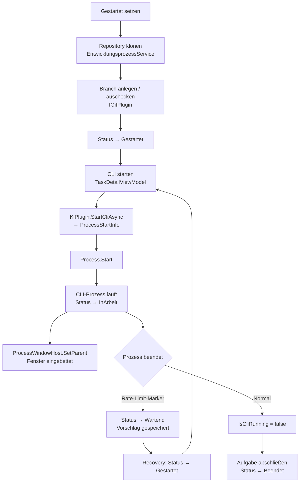

# Aufgaben & KI-Entwicklungsprozess — Technischer Ablauf

## Übersicht

Der Entwicklungsprozess wird durch `EntwicklungsprozessService.ProzessStartenAsync` eingeleitet. Das CLI des KI-Tools wird als nativer Prozess gestartet und via Win32 `SetParent` in die WPF-Aufgabendetailansicht eingebettet. `KiAusfuehrungsService` verwaltet den Prozess-Lifecycle als Singleton.

## Ablauf

### 1. Repository einrichten (`ProzessStartenAsync`)

Ausgelöst durch den „Gestartet setzen"-Button in `TaskDetailView`.

Beteiligte Komponenten:
- `EntwicklungsprozessService.ProzessStartenAsync` — Orchestriert den Startablauf
- `PluginSelectionService.ResolveSourceCodeManagementPluginAsync` — Wählt das SCM-Plugin
- `IArbeitsverzeichnisResolver.ResolveAsync` — Ermittelt das lokale Arbeitsverzeichnis
- `IGitPlugin.CloneRepositoryAsync` — Klont das Repository
- `IGitPlugin.CreateBranchAsync` / `CheckoutRemoteBranchAsync` — Legt den task/-Branch an oder checkt einen vorhandenen aus
- `AufgabeService.SetStatusAsync` — Setzt Status auf `ArbeitsverzeichnisEingerichtet`, dann `Gestartet`

### 2. CLI starten (`StartCliAsync`)

Ausgelöst durch „CLI starten" in `TaskDetailView`.

Beteiligte Komponenten:
- `TaskDetailViewModel.CliStartenAsync` — Koordiniert Plugin-Auflösung und Service-Aufruf
- `PluginSelectionService.ResolveDevelopmentAutomationPluginAsync` — Wählt das KI-Plugin
- `KiAusfuehrungsService.StartCliAsync` — Startet den CLI-Prozess, gibt `CliProcessHandle` zurück
- `IKiPlugin.StartCliAsync` — Plugin liefert `ProcessStartInfo` (Executable, Argumente, CWD)
- `Process.Start()` — Startet den nativen Prozess
- `KiAusfuehrungsService.CliProcessStatusChanged` — Event: UI wird informiert
- `AufgabeService.SetStatusAsync` — Status → `InArbeit`

### 3. Fenster einbetten (`ProcessWindowHost`)

Beteiligte Komponenten:
- `TaskDetailView.xaml.cs` — abonniert `TaskDetailViewModel.CliProzessGestartet`
- `ProcessWindowEmbedder` (optional) — Hilfsdienst für Handle-Suche
- `ProcessWindowHost.EmbeddedHandle` — DependencyProperty; Setter ruft `EmbedWindow()` auf
- `NativeMethods.SetParent(handle, _hostHandle)` — bindet das CLI-Fenster an den WPF-Container
- `NativeMethods.SetWindowLong` — entfernt `WS_CAPTION` und `WS_THICKFRAME` aus dem eingebetteten Fenster

### 4. Prozess beendet sich

- `Process.Exited`-Event wird ausgelöst
- `KiAusfuehrungsService.CliProcessStatusChanged` → `CliProcessStatus.Gestoppt`
- `TaskDetailViewModel.OnCliProcessStatusChanged` → `IsCliRunning = false`
- Anwender kann Status manuell auf `Beendet` setzen oder via `AufgabeAbschliessenCommand`

### 5. Aufgabe abschließen (`AbschliessenAsync`)

- `EntwicklungsprozessService.AbschliessenAsync` — Setzt Status auf `Beendet`, löscht optional Klonverzeichnis

## Diagramm

## Fehlerbehandlung

| Situation | Verhalten |
|-----------|-----------|
| CLI-Prozess startet nicht | Exception in `CliStartenAsync`; `FehlerMeldung` in ViewModel gesetzt |
| `SetParent` schlägt fehl | CLI-Fenster bleibt eigenständig; kein Absturz der Anwendung |
| Prozess beendet sich unerwartet | `Process.Exited`-Event; `IsCliRunning = false`; Heartbeat bleibt als letzter Wert |
| Heartbeat > 5 Min, kein Prozess | Recovery-Kandidat; Banner auf Dashboard |
| Zweiter CLI-Start für gleiche Aufgabe | `KiAusfuehrungsService` gibt vorhandenes Handle zurück (kein doppelter Start) |
