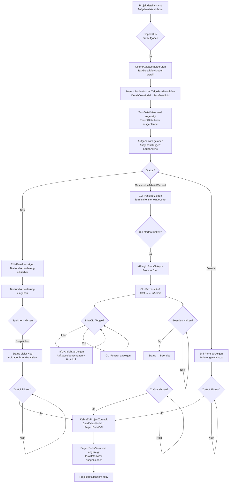

# Aufgaben & KI-Entwicklungsprozess — Technischer Ablauf

## Übersicht

Der Entwicklungsprozess wird durch `EntwicklungsprozessService.ProzessStartenAsync` eingeleitet. Das CLI des KI-Tools wird als nativer Prozess gestartet und via Win32 `SetParent` in die WPF-Aufgabendetailansicht eingebettet. `KiAusfuehrungsService` verwaltet den Prozess-Lifecycle als Singleton.

## Ablauf

### Navigieren zu Aufgabendetail aus Projektdetail

Ausgelöst durch Doppelklick auf Aufgabe in der Aufgabenliste oder durch Klick auf „Neue Aufgabe".

Beteiligte Komponenten:
- `ProjectDetailView.xaml.cs` — Code-Behind mit `MouseDoubleClick` Event-Handler auf Aufgabenliste
- `ProjectDetailViewModel.AufgabeOeffnenCommand` — RelayCommand<Guid> mit `OeffneAufgabe(id)` Methode
- `ProjectDetailViewModel.NavigateToTaskViewCallback` — Action<TaskDetailViewModel>, gesetzt durch `ProjectListViewModel`
- `ProjectListViewModel.ZeigeTaskDetailView` — Private Methode, setzt `DetailViewModel = vm`
- `MainWindow.xaml` — DataTemplate für `TaskDetailViewModel` rendert `TaskDetailView`

Ablauf:
1. Nutzer doppelklickt auf Aufgabe in `ProjectDetailView.Aufgabenliste`
2. `AufgabeDoubleClick()` in Code-Behind wird ausgelöst
3. `ProjectDetailViewModel.AufgabeOeffnenCommand.Execute(aufgabeId)` wird aufgerufen
4. `OeffneAufgabe(id)` wird ausgeführt:
   - Neues `TaskDetailViewModel` wird aus DI-Container erstellt
   - `TaskDetailViewModel.ZurueckAction = () => NavigateBackToProjectCallback?.Invoke()` wird gesetzt
   - `TaskDetailViewModel.AufgabeListeAktualisierenCallback = ReloadAufgabenListAsync` wird gesetzt
   - `TaskDetailViewModel.AufgabeId = id` wird gesetzt (triggert Laden)
5. `NavigateToTaskViewCallback?.Invoke(vm)` wird aufgerufen → `ProjectListViewModel.ZeigeTaskDetailView(vm)`
6. `ProjectListViewModel.DetailViewModel = vm` wird gesetzt
7. MainWindow wechselt DataTemplate: `TaskDetailViewModel` → `TaskDetailView` wird gerendert
8. `ProjectDetailView` wird nicht mehr angezeigt

### Navigieren zurück zur Projektdetailansicht

Ausgelöst durch Klick auf „Zurück"-Button im Ribbon der `TaskDetailView`.

Beteiligte Komponenten:
- `TaskDetailViewModel.ZurueckCommand` — RelayCommand mit `ZurueckAction?.Invoke()`
- `ProjectDetailViewModel.NavigateBackToProjectCallback` — Action, gesetzt durch `ProjectListViewModel`
- `ProjectListViewModel.KehreZuProjectZurueck` — Private Methode, setzt `DetailViewModel = _currentProjectDetailViewModel`

Ablauf:
1. Nutzer klickt „Zurück" Button im Ribbon von `TaskDetailView`
2. `TaskDetailViewModel.ZurueckCommand.Execute()` wird aufgerufen
3. `ZurueckAction?.Invoke()` wird aufgerufen → `NavigateBackToProjectCallback?.Invoke()`
4. `ProjectListViewModel.KehreZuProjectZurueck()` wird aufgerufen
5. `DetailViewModel = _currentProjectDetailViewModel` wird gesetzt
6. MainWindow wechselt DataTemplate: `ProjectDetailViewModel` → `ProjectDetailView` wird gerendert
7. `TaskDetailView` wird nicht mehr angezeigt

### 0. Aufgabe anlegen und bearbeiten (Status: Neu)

Ausgelöst durch den „Speichern"-Button in der Edit-Panel-Ansicht.

Beteiligte Komponenten:
- `TaskDetailViewModel.SpeichernCommand` — Prüft, ob Titel nicht leer und Status ∈ {Neu, Gestartet}
- `AufgabeService.UpdateAsync` — Speichert `Titel` und `AnforderungsBeschreibung` in der Datenbank
- `IDialogService` — Zeigt Fehler-Toast bei Validierungsfehlern
- `TaskDetailView.xaml` — Edit-Panel mit TextBox-Bindungen zu `EditTitel` und `EditAnforderungsBeschreibung`

Ablauf:
1. Anwender gibt Titel und optional Anforderungsbeschreibung ein
2. Two-Way-Binding aktualisiert `EditTitel` und `EditAnforderungsBeschreibung` in ViewModel
3. ViewModel berechnet `KannSpeichern` basierend auf nicht-leerem Titel
4. Anwender klickt „Speichern" → `SpeichernCommand.Execute()`
5. `AufgabeService.UpdateAsync()` wird aufgerufen
6. Bei Erfolg: `LadenAsync()` neu laden, Toast anzeigen; bei Fehler: `FehlerMeldung` anzeigen

### 1. Repository einrichten (`ProzessStartenAsync`)

Ausgelöst durch den „Gestartet setzen"-Button in `TaskDetailView`.

Beteiligte Komponenten:
- `EntwicklungsprozessService.ProzessStartenAsync` — Orchestriert den Startablauf
- `PluginSelectionService.ResolveSourceCodeManagementPluginAsync` — Wählt das SCM-Plugin
- `IArbeitsverzeichnisResolver.ResolveAsync` — Ermittelt das lokale Arbeitsverzeichnis
- `IGitPlugin.CloneRepositoryAsync` — Klont das Repository
- `IGitPlugin.CreateBranchAsync` / `CheckoutRemoteBranchAsync` — Legt den task/-Branch an oder checkt einen vorhandenen aus
- `AufgabeService.SetStatusAsync` — Setzt Status auf `ArbeitsverzeichnisEingerichtet`, dann `Gestartet`

### 2. CLI starten (`StartCliAsync`)

Ausgelöst durch „CLI starten" in `TaskDetailView`.

Beteiligte Komponenten:
- `TaskDetailViewModel.CliStartenAsync` — Koordiniert Plugin-Auflösung und Service-Aufruf
- `PluginSelectionService.ResolveDevelopmentAutomationPluginAsync` — Wählt das KI-Plugin
- `KiAusfuehrungsService.StartCliAsync` — Startet den CLI-Prozess, gibt `CliProcessHandle` zurück
- `IKiPlugin.StartCliAsync` — Plugin liefert `ProcessStartInfo` (Executable, Argumente, CWD)
- `Process.Start()` — Startet den nativen Prozess
- `KiAusfuehrungsService.CliProcessStatusChanged` — Event: UI wird informiert
- `AufgabeService.SetStatusAsync` — Status → `InArbeit`

### 3. Fenster einbetten (`ProcessWindowHost`)

Beteiligte Komponenten:
- `TaskDetailView.xaml.cs` — abonniert `TaskDetailViewModel.CliProzessGestartet`
- `ProcessWindowEmbedder` (optional) — Hilfsdienst für Handle-Suche
- `ProcessWindowHost.EmbeddedHandle` — DependencyProperty; Setter ruft `EmbedWindow()` auf
- `NativeMethods.SetParent(handle, _hostHandle)` — bindet das CLI-Fenster an den WPF-Container
- `NativeMethods.SetWindowLong` — entfernt `WS_CAPTION` und `WS_THICKFRAME` aus dem eingebetteten Fenster

### 4. Info/CLI-Ansicht umschalten

Ausgelöst durch Toggle-Button im CLI-Panel.

Beteiligte Komponenten:
- `TaskDetailViewModel.InfoCliToggleCommand` — Einfacher Toggle-Command
- `IsInfoViewVisible` Property — Boolean, steuert Sichtbarkeit beider Panels
- `TaskDetailView.xaml` — Zwei überlagerte Panels mit Visibility-Bindings zu `IsInfoViewVisible`

Ablauf:
1. Anwender klickt Toggle-Button „Info"/"CLI"
2. `InfoCliToggleCommand.Execute()` → `IsInfoViewVisible = !IsInfoViewVisible`
3. ProcessWindowHost und Info-Panel wechseln ihre Sichtbarkeit (nur UI-Zustand, kein Service-Aufruf)

### 5. Prozess beendet sich

- `Process.Exited`-Event wird ausgelöst
- `KiAusfuehrungsService.CliProcessStatusChanged` → `CliProcessStatus.Gestoppt`
- `TaskDetailViewModel.OnCliProcessStatusChanged` → `IsCliRunning = false`
- Anwender kann Status manuell auf `Beendet` setzen oder via `AufgabeAbschliessenCommand`

### 6. Aufgabe abschließen (`AbschliessenAsync`)

- `EntwicklungsprozessService.AbschliessenAsync` — Setzt Status auf `Beendet`, löscht optional Klonverzeichnis

### 7. Aufgabe löschen (`LoeschenAsync`)

Ausgelöst durch den „Löschen"-Button im Ribbon.

Beteiligte Komponenten:
- `TaskDetailViewModel.LoeschenCommand` — Prüft `KannLoeschen` (Status ∉ {Beendet, Archiviert} && !IsCliRunning)
- `IDialogService.BestaetigenDialog` — Zeigt Bestätigungsdialog
- `AufgabeService.DeleteAsync` — Löscht die Aufgabe aus der Datenbank
- `AufgabeListeAktualisierenCallback` — Optional: aktualisiert übergeordnete Listenansicht
- `ZurueckAction` — Navigationscallback zur Rückkehr zur Projektdetailansicht

Ablauf:
1. Anwender klickt „Löschen" im Ribbon
2. `LoeschenCommand.Execute()` wird aufgerufen
3. `IDialogService.BestaetigenDialog("Aufgabe '{Titel}' wirklich löschen?...")` wird angezeigt
4. Anwender wählt „Löschen" oder „Abbrechen"
5. Bei „Löschen": `AufgabeService.DeleteAsync()` wird aufgerufen
6. Bei Erfolg: Callback aufgerufen, `ZurueckAction` navigiert zur Projektansicht
7. Bei Fehler (z.B. Status=Beendet): `FehlerMeldung` zeigt Exception-Message

## Diagramm

## Fehlerbehandlung

| Situation | Verhalten |
|-----------|-----------|
| Speichern mit leerem Titel | „Speichern"-Button ist disabled; kein Service-Aufruf |
| Speichern während CLI läuft | „Speichern"-Button ist disabled (`KannSpeichern` prüft `!IsCliRunning`) |
| Löschen im Status Beendet/Archiviert | „Löschen"-Button ist disabled (`KannLoeschen` prüft Status) |
| Löschen während CLI läuft | „Löschen"-Button ist disabled (`KannLoeschen` prüft `!IsCliRunning`) |
| Dialog-Bestätigung abgebrochen | Aufgabe bleibt unverändert; Dialog wird geschlossen |
| Delete-Service wirft Exception | `FehlerMeldung` zeigt Exception-Message; Aufgabe bleibt erhalten |
| CLI-Prozess startet nicht | Exception in `CliStartenAsync`; `FehlerMeldung` in ViewModel gesetzt |
| `SetParent` schlägt fehl | CLI-Fenster bleibt eigenständig; kein Absturz der Anwendung |
| Prozess beendet sich unerwartet | `Process.Exited`-Event; `IsCliRunning = false`; Heartbeat bleibt als letzter Wert |
| Heartbeat > 5 Min, kein Prozess | Recovery-Kandidat; Banner auf Dashboard |
| Zweiter CLI-Start für gleiche Aufgabe | `KiAusfuehrungsService` gibt vorhandenes Handle zurück (kein doppelter Start) |
