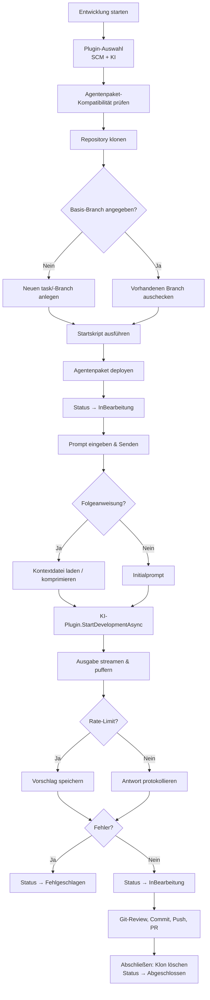

# Aufgaben & KI-Entwicklungsprozess — Technischer Ablauf

## Übersicht

Der Entwicklungsprozess wird durch `EntwicklungsprozessService.ProzessStartenAsync` eingeleitet und durch `KiAusfuehrungsService.StartKiLauf` fortgeführt. Der gesamte KI-Lauf findet in einem `Task.Run`-Hintergrundthread statt; die Blazor-Komponente abonniert den Ausgabestrom via `KiSession.Subscribe`.

## Ablauf

### 1. Prozess starten (`ProzessStartenAsync`)

Ausgelöst durch den „Entwicklung starten"-Dialog in `AufgabeDetail.razor`.

Beteiligte Komponenten:
- `EntwicklungsprozessService.ProzessStartenAsync` — Orchestriert den Startablauf
- `PluginSelectionService.ResolveSourceCodeManagementPluginAsync` — Wählt das SCM-Plugin
- `PluginSelectionService.ResolveDevelopmentAutomationPluginAsync` — Wählt das KI-Plugin
- `IArbeitsverzeichnisResolver.ResolveAsync` — Ermittelt das lokale Arbeitsverzeichnis
- `IGitPlugin.CloneRepositoryAsync` — Klont das Repository
- `IGitPlugin.CreateBranchAsync` / `CheckoutRemoteBranchAsync` — Legt den task/-Branch an oder checkt einen vorhandenen aus
- `IKiPlugin.IsAgentPackageCompatibleAsync` — Prüft Agentenpaket-Kompatibilität vor dem Klon
- `IKiPlugin.DeployAgentPackageAsync` — Kopiert `.claude/` oder `.github/` ins geklonte Repository
- `AufgabeService.StartenAsync` — Setzt Status auf `InBearbeitung`, speichert Branch und Klonpfad

### 2. KI starten (`KiStartenAsync` + `StartKiLauf`)

Ausgelöst durch „Senden" in der Ausführungsansicht.

Beteiligte Komponenten:
- `KiAusfuehrungsService.StartKiLauf` — Startet Hintergrundtask, hält `KiSession`
- `EntwicklungsprozessService.KiStartenAsync` — `IAsyncEnumerable` über KI-Ausgabezeilen
- `AufgabeService.KiAktiviertAsync` — Setzt Status auf `KiAktiv`
- `BuildFollowPromptWithContextAsync` — Baut Folgeanweisung mit Kontextreferenz auf
- `EnsureContextWithinLimitsAsync` — Komprimiert Kontextdatei wenn Soft-Limit (12 000 Zeichen) überschritten
- `IKiPlugin.StartDevelopmentAsync` — Streamt KI-Ausgabe (z.B. claude CLI JSON)
- `ProtokollService.AddEintragAsync` — Speichert Prompt und Antwort als `Protokolleintrag`
- `AufgabeService.KiAbgeschlossenAsync` / `FehlgeschlagenAsync` — Setzt Endstatus

### 3. Ausgabe empfangen und anzeigen

- `KiSession.AddLine` — Puffert Ausgabe und ruft alle Subscriber auf
- `AufgabeDetail.razor.cs` abonniert per `KiAusfuehrungsService.Subscribe`
- UI zeigt Streaming-Ausgabe in `.streaming-output`-Bereich, nach Abschluss im Protokoll

### 4. Git-Aktionen (Register „Projektverzeichnis")

- `EntwicklungsprozessService.CommitDurchfuehrenAsync`
- `EntwicklungsprozessService.PushDurchfuehrenAsync`
- `EntwicklungsprozessService.PullDurchfuehrenAsync`
- `EntwicklungsprozessService.PullRequestErstellenAsync`
- `GitOrchestrationService` — Workspace-Snapshot, Commit-Liste, Dateivorschau

### 5. Aufgabe abschließen

- `EntwicklungsprozessService.AbschliessenAsync` — Löscht Klonverzeichnis, setzt `Abgeschlossen`

## Diagramm

## Fehlerbehandlung

| Situation | Verhalten |
|-----------|-----------|
| KI-Exception während Streaming | Status → `Fehlgeschlagen`, Fehlermeldung ins Protokoll |
| Rate-Limit erkannt | Vorschlag mit Ausführungszeit gespeichert, Hinweis in der UI |
| Session nicht gefunden (Claude) | Automatischer Neustart als Erstlauf |
| Kontextdatei überschreitet Hard-Limit (20 000 Zeichen) | Protokolleintrag, KI-Lauf trotzdem gestartet |
| Startskript fehlgeschlagen | Aufgabe wird trotzdem gestartet, Hinweis im Protokoll |
| Aufgabe bereits im Status `KiAktiv` | `StartKiLauf` verweigert zweiten Start |
