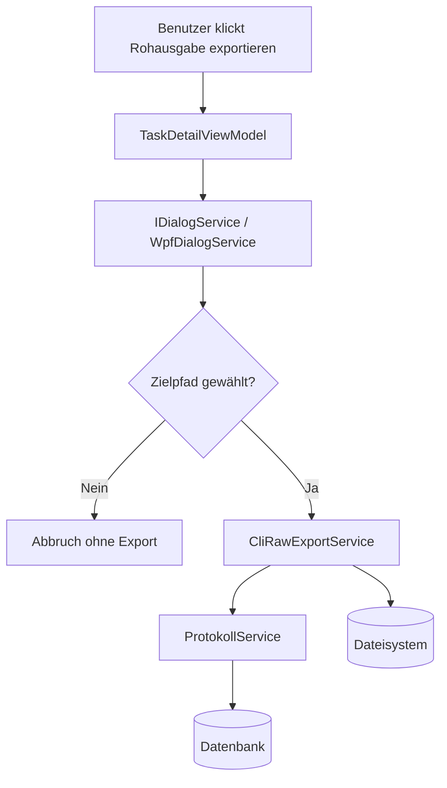

← [Zurück zur Übersicht](index.md)

# Aufgaben & KI-Entwicklungsprozess — Architektur

## Beteiligte Komponenten

| Komponente | Typ | Rolle |
|------------|-----|-------|
| `TaskDetailView.xaml` | WPF-View | Stellt den Ribbon-Button **Rohausgabe exportieren** bereit. |
| `TaskDetailViewModel` | ViewModel | Orchestriert Dialog, Validierung und Exportaufruf. |
| `IDialogService` / `WpfDialogService` | UI-Abstraktion | Öffnet den nativen Speichern-Dialog für den Zielpfad. |
| `ICliRawExportService` / `CliRawExportService` | Application Service | Liest die gespeicherten CLI-Protokolle und schreibt die `.raw`-Datei. |
| `ProtokollService` | Persistenzservice | Liefert den kompletten Protokoll-Snapshot einer Aufgabe. |
| `Protokolleintrag` | Domain-Entity | Quelle der exportierten `CliOutput`-Zeilen. |
| Dateisystem | Betriebssystem | Ziel für die erzeugte `.raw`-Datei. |

## Abhängigkeiten

- Die Funktion nutzt keine externen Web-Services oder APIs.
- Die Datenquelle ist ausschließlich die lokale Datenbank über `ProtokollService`.
- Der Dateischreibvorgang läuft synchron zur Benutzeraktion und schreibt direkt ins Dateisystem des Anwenders.
- Der Dialog muss auf dem UI-Dispatcher geöffnet werden, damit die WPF-Ansicht responsiv bleibt.

## Datenfluss

1. Der Benutzer löst den Export in der `TaskDetailView` aus.
2. `TaskDetailViewModel` öffnet über `IDialogService` den Speichern-Dialog.
3. Nach der Pfadwahl ruft das ViewModel `ICliRawExportService.ExportCliRawAsync(...)` auf.
4. Der Service lädt die Protokolle der Aufgabe über `ProtokollService.GetByAufgabeAsync(...)`.
5. Aus den geladenen Einträgen werden nur `ProtokollTyp.CliOutput`-Zeilen übernommen.
6. Die Zeilen werden in ihrer gespeicherten Reihenfolge zusammengeführt und als UTF-8-Datei ohne BOM geschrieben.
7. Fehler beim Schreiben werden im ViewModel sichtbar gemacht; der restliche UI-Zustand bleibt unverändert.

## Diagramm

## Skalierung und Zuverlässigkeit

- Der Export ist ein on-demand Vorgang und belastet nur die Protokolle der aktuell gewählten Aufgabe.
- Da ausschließlich bereits persistierte Daten exportiert werden, ist der Ablauf unabhängig von einer laufenden CLI-Session.
- Fehler in der Dateiausgabe führen nicht zu einem Aufgaben- oder CLI-Abbruch; sie bleiben auf den Exportvorgang begrenzt.
