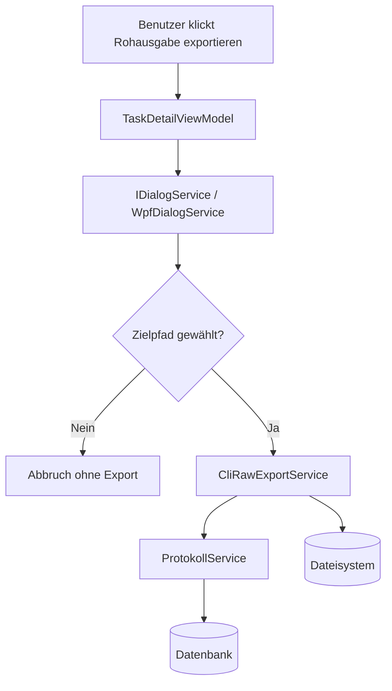

← [Zurück zur Übersicht](index.md)

# Aufgaben & KI-Entwicklungsprozess — Architektur

## Beteiligte Komponenten

| Komponente | Typ | Rolle |
|------------|-----|-------|
| `TaskDetailView.xaml` | WPF-View | Stellt den Ribbon-Button **Rohausgabe exportieren** bereit. |
| `TaskDetailViewModel` | ViewModel | Orchestriert Dialog, Validierung und Exportaufruf. |
| `IDialogService` / `WpfDialogService` | UI-Abstraktion | Öffnet den nativen Speichern-Dialog für den Zielpfad. |
| `ICliRawExportService` / `CliRawExportService` | Application Service | Liest die gespeicherten CLI-Protokolle und schreibt die `.raw`-Datei. |
| `ProtokollService` | Persistenzservice | Liefert den kompletten Protokoll-Snapshot einer Aufgabe. |
| `Protokolleintrag` | Domain-Entity | Quelle der exportierten `CliOutput`-Zeilen. |
| Dateisystem | Betriebssystem | Ziel für die erzeugte `.raw`-Datei. |

## Abhängigkeiten

- Die Funktion nutzt keine externen Web-Services oder APIs.
- Die Datenquelle ist ausschließlich die lokale Datenbank über `ProtokollService`.
- Der Dateischreibvorgang läuft synchron zur Benutzeraktion und schreibt direkt ins Dateisystem des Anwenders.
- Der Dialog muss auf dem UI-Dispatcher geöffnet werden, damit die WPF-Ansicht responsiv bleibt.

## Datenfluss

1. Der Benutzer löst den Export in der `TaskDetailView` aus.
2. `TaskDetailViewModel` öffnet über `IDialogService` den Speichern-Dialog.
3. Nach der Pfadwahl ruft das ViewModel `ICliRawExportService.ExportCliRawAsync(...)` auf.
4. Der Service lädt die Protokolle der Aufgabe über `ProtokollService.GetByAufgabeAsync(...)`.
5. Aus den geladenen Einträgen werden nur `ProtokollTyp.CliOutput`-Zeilen übernommen.
6. Die Zeilen werden in ihrer gespeicherten Reihenfolge zusammengeführt und als UTF-8-Datei ohne BOM geschrieben.
7. Fehler beim Schreiben werden im ViewModel sichtbar gemacht; der restliche UI-Zustand bleibt unverändert.

## Diagramm

## Skalierung und Zuverlässigkeit

- Der Export ist ein on-demand Vorgang und belastet nur die Protokolle der aktuell gewählten Aufgabe.
- Da ausschließlich bereits persistierte Daten exportiert werden, ist der Ablauf unabhängig von einer laufenden CLI-Session.
- Fehler in der Dateiausgabe führen nicht zu einem Aufgaben- oder CLI-Abbruch; sie bleiben auf den Exportvorgang begrenzt.

## Aufgaben-Pause und Session-Limits

Die Pause einer regulären Aufgabe ist als zeitbasiertes Overlay (`Aufgabe.PausiertBisUtc`) umgesetzt — ohne eigenen Aufgabenstatus und ohne Eingriff in laufende CLI-Prozesse.

### Beteiligte Komponenten

| Komponente | Typ | Rolle |
|------------|-----|-------|
| `Aufgabe.PausiertBisUtc` | Domain-Entity-Property | Persistenter Pausen-Endzeitpunkt (UTC, nullable Unix-Millis in der Datenbank) |
| `AufgabeService.SetPauseAsync` | Application Service (scoped) | Setzt/leert die Pause mit Validierung und `SystemMeldung`-Protokolleintrag |
| `TaskDetailViewModel` / `AufgabePausierenDialogViewModel` | ViewModel | Ribbon-Aktion **Pause einstellen**, Dialog-Vorbelegung und -Validierung |
| `AufgabePausierenDialog` / `IDialogService` | WPF-View / UI-Abstraktion | Modaler Dialog zur Datum-/Uhrzeitwahl |
| `EntwicklungsprozessService.WirfWennPausiert` | Application Service | Guard für Prozessstart, CLI-Neustart und Plugin-Wechsel |
| `AufgabeRecoveryService` | Application Service | Filtert pausierte Aufgaben aus den Recovery-Kandidaten, lehnt manuelle Recovery ab |
| `PromptZeitVersandService` | Application Service (Singleton) | Verschiebt geplante Prompts auf das Pausenende statt sie zu verwerfen |
| `KiPluginLimitService` | Application Service (scoped) | Persistiert Session-Limits als `AppEinstellung` (`plugins.sessionlimit.<Prefix>`) und wendet die Pause prefix-weit an |
| `CliOutputProtokollWriter` / `ProtokollService` | Infrastruktur / Application Service | Erkennen den Marker `[[SOFTWARESCHMIEDE_RATE_LIMIT:<ISO8601>]]` im CLI-Output-Stream |
| `CliUpdateSafetyService` | Application Service | Behandelt Aufgaben mit zukünftigem Session-Limit als nicht riskant |
| `AktiveAufgabePanelItem` / `KiAusfuehrungsStatusConverter` | ViewModel / Converter | Countdown-Anzeige `⏸ Pausiert (noch …)` und Kachel-Abblendung (`Opacity = 0.55`) |
| `AufgabeLaufdatenChangedNotifier` | Infrastruktur | Löst nach persistierten Pausen-Änderungen den sofortigen Seitenleisten-Refresh aus |

### Datenfluss (automatische Pause bei Session-Limit)

1. `CliOutputProtokollWriter` persistiert eine CLI-Zeile über `ProtokollService.AddCliOutputAsync` — dabei entsteht bei Marker-Fund der `RateLimit`-Protokolleintrag.
2. Bei gültigem Zeitstempel ruft der Writer `KiPluginLimitService.VerarbeiteRateLimitAsync` (neuer DI-Scope pro Zeile).
3. Der Service persistiert den Reset-Zeitpunkt als `AppEinstellung` und lädt die aktiven regulären Aufgaben mit demselben `KiPluginPrefix`.
4. Pro Aufgabe wird `PausiertBisUtc` mit Max-Semantik gesetzt, ein `SystemMeldung`-Eintrag geschrieben und `NotifyLaufdatenChanged` ausgelöst.
5. Die Seitenleiste aktualisiert die Kachel sofort; der Countdown tickt anschließend über den bestehenden 5-Sekunden-Refresh.

### Zuverlässigkeit

- Die Pause blockiert ausschließlich neu ausgelöste Aktionen; laufende Prozesse werden nie angefasst.
- Das Pausenende wirkt rein zeitbasiert — es gibt keinen Hintergrund-Job und keinen automatischen Restart.
- Marker ohne Zeitstempel, fehlendes `KiPluginPrefix` oder ein nicht registrierter `KiPluginLimitService` führen zu keinem Fehler: Es wird nur der `RateLimit`-Protokolleintrag geschrieben.
