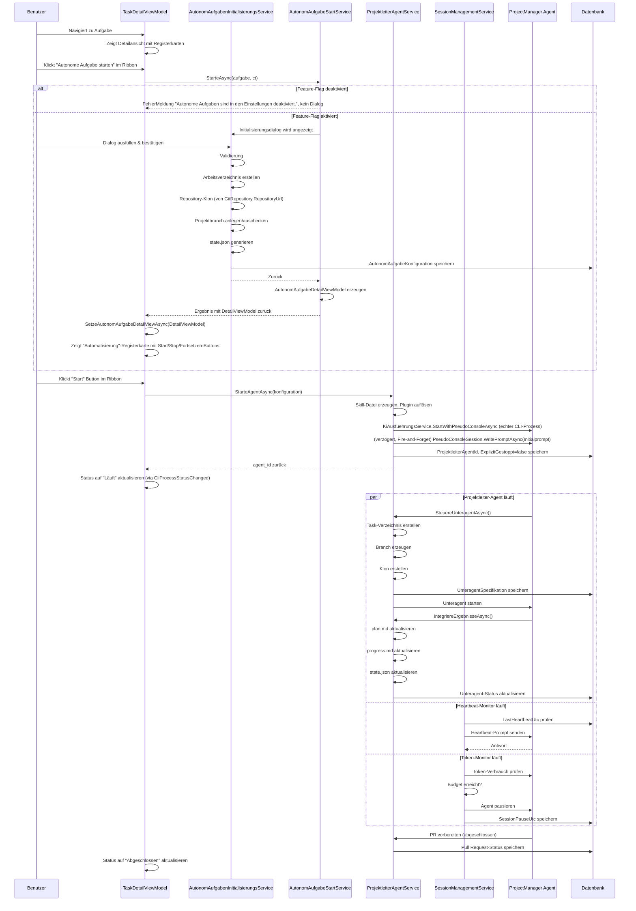

← [Zurück zur Übersicht](index.md)

# Autonome Aufgaben — Technischer Ablauf

## Übersicht

Eine Autonome Aufgabe durchläuft folgende technische Phasen:

1. **Initialisierung** — Arbeitsverzeichnis, Repository-Klon, Konfiguration
2. **Agent-Start** — echter CLI-Prozess wird über `KiAusfuehrungsService` gestartet, Initialprompt wird verzögert an die CLI-Session gesendet; explizites Stoppen setzt `ExplizitGestoppt` und verhindert automatischen Wiederstart
2b. **App-Neustart-Recovery** — beim Programmstart werden nicht explizit gestoppte, aktive Autonome Aufgaben automatisch mit Weitermachen-Prompt neu gestartet
3. **Unteragenten-Orchestrierung** — Projektleiter erzeugt und verwaltet Unteragenten
4. **Session-Management** — Token-Budget, Laufzeitlimit, Heartbeat-Überwachung
5. **Integrationn & Abschluss** — Ergebnisse zusammenfassen, PR vorbereiten

## Detaillierter Ablauf

### Phase 0: Feature-Flag-Guard beim Klick auf „Autonome Aufgabe starten"

**Aufruf-Chain:**
```
Benutzer: Klickt "Autonome Aufgabe starten" im Ribbon
    ↓
TaskDetailViewModel.AutonomAufgabeInitialisierenAsync()
    ↓
AutonomAufgabeStartService.StarteAsync(aufgabe, ct)
    ↓
if (!_autonomAufgabenOptions.Value.Enabled) → AutonomAufgabeStartResult mit FehlerMeldung, kein Dialog
```

`AutonomAufgabeStartService.StarteAsync()` prüft als erste Anweisung `_autonomAufgabenOptions.Value.Enabled` (`IOptions<AutonomAufgabenOptions>`, aus `appsettings.json`/Umgebungsvariable beim App-Start gebunden). Ist das Flag `false`, wird ohne weitere Verarbeitung `new AutonomAufgabeStartResult(aufgabe, "Autonome Aufgaben sind in den Einstellungen deaktiviert.", null)` zurückgegeben — `AutonomAufgabeInitialisierungsDialogViewModel` wird nicht instanziiert, der Dialog erscheint nicht. `TaskDetailViewModel` zeigt `FehlerMeldung` an. Der Ribbon-Button selbst bleibt sichtbar/klickbar (Sichtbarkeit hängt nur von `IsAutonomAufgabe`, nicht vom Feature-Flag ab) — erst der Klick löst die Guard-Klausel aus. Ist das Flag `true`, läuft Phase 1 unverändert weiter.

Zwei weitere, unabhängige Guard-Klauseln (Defense-in-Depth) prüfen dasselbe Flag erneut an tieferliegenden Einstiegspunkten und werfen dort `InvalidOperationException(AutonomAufgabenOptions.DisabledErrorMessage)`, falls sie direkt (ohne den UI-Weg über `AutonomAufgabeStartService`) aufgerufen werden: `AutonomAufgabenInitialisierungsService.InitialisiereAsync()` (siehe Phase 1, Schritt 0) und `ProjektleiterAgentService.StarteAgentAsync()` (siehe Phase 2, Schritt 0). Siehe **Business Rules** für Details.

---

### Phase 1: Initialisierung einer Autonomen Aufgabe

**Aufruf-Chain:**
```
Benutzer: Dialog öffnen
    ↓
AutonomAufgabeInitialisierungsDialogViewModel.Initialize(aufgabe)
    ↓
AutonomAufgabeInitialisierungsDialogViewModel.LadeAsync()
    ↓
LadeProjektBranchesAsync() + LadePromptVorlagenAsync()

Benutzer: Dialog ausfüllen & bestätigen
    ↓
AutonomAufgabeInitialisierungsDialogViewModel.BestaetigenAsync()
    ↓
AufgabeService.ErzeugeAutonomAufgabeAsync(aufgabe, initialPrompt)
    ↓
AutonomAufgabenInitialisierungsService.InitialisiereAsync(aufgabe, anfrage)
```

**Vorgelagert: Laden von Projektbranches und Promptvorlagen (`LadeAsync`)**

`AutonomAufgabeInitialisierungsDialogViewModel.LadeAsync()` wird von der View nach `Initialize(aufgabe)` und vor Anzeige des Dialogs aufgerufen und führt zwei unabhängige Ladeschritte aus:

- `LadeProjektBranchesAsync()`:
  1. Ermittelt über `ResolveGitPlugin()` das zur `GitRepository.PluginTyp` der Aufgabe passende `IGitPlugin` aus `IPluginManager.GetSourceCodeManagementPlugins()` (Fallback: erstes verfügbares Plugin)
  2. Ist kein Plugin oder keine `RepositoryUrl` vorhanden: `IsProjectBranchManualInput = true` (Textfeld statt Auswahlliste)
  3. Sonst: `IGitPlugin.GetRemoteBranchesAsync(repositoryUrl, ct)` liefert die Branch-Liste, die (alphabetisch sortiert) in `AvailableProjectBranches` geschrieben wird; bei leerer Liste oder Exception fällt das ViewModel ebenfalls auf `IsProjectBranchManualInput = true` zurück (Fehler wird geloggt, nicht dem Anwender als harter Fehler angezeigt)
- `LadePromptVorlagenAsync()`: lädt alle Einträge über `PromptVorlagenService.GetAllAsync(ct)` in die Collection `InitialPromptVorlagen`

**Branch-Neuanlage über den „+"-Button**

Beteiligte Commands/Methoden im ViewModel:
- `ShowCreateBranchCommand` → `ZeigeBranchAnlegen()`: setzt `IsCreatingBranch = true`, leert `NewBranchName`/`NewBranchError`
- `CancelCreateBranchCommand` → `AbbrechenBranchAnlegen()`: setzt `IsCreatingBranch = false` und leert Eingabe/Fehler
- `CreateBranchCommand` (nur aktiv, wenn `NewBranchName` nicht leer ist) → `NeuenBranchAnlegenAsync(ct)`:
  1. Validiert `NewBranchName` (nicht leer/whitespace, gültiger Git-Branch-Name via `GitBranchNameValidator.IstGueltig()`) und prüft auf Duplikat (case-insensitive) in `AvailableProjectBranches`; bei Verstoß wird `NewBranchError` gesetzt und die Methode kehrt zurück, ohne die Eingabezeile zu schließen
  2. Bei Erfolg: fügt `NewBranchName` zu `AvailableProjectBranches` hinzu, setzt `SelectedProjectBranch = NewBranchName`, `IsProjectBranchManualInput = false`, schließt die Eingabezeile (`IsCreatingBranch = false`)
  3. Führt **keine** Git-Operation aus — zum Dialog-Zeitpunkt existiert bei Autonomen Aufgaben nie ein lokaler Klon. Der eigentliche Branch wird erst von `AutonomAufgabenInitialisierungsService.ErstelleProjektbranchAsync()` nach dem Repository-Klon in `InitialisiereAsync()` angelegt (siehe unten).

**Promptvorlagen-Auswahl**

Die Property `SelectedInitialPromptVorlage` löst beim Setzen `PromptVorlagenPlatzhalterService.Resolve(vorlage.Prompttext, aufgabe)` auf und schreibt das Ergebnis in `InitialPrompt`. Der Anwender kann den übernommenen Text danach frei weiterbearbeiten.

**Hilfe-Button**

Der Button „Hilfe" (`OnHilfeClick` im Code-Behind `AutonomAufgabeInitialisierungsDialog.xaml.cs`) öffnet einen `HelpTextDialog` mit einem statischen, im Code-Behind hinterlegten Erklärungstext zum Gesamtablauf einer Autonomen Aufgabe und zu den Formularfeldern des Dialogs. Es ist keine ViewModel-Logik beteiligt.

**Methode: `AutonomAufgabenInitialisierungsService.InitialisiereAsync()`**

0. **Feature-Flag-Guard**: `if (!_options.Enabled) throw new InvalidOperationException(AutonomAufgabenOptions.DisabledErrorMessage);` — erste Anweisung der Methode, vor jeder weiteren Verarbeitung (siehe Phase 0 und Business Rules)

1. **Validierung**
   - `anfrage.InitialPrompt` ≥ 10 Zeichen?
   - `anfrage.TokenBudget` > 0 und ≤ 5.000.000?
   - `anfrage.LaufzeitLimitMinuten` ∈ [60..1440]?
   - `anfrage.ArbeitsverzeichnisPfad` ist absolut und erstellbar?
   - Throw `ArgumentException` falls nicht erfüllt

2. **Arbeitsverzeichnis erstellen**
   ```
   Aufruf: ErstelleArbeitsverzeichnisStrukturAsync(pfad)
       - Erstelle: {pfad}/
       - Erstelle: {pfad}/skills/, {pfad}/clones/, {pfad}/tasks/, {pfad}/logs/
       - Erstelle: {pfad}/skills/archive/
       - Erstelle: {pfad}/plan.md (Template)
       - Erstelle: {pfad}/progress.md (Template)
       - Erstelle: {pfad}/governance.md (Template mit Limits)
       - Erstelle: {pfad}/permissions.json (JSON mit Berechtigungen)
   ```

3. **Plugin-Auflösung**
   ```
   Aufruf: _pluginSelectionService.ResolveSourceCodeManagementPluginAsync(aufgabe.GitRepository?.PluginTyp, ct)
       - Resolves das SCM-Plugin anhand der aufgabenspezifischen Konfiguration (aufgabe.GitRepository.PluginTyp)
       - Falls aufgabe.GitRepository?.PluginTyp null ist, wird der gespeicherte Default herangezogen
       - Falls auch kein Default vorhanden, wird ein Fallback-Plugin (alphabetisch erste aktive Implementierung) verwendet
       - Rückgabe: vollständig initialisierte IGitPlugin-Instanz
       - Dieses aufgelöste Plugin wird für alle nachfolgenden Klon- und Branch-Operationen verwendet (nicht das global konfigurierte Default-Plugin)
   ```

4. **Repository-Klon**
   ```
   Aufruf: KloneHauptRepositoryAsync(gitPlugin, aufgabe, {pfad}/clones/repo_main)
       - Quelle: aufgabe.GitRepository.RepositoryUrl (nicht mehr aufgabe.LokalerKlonPfad)
       - gitPlugin.CloneRepositoryAsync(repositoryUrl, zielPfad, ct) — verwendet das in Schritt 3 aufgelöste Plugin
       - Wirft InvalidOperationException, falls aufgabe.GitRepository?.RepositoryUrl leer ist
   ```

5. **Projektbranch anlegen**
   ```
   Aufruf: ErstelleProjektbranchAsync(gitPlugin, aufgabe, {pfad}/clones/repo_main, anfrage.ProjektBranchName)
       - Lädt Remote-Branches via gitPlugin.GetRemoteBranchesAsync(repositoryUrl, ct) — verwendet das in Schritt 3 aufgelöste Plugin
         (unterstützt das Plugin keine Remote-Branches, z. B. LocalDirectoryPlugin
         mit NotSupportedException, wird dies wie eine leere Liste behandelt)
       - Branch bereits remote vorhanden: gitPlugin.CheckoutRemoteBranchAsync(repoMainPfad, branchName, ct)
       - Sonst: Ist der lokale Branch bereits vorhanden (Retry-Fall, geprüft via
         "git branch --list" über _cliRunner), wird die Anlage übersprungen; andernfalls
         gitPlugin.CreateBranchAsync(repoMainPfad, branchName, sourceBranchName: null, ct)
         (führt "git checkout -b" aus, checkt repoMainPfad dabei zugleich auf den neuen Branch
         aus — das ist der eigentliche Zweck dieses Schritts, da nachfolgend angelegte
         Unteragenten-Branches implizit von der aktuellen HEAD von repoMainPfad abzweigen)
       - Wirft InvalidOperationException bei Git-Fehler
   ```

6. **state.json generieren**
   ```json
   {
     "task_id": "{aufgabe-id}",
     "project_branch": "{projektBranchName}",
     "initial_prompt": "{initialPrompt}",
     "permissions_file": "{permissionsJsonPfad}",
     "runtime": {
       "started_utc": "2026-08-20T10:30:00Z",
       "net_minutes_used": 0,
       "net_minutes_limit": 480,
       "paused_utc": null
     },
     "governance": {
       "max_subagents": 5,
       "max_clones": 3,
       "max_feature_branches": 10,
       "token_budget": 500000
     },
     "clones": [
       {"name": "repo_main", "path": "clones/repo_main", "branch": "main"}
     ],
     "subagents": [],
     "skills": [],
     "progress": {
       "phase": "initialized",
       "completion_percentage": 0,
       "last_updated_utc": "2026-08-20T10:30:00Z"
     },
     "pull_request": {
       "status": "planned",
       "url": null
     },
     "flags": {
       "allow_token_extension": true,
       "skip_conpty_tests": false
     }
   }
   ```

7. **DB-Eintrag erstellen**
   ```csharp
   var konfiguration = new AutonomAufgabeKonfiguration
   {
       Id = Guid.NewGuid(),
       AufgabeId = aufgabe.Id,
       ProjektBranchName = anfrage.ProjektBranchName,
       InitialPrompt = anfrage.InitialPrompt,
       PermissionsJsonPfad = anfrage.PermissionsJsonPfad,
       TokenBudget = anfrage.TokenBudget,
       TokenBudgetErweitert = anfrage.TokenBudgetErweitert,
       LaufzeitLimitMinuten = anfrage.LaufzeitLimitMinuten,
       PersistenzModus = anfrage.PersistenzModus,
       SkillAutogeneration = anfrage.SkillAutogeneration,
       ArbeitsverzeichnisPfad = anfrage.ArbeitsverzeichnisPfad
   };
   await _db.AutonomAufgabeKonfigurationen.AddAsync(konfiguration);
   aufgabe.AutonomKonfiguration = konfiguration;
   aufgabe.AusfuehrungsStatus = AufgabeAusfuehrungsStatus.AutonomAufgabe;
   await _db.SaveChangesAsync();
   ```

8. **Return** der `AutonomAufgabeKonfiguration`

**Beteiligte Klassen:**
- `AutonomAufgabenInitialisierungsService` (Orchestrierung, Repository-Klon, Projektbranch-Anlage)
- `AutonomAufgabeInitialisierungsDialogViewModel` (Formular, Branch-/Vorlagen-Laden, Branch-Namensvalidierung)
- `GitBranchNameValidator` (Validierung von Branch-Namen gegen Git-Regeln, verwendet sowohl im Dialog als auch im Service)
- `IGitPlugin` (`CloneRepositoryAsync`, `GetRemoteBranchesAsync`, `CheckoutRemoteBranchAsync`, `CreateBranchAsync`, `ResolveEffectiveRepositoryPathAsync` — Klon sowie Branch-Auswahl/-Anlage im Service; `GetRemoteBranchesAsync` weiterhin für die Auswahlliste im Dialog)
- `PluginSelectionService` (`ResolveSourceCodeManagementPluginAsync` — löst das für die Aufgabe zu verwendende `IGitPlugin` anhand von `aufgabe.GitRepository.PluginTyp` auf, siehe Schritt 3 „Plugin-Auflösung"; verwendet dasselbe Muster wie `EntwicklungsprozessService.ResolvePluginAsync` für reguläre Aufgaben)
- `ICliRunner` (`git branch --list` für den Idempotenz-Check in `ErstelleProjektbranchAsync()` bzw. `LokalerBranchExistiertBereitsAsync()`)
- `IPluginManager` (Ermittlung des passenden Git-Plugins im Dialog)
- `PromptVorlagenService` / `PromptVorlagenPlatzhalterService` (Promptvorlagen laden und Platzhalter auflösen)
- `SoftwareschmiededDbContext` (Persistierung)
- `ILogger` (Protokollierung)

---

### Phase 2: Start des Projektleiter-Agenten

**Aufruf-Chain:**
```
Benutzer: Klickt "Start"-Button im Ribbon (Gruppe "Autonome Aufgabe")
    ↓
AutonomAufgabeDetailViewModel.StartCommand → StarteAgentAsync(ct)
    ↓
ProjektleiterAgentService.StarteAgentAsync(konfiguration, optionalResumePrompt: null, ct)
```

`ProjektleiterAgentService.StarteAgentAsync()` startet — anders als in einem früheren Entwicklungsstand, in dem diese Methode nur DB-Felder setzte — einen **echten CLI-Prozess** über dieselbe Infrastruktur wie bei regulären Aufgaben (`KiAusfuehrungsService`).

**Methode: `ProjektleiterAgentService.StarteAgentAsync(konfiguration, optionalResumePrompt, ct)`**

0. **Feature-Flag-Guard**: `if (!_autonomAufgabenOptions.Value.Enabled) throw new InvalidOperationException(AutonomAufgabenOptions.DisabledErrorMessage);` — erste Anweisung der Methode, greift auch bei der App-Neustart-Recovery (Phase 2b) und bei Session-Fortsetzung (Phase 6), da beide intern `StarteAgentAsync()` aufrufen

1. **Skill-Datei erzeugen** (falls nicht vorhanden): `skills/skill_projektleiter_v1.md` im Arbeitsverzeichnis, Inhalt aus `BuildDefaultProjektleiterSkill(konfiguration)` (enthält u. a. den Initialprompt).
2. **Plugin auflösen**: `PluginSelectionService.ResolveDevelopmentAutomationPluginAsync(aufgabe.KiPluginPrefix, ct)` liefert das zu verwendende `IKiPlugin`.
3. **`optionalParameters` bestimmen**: `"--continue"`, wenn `optionalResumePrompt` gesetzt ist (Resume-Fall, siehe Phase 2b) **und** `kiPlugin.SupportsSessionContinuation() == true`; sonst `null`. Wichtig: Dieser Parameter wird von jedem KI-Plugin als rohe Kommandozeilenargumente interpretiert (`ProcessStartInfo.Arguments`) — er enthält **niemals** den Prompttext selbst.
4. **CLI starten**: `KiAusfuehrungsService.StartWithPseudoConsoleAsync(aufgabeId, kiPlugin, konfiguration.ArbeitsverzeichnisPfad, optionalParameters, ct)` — startet den CLI-Prozess per ConPTY (dieselbe Mechanik wie `EntwicklungsprozessService.CliNeustartenAsync()` für reguläre Aufgaben). Schlägt dieser Schritt fehl, wird `AusfuehrungsStatus = Beendet` gesetzt und die Exception weitergeworfen.
5. **Prompt verzögert senden**: Fire-and-Forget-Aufruf der privaten Methode `SendeInitialPromptVerzoegertAsync(aufgabeId, promptText, ct)` mit `promptText = optionalResumePrompt ?? konfiguration.InitialPrompt`. Diese wartet `PromptSendeVerzoegerungMs` (3000 ms — deutlich länger als die 300-ms-Verzögerung beim regulären CLI-Start, da zusätzlich der Eigenstart der KI-CLI abgewartet werden muss) und ruft anschließend `KiAusfuehrungsService.GetPseudoConsoleSession(aufgabeId)` sowie `PseudoConsoleSession.WritePromptAsync(promptText, ct)` auf — der Prompt wird damit als Texteingabe in die laufende CLI-Session geschrieben, nicht als Kommandozeilenargument. Fehler (z. B. Session bereits beendet) werden geloggt, nicht geworfen.
6. **DB aktualisieren**: neue `agentId` (`projektleiter-{guid}`) erzeugen, `AutonomKonfiguration.ProjektleiterAgentId`, `AutonomKonfiguration.ExplizitGestoppt = false`, `Aufgabe.AusfuehrungsStatus = Aktiv`, `Aufgabe.AktiveRunId`, `Aufgabe.LastHeartbeatUtc` setzen, `SaveChangesAsync()`.

Die **„Automatisierung"**-Registerkarte zeigt den Status als **„Läuft"** an, sobald `KiAusfuehrungsService.CliProcessStatusChanged` das `AutonomAufgabeDetailViewModel` über den erfolgreichen Start informiert (`CliIsRunning` wird darüber aktualisiert).

**Beteiligte Klassen:**
- `ProjektleiterAgentService`
- `KiAusfuehrungsService` (CLI-Prozessverwaltung, `StartWithPseudoConsoleAsync`, `GetPseudoConsoleSession`, `StopCliAsync`)
- `PluginSelectionService` (`ResolveDevelopmentAutomationPluginAsync`)
- `PseudoConsoleSession` (`WritePromptAsync`)
- `SoftwareschmiededDbContext`

---

### Phase 2a: Explizites Stoppen

**Aufruf-Chain:**
```
Benutzer: Klickt "Stop"-Button im Ribbon (Gruppe "Autonome Aufgabe")
    ↓
AutonomAufgabeDetailViewModel.StopCommand → StoppeAgentAsync(ct)
    ↓
ProjektleiterAgentService.StoppeAgenExplizitAsync(aufgabeId, ct)
```

**Methode: `ProjektleiterAgentService.StoppeAgenExplizitAsync()`**

1. `AutonomAufgabeKonfiguration` laden, `ExplizitGestoppt = true` setzen und **sofort** per `SaveChangesAsync()` persistieren (bewusst vor dem CLI-Stopp, siehe unten).
2. `KiAusfuehrungsService.StopCliAsync(aufgabeId, ct)` aufrufen (Best-Effort: SIGTERM/`CloseMainWindow()`, nach 5s `Kill`); Fehler werden geloggt, nicht geworfen.

Die Reihenfolge (Flag zuerst, CLI-Stopp danach) ist bewusst gewählt: `ExplizitGestoppt` ist die sicherheitsrelevante Aussage, die einen ungewollten automatischen Wiederstart bei App-Neustart verhindert (Phase 2b), und muss unabhängig davon persistiert werden, ob der eigentliche Prozess-Stopp gelingt. `StopCommand.CanExecute` prüft dazu bewusst nur `!IsBusy` (nicht `CliIsRunning`), damit „Stop" auch klickbar bleibt, wenn der CLI-Prozess bereits von selbst beendet wurde.

---

### Phase 2b: App-Neustart-Recovery

**Aufruf-Chain:**
```
App.xaml.cs: StartupAsync(e)
    ↓ (nach PromptVorlagenService.EnsureInitialPromptVorlagenAsync())
Neuer DI-Scope wird erstellt
    ↓
Abfrage: AutonomAufgabeKonfigurationen.Where(k => !k.ExplizitGestoppt && k.Aufgabe.AusfuehrungsStatus == Aktiv)
    ↓ (für jede gefundene Konfiguration)
ProjektleiterAgentService.StarteAgenNachAppNeustartAsync(aufgabeId, resumePrompt, ct)
```

**Methode: `App.ErstelleResumePromptNachAppNeustart()`** generiert einen statischen Weitermachen-Prompt-Text ("Weitermachen nach App-Neustart: Setze die Arbeit an der Autonomen Aufgabe im Arbeitsverzeichnis '...' fort. Prüfe state.json, plan.md und progress.md für den aktuellen Stand, bevor du weitermachst.").

**Methode: `ProjektleiterAgentService.StarteAgenNachAppNeustartAsync(aufgabeId, resumePrompt, ct)`**

1. `AutonomAufgabeKonfiguration` laden.
2. Prüfen: `!ExplizitGestoppt && AusfuehrungsStatus == Aktiv` — sonst (explizit gestoppt oder nicht mehr aktiv) wird ohne Aktion zurückgekehrt.
3. Sonst: `StarteAgentAsync(konfiguration, optionalResumePrompt: resumePrompt, ct)` aufrufen — durchläuft denselben Ablauf wie Phase 2, sendet aber den Resume-Prompt statt des Initialprompts und übergibt `optionalParameters = "--continue"`, falls das Plugin Session-Fortsetzung unterstützt (`SupportsSessionContinuation()`, aktuell verifiziert für `ClaudeCliPlugin`).

Fehler pro Aufgabe werden geloggt, verhindern aber nicht den App-Start und die Recovery weiterer Aufgaben (Best-Effort, jede Aufgabe wird einzeln in einem eigenen `try`/`catch` behandelt).

**Beteiligte Klassen:**
- `App` (`App.xaml.cs`, Startup-Recovery-Block)
- `ProjektleiterAgentService`
- `SoftwareschmiededDbContext`

---

### Phase 3: Unteragenten-Orchestrierung

**Aufruf-Chain (ausgelöst durch Projektleiter-Agent):**
```
Projektleiter-Agent erkennt Teilaufgabe
    ↓
Agent ruft (intern): ProjektleiterAgentService.SteuereUnteragentAsync()
```

**Methode: `ProjektleiterAgentService.SteuereUnteragentAsync()`**

1. **Unteragenten-Verzeichnis erstellen**
   ```
   {arbeitsverzeichnis}/tasks/task_{counter}/
   ```

2. **Feature-Branch erzeugen (lokal, ohne Checkout)**
   ```csharp
   var branchName = $"feature-unteragent-{counter}";
   // GitBranchHelper.ErstelleLokalenBranchAsync() ruft nur 'git branch' auf (kein Checkout),
   // da mehrere Unteragenten nacheinander denselben repoMainPfad nutzen und Checkouts zu
   // Wettlauf-Bedingungen führen würden. Der Checkout erfolgt implizit beim Klon (Schritt 3).
   var effektiverRepoMainPfad = await GitBranchHelper.ErstelleLokalenBranchAsync(
       _cliRunner, _gitPlugin, repoMainPfad, branchName, _logger, fehlerKontext, ct);
   ```

3. **Repository-Klon für Unteragenten**
   ```csharp
   var clonePath = $"{arbeitsverzeichnis}/clones/repo_feature_{counter}";
   // GitKlonHelper.KloneFallsNichtVorhandenAsync() klont den Feature-Branch
   // (der im Schritt 2 lokal angelegt wurde) vom effektiven repoMainPfad in den clonePath
   await GitKlonHelper.KloneFallsNichtVorhandenAsync(
       _cliRunner, effektiverRepoMainPfad, clonePath, branchName, _logger, fehlerKontext, ct);
   ```

4. **UnteragentSpezifikation erstellen & persistieren**
   ```csharp
   var unteragent = new UnteragentSpezifikation
   {
       Id = Guid.NewGuid(),
       AutonomAufgabeId = konfiguration.Id,
       ExterneAgentId = $"subagent-{counter}",
       TaskId = $"task-{counter}",
       Scope = "feature-{bereich}", // z.B. "feature-backend"
       Prompt = taskPrompt,
       VerzeichnisPfad = $"tasks/task_{counter}",
       Branch = branchName,
       ClonePfad = $"clones/repo_feature_{counter}",
       ErzeugungsDatum = DateTimeOffset.UtcNow,
       Status = UnteragentStatus.Erzeugt
   };
   await _db.UnteragentSpezifikationen.AddAsync(unteragent);
   await _db.SaveChangesAsync();
   ```

5. **Unteragenten-Governance-Konfiguration**
   ```
   Unteragent darf NICHT:
   - Außerhalb von tasks/task_XXX/ schreiben
   - Pull Requests erstellen (nur Commits)
   - Skills modifizieren
   - Andere Tasks oder Clones bearbeiten
   ```

6. **Unteragent starten**
   ```csharp
   var subagentRequest = new AgentStartRequest
   {
       Prompt = unteragent.Prompt,
       WorkingDirectory = Path.Combine(konfiguration.ArbeitsverzeichnisPfad, unteragent.VerzeichnisPfad),
       SkillRegistry = skills,
       Limits = new AgentLimits { TokenBudget = /* portion */ }
   };
   var subagentId = await _agentRuntime.StartAgentAsync(subagentRequest);
   ```

**Beteiligte Klassen:**
- `ProjektleiterAgentService` (Orchestrierung der Unteragenten)
- `UnteragentGitProvisioningService` (Feature-Branch-Erstellung und Klon-Provisioning)
- `GitBranchHelper` (Lokale Branch-Erstellung ohne Checkout)
- `GitKlonHelper` (Repository-Klon für Unteragenten)
- `UnteragentGovernanceService` (Governance-Checks)
- `SoftwareschmiededDbContext` (Persistierung)

---

### Phase 4: Session-Management (Token-Budget & Heartbeat)

**Parallel zur Ausführung:**

#### Token-Budget-Überwachung

```
Monitor Loop (z.B. alle 10 Sekunden):
    - Lese `AktiveRunId` und `state.json`
    - Abfrage: Aktuelle Token des Agenten?
    - Falls (TokenVerbunden / TokenBudget) >= 0,95:
        → Rufe SessionManagementService.PauseAufgabeBeiBudgetLimitAsync()
```

**Methode: `SessionManagementService.PauseAufgabeBeiBudgetLimitAsync()`**

1. Agenten-Prozess beenden (graceful shutdown)
2. aufgabe.AutonomKonfiguration.SessionPauseUtc = DateTimeOffset.UtcNow
3. Aufgabe.AusfuehrungsStatus = AufgabeAusfuehrungsStatus.Wartend (oder Beendet)
4. state.json aktualisieren: `runtime.paused_utc = now`
5. Log: "Aufgabe wegen Budget-Limit pausiert"
6. await _db.SaveChangesAsync()

#### Heartbeat-Überwachung

```
Heartbeat Loop (z.B. alle 30 Sekunden):
    - Lese Aufgabe.LastHeartbeatUtc
    - Zeit_seit_letztem_Heartbeat = now - LastHeartbeatUtc
    - Falls Zeit > HeartbeatTimeout UND Session.Paused == false:
        → Rufe SessionManagementService.PruefeAusfuehrungAsync()
```

**Methode: `SessionManagementService.PruefeAusfuehrungAsync()`**

1. Falls `time_since_heartbeat > timeout`:
   - Generiere Prompt: "Wurdest du unterbrochen oder pausiert? Antworte kurz."
   - Sende an Projektleiter-Agent
   - Warte auf Response (mit Timeout)
2. Falls Agent antwortet:
   - Heartbeat erneuert sich → kein Fehler
3. Falls Agent nicht antwortet:
   - Aufgabe.AusfuehrungsStatus = Beendet
   - Fehlerlog: "Heartbeat-Timeout — Agent nicht erreichbar"

**Beteiligte Klassen:**
- `SessionManagementService`
- `AufgabeService`
- `SoftwareschmiededDbContext`

---

### Phase 5: Integrationn & Abschluss

**Nach jedem Unteragenten-Abschluss:**

**Methode: `ProjektleiterAgentService.IntegriereErgebnisseAsync()`**

1. **Ergebnisse lesen**
   ```
   Lese aus tasks/task_XXX/:
   - task_report.md (Zusammenfassung)
   - task_changes.json (geänderte Dateien)
   - task_log.md (Detailliertes Ausführungslog)
   ```

2. **plan.md aktualisieren**
   ```
   Anhängen: "## Teilaufgabe {N} — {Scope}"
   - Status: Abgeschlossen
   - Branch: {Branch}
   - Commits: {anzahl}
   - Zusammenfassung: {task_report.md}
   ```

3. **progress.md aktualisieren**
   ```
   Anhängen:
   - Meilenstein: "{Scope} abgeschlossen"
   - Datum: {now}
   - Token verbraucht: {unteragent-token}
   - Nächste Schritte: ...
   ```

4. **state.json aktualisieren**
   ```json
   {
     "subagents": [
       {
         "task_id": "task-{N}",
         "status": "completed",
         "completion_date": "2026-08-20T11:30:00Z",
         "token_used": 45000
       }
     ],
     "progress": {
       "phase": "in_progress",
       "completion_percentage": 33,
       "last_updated_utc": "2026-08-20T11:30:00Z"
     }
   }
   ```

5. **DB aktualisieren**
   ```csharp
   unteragent.AbschlussDatum = DateTimeOffset.UtcNow;
   unteragent.Status = UnteragentStatus.Abgeschlossen;
   aufgabe.AutonomKonfiguration.AktiveUnteragenten--;
   await _db.SaveChangesAsync();
   ```

---

### Phase 6: Wiederaufnahme nach Pause

**Benutzer klickt "Fortsetzen":**

**Methode: `SessionManagementService.SetzeFortAsync()`**

1. **Context laden**
   ```csharp
   var aufgabe = await _db.Aufgaben.FindAsync(aufgabeId);
   var state = JsonSerializer.Deserialize(File.ReadAllText(statePath));
   var plan = File.ReadAllText(planPath);
   var progress = File.ReadAllText(progressPath);
   ```

2. **Weiterführungs-Prompt generieren**
   ```
   "Fasse zusammen: In plan.md steht der Gesamtplan, in progress.md 
   dein bisheriger Fortschritt. Du warst bis {progress.last_completed_step} 
   gekommen. Fahre fort mit den nächsten Schritten."
   ```

3. **Agent neu starten**
   ```csharp
   konfiguration.TokenBudget += erweiterung;
   await ProjektleiterAgentService.StarteAgenAsync(konfiguration, weiterführungsPrompt);
   ```

4. **Status zurücksetzen**
   ```csharp
   aufgabe.AutonomKonfiguration.SessionPauseUtc = null;
   aufgabe.AusfuehrungsStatus = AufgabeAusfuehrungsStatus.Aktiv;
   await _db.SaveChangesAsync();
   ```

---

## Diagramm: Gesamtablauf



## Fehlerbehandlung

| Fehlerfall | Ort | Handling |
|-----------|-----|----------|
| Feature-Flag deaktiviert (UI-Einstiegspunkt) | `AutonomAufgabeStartService.StarteAsync()` | `AutonomAufgabeStartResult` mit `FehlerMeldung = "Autonome Aufgaben sind in den Einstellungen deaktiviert."`, kein Dialog, keine Exception |
| Feature-Flag deaktiviert (direkter Serviceaufruf) | `AutonomAufgabenInitialisierungsService.InitialisiereAsync()`, `ProjektleiterAgentService.StarteAgentAsync()` | `InvalidOperationException(AutonomAufgabenOptions.DisabledErrorMessage)` werfen |
| Arbeitsverzeichnis existiert | Initialisierung | `DirectoryAccessException` werfen |
| Repository-URL fehlt | Initialisierung | `InvalidOperationException` werfen, Dialog-Fehlermeldung |
| Repository-Klon schlägt fehl | Initialisierung | `InvalidOperationException` werfen, Dialog-Fehlermeldung, partieller Klon bleibt erhalten für Retry |
| Projektbranch-Erstellung schlägt fehl | Initialisierung (nach Klon) | `InvalidOperationException` werfen, Dialog-Fehlermeldung, Klon bleibt erhalten für Retry |
| Token-Budget ungültig | Initialisierung | `ArgumentException` werfen |
| Unteragenten-Verzeichnis nicht erstellbar | Unteragenten-Erzeugung | Fehlerlog, Unteragent auf Fehler setzen |
| Governance-Verletzung | Unteragenten-Arbeitszeit | Blockierung durch `UnteragentGovernanceService`, Fehlerlog |
| Heartbeat-Timeout | Laufzeit | "Wurdest du unterbrochen?"-Prompt, bei no response → Beendet |
