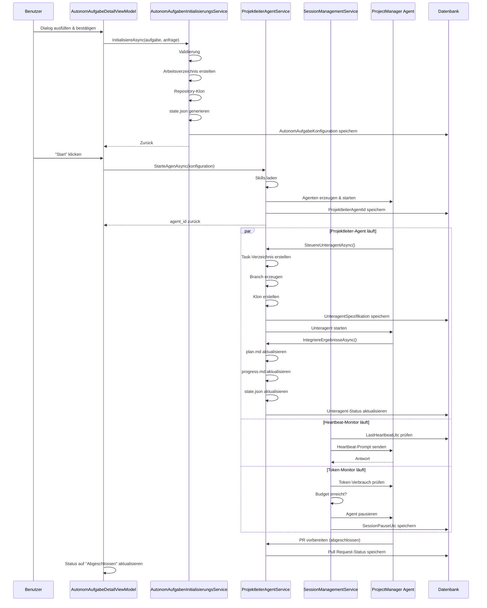

← [Zurück zur Übersicht](index.md)

# Autonome Aufgaben — Technischer Ablauf

## Übersicht

Eine Autonome Aufgabe durchläuft folgende technische Phasen:

1. **Initialisierung** — Arbeitsverzeichnis, Repository-Klon, Konfiguration
2. **Agent-Start** — Projektleiter-Agent wird mit Initialprompt und Skill-Registry geladen
3. **Unteragenten-Orchestrierung** — Projektleiter erzeugt und verwaltet Unteragenten
4. **Session-Management** — Token-Budget, Laufzeitlimit, Heartbeat-Überwachung
5. **Integrationn & Abschluss** — Ergebnisse zusammenfassen, PR vorbereiten

## Detaillierter Ablauf

### Phase 1: Initialisierung einer Autonomen Aufgabe

**Aufruf-Chain:**
```
Benutzer: Dialog ausfüllen & bestätigen
    ↓
AutonomAufgabeInitialisierungsDialogViewModel.BestaetigenAsync()
    ↓
AufgabeService.ErzeugeAutonomAufgabeAsync(aufgabe, initialPrompt)
    ↓
AutonomAufgabenInitialisierungsService.InitialisiereAsync(aufgabe, anfrage)
```

**Methode: `AutonomAufgabenInitialisierungsService.InitialisiereAsync()`**

1. **Validierung**
   - `anfrage.InitialPrompt` ≥ 10 Zeichen?
   - `anfrage.TokenBudget` > 0 und ≤ 5.000.000?
   - `anfrage.LaufzeitLimitMinuten` ∈ [60..1440]?
   - `anfrage.ArbeitsverzeichnisPfad` ist absolut und erstellbar?
   - Throw `ArgumentException` falls nicht erfüllt

2. **Arbeitsverzeichnis erstellen**
   ```
   Aufruf: ErstelleArbeitsverzeichnisStrukturAsync(pfad)
       - Erstelle: {pfad}/
       - Erstelle: {pfad}/skills/, {pfad}/clones/, {pfad}/tasks/, {pfad}/logs/
       - Erstelle: {pfad}/skills/archive/
       - Erstelle: {pfad}/plan.md (Template)
       - Erstelle: {pfad}/progress.md (Template)
       - Erstelle: {pfad}/governance.md (Template mit Limits)
       - Erstelle: {pfad}/permissions.json (JSON mit Berechtigungen)
   ```

3. **Repository-Klon**
   ```
   Aufruf: _cliRunner.RunAsync("git clone {repository} {pfad}/clones/repo_main")
   ```

4. **state.json generieren**
   ```json
   {
     "task_id": "{aufgabe-id}",
     "project_branch": "{projektBranchName}",
     "initial_prompt": "{initialPrompt}",
     "permissions_file": "{permissionsJsonPfad}",
     "runtime": {
       "started_utc": "2026-08-20T10:30:00Z",
       "net_minutes_used": 0,
       "net_minutes_limit": 480,
       "paused_utc": null
     },
     "governance": {
       "max_subagents": 5,
       "max_clones": 3,
       "max_feature_branches": 10,
       "token_budget": 500000
     },
     "clones": [
       {"name": "repo_main", "path": "clones/repo_main", "branch": "main"}
     ],
     "subagents": [],
     "skills": [],
     "progress": {
       "phase": "initialized",
       "completion_percentage": 0,
       "last_updated_utc": "2026-08-20T10:30:00Z"
     },
     "pull_request": {
       "status": "planned",
       "url": null
     },
     "flags": {
       "allow_token_extension": true,
       "skip_conpty_tests": false
     }
   }
   ```

5. **DB-Eintrag erstellen**
   ```csharp
   var konfiguration = new AutonomAufgabeKonfiguration
   {
       Id = Guid.NewGuid(),
       AufgabeId = aufgabe.Id,
       ProjektBranchName = anfrage.ProjektBranchName,
       InitialPrompt = anfrage.InitialPrompt,
       PermissionsJsonPfad = anfrage.PermissionsJsonPfad,
       TokenBudget = anfrage.TokenBudget,
       TokenBudgetErweitert = anfrage.TokenBudgetErweitert,
       LaufzeitLimitMinuten = anfrage.LaufzeitLimitMinuten,
       PersistenzModus = anfrage.PersistenzModus,
       SkillAutogeneration = anfrage.SkillAutogeneration,
       ArbeitsverzeichnisPfad = anfrage.ArbeitsverzeichnisPfad
   };
   await _db.AutonomAufgabeKonfigurationen.AddAsync(konfiguration);
   aufgabe.AutonomKonfiguration = konfiguration;
   aufgabe.AusfuehrungsStatus = AufgabeAusfuehrungsStatus.AutonomAufgabe;
   await _db.SaveChangesAsync();
   ```

6. **Return** der `AutonomAufgabeKonfiguration`

**Beteiligte Klassen:**
- `AutonomAufgabenInitialisierungsService` (Orchestrierung)
- `SoftwareschmiededDbContext` (Persistierung)
- `ICliRunner` (Git-Befehle)
- `ILogger` (Protokollierung)

---

### Phase 2: Start des Projektleiter-Agenten

**Aufruf-Chain:**
```
Benutzer: Start-Button klicken
    ↓
AutonomAufgabeDetailViewModel.StartCommand
    ↓
ProjektleiterAgentService.StarteAgenAsync(konfiguration)
```

**Methode: `ProjektleiterAgentService.StarteAgenAsync()`**

1. **Konfiguration laden**
   - Lese `AutonomAufgabeKonfiguration` aus DB
   - Lese `state.json` aus Arbeitsverzeichnis
   - Lese `governance.md` für Limits

2. **Skills vorbereiten**
   - Lade Skill `skills/skill_projektleiter_v1.md` aus Dateisystem
   - Registriere weitereSkills aus DB (`SkillDefinition` mit `SkillStatus == Freigegeben`)

3. **Agent erzeugen und starten**
   ```csharp
   var agentRequest = new AgentStartRequest
   {
       Prompt = konfiguration.InitialPrompt,
       SkillRegistry = skills,
       WorkingDirectory = konfiguration.ArbeitsverzeichnisPfad,
       Limits = new AgentLimits
       {
           TokenBudget = konfiguration.TokenBudget,
           RuntimeMinutes = konfiguration.LaufzeitLimitMinuten,
           MaxSubagents = governance.MaxSubagents
       }
   };
   var agentId = await _agentRuntime.StartAgentAsync(agentRequest);
   ```

4. **DB aktualisieren**
   ```csharp
   aufgabe.ProjektleiterAgentId = agentId;
   aufgabe.AusfuehrungsStatus = AufgabeAusfuehrungsStatus.Aktiv;
   aufgabe.AktiveRunId = agentId; // oder run-spezifische ID
   await _db.SaveChangesAsync();
   ```

**Beteiligte Klassen:**
- `ProjektleiterAgentService`
- `AgentRuntime` (oder äquivalente Agent-Infrastruktur)
- `SoftwareschmiededDbContext`

---

### Phase 3: Unteragenten-Orchestrierung

**Aufruf-Chain (ausgelöst durch Projektleiter-Agent):**
```
Projektleiter-Agent erkennt Teilaufgabe
    ↓
Agent ruft (intern): ProjektleiterAgentService.SteuereUnteragentAsync()
```

**Methode: `ProjektleiterAgentService.SteuereUnteragentAsync()`**

1. **Unteragenten-Verzeichnis erstellen**
   ```
   {arbeitsverzeichnis}/tasks/task_{counter}/
   ```

2. **Feature-Branch erzeugen**
   ```csharp
   var branchName = $"feature-unteragent-{counter}";
   await _cliRunner.RunAsync($"git checkout -b {branchName} {projektBranch}");
   ```

3. **Repository-Klon für Unteragenten**
   ```csharp
   var clonePath = $"{arbeitsverzeichnis}/clones/repo_feature_{counter}";
   await _cliRunner.RunAsync($"git clone -b {branchName} --reference {clonePath_main} {repository} {clonePath}");
   ```

4. **UnteragentSpezifikation erstellen & persistieren**
   ```csharp
   var unteragent = new UnteragentSpezifikation
   {
       Id = Guid.NewGuid(),
       AutonomAufgabeId = konfiguration.Id,
       AgentId = $"subagent-{counter}",
       TaskId = $"task-{counter}",
       AgentScope = "feature-{bereich}", // z.B. "feature-backend"
       AgentPrompt = taskPrompt,
       AgentDirectory = $"tasks/task_{counter}",
       AgentBranch = branchName,
       AgentClone = $"clones/repo_feature_{counter}",
       ErzeugungsDatum = DateTimeOffset.UtcNow,
       Status = UnteragentStatus.Erzeugt
   };
   await _db.UnteragentSpezifikationen.AddAsync(unteragent);
   await _db.SaveChangesAsync();
   ```

5. **Unteragenten-Governance-Konfiguration**
   ```
   Unteragent darf NICHT:
   - Außerhalb von tasks/task_XXX/ schreiben
   - Pull Requests erstellen (nur Commits)
   - Skills modifizieren
   - Andere Tasks oder Clones bearbeiten
   ```

6. **Unteragent starten**
   ```csharp
   var subagentRequest = new AgentStartRequest
   {
       Prompt = unteragent.AgentPrompt,
       WorkingDirectory = Path.Combine(konfiguration.ArbeitsverzeichnisPfad, unteragent.AgentDirectory),
       SkillRegistry = skills,
       Limits = new AgentLimits { TokenBudget = /* portion */ }
   };
   var subagentId = await _agentRuntime.StartAgentAsync(subagentRequest);
   ```

**Beteiligte Klassen:**
- `ProjektleiterAgentService`
- `UnteragentGovernanceService` (Governance-Checks)
- `SoftwareschmiededDbContext`

---

### Phase 4: Session-Management (Token-Budget & Heartbeat)

**Parallel zur Ausführung:**

#### Token-Budget-Überwachung

```
Monitor Loop (z.B. alle 10 Sekunden):
    - Lese `AktiveRunId` und `state.json`
    - Abfrage: Aktuelle Token des Agenten?
    - Falls (TokenVerbunden / TokenBudget) >= 0,95:
        → Rufe SessionManagementService.PauseAufgabeBeiBudgetLimitAsync()
```

**Methode: `SessionManagementService.PauseAufgabeBeiBudgetLimitAsync()`**

1. Agenten-Prozess beenden (graceful shutdown)
2. Aufgabe.SessionPauseUtc = DateTimeOffset.UtcNow
3. Aufgabe.AusfuehrungsStatus = AufgabeAusfuehrungsStatus.Wartend (oder Beendet)
4. state.json aktualisieren: `runtime.paused_utc = now`
5. Log: "Aufgabe wegen Budget-Limit pausiert"
6. await _db.SaveChangesAsync()

#### Heartbeat-Überwachung

```
Heartbeat Loop (z.B. alle 30 Sekunden):
    - Lese Aufgabe.LastHeartbeatUtc
    - Zeit_seit_letztem_Heartbeat = now - LastHeartbeatUtc
    - Falls Zeit > HeartbeatTimeout UND Session.Paused == false:
        → Rufe SessionManagementService.PruefeAusfuehrungAsync()
```

**Methode: `SessionManagementService.PruefeAusfuehrungAsync()`**

1. Falls `time_since_heartbeat > timeout`:
   - Generiere Prompt: "Wurdest du unterbrochen oder pausiert? Antworte kurz."
   - Sende an Projektleiter-Agent
   - Warte auf Response (mit Timeout)
2. Falls Agent antwortet:
   - Heartbeat erneuert sich → kein Fehler
3. Falls Agent nicht antwortet:
   - Aufgabe.AusfuehrungsStatus = Beendet
   - Fehlerlog: "Heartbeat-Timeout — Agent nicht erreichbar"

**Beteiligte Klassen:**
- `SessionManagementService`
- `AufgabeService`
- `SoftwareschmiededDbContext`

---

### Phase 5: Integrationn & Abschluss

**Nach jedem Unteragenten-Abschluss:**

**Methode: `ProjektleiterAgentService.IntegriereErgebnisseAsync()`**

1. **Ergebnisse lesen**
   ```
   Lese aus tasks/task_XXX/:
   - task_report.md (Zusammenfassung)
   - task_changes.json (geänderte Dateien)
   - task_log.md (Detailliertes Ausführungslog)
   ```

2. **plan.md aktualisieren**
   ```
   Anhängen: "## Teilaufgabe {N} — {AgentScope}"
   - Status: Abgeschlossen
   - Branch: {AgentBranch}
   - Commits: {anzahl}
   - Zusammenfassung: {task_report.md}
   ```

3. **progress.md aktualisieren**
   ```
   Anhängen:
   - Meilenstein: "{AgentScope} abgeschlossen"
   - Datum: {now}
   - Token verbraucht: {unteragent-token}
   - Nächste Schritte: ...
   ```

4. **state.json aktualisieren**
   ```json
   {
     "subagents": [
       {
         "task_id": "task-{N}",
         "status": "completed",
         "completion_date": "2026-08-20T11:30:00Z",
         "token_used": 45000
       }
     ],
     "progress": {
       "phase": "in_progress",
       "completion_percentage": 33,
       "last_updated_utc": "2026-08-20T11:30:00Z"
     }
   }
   ```

5. **DB aktualisieren**
   ```csharp
   unteragent.AbschlussDatum = DateTimeOffset.UtcNow;
   unteragent.Status = UnteragentStatus.Abgeschlossen;
   aufgabe.AktiveUnteragenten--;
   await _db.SaveChangesAsync();
   ```

---

### Phase 6: Wiederaufnahme nach Pause

**Benutzer klickt "Fortsetzen":**

**Methode: `SessionManagementService.SetzeFortAsync()`**

1. **Context laden**
   ```csharp
   var aufgabe = await _db.Aufgaben.FindAsync(aufgabeId);
   var state = JsonSerializer.Deserialize(File.ReadAllText(statePath));
   var plan = File.ReadAllText(planPath);
   var progress = File.ReadAllText(progressPath);
   ```

2. **Weiterführungs-Prompt generieren**
   ```
   "Fasse zusammen: In plan.md steht der Gesamtplan, in progress.md 
   dein bisheriger Fortschritt. Du warst bis {progress.last_completed_step} 
   gekommen. Fahre fort mit den nächsten Schritten."
   ```

3. **Agent neu starten**
   ```csharp
   konfiguration.TokenBudget += erweiterung;
   await ProjektleiterAgentService.StarteAgenAsync(konfiguration, weiterführungsPrompt);
   ```

4. **Status zurücksetzen**
   ```csharp
   aufgabe.SessionPauseUtc = null;
   aufgabe.AusfuehrungsStatus = AufgabeAusfuehrungsStatus.Aktiv;
   await _db.SaveChangesAsync();
   ```

---

## Diagramm: Gesamtablauf



## Fehlerbehandlung

| Fehlerfall | Ort | Handling |
|-----------|-----|----------|
| Arbeitsverzeichnis existiert | Initialisierung | `DirectoryAccessException` werfen |
| Repository-Klon schlägt fehl | Initialisierung | Fehlerlog, Dialog-Fehlermeldung |
| Token-Budget ungültig | Initialisierung | `ArgumentException` werfen |
| Unteragenten-Verzeichnis nicht erstellbar | Unteragenten-Erzeugung | Fehlerlog, Unteragent auf Fehler setzen |
| Governance-Verletzung | Unteragenten-Arbeitszeit | Blockierung durch `UnteragentGovernanceService`, Fehlerlog |
| Heartbeat-Timeout | Laufzeit | "Wurdest du unterbrochen?"-Prompt, bei no response → Beendet |
