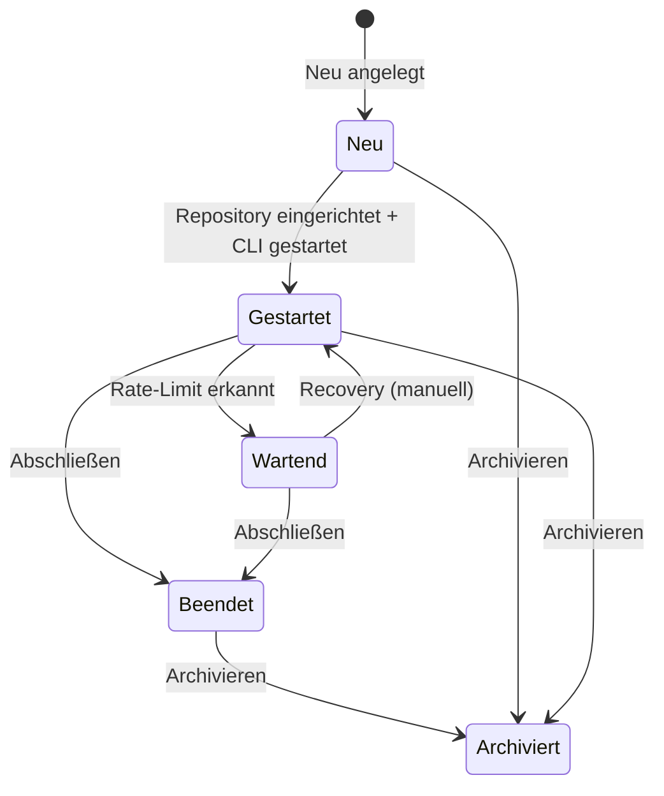
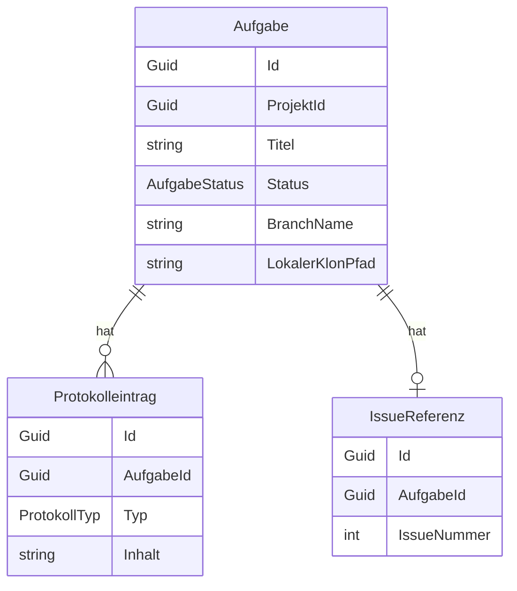

# Aufgaben & KI-Entwicklungsprozess — Datenmodell

## Entitäten

### `Aufgabe`

| Eigenschaft | Typ | Beschreibung |
|-------------|-----|--------------|
| `Id` | `Guid` | Primärschlüssel |
| `ProjektId` | `Guid` | FK → Projekt |
| `GitRepositoryId` | `Guid?` | FK → GitRepository |
| `Titel` | `string` | Aufgabentitel |
| `AnforderungsBeschreibung` | `string?` | Prompt-Vorlage / Anforderungstext |
| `Status` | `AufgabeStatus` | Aktueller Status (siehe unten) |
| `BranchName` | `string?` | Name des Git-Branches |
| `LokalerKlonPfad` | `string?` | Lokaler Pfad des geklonten Repositories |
| `AgentenpaketName` | `string?` | Name des Agentenpakets |
| `AgentenName` | `string?` | Name des gewählten Agenten |
| `KiPluginPrefix` | `string?` | Plugin-Prefix des KI-Plugins |
| `ErstellungsDatum` | `DateTimeOffset` | Anlagezeitpunkt |
| `AbschlussDatum` | `DateTimeOffset?` | Abschlusszeitpunkt |
| `AktiveRunId` | `string?` | Run-ID eines laufenden KI-Prozesses |
| `LastHeartbeatUtc` | `DateTimeOffset?` | Letzter Heartbeat-Zeitstempel |
| `LetzterCliStartUtc` | `DateTimeOffset?` | Zeitpunkt des letzten echten CLI-Prozessstarts; dient als stabile Sortiergrundlage fuer aktive Aufgabenlisten |
| `RecoveryVersion` | `int` | Concurrency-Token für Recovery |
| `VorschlagPrompt` | `string?` | Gespeicherter Rate-Limit-Prompt-Vorschlag |
| `VorschlagAusfuehrenAbUtc` | `DateTimeOffset?` | Geplanter Ausführungszeitpunkt des Vorschlags |

### `Protokolleintrag`

| Eigenschaft | Typ | Beschreibung |
|-------------|-----|--------------|
| `Id` | `Guid` | Primärschlüssel |
| `AufgabeId` | `Guid` | FK → Aufgabe |
| `Zeitstempel` | `DateTimeOffset` | Zeitpunkt des Eintrags |
| `Typ` | `ProtokollTyp` | `Prompt`, `KiAntwort`, `GitAktion`, `StatusUebergang`, `TestErgebnis`, `CliOutput`, `RateLimit`, `SystemMeldung` |
| `Inhalt` | `string` | Inhalt (Markdown) |
| `AgentName` | `string?` | Name des Agenten |

### `IssueReferenz`

| Eigenschaft | Typ | Beschreibung |
|-------------|-----|--------------|
| `Id` | `Guid` | Primärschlüssel |
| `AufgabeId` | `Guid` | FK → Aufgabe |
| `IssueNummer` | `int` | Issue-Nummer im Provider |
| `Titel` | `string` | Titel des Issues |
| `IssueUrl` | `string?` | Direkt-URL zum Issue |

## Statusübergänge

## Beziehungen

## CLI-Ausgabeprotokoll

CLI-Ausgaben werden ohne neue Tabelle im bestehenden `Protokolleintrag`-Modell gespeichert:

| Feld | Wert bei CLI-Ausgabe |
|------|----------------------|
| `AufgabeId` | Die Aufgabe, deren ConPTY-Sitzung den Output erzeugt hat |
| `Typ` | `ProtokollTyp.CliOutput` |
| `Inhalt` | Eine dekodierte Ausgabezeile aus dem Terminal-Output |
| `Zeitstempel` | Persistenzzeitpunkt des Protokolleintrags |

`ProtokollService.AddCliOutputAsync` ist der zentrale Persistenzpfad. Erkennt die Methode in einer Ausgabezeile einen Rate-Limit-Marker, wird zusätzlich ein `ProtokollTyp.RateLimit`-Eintrag erzeugt.
